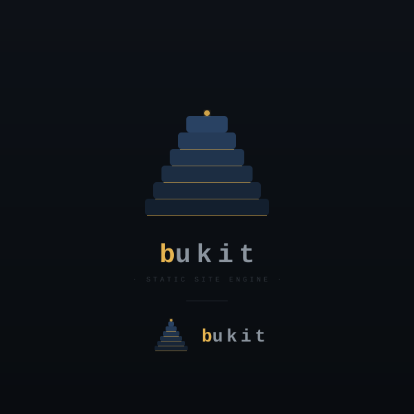

# bukit（.NET 10 Native AOT 静态站点引擎）

<p align="center">
  
</p>

语言版本：简体中文（当前）| [English](./README.md) | [Bahasa Melayu](./README.ms.md)

一个面向“笔记即 CMS”的静态网站引擎：内容可来自 Notion（或本地 Markdown），在 GitHub Actions 中自动构建并部署到 GitHub Pages。

## 文档

- 普通用户使用文档：[`guide/user`](guide/user/README.zh-CN.md)
- 开发者/维护者文档：[`guide/dev`](guide/dev/README.zh-CN.md)
- 本轮治理补充说明：[`guide/dev/perf-aot-governance.md`](guide/dev/perf-aot-governance.md)

## 快速开始（使用仓库内示例站点）

先验证端到端构建是否正常：

```bash
dotnet build bukit.slnx -c Release
dotnet run --project src/Bukit.Cli -c Release -- doctor --config examples/starter/site.yaml
dotnet run --project src/Bukit.Cli -c Release -- build --config examples/starter/site.yaml --clean --site-url https://example.com
dotnet run --project src/Bukit.Cli -c Release -- preview --dir examples/starter/dist --port auto
```

浏览器打开：

```
控制台会输出实际的 Preview URL（端口可能不同）
```

## 命令行

### 初始化站点

```bash
dotnet run --project src/Bukit.Cli -c Release -- create my-site
```

Notion 模式：

```bash
dotnet run --project src/Bukit.Cli -c Release -- create my-site --provider notion
```

### 构建

默认读取当前目录 `site.yaml`：

```bash
dotnet run --project src/Bukit.Cli -c Release -- build --clean
```

输出构建指标（JSON）与结构化日志（便于 CI 采集）：

```bash
dotnet run --project src/Bukit.Cli -c Release -- build --clean --metrics metrics.json --log-format json
```

并行渲染（可加速大站点构建；默认使用 CPU 核心数）：

```bash
dotnet run --project src/Bukit.Cli -c Release -- build --clean --jobs 8
```

多站点（读取 `sites/<name>.yaml`，但 rootDir 仍为当前目录）：

```bash
dotnet run --project src/Bukit.Cli -c Release -- build --site blog --clean
```

覆盖输出目录与 baseUrl：

```bash
dotnet run --project src/Bukit.Cli -c Release -- build --output dist --base-url /my-repo --site-url https://user.github.io/my-repo --clean
```

### 诊断

```bash
dotnet run --project src/Bukit.Cli -c Release -- doctor --config site.yaml
```

### 清理

```bash
dotnet run --project src/Bukit.Cli -c Release -- clean --dir dist
```

### 主题

列出工程根目录下的 `themes/<name>`：

```bash
dotnet run --project src/Bukit.Cli -c Release -- theme list --config site.yaml
```

写回配置（设置 `theme.name`）：

```bash
dotnet run --project src/Bukit.Cli -c Release -- theme use alt --config site.yaml
```

### Webhook（触发 GitHub Actions dispatch）

用于 Notion webhook → GitHub `repository_dispatch` 的触发器（不影响核心引擎）：

```bash
dotnet run --project src/Bukit.Cli -c Release -- webhook --repo owner/repo --port 8787 --path /webhook/notion --event bukit_notion
```

环境变量要求：

- `BUKIT_WEBHOOK_TOKEN`（入站请求头 `X-Sitegen-Token`）
- `BUKIT_GITHUB_TOKEN`（或 `GITHUB_TOKEN`）

## 配置（site.yaml）

参考：[examples/starter/site.yaml](examples/starter/site.yaml)

关键字段：

- `site.collections`：推荐的内容组织与路由主模型（每个集合声明 `permalink`、`template`，可选 `listRoute`）。`post/page` 默认规则仍作为兼容层保留。
- `site.baseUrl`：GitHub Pages 子路径（例如 `/my-repo`），根站点用 `/`
- `site.url`：站点绝对域名（用于 sitemap/rss），也可通过 `--site-url` 覆盖
- `site.pluginFailMode`：插件失败策略（`strict` 默认中断构建；`warn` 仅记录错误继续）
- `site.externalPlugins`：外部协议插件配置（`runtime: process|wasm`，支持 `after-build|derive-pages`）
- `site.externalAssemblyTrustMode` + `site.externalAssemblyAllowlist`：外部 DLL 信任治理（`warn|strict` + SHA256 allowlist）
- `externalPlugins.<name>.options.processArgs`：process 插件结构化参数（`positionals/named`），`options.arguments` 已禁用
- `externalPlugins.<name>.maxMemoryMb/wasmFsMode/wasmAllowNetwork`：wasm 资源与权限约束（默认禁网）
- `site.autoSummary`：未提供 summary 时是否从正文提取摘要（用于 taxonomy/rss/search 等）
- `site.autoSummaryMaxLength`：自动摘要最大长度（字符数）
- `content.provider`：`markdown` 或 `notion`
- `content.markdown.maxItems`：最多读取多少篇 Markdown（正整数）
- `content.markdown.includePaths/includeGlobs`：只读取指定的 Markdown（用于大仓库/单篇调试）
- `content.notion.maxItems`：最多拉取多少条 Notion 页面（正整数）
- `content.notion.includeSlugs`：只拉取 slug 在列表中的页面（数据库 query 过滤）
- `content.notion.cacheMode/cacheDir`：Notion 渲染缓存（off/readwrite/readonly）
- `content.notion.renderConcurrency/maxRps/maxRetries`：Notion 并发渲染与限流/重试（提升大库渲染速度与稳定性）
- 构建结束会输出 `event=notion.stats`：Notion 请求数与节流等待统计（便于评估吞吐与瓶颈）
- `build.output`：输出目录（相对 `site.yaml` 所在目录）
- `theme.layouts/assets/static`：模板、资源与静态文件目录（相对 `site.yaml` 所在目录）

## 模板自定义字段（v2）

v2 支持在模板中读取“自定义字段”，统一入口是：

- `page.fields.<key>.value`
- `page.fields.<key>.type`（text/number/date/list/bool/file）

### Markdown（Front Matter）

在 Markdown 文件的 Front Matter 中新增字段即可（示例）：

```yaml
---
type: page
seo_title: 关于 - Bukit 示例站点
reading_time: 5
tags:
  - bukit
---
```

模板中使用（注意：本项目模板语法使用 Scriban 的 `{{ if ... }}` 形式）：

```scriban
<title>
  {{ if page.fields.seo_title }}
    {{ page.fields.seo_title.value }}
  {{ else }}
    {{ page.title }}
  {{ end }}
  - {{ site.title }}
</title>
```

### Notion（fieldPolicy）

Notion 内容源会按 `content.notion.fieldPolicy` 决定哪些 properties 会进入 `page.fields`：

```yaml
content:
  provider: notion
  notion:
    databaseId: "<your_database_id>"
    fieldPolicy:
      mode: whitelist   # whitelist | all
      allowed:
        - cover
        - seo_title
        - seo_desc
        - reading_time
        - my_link
```

模板示例：

```scriban
{{ if page.fields.cover }}
  
{{ end }}
```

## v2 验收与测试

当前仓库主要采用“可运行验收（smoke/acceptance）”方式覆盖核心链路（build/doctor/i18n/sitemap/rss/taxonomy/multi-site/webhook）。推荐两种方式：

- 一键 smoke（本地）：[`scripts/smoke.ps1`](scripts/smoke.ps1) / [`scripts/smoke.sh`](scripts/smoke.sh)
- 分项验收文档：
  - v2.1（P1）：[`guide/dev/testing-smoke.md`](guide/dev/testing-smoke.md)
  - v2.2+（P2）：[`guide/dev/testing-smoke.md`](guide/dev/testing-smoke.md)

## AI 建站（v2）

- 对话式建站指南：[`guide/ai/chatgpt/README.zh-CN.md`](guide/ai/chatgpt/README.zh-CN.md)
- Intent 契约与映射规则：[`guide/dev/intent-cli.md`](guide/dev/intent-cli.md)

> 说明：当前仓库聚焦 `Bukit` 主线，不包含 [BukitJalil](https://github.com/ALi365-SDN-BHD/BukitJalil) 桌面端源码与解决方案。

## Notion 内容源

### 环境变量

Notion Token 只允许通过环境变量注入：

- `NOTION_TOKEN`

### 数据库字段约定（v1）

`content.provider: notion` 模式下，默认按以下字段解析：

- `Published`（checkbox）：是否发布；仅发布内容会被渲染
- `Title`（title）：标题
- `Slug`（rich_text 或 formula/string）：URL slug（缺省会从 Title 生成）
- `Type`（select 或 multi_select）：`post`/`page`（缺省 `post`）
- `PublishAt`（date，可选）：发布时间（缺省当前时间）

v2 的字段模板与 schema 说明见：

- [`guide/dev/content.md`](guide/dev/content.md)

## GitHub Actions + GitHub Pages

仓库提供了 Pages workflow 模板样例 [`.github/workflows/pages.yml`](.github/workflows/pages.yml)，可直接复制到自己的仓库使用。
详细指引见：[`guide/user/13-部署-GitHub-Pages.md`](guide/user/13-部署-GitHub-Pages.md)。

要启用部署：

1. 在 GitHub 仓库 Settings → Pages → Build and deployment 选择 “GitHub Actions”
2. 如使用 Notion：在仓库 Settings → Secrets and variables → Actions 添加 `NOTION_TOKEN`
3. 按你的 workflow 配置推送到 `main` 分支，触发构建与部署

## AOT 发布（本地）

示例（linux-x64）：

```bash
dotnet publish src/Bukit.Cli -c AOT -r linux-x64 -o out/bukit
```

默认使用 `BukitStripSymbols=false` 以避免本地环境缺少 `objcopy/llvm-objcopy` 时发布失败。  
若需要符号剥离（体积优化），请显式启用：

```bash
dotnet publish src/Bukit.Cli -c AOT -r linux-x64 -o out/bukit -p:BukitStripSymbols=true
```

当启用符号剥离但系统没有 `objcopy/llvm-objcopy` 时，发布会给出清晰错误提示。

Windows 示例（win-x64）：
```bash
dotnet publish src/Bukit.Cli -c AOT -r win-x64 -o out/bukit
dotnet publish src/Bukit.Cli -c Release -r win-x64 -o out/bukit /p:PublishSingleFile=true /p:SelfContained=true
```

## 验证命令矩阵

```bash
# 编译（告警即错误）
dotnet build bukit.slnx -c Release -warnaserror

# 单测
dotnet test tests/Bukit.Engine.Tests/Bukit.Engine.Tests.csproj -c Release
dotnet test tests/Bukit.Content.Tests/Bukit.Content.Tests.csproj -c Release
dotnet test tests/Bukit.Cli.Tests/Bukit.Cli.Tests.csproj -c Release
dotnet test tests/Bukit.Rendering.Tests/Bukit.Rendering.Tests.csproj -c Release

# WASM 协议路径
dotnet test tests/Bukit.Engine.Tests/Bukit.Engine.Tests.csproj -c Release --filter "FullyQualifiedName~RuntimeIsWasm|FullyQualifiedName~WasmPluginInvoker"

# 代码规范
dotnet format bukit.slnx --verify-no-changes

# AOT 告警检查（零告警策略，Scriban/ImageSharp 已全部 AOT 兼容）
bash scripts/check-aot-warnings.sh linux-x64 out/bukit /tmp/bukit-aot-check.log
```

CI `smoke` 工作流还包含以下质量门：

- Coverage gate（分项目阈值）
- Vulnerable package gate（阻断 High/Critical）
- 仓库 smoke 脚本（端到端）

## 性能基线（冷启动优先）

使用脚本对比 JIT 与 AOT 在同一配置下的构建耗时、RSS 与 metrics：

```bash
bash scripts/perf-baseline.sh Release osx-arm64 examples/starter/site.yaml
```
