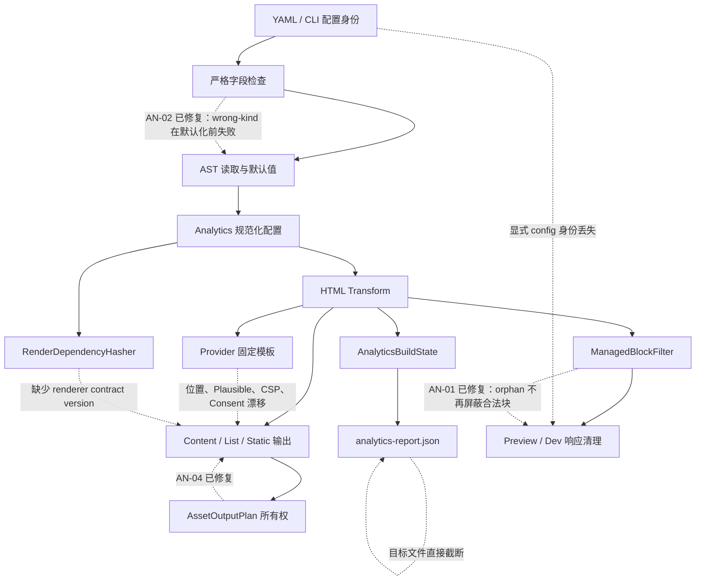

# Bukit Analytics 内置插件深度全方位复审报告（2026-07-20）

> 复审日期：2026-07-20（Asia/Kuala_Lumpur）
> 实现基线：`main@fe27bbbe`
> 原 Analytics 实现提交：`4103959c`
> 原报告提交：`9ff5d452`
> 执行环境：macOS arm64，.NET SDK 10.0.100，Bukit 1.0.10
> 执行 checkout：审计开始时为 `f076a288`；结束前仓库被外部推进到 `main@f80919f8`。`fe27bbbe..f80919f8` 没有 `src/Bukit-Core` 实现变化，因此本文继续以约定的 `fe27bbbe` 为唯一实现基线。
> 整改状态：AN-01 已进入 `main@738244cf`；本轮期间 `main` 被外部推进到 `7104c93a`（仅合并治理文档、与本项无重叠），AN-02 已于 2026-07-20 在该 HEAD 后的当前工作树完成修复和验证；其余状态不自动变化。
> 审计阶段边界：复审时只重写本报告。后续整改按发现逐项推进；AN-02 修改 YAML AST 严格校验、生成的 JSON Schema、Config/CLI 回归测试和本报告，没有修改公共 C# API 或插件协议。Schema 收紧仅拒绝此前被静默默认化的无效插件开关，未知插件名及 `options` 内容仍开放。

## 一、复审结论

原 AN-01～AN-14 均已从当前源码和运行结果重新验证，旧结论没有自动继承。结论如下：

- 当前未解决问题 **11 项**：P0 0 项、P1 1 项、P2 7 项、P3 3 项。
- 已修复 **3 项**：AN-01、AN-02、AN-04。AN-02 现会在默认值应用前拒绝错误 Analytics/plugin 节点类型，生成 Schema 与运行时插件开关契约一致。
- 新增确认问题 **0 项**。本轮扩大到共享 Engine、运行模式、原始字节、报告、增量和 Native AOT 后，没有把不稳定假设升级成新编号。
- 复审基线相关定向测试 **450/450 通过**；AN-02 整改后的仓库定向 gate 为 Config **245/245**、CLI **578/578**。测试通过不用于否定仍未覆盖的其他发现。
- `osx-arm64` Native AOT 发布成功，发布二进制完成四 Provider 最小真实构建；未加载生成页面，也未向 Analytics 服务发送请求。

主体链路能够工作：四个 Provider 可生成脚本，Content/List/Static/多语言页面经过统一 Transform，Development 能抑制 production-only 追踪，插件禁用会生成可解释的报告，Provider 值校验和输出转义有效，报告不泄露 Provider ID。AN-01、AN-02 已关闭；生产完备性仍被一个 P1 问题阻断：Preview 丢失显式配置身份。

## 二、严重度与状态总表

### 2.1 分级与状态

| 项目 | 定义 |
|---|---|
| P0 | 可普遍触发的灾难性数据、安全或发布失败，必须阻断发布。 |
| P1 | 可稳定触发的隐私策略失效、错误启用追踪或核心契约破坏。 |
| P2 | 明确的兼容性、可靠性、安全能力或增量正确性缺口。 |
| P3 | 架构债务、性能、原子性或低概率恢复风险。 |
| 仍存在 | 当前源码解释、最小复现或严格控制流证据仍成立。 |
| 已修复 | 源码闭环、最小复现转绿和真实构建证据同时成立。 |

### 2.2 当前发现总表

| ID | 状态 | 等级 | 分类 | 当前结论 | 置信度 |
|---|---|---:|---|---|---:|
| AN-01 | **已修复** | 原 P1 | 已修复 Bug / 隐私风险 | orphan 保留但不再屏蔽后续合法块；连续三次 Transform 完全相等，Preview 可清理合法块。 | 高 |
| AN-02 | **已修复** | 原 P1 | 已修复配置契约 Bug | 原五类错误 YAML 及四个同根防御用例均以精确路径失败；插件 Schema 与运行时短/长格式一致。 | 高 |
| AN-03 | 仍存在 | P1 | 已确认 Preview Bug | `preview --config custom.yaml` 用该配置解析输出目录，却只用固定 `site.yaml` 决定清理策略。 | 高 |
| AN-04 | 已修复 | 原 P1 | 已修复发布 Bug | fresh build 不再生成原始 `raw.html`；旧 manifest 拥有的旁路文件会在增量升级时删除。 | 高 |
| AN-05 | 仍存在 | P2 | 外部规范漂移 | GA/GTM head 片段固定注入到 `</head>` 前，偏离 Google 当前的 head 起始位置要求。 | 高 |
| AN-06 | 仍存在 | P2 | Provider 设计缺陷 | 双 GA 产生两套 loader、两次 `dataLayer` bootstrap 和两次 config。 | 高 |
| AN-07 | 仍存在 | P2 | 外部规范漂移 | Plausible 默认仍使用旧通用 `script.js + data-domain` 模型。 | 高 |
| AN-08 | 仍存在 | P2 | 安全/隐私风险 | Provider 固定模板没有 Consent Mode、CMP 时序或 CSP nonce/hash 契约。 | 高 |
| AN-09 | 仍存在 | P2 | 增量设计缺陷 | Render Dependency Hash 未包含 Analytics renderer/template 契约版本。 | 高 |
| AN-10 | 仍存在 | P2 | 已确认字节保真 Bug | Preview/Dev 无条件文本解码再 UTF-8 编码，BOM 被删、非 UTF-8 字节被替换。 | 高 |
| AN-11 | 仍存在 | P2 | 安全/隐私风险 | Preview 配置缺失或加载失败时静默 fail-open，保留生产追踪。 | 高 |
| AN-12 | 仍存在 | P3 | 可靠性问题 | Analytics 报告直接截断并覆盖目标文件，不是原子写入。 | 高 |
| AN-13 | 仍存在 | P3 | 架构债务 | CLI 引用 Engine 的同时再次源码编译 Engine 的扫描器和过滤器。 | 高 |
| AN-14 | 仍存在 | P3 | 性能/增量问题 | 哈希未按有效启用状态裁剪；禁用配置变化仍使页面过度失效。 | 高 |

### 2.3 AN-01～AN-14 状态迁移

| ID | 2026-07-18 | 2026-07-20 | 复审依据 |
|---|---|---|---|
| AN-01 | 确认 | **已修复（同日整改）** | RED 复现 1→2→3；线性两遍解析后连续三次相等，Preview 合法块被清理。 |
| AN-02 | 确认 | **已修复（同日整改）** | 原五个黑盒 `config check` 均由退出 0 转为退出 1；合法空 Analytics 与插件长格式仍通过。 |
| AN-03 | 确认 | 仍存在 | 仅加入同内容 `site.yaml` 后 Preview 才清理。 |
| AN-04 | 确认 | **已修复** | `AssetOutputPlan` 输出所有权修复；fresh/upgrade 两种真实构建转绿。 |
| AN-05 | 漂移 | 仍存在 | 2026-07-20 官方文档与当前 HeadEnd 模型对照。 |
| AN-06 | 确认 | 仍存在 | 双 GA 真实构建各计数 2。 |
| AN-07 | 漂移 | 仍存在 | Plausible 2026 更新指南与默认值对照。 |
| AN-08 | 风险 | 仍存在 | 配置、片段模型和 Provider 均无 consent/nonce 能力。 |
| AN-09 | 确认 | 仍存在 | 当前 hasher 只有配置值，没有 renderer contract。 |
| AN-10 | 确认 | 仍存在 | HTTP 原始字节证明 BOM/Latin-1 被改变。 |
| AN-11 | 风险 | 仍存在 | 畸形配置真实 Preview 静默保留管理块。 |
| AN-12 | 风险 | 仍存在 | 仍为 `File.Create(path)` 直接写入。 |
| AN-13 | 债务 | 仍存在 | `.csproj` linked-source 仍存在。 |
| AN-14 | 性能 | 仍存在 | 插件关闭时 hasher 仍纳入全部 Provider 值。 |

## 三、跨模块根因图



三类系统性根因贯穿多数发现：

1. JSON Schema、YAML AST 节点类型、运行时默认值和 CLI 检查曾在 Analytics/plugin 开关处失配；AN-02 已将该范围收敛为同一严格契约。
2. HTML marker 没有签名或所有权凭据；AN-01 已用线性两遍解析修复可判定的 orphan-before-valid 情形，完整伪造合法 pair 的所有权仍无法从文本本身区分。
3. Provider 渲染能力被压缩为 `HeadEnd/BodyStart` 两个固定槽，无法表达 head-start、nonce、consent bootstrap 或共享 Google tag bootstrap。

## 四、发现详情（含整改状态）

### AN-01 — 原 P1：畸形管理标记阻断合法块清理并破坏幂等（已修复）

- **置信度 / 分类：** 高；历史已确认 Bug、隐私风险；当前已修复。
- **源码位置：** `AnalyticsManagedBlockFilter.cs:12-98,174-178`；`AnalyticsHtmlTransform.cs:31-34,88-112`；`PreviewCommand.cs:253-260`；`DevRequestHandler.cs:65-73`。
- **最小复现：** 在 `<head>` 中放入没有 end 的 `<!-- bukit:analytics:google-analytics:G-ORPHAN:head:start -->`，对同一 HTML 连续执行三次有效 GA Transform。
- **命令与输出：** TDD RED 中 Engine 断言第一、第二次字符串不同，CLI 仍找到 `G-ACTIVE`；修复后 `AnalyticsHtmlTransformTests` 13/13、`PreviewCommandTests` 18/18，Engine Analytics 54/54、CLI Preview/Dev 117/117。
- **期望 / 实际：** 期望保留 orphan、清理其后独立合法块并保证重复 Transform 相等；当前实际为三次结果完全相等、恰有一个 `G-ACTIVE`，Preview 删除 `G-ACTIVE` 及其脚本且保留 orphan。
- **历史根因：** 旧过滤器对每个 start 向后做全局 depth 扫描，未闭合时 `break`，使 orphan 吞掉其后的合法 pair。
- **修复实现：** 第一遍以栈按通用 start/end 边建立 close 和 parent，第二遍只删除“直接 pair、key/location 相同、没有已闭合祖先”的块。未闭合祖先被保留但不再屏蔽后续独立 pair；总复杂度为 O(n)，避免简单 `break → continue` 在多个 orphan 下退化为 O(n²)。
- **影响范围：** Production 幂等、Preview/Dev production-only 清理均恢复；没有改动公共 API、配置 Schema、报告 Schema 或外部插件协议。
- **修复边界：** nested、crossed、bounded mismatch、孤立 marker 仍保守整组保留；无签名协议无法区分用户手写的完整合法 pair 与 Bukit pair，这是既有协议边界，不在 AN-01 内扩张协议。
- **回归测试：** 连续三次完全相等；Preview orphan 后合法块清理；嵌套、交叉、bounded mismatch、属性、普通注释及 `script/style/title/textarea` 中 marker-like 内容不误删。

### AN-02 — 原 P1：错误 YAML 节点类型被静默降级为默认值（已修复）

- **置信度 / 分类：** 高；历史已确认配置契约 Bug；当前已修复。
- **源码位置：** `ConfigStrictFieldValidator.cs:72-104,142-185`；`ConfigJsonSchemaGenerator.cs:57,604-613`；`AnalyticsConfigTests.cs:71-104`；`ConfigCommandTests.cs:111-161`。
- **历史最小复现：** `analytics: []`、`providers: {}`、`enabled: []`、`productionOnly: {}`、`site.plugins.analytics: definitely-not-a-bool` 均曾被当作缺失或默认启用。
- **修复后命令与输出：** 用 Release CLI 对原五个文件运行 `dotnet bukit.dll config check --config <file>`，五次均退出 `1`，依次输出 `site.analytics must be a mapping`、`providers must be a sequence`、两个布尔路径错误及 `site.plugins.analytics must be a mapping or boolean`；合法 `analytics.providers: []` 与插件 `{ enabled: false, options: {...} }` 退出 `0`。
- **期望 / 实际：** 期望 wrong-kind 在默认值应用前失败；当前 YAML AST 严格层按完整路径抛出 `ConfigInvalidValue`，`config check` 返回 1，不再静默启用插件或丢弃 Provider。
- **历史根因：** `Map/Seq/GetOptional*` 用 null 同时表示“不存在”和“类型错误”，插件短格式的 `bool.TryParse` 失败又保留初始 `enabled=true`。
- **修复实现：** Analytics object、Provider list 和两个布尔字段均做 presence-aware kind 检查；`site.plugins` 及每个插件短/长格式统一验证。生成 Schema 使用 `oneOf(boolean, strict mapping)`，mapping 只允许 `enabled/options`，同时保留未知插件名与 `options.additionalProperties=true`。
- **影响范围：** `config check`、Production、Development、Preview 共用同一加载路径；修复同时覆盖所有 Core built-in plugin toggle，避免同类非法标量默认启用。
- **修复边界：** 没有改动公共 C# API、Analytics Provider 字段或外部插件协议；合法 `analytics: {}`、`providers: []`、插件 true/false 短格式和 mapping 长格式保持兼容。此前无效果的 wrapper 未知字段现在按严格契约拒绝。
- **回归测试：** 原五个复现加 `site.plugins: []`、长格式错误 `enabled/options`、wrapper 未知字段共九项均精确断言错误码、消息和 CLI 非零退出；合法空 object/list、Provider 校验与顺序、插件短/长格式及 Schema 开放边界保持通过。仓库定向 gate：Config 245/245、CLI 578/578；最终 subagent 只读审查无 Critical/Important。

### AN-03 — P1：Preview 丢失显式配置身份

- **置信度 / 分类：** 高；已确认 Preview Bug、隐私风险。
- **源码位置：** `PreviewCommand.cs:20-37,56-70,290-312`。
- **最小复现：** 站点只有 `custom.yaml`，其中 Analytics 为 production-only；`dist/index.html` 含合法管理块，运行 `bukit preview --config custom.yaml`。
- **命令与输出：** 第一次 HTTP 响应保留完整 GA 块；把同内容复制为 `site.yaml` 后仍以 `--config custom.yaml` 启动，第二次响应变成没有块的 `<head></head>`。
- **期望 / 实际：** 期望显式配置既决定 output，也决定 Preview 清理策略；实际显式配置只参与 output 解析，策略函数从输出目录向上只搜索字面量 `site.yaml`。
- **根因：** Preview 在解析目录后丢弃了 `ResolvedConfigPath`，策略层重新以目录猜测配置身份。
- **影响范围：** 自定义 `--config`、`--config + --dir`、多站点配置和外部 output 目录；用户认为 Preview 不追踪时仍可能加载生产脚本。
- **修复边界：** 将已解析配置或显式配置路径直接传给策略解析；仅在用户没有指定 config/site 时才执行 nearest-site fallback，并输出策略来源。
- **回归测试：** custom config、`--site`、`--config + --dir`、外部 output、多站点、无配置；每种情况同时验证目录解析和清理决策使用同一配置。

### AN-05 — P2：GA/GTM head 注入位置偏离 Google 当前安装要求

- **置信度 / 分类：** 高；外部规范漂移、兼容性问题。
- **源码位置：** `AnalyticsHtmlFragments.cs:3-6`；`AnalyticsHtmlTransform.cs:88-112`；`GoogleAnalyticsProvider.cs:15-25`；`GoogleTagManagerProvider.cs:16-19`。
- **最小复现：** 构建含 `<head><title>...</title></head>` 的页面并检查 GA/GTM marker；探针输出 `GA_AFTER_TITLE=True`。
- **命令与输出：** 四 Provider 真实构建的 GA/GTM head 块均位于 `</head>` 之前，而非 opening head 后；GTM noscript 正确位于 opening body 后。
- **期望 / 实际：** Google tag 文档要求片段紧随 opening `<head>`；GTM 要求第一段尽可能靠近 head 顶部、第二段紧随 body 开始。实际模型只能表达 HeadEnd 和 BodyStart。
- **根因：** HTML fragment contract 没有 HeadStart 插槽，所有 head Provider 被硬编码到 `head.ContentEnd`。
- **影响范围：** 所有 GA4/GTM 页面；可能延迟标签初始化，并持续偏离官方安装校验和支持基线。
- **修复边界：** 内部增加 HeadStart 插槽并明确 Transform 顺序；GA/GTM 迁移到 HeadStart，GTM BodyStart 保持不变；管理 marker 仍需可清理。
- **回归测试：** opening head 后的位置断言、GTM body 第一子项、无/多/大小写 head/body、SEO/主题 Transform 组合顺序和三次幂等。

官方基线（抓取日期 2026-07-20）：[Google tag](https://developers.google.com/tag-platform/gtagjs)、[GTM 安装规范](https://support.google.com/tagmanager/answer/14847097?hl=en)。

### AN-06 — P2：多个 GA Provider 输出多套 bootstrap

- **置信度 / 分类：** 高；Provider 设计缺陷、性能与数据质量风险。
- **源码位置：** `GoogleAnalyticsProvider.cs:11-25`；`AnalyticsHtmlTransform.cs:58-63,96-112`。
- **最小复现：** 配置两个不同合法 measurement ID，真实构建任一页面。
- **命令与输出：** AOT 构建的每个页面均为 `gtag/js loaders=2`、`window.dataLayer=2`、`gtag('config')=2`；探针同样输出 `DOUBLE_GA_LOADERS=2`、`DOUBLE_GA_DATALAYER=2`、`DOUBLE_GA_CONFIG=2`。
- **期望 / 实际：** 期望一个 Google tag bootstrap 后追加多个 destination/config；实际每个 Provider 完整重复 loader、队列初始化和函数声明。
- **根因：** Provider 独立渲染完整片段，注册表/聚合层没有“共享 bootstrap + 多 destination”的概念。
- **影响范围：** 多 GA destination 站点；重复下载/执行、初始化时序不确定，并增加重复事件和诊断噪声风险。
- **修复边界：** 在内部聚合阶段合并 GA Provider，选择一个 loader/bootstrap，按稳定配置顺序输出 config；不改变现有 YAML 列表契约。
- **回归测试：** 单 GA 保持一套；双/三 GA 始终一套 loader/bootstrap、N 个 config；与 GTM 共存、Provider 顺序稳定、增量 hash 对 destination 变化敏感。

### AN-07 — P2：Plausible 默认仍绑定旧通用脚本模型

- **置信度 / 分类：** 高；外部规范漂移。
- **源码位置：** `SiteDefaultsApplier.cs:98-113`；`PlausibleProvider.cs:7-12`；`ConfigJsonSchemaGenerator.cs:226-233`。
- **最小复现：** Plausible 只配置 `domain`，不配置 `scriptUrl`。
- **命令与输出：** 探针输出 `PLAUSIBLE_LEGACY_URL=True`、`PLAUSIBLE_DATA_DOMAIN=True`；真实构建生成 `https://plausible.io/js/script.js` 和 `data-domain`。
- **期望 / 实际：** 2025-10 后 Plausible Cloud 新机制使用站点设置中生成的 unique per-site snippet；实际 Bukit 默认继续生成旧通用脚本，无法表达官方 snippet 的站点专属 URL/属性组合。
- **根因：** Schema 和 defaults 将历史 URL 固化为协议默认，Provider 仅接受 domain/scriptUrl 两个字段。
- **影响范围：** 新 Plausible Cloud 站点和启用新版 snippet 的迁移站点；旧站点和自托管 URL 不必然立即失效，因此本项不是“所有用户均坏”。
- **修复边界：** 明确区分 legacy、自托管和 site-specific snippet；优先允许完整受控 snippet 参数或官方生成 URL，并提供兼容期诊断，不能静默改写现有站点语义。
- **回归测试：** 新站点专属片段、旧式显式 URL、自托管、IDN 域名、属性转义、迁移警告与 Schema 示例。

官方基线（抓取日期 2026-07-20）：[Plausible script update guide](https://plausible.io/docs/script-update-guide)。

### AN-08 — P2：Consent Mode 与严格 CSP 缺少一等集成契约

- **置信度 / 分类：** 高；安全/隐私风险、设计缺陷。
- **源码位置：** 四个 Provider 文件；`AnalyticsHtmlFragments.cs:3-6`；`AnalyticsHtmlTransform.cs:150-151`；Analytics 配置 Schema/模型无 consent、nonce、CMP 或自定义属性字段。
- **最小复现：** 启用 GA/GTM 并检查生成 HTML；脚本立即出现，没有 consent default/update bootstrap，也无法从页面上下文向内联/外链 script 传播 nonce。
- **命令与输出：** 四 Provider真实输出逐结构检查：GA/GTM 内联 script 无 `nonce`，Plausible/Umami 外链 script 无通用 nonce 接口；用户授权前标签已经存在于可加载 HTML 中。
- **期望 / 实际：** 严格隐私部署需要在 config/event 前设定默认 consent，并能由 CMP 更新；严格 CSP 通常需要 nonce/hash 策略。实际只能整体启用、production-only 或关闭，无法表达这些时序和属性。
- **根因：** Provider 输出是固定字符串，render context 没有安全属性/consent policy，配置也没有 CMP 集成点。
- **影响范围：** 受同意法规、Google Consent Mode v2、严格 `script-src`/`frame-src` CSP 管理的站点；默认即加载网络脚本。
- **修复边界：** 先定义内部 consent/CSP 渲染契约和安全默认值，再扩展配置 Schema；nonce 必须来自每响应可信上下文，不能接受任意未验证 HTML；给 CMP 明确的 default-before-config 与 update 接口。
- **回归测试：** denied 默认发生在 config 前、CMP update、nonce 传播、严格 CSP 页面、无 nonce 兼容模式、GTM iframe CSP、所有属性转义及 production-only 清理。

官方基线（抓取日期 2026-07-20）：[Google Consent Mode](https://developers.google.com/tag-platform/security/guides/consent)、[Google CSP 指南](https://developers.google.com/tag-platform/security/guides/csp)。

### AN-09 — P2：增量哈希不包含 Analytics 渲染契约版本

- **置信度 / 分类：** 高；增量设计缺陷。
- **源码位置：** `RenderDependencyHasher.cs:54-74`；Provider 模板文件。
- **最小复现：** 保持配置、内容和主题不变，只升级包含 Provider 模板变化但 manifest schema 兼容的 Bukit 二进制，再使用保留 cache 的 `--no-clean --incremental`。
- **命令与输出：** 源码审计证明 hash 只追加 pluginEnabled、enabled、productionOnly、executionMode、Provider type/key/options；没有 Analytics renderer/template contract 常量。模板源变化本身不能改变 hash。
- **期望 / 实际：** 期望任何改变最终 Analytics HTML 的实现升级都使相关页面失效；实际相同配置产生相同依赖 hash，可复用旧 HTML。
- **根因：** 增量依赖只建模输入数据，没有建模生成器契约版本。
- **影响范围：** Provider snippet、marker 格式、注入位置、转义或 consent 逻辑升级后复用旧 output/cache 的站点。
- **修复边界：** 增加单一 `AnalyticsRendererContractVersion` 并进入 framed hash；任何可观察 HTML 契约变化必须显式提升版本。
- **回归测试：** 合同版本相同保持 skip；提升版本强制重渲染；Provider 模板 golden 变化必须伴随版本变化的架构测试。

### AN-10 — P2：Preview/Dev 无条件破坏 HTML 原始字节

- **置信度 / 分类：** 高；已确认 Bug、兼容性问题。
- **源码位置：** `PreviewCommand.cs:253-260`；`DevRequestHandler.cs:62-73`。
- **最小复现：** 在没有配置、没有管理块的 output 中放入一个 UTF-8 BOM HTML 和一个含 Latin-1 `0xE9` 的 HTML，通过 Preview 请求原始响应字节。
- **命令与输出：** 输入 BOM 前缀 `efbbbf`，HTTP 响应不再含该前缀；输入 Latin-1 `e9`，响应出现 UTF-8 replacement `efbfbd`。
- **期望 / 实际：** 当无需清理/注入时应字节直通；需要改写时也应明确编码或安全拒绝。实际所有 HTML 都经 `ReadAllText` 和 `Encoding.UTF8.GetBytes`，即使策略为 false 也重编码。
- **根因：** 响应层没有无变换 fast path，也没有 BOM/charset 探测或原字节保留策略。
- **影响范围：** Preview 和 Dev 的 BOM、非 UTF-8、无管理块页面；可能改变内容、哈希、浏览器解码和调试结果。
- **修复边界：** 无需 Analytics/LiveReload 改写时直接流式复制字节；必须改写时只支持明确 UTF-8，保留 BOM 策略或给出可见错误。Dev 的 LiveReload 需要独立定义编码边界。
- **回归测试：** UTF-8 BOM/无 BOM、Latin-1、无 marker 直通、有 marker 清理、Dev LiveReload、Content-Length 与原始字节断言。

### AN-11 — P2：Preview 配置失败静默 fail-open

- **置信度 / 分类：** 高；安全/隐私风险、可观测性缺陷。
- **源码位置：** `PreviewCommand.cs:290-312`。
- **最小复现：** `site.yaml` 使用畸形 YAML，`dist/index.html` 含生产管理块，启动 Preview 并请求页面。
- **命令与输出：** Preview 正常启动且无配置加载警告，HTTP 响应保留完整追踪块；catch 分支直接返回 false。
- **期望 / 实际：** 隐私敏感策略至少应明确警告并允许 strict fail-closed；实际配置缺失和配置损坏都静默解释为“不清理”。
- **根因：** 一个 bool 同时承载策略和错误状态，广泛 catch 丢弃异常及来源。
- **影响范围：** 配置语法错误、路径错误、外部 output、权限/读取失败；开发者可能在本机预览时发送生产事件。
- **修复边界：** 返回结构化决策 `Remove/Keep/Error/Source`；配置存在但加载失败默认停止 Preview 或至少强警告并支持显式 override；不得吞掉异常类别。
- **回归测试：** 缺失、畸形、无权限、custom config、显式 keep；断言退出码、警告文本和 HTTP 中是否存在 marker。

### AN-12 — P3：Analytics 报告写入非原子

- **置信度 / 分类：** 高；可靠性问题。
- **源码位置：** `AnalyticsReportWriter.cs:17-64`，尤其 `File.Create(path)`。
- **最小复现：** 在报告覆盖写入期间终止进程或注入写异常；目标文件已先被截断。
- **命令与输出：** 源码控制流为创建目标文件、直接写 JSON、dispose；与 `BuildManifest` 使用 temp file 的实现不同，没有 replace/rename 提交点。
- **期望 / 实际：** 期望旧完整报告或新完整报告二选一；实际可能留下空文件或截断 JSON。
- **根因：** 报告 writer 没有复用仓库的临时文件 + 原子替换模式。
- **影响范围：** 构建中断、磁盘满、I/O 错误、并发读取报告的 CI/工具。统计本身使用并发安全状态，本项只针对落盘提交。
- **修复边界：** 同目录写唯一 temp、flush/close 后原子 replace/move，失败清理 temp 并保留旧报告。
- **回归测试：** 写入前/中/后故障注入、并发读取、旧报告保留、无孤儿 temp、正常 JSON schema。

### AN-13 — P3：CLI 重复编译 Engine 源文件

- **置信度 / 分类：** 高；架构债务、所有权风险。
- **源码位置：** `Bukit.Cli.csproj:3-9,29-33`。
- **最小复现：** 检查项目图：CLI 已 `ProjectReference` Engine，同时 linked compile `HtmlHeadScanner.cs` 和 `AnalyticsManagedBlockFilter.cs`。
- **命令与输出：** `rg` 同时命中 Engine 引用和两条 `<Compile Include="..\Bukit.Engine\...">`；相同源码形成 CLI/Engine 两个内部类型所有者。
- **期望 / 实际：** 期望共享行为由一个明确 assembly/abstraction 拥有；实际通过源码链接复制实现，测试和修复可能只覆盖其中一个编译上下文。
- **根因：** Preview 需要内部过滤器，但没有合适的内部共享程序集或显式 facade。
- **影响范围：** Native AOT trimming、类型身份、条件编译、可见性、未来重构和测试覆盖解释。
- **修复边界：** 将纯 HTML 扫描/管理块逻辑移到已有合适的 internal shared 项目，或从 Engine 暴露受控 internal facade 并配合 `InternalsVisibleTo`；避免公共 API 扩张。
- **回归测试：** 架构测试禁止 CLI linked compile Engine source；Engine/CLI 共享 golden；AOT publish 与 Preview 清理均通过。

### AN-14 — P3：有效禁用状态仍造成增量过度失效和扫描成本

- **置信度 / 分类：** 高；性能问题、设计取舍。
- **源码位置：** `RenderDependencyHasher.cs:54-74`；`AnalyticsHtmlTransform.cs:31-45`。
- **最小复现：** 将 `site.plugins.analytics: false`，只改变 Provider ID 或 Analytics options，比较 render dependency hash；插件仍关闭但 hash 改变。Analytics enabled=false/no providers 时 Transform 仍先扫描管理块。
- **命令与输出：** 源码控制流先写 pluginEnabled，再无条件写 enabled/productionOnly/executionMode/全部 Provider；真实禁用构建报告 `pluginEnabled=false`、`processedHtml=0`、`plugin_disabled=5`，证明主插件执行已跳过，但 hash 仍未裁剪。
- **期望 / 实际：** 期望无效配置变化不使页面失效；实际禁用站点仍被无效 Provider 值污染全局 hash。enabled=false/no providers 的扫描可用于清除 stale block，属于正确性取舍，但缺少 cheap precheck/度量。
- **根因：** hasher 表达原始完整配置，而非最终有效渲染契约；清理语义与注入语义共用同一 Transform。
- **影响范围：** 大站点的增量构建、频繁切换配置、禁用但保留历史 Provider 配置的仓库。
- **修复边界：** plugin disabled 时 hash 只纳入插件开关和 renderer contract；enabled=false/no providers 时保留 stale-block 正确清理，但可先做 marker 字节查找并记录扫描命中率。
- **回归测试：** disabled 下 Provider 变化 hash 不变；重新启用时 hash 改变并正确注入；stale block 仍被清理；大批无 marker HTML 的基准测试。

## 五、已修复发现

### AN-04 — 原 P1：Static HTML 原文件旁路发布（已修复）

- **置信度 / 分类：** 高；历史发布 Bug，当前状态已修复。
- **历史源码根因：** Static HTML 同时进入渲染路由和静态目录复制，两个输出所有者分别生成路由 HTML 与原始相对文件，后者绕过 Transform。
- **当前源码位置：** `AssetOutputPlan.cs:41-65,150-174`；`BuildManifestTracker` 的所有权清理链；修复提交链中的统一输出所有权变更。
- **最小复现：** `theme.staticTemplate` 渲染 `static/raw.html` 为 `/raw/index.html`；fresh build 检查是否还有 `/raw.html`。再人工植入旧 `raw.html` 并把它加入旧 `.cache/build-manifest.json`，运行 `--no-clean --incremental`。
- **命令与输出：** fresh build 生成 `dist/raw/index.html` 且不生成 `dist/raw.html`；升级模拟输出 `RAW_HTML_REMOVED`，新 manifest 只保留 `raw/index.html`。
- **期望 / 实际：** 期望渲染型 Static HTML 只有路由输出，旧版本拥有的旁路文件升级时删除；当前实际与期望一致。
- **修复根因闭环：** `BuildRenderedStaticCopyDestinations` 从 RenderEntry 计算已渲染 Static 源相对路径，静态复制计划排除这些 destination；manifest 清理由旧所有权安全删除遗留输出。
- **影响范围：** fresh build、incremental、legacy manifest upgrade 均已覆盖。没有 manifest 所有权的人工未知 `raw.html` 会被保留，这是保护用户文件的正确行为，不是回归。
- **修复边界评价：** 修复位于输出所有权规划层，没有为 Analytics 写特例，边界正确。
- **回归测试：** 现有 `BuildAsync_StaticHtmlTemplateOutput_IsNotOverwrittenByRawCopy` 通过；还应长期保留 legacy manifest 删除、未知用户文件保留、大小写路径和多语言 Static 路由测试。

## 六、Provider、HTML 与运行矩阵证据

### 6.1 四 Provider 真实构建

隔离站点位于 `/tmp/bukit-analytics-reaudit-site`，仅使用合成 ID：

- Content、List、Page、Static 共 5 个正式 HTML，SEO 关闭。
- 每个正式页面恰有一个 GA 管理块；四 Provider 均出现。
- `.bukit/analytics-report.json` 为 `processedHtml=5`、`injectedHtml=5`，只含 Provider type，不含 measurement ID、container ID、domain、UUID 或 script URL。
- `bukit-search.html` 是内部搜索索引载体，不是正式页面；redirect 页面不进入 Analytics Transform，均不计为缺陷。

### 6.2 运行模式

| 场景 | 结果 |
|---|---|
| Production | 5/5 正式 HTML 注入；报告 5/5。 |
| Development | 5 个页面均无 Analytics，存在 LiveReload；报告 `development_mode=5`。 |
| Preview 正常 `site.yaml` | production-only 管理块被清理。 |
| Preview custom config | AN-03：未清理。 |
| Preview malformed config | AN-11：静默保留。 |
| 插件关闭 | 无 marker；报告 `pluginEnabled=false`、`processedHtml=0`、`plugin_disabled=5`。 |
| 双 GA | 每页两套 loader/bootstrap/config，确认 AN-06。 |
| 多语言 | en 5 页、zh-CN 3 页，8 页均恰有一个 GA 块；两份语言报告分别为 5/5 与 3/3。 |
| 重复增量 | 构建成功且管理块不重复；部分 List/Static 页面仍发生既有过度失效，归入 AN-14，不另立 Bug。 |

### 6.3 HTML 对抗矩阵

当前已有行为与本轮探针共同确认：

- 正常简单管理块可删除，普通注释不删除。
- 属性和 `script/style/title/textarea` 中 marker-like 文本不被识别为管理 marker。
- 嵌套、交叉、key/location 不匹配组被保留，避免误删用户内容。
- 无 head 时 head Provider 不注入并记录 `head_missing`；无 body 时 GTM body 片段不注入并记录 `body_missing`。
- 大小写 tag 和常规畸形 HTML 由 `HtmlHeadScanner` 处理；AN-01 的 orphan-before-valid 情形已经整改并加入 Engine/CLI 回归测试。

### 6.4 官方 Provider 对照（2026-07-20）

| Provider | 当前状态 |
|---|---|
| GA4 | ID 校验、HTML/JS 转义有效；head 位置和多 destination 聚合存在 AN-05/06。 |
| GTM | body noscript 位置正确；head 位置、Consent/CSP 存在 AN-05/08。 |
| Plausible | 显式自托管 HTTPS URL 可用；默认协议存在 AN-07。 |
| Umami | 当前 `defer src + data-website-id` 核心形式与官方配置兼容；自托管 URL 和 UUID 校验正确，未发现确认兼容 Bug。 |

官方资料：[Google tag](https://developers.google.com/tag-platform/gtagjs)、[GTM](https://support.google.com/tagmanager/answer/14847097?hl=en)、[Consent Mode](https://developers.google.com/tag-platform/security/guides/consent)、[Google CSP](https://developers.google.com/tag-platform/security/guides/csp)、[Plausible](https://plausible.io/docs/script-update-guide)、[Umami](https://docs.umami.is/docs/tracker-configuration)。

## 七、测试、AOT 与审计证据

### 7.1 定向测试

| 项目 | 结果 |
|---|---:|
| Config：Analytics + ConfigJsonSchemaGenerator | 48/48 |
| Engine：Analytics/HTML/Hasher/Static/AssetOutputPlan/Variant pipeline | 117/117 |
| CLI：Preview/Dev | 116/116 |
| Rendering | 164/164 |
| Architecture：AnalyticsPluginBoundaryTests | 5/5 |
| **合计** | **450/450** |

不含 Rendering 的 Analytics 相关基线为 **286/286**，替代旧报告的 276 项数字。未运行 full、release、`test-all`、`smoke-all` 或 whole-solution gate。

### 7.2 Native AOT

执行：

```bash
dotnet publish src/Bukit-Core/Bukit.Cli/Bukit.Cli.csproj \
  -c Release -r osx-arm64 --self-contained true \
  -o /tmp/bukit-analytics-reaudit-aot
```

结果：

- 沙箱内首次尝试仅因 NuGet vulnerability cache 无写权限产生 `NU1900`，属于环境阻塞，不是产品缺陷。
- 在批准的外部执行中 publish 成功；产物为 Mach-O 64-bit arm64 Native AOT。
- `/tmp/bukit-analytics-reaudit-aot/bukit version` 报告 Bukit 1.0.10、runtime `native-aot`。
- AOT 二进制完成四 Provider 的 5 页最小构建，每页恰有一个 GA 块，报告 5/5；未发现 JIT/AOT 行为差异。

### 7.3 审计环境说明

一次并行启动多个 `dotnet run` 的尝试引发共享 `obj/bin` 文件锁警告；该批结果已废弃，后续先构建一次 CLI，再串行执行全部运行场景。此项是审计编排问题，不是 Bukit 产品 Bug。

### 7.4 报告 targeted gate

执行 `env -u NOTION_TOKEN bash scripts/checks/post-change-targeted.sh -- docs/analysis/bukit-analytics-built-in-plugin-deep-audit-2026-07-18.zh-CN.md`。沙箱内首次运行在 `brainstorm server self-test` 将已回收子进程误判为存活；同一命令在沙箱外复跑后完整通过，包括 diff whitespace、文档契约、public API drift、brainstorm server、YAML static context 等检查。首次失败归类为沙箱进程可见性阻塞，不归类为 Analytics 或仓库产品缺陷。

### 7.5 AN-01 整改验证

- TDD RED：`Transform_RemainsIdempotent_WhenUnpairedStartPrecedesManagedBlock` 因第二次结果新增管理块而失败；`ApplyPreviewAnalyticsPolicy_RemovesValidManagedBlockAfterUnpairedStart` 因仍包含 `G-ACTIVE` 而失败。
- GREEN：`AnalyticsHtmlTransformTests` 13/13、`PreviewCommandTests` 18/18。
- 扩大回归：Engine Analytics 54/54、CLI Preview/Dev 117/117。
- 仓库代码 targeted gate：Engine 1558/1558、CLI 569/569，并通过文档契约、public API drift、brainstorm server 和 YAML static context 检查。
- 高风险只读 subagent 复核：Spec Compliance ✅，Task quality Approved，Critical/Important/Minor 均无。

## 八、测试盲区与已排除问题

### 8.1 仍需补齐的测试盲区

1. `analytics/providers/enabled/productionOnly` 的 YAML wrong-kind 与非法插件短格式。
2. Preview 显式 custom config、多站点、外部 output 与 `--config + --dir`。
3. Preview 配置加载失败的退出码、警告和 fail-closed 策略。
4. BOM、无 BOM、非 UTF-8 原字节直通；Dev LiveReload 编码契约。
5. 多 GA 共享 bootstrap、多 destination 顺序。
6. Analytics renderer contract version 的增量升级测试。
7. Plausible site-specific snippet、Consent Mode、CSP nonce/hash。
8. Analytics report 原子写入的故障注入。
9. legacy manifest 拥有的 Static 旁路文件升级删除。
10. Native AOT 下四 Provider + Preview/Dev 组合行为。

### 8.2 已排除或不升级为确认 Bug

- **AN-04 回归：** 已排除；fresh 与 legacy-owned upgrade 均转绿。
- **未知 `raw.html` 被保留：** 未列 Bug。没有 manifest 所有权的文件可能属于用户，构建不得擅自删除。
- **Provider 值注入：** 未发现。GA/GTM ID 有正则约束，Plausible 域名做 IDN 规范化，Umami UUID/URL 严格校验，HTML/JS 按上下文转义。
- **重复同 key Provider：** 配置验证会拒绝；两个不同 GA ID 被允许后产生 AN-06，而不是重复 key 漏检。
- **Umami 核心模板漂移：** 未发现。当前核心属性与官方文档兼容。
- **报告隐私泄漏：** 未发现。真实报告只包含 Provider types 和聚合统计。
- **统计并发竞争：** 未发现。BuildState 的现有并发模型和测试通过；AN-12 只针对文件提交原子性。
- **Static/Content/List/多语言漏注入：** 当前真实矩阵未复现。
- **Native AOT 差异：** 未复现；发布二进制真实构建通过。
- **失败构建后永久复用 stale report：** 未升级。恢复追踪会把未完成状态标记为 started，下一次 no-clean 构建会自动清理；需要故障注入测试，但现有控制流没有稳定证明永久错误发布。

## 九、四批修复路线

### 第一批：阻断级正确性与隐私

剩余范围：AN-03；AN-01、AN-02、AN-04 已完成，保留为固定回归。

- AN-01 已完成：线性两遍 marker 解析只清理可证明的直接 pair，orphan 不再导致累积。
- AN-02 已完成：YAML strict validator 对 wrong-kind、非法插件布尔值和错误长格式 fail-fast，Schema 与运行时一致。
- Preview 保留显式配置身份，并为配置错误提供可见的安全决策。
- 验收：剩余 AN-03 最小复现转绿；AN-01/AN-02/AN-04 的 Production/Preview/Dev、配置契约与 legacy Static upgrade 测试长期通过。

### 第二批：Provider 兼容与配置契约

范围：AN-05、AN-06、AN-07、AN-08。

- 支持 HeadStart 和稳定 Transform 次序。
- 聚合 Google tag bootstrap 与多 destination。
- 设计 Plausible 新/旧/自托管迁移契约。
- 在扩展公共 Schema 前先完成 Consent/CSP 的内部威胁模型、默认值和迁移说明。
- 验收：官方 snippet 结构 golden、严格 CSP、CMP 时序、双 GA、Plausible 新旧模式全部通过。

### 第三批：可靠性与性能

范围：AN-09、AN-10、AN-12、AN-14。

- renderer contract version 进入增量 hash。
- Preview/Dev 增加原字节 fast path 和明确编码契约。
- 报告采用同目录临时文件和原子替换。
- hash 按有效启用状态裁剪，保留 stale-block 清理正确性。
- 验收：二进制升级失效、BOM/Latin-1、报告故障注入、禁用配置 hash 基准全部通过。

### 第四批：架构债务

范围：AN-13 及跨模块契约收口。

- 消除 CLI linked-source，明确 HTML scanner/managed-block filter 的单一所有者。
- 用架构测试禁止再次从 Engine 链接编译源码。
- 验收：CLI/Engine golden 一致、AOT publish、Preview/Dev、Architecture targeted gate 全部通过。

## 十、最终判断

Analytics 已具备可工作的主路径，AN-01、AN-02 和 AN-04 已关闭；但在 AN-03 关闭前，不应把 Preview 隐私语义宣称为生产级安全。其后优先处理 Google/Plausible 规范漂移、Consent/CSP 与 renderer contract version，再收敛字节保真、报告原子性和 linked-source 债务。

本报告只陈述在 `fe27bbbe` 实现基线上能够由源码、最小复现、真实构建或官方规范稳定支持的结论；未成功复现的假设均保留在测试盲区或已排除项中，没有伪装成确认 Bug。
