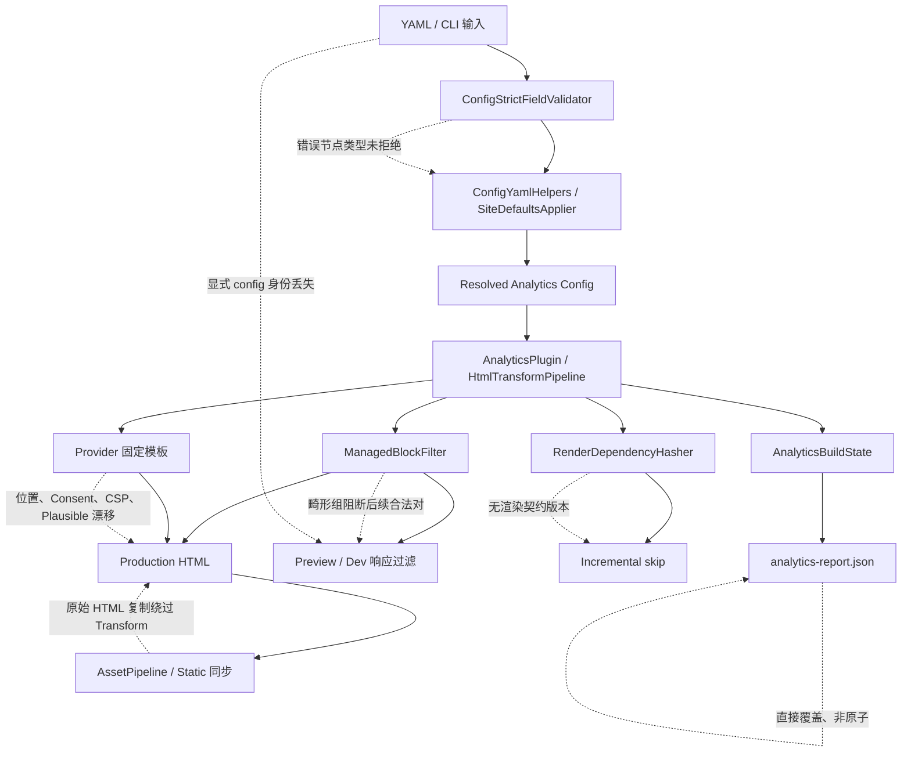

# Bukit Analytics 内置插件深度全方位审计报告

> 审计日期：2026-07-18
> 审计基线：`4103959c9f7ee1b8dfe8db7e34340f4495e7a9ce`（`feat(analytics): add built-in analytics plugin`）
> 审计方式：源码追踪、最小复现、真实 CLI 构建、Preview/Dev HTTP 验证、定向测试、仓库 targeted gate、Native AOT 产物验证
> 审计边界：只新增本报告；未修改实现、公共 API、外部插件协议、测试或现有用户文件

## 一、结论

Analytics 的主体架构是成立的：插件保持 Core-internal，四个 Provider 能生成预期片段，Content/List/Static 渲染路由经过统一 HTML Transform，SEO 关闭不影响 Analytics，配置变更进入增量依赖，统计计数线程安全，Native AOT 可发布并能完成真实构建。

但是当前实现尚不能视为生产级完备。审计确认 **14 项问题或风险**：

- **P0：0 项**
- **P1：4 项**——会造成 Preview/Dev 隐私策略失效、配置静默启用追踪或发布页面漏统计。
- **P2：7 项**——涉及外部 Provider 规范漂移、增量正确性、CSP/Consent、字节保真和静默 fail-open。
- **P3：3 项**——涉及报告原子性、源码所有权和不必要的构建成本。

最需要立即修复的不是 Provider 模板本身，而是以下四条跨层链路：

1. 畸形管理标记会阻断合法块清理，并使重复 Transform 累积脚本。
2. YAML 节点类型错误会被当作字段缺失，甚至把非法插件开关解释成 `enabled=true`。
3. `preview --config custom.yaml` 不使用该配置决定清理策略。
4. 配置 `theme.staticTemplate` 后，原始 `.html` 仍被直接复制发布，绕过 Analytics Transform。

## 二、严重度、证据等级与发现总表

### 2.1 分级定义

| 等级 | 定义 |
|---|---|
| P0 | 可普遍触发的灾难性数据、安全或发布失败；必须阻断发布。 |
| P1 | 可稳定触发的隐私/追踪策略失效、错误启用、重要页面漏统计或核心契约破坏。 |
| P2 | 明确的兼容性、可靠性或安全能力缺口；需要进入近期修复。 |
| P3 | 架构债务、可观测性、性能或低概率恢复问题。 |

证据等级：

- **已确认 Bug**：真实运行或最小程序稳定复现，并有完整源码链路。
- **已确认设计缺陷**：控制流能够严格推出错误结果，但审计边界不允许修改实现来模拟升级。
- **外部规范漂移**：当前代码与 2026-07-18 可访问的 Provider 官方文档不一致。
- **设计风险**：当前行为有意或已文档化，但在隐私、安全或运维上存在显著风险。

### 2.2 发现总表

| ID | 等级 | 分类 | 结论 | 置信度 |
|---|---:|---|---|---:|
| AN-01 | P1 | 已确认隐私/幂等 Bug | 未闭合管理标记会阻断后续合法块清理；重复 Transform 按 1→2→3 累积脚本，Preview 可继续发送追踪。 | 高 |
| AN-02 | P1 | 已确认配置契约 Bug | Analytics 错误 YAML 形状全部通过检查；非法插件标量静默解释为启用。 | 高 |
| AN-03 | P1 | 已确认 Preview Bug | 显式 `--config custom.yaml` 只用于解析输出目录，清理策略仍只搜索固定名称 `site.yaml`。 | 高 |
| AN-04 | P1 | 已确认发布/覆盖 Bug | Static HTML 同时发布原始 `/raw.html` 与经 Transform 的 `/raw/`，前者没有 Analytics。 | 高 |
| AN-05 | P2 | 外部规范漂移 | GA/GTM 被注入到 `head` 尾部，而 Google 当前要求立即/尽可能靠近 `head` 开始处。 | 高 |
| AN-06 | P2 | 已确认 Provider 设计缺陷 | 多个 GA Provider 会输出多套 loader、`dataLayer` 初始化和 `gtag('config')`。 | 高 |
| AN-07 | P2 | 外部规范漂移 | Plausible 默认仍是旧通用脚本模型，未对接 2025-10 起的站点专属 snippet。 | 高 |
| AN-08 | P2 | 安全/隐私能力缺口 | 固定模板没有 Consent Mode 或 CSP nonce/hash 的一等集成契约。 | 中高 |
| AN-09 | P2 | 已确认增量设计缺陷 | Render Dependency Hash 不含 Analytics 渲染契约/插件实现版本，升级模板后可复用旧 HTML。 | 高 |
| AN-10 | P2 | 已确认字节保真 Bug | Preview/Dev 对全部 HTML 做文本解码和 UTF-8 重编码；即使没有管理块也会删除 UTF-8 BOM。 | 高 |
| AN-11 | P2 | 已文档化隐私风险 | Preview 找不到或加载不了配置时静默 fail-open，保留当前管理块且不发警告。 | 高 |
| AN-12 | P3 | 可靠性风险 | Analytics 报告直接覆盖目标文件，进程中断可留下截断 JSON。 | 高 |
| AN-13 | P3 | 架构债务 | CLI 在引用 Engine 的同时再次源码编译过滤器和 HTML 扫描器。 | 高 |
| AN-14 | P3 | 性能/增量噪声 | 禁用、无 Provider 或插件关闭时仍存在扫描或哈希过度失效。 | 高 |

## 三、跨模块根因图



核心问题不是单一类中的一行代码，而是三种契约没有被端到端锁定：

- Schema、YAML AST 形状和运行时默认值没有共享同一严格类型契约。
- HTML 管理块解析器只返回字符串，调用方不知道输入是否存在歧义。
- 渲染管线、静态同步、Preview 配置身份和增量缓存分别维护自己的“哪些 HTML 应处理”判断。

## 四、详细发现

### AN-01 — P1：畸形管理标记阻断合法块清理并破坏幂等

**分类：** 已确认隐私 Bug、已确认幂等 Bug
**置信度：** 高

**源码位置：**

- `src/Bukit-Core/Bukit.Engine/Analytics/AnalyticsManagedBlockFilter.cs:20-70`
- `src/Bukit-Core/Bukit.Engine/Analytics/AnalyticsHtmlTransform.cs:31-34,88-112`
- `src/Bukit-Core/Bukit.Cli/Commands/PreviewCommand.cs:83-90`
- `src/Bukit-Core/Bukit.Cli/Commands/Dev/DevRequestHandler.cs:65-73`
- `docs/plans/bukit-analytics-built-in-plugin-implementation-plan.md:296-305`

**最小复现：**

```html
<html><head>
<!-- bukit:analytics:google-analytics:G-ORPHAN:head:start -->
</head><body></body></html>
```

以一个有效 GA Provider 对同一字符串连续执行 Transform 三次。审计探针输出：

```text
MALFORMED_FIRST_COUNT=1
MALFORMED_SECOND_COUNT=2
MALFORMED_THIRD_COUNT=3
MALFORMED_FIRST_EQUALS_SECOND=False
```

真实 Preview 复现进一步确认隐私影响：生产构建在上述 orphan marker 后注入 `G-ORPHANPROBE`；配置为 `productionOnly: true`，再运行标准 `preview --config site.yaml`，HTTP 响应仍包含 loader 和 `gtag('config', 'G-ORPHANPROBE')`。

**期望：**

- 畸形用户标记本身可以保留。
- 后续由 Bukit 生成的独立、格式正确的管理块必须仍可清理。
- Transform 重复执行结果必须完全一致。
- Preview/Dev 的 production-only 清理不能因一个 orphan marker 整体失效。

**实际：**

过滤器遇到第一个 `start` 后使用全局深度计数。后续合法 `start/end` 被当作嵌套组；外层始终未闭合，最终 `break`，不产生任何 removal。Transform 不知道清理存在歧义，继续注入新块。

**根因：**

- 匹配算法按“所有 Analytics marker 的单一全局栈”解析，而不是按可证明的简单配对和区间关系解析。
- `Remove` 只返回 HTML 字符串，没有返回 `malformed/ambiguous` 状态。
- Transform 在清理失败或歧义后仍无条件注入。

**影响：**

- Preview/Dev 可能违反 `productionOnly` 隐私策略。
- 若同一 HTML 在一个扩展管线中被重复处理，会重复加载脚本并重复 page view。
- 内容作者或主题可以用一条精确格式的 orphan comment 使清理失效。

**修复建议：**

1. 将结果改为内部结构 `ManagedBlockFilterResult(Html, HadMalformedMarkers, RemovedCount)`。
2. 识别并移除不与已闭合畸形组重叠的简单同 key/location 对；一个未闭合 marker 不应吞掉其后全部独立配对。
3. Transform 在无法证明安全注入时跳过注入并记录新的固定原因，例如 `managed_marker_malformed`；Preview/Dev 仍应尽力移除可证明的当前块并警告。
4. 不改变 raw-text、属性、嵌套闭合组和交叉组的保护语义。

**回归测试：**

- orphan start 位于合法块之前、之后及 head/body 不同位置。
- 同输入连续 Transform 三次保持完全相等。
- Production 生成后经 Preview/Dev 过滤，不再包含任何合法 Bukit Provider 块。
- 嵌套闭合组、交叉组、script/style/title/textarea/属性内 marker 仍保持原样。

### AN-02 — P1：Analytics YAML 类型错误被静默降级为默认值

**分类：** 已确认配置契约 Bug
**置信度：** 高

**源码位置：**

- `src/Bukit-Core/Bukit.Config/ConfigStrictFieldValidator.cs:72-82,352-368`
- `src/Bukit-Core/Bukit.Config/ConfigYamlHelpers.cs:20-42,235-243`
- `src/Bukit-Core/Bukit.Config/SiteDefaultsApplier.cs:64-113`
- `src/Bukit-Core/Bukit.Config/SiteDefaultsApplier.Theme.cs:141-199`
- `src/Bukit-Core/Bukit.Config/ConfigJsonSchemaGenerator.cs:32-63,206-243`

**最小复现及实际结果：**

以下五个配置均被 `bukit config check` 以退出码 0 接受：

```yaml
site:
  analytics: []                    # Schema 要求 object
```

```yaml
site:
  analytics:
    providers: {}                  # Schema 要求 array
```

```yaml
site:
  analytics:
    enabled: []                    # Schema 要求 boolean
```

```yaml
site:
  analytics:
    productionOnly: {}             # Schema 要求 boolean
```

```yaml
site:
  plugins:
    analytics: definitely-not-a-bool
```

运行时读取结果：

```text
analytics-sequence.yaml   ENABLED=True PRODUCTION_ONLY=True PROVIDERS=0 PLUGIN_ENABLED=True
providers-mapping.yaml   ENABLED=True PRODUCTION_ONLY=True PROVIDERS=0 PLUGIN_ENABLED=True
enabled-sequence.yaml    ENABLED=True PRODUCTION_ONLY=True PROVIDERS=1 PLUGIN_ENABLED=True
production-mapping.yaml  ENABLED=True PRODUCTION_ONLY=True PROVIDERS=1 PLUGIN_ENABLED=True
plugin-invalid-scalar    ENABLED=True PRODUCTION_ONLY=True PROVIDERS=1 PLUGIN_ENABLED=True
```

**期望：** 存在但节点类型错误的字段必须报告精确路径和期望类型，退出码非 0。

**实际：** `Map`、`Seq`、`GetOptionalMapping`、`GetOptionalSequence` 和 `GetOptionalString` 使用 `as`/类型判断后返回 `null`，把“类型错误”混同为“不存在”；默认值随后接管。插件标量解析失败也不抛错，保留初始 `enabled=true`。

**根因：** AST 访问 API 没有区分 missing 与 wrong-kind；Schema 虽声明 Analytics 类型，但 CLI 的配置检查没有用 Schema 校验 YAML，且 `site.plugins` Schema 允许任意值。

**影响：**

- 用户试图关闭 Analytics 时可能实际启用追踪。
- `providers` 写错形状会静默变为空，造成全站漏统计。
- Preview 清理策略也读取同一降级结果，可能继续保留旧追踪块。
- 编辑器 Schema、CLI 检查和真实运行时产生互相矛盾的结论。

**修复建议：**

- 在严格字段校验层增加 `RequireNodeKind(path, Mapping|Sequence|Scalar)`，优先覆盖 Analytics 和 plugin toggle。
- AST helper 在键存在但类型错误时抛 `ConfigInvalidValue`，仅真正缺失时返回 `null`。
- `site.plugins.additionalProperties` 改为 `oneOf: [boolean, {enabled:boolean, options:object}]`。
- 非布尔插件标量必须失败，不允许默认启用。

**回归测试：** 上述五个配置逐一失败，并锁定诊断路径、错误码和 CLI 退出码；有效布尔短格式与 mapping 长格式继续通过。

### AN-03 — P1：Preview 丢失显式配置身份

**分类：** 已确认 Preview 隐私 Bug
**置信度：** 高

**源码位置：**

- `src/Bukit-Core/Bukit.Cli/Commands/PreviewCommand.cs:20-37,50-56`
- `src/Bukit-Core/Bukit.Cli/Commands/PreviewCommand.cs:290-312`

**复现：**

1. 只有 `custom.yaml`，没有 `site.yaml`。
2. `custom.yaml` 设置 `build.output: dist`、`productionOnly: true` 和 GA Provider。
3. `dist/index.html` 包含一个有效 Bukit Analytics 管理块。
4. 运行 `bukit preview --config custom.yaml --port auto` 并请求 `/`。

**实际对照：**

- 使用 `custom.yaml`：HTTP 响应保留完整 tracking block。
- 内容完全相同但配置名改为 `site.yaml`：HTTP 响应变为 `<html><head></head><body>standard</body></html>`。

**期望：** 显式 `--config`/`--site` 是本次命令的配置身份，必须同时决定输出目录和 Analytics Preview policy；即使同时传 `--dir` 也不能丢失该身份。

**根因：** `RunAsync` 使用显式配置只解析 `dir`，随后只把 `dir` 传给 `ResolveRemoveManagedAnalyticsInPreview`。后者重新向父目录搜索固定文件名 `site.yaml`。

**影响：** 自定义配置名、多站点配置、输出目录位于站点外部、同时使用 `--dir` 的工作流都可能在 Preview 中发送生产追踪。

**修复建议：**

- 在 `RunAsync` 中一次性解析配置身份和 policy；将结果直接传给请求处理器。
- 仅在没有显式 `--config/--site` 时使用 nearest-`site.yaml` fallback。
- 启动日志打印 policy 来源和结果，例如 `analytics-preview-policy source=... remove=true`，但不输出 Provider ID。

**回归测试：** custom config、multi-site、`--config + --dir`、输出目录在站点外部、符号链接输出目录及默认 nearest-config 控制组。

### AN-04 — P1：Static HTML 原文件绕过 Transform 并被重复发布

**分类：** 已确认发布/Analytics 覆盖 Bug
**置信度：** 高

**源码位置：**

- `src/Bukit-Core/Bukit.Engine/PageRenderDispatcher.cs:237-256`
- `src/Bukit-Core/Bukit.Engine/AssetPipeline.cs:48-54,96-121`
- `src/Bukit-Core/Bukit.Engine/Incremental/BuildManifestTracker.cs:55-62,102-123`
- `src/Bukit-Core/Bukit.Engine/StaticFileService.cs:19-101,150-187`

**复现：**

```yaml
theme:
  layouts: layouts
  static: static
  staticTemplate: pages/page.html
```

`static/raw.html` 内容为普通完整 HTML。对全新的 `fresh-dist` 构建后得到：

```text
fresh-dist/raw.html         markers=0
fresh-dist/raw/index.html   markers=7
```

前者是原文件直接复制，可通过 `/raw.html` 访问；后者是 Static RenderEntry 经模板和 Analytics Transform 输出，可通过 `/raw/` 访问。

**期望：** 配置 `staticTemplate` 后，HTML 源应只作为 Static 路由内容，不应再作为原始静态资产直接发布。实现计划明确要求 Content、List、Static 全部覆盖。

**实际：** 渲染管线正确生成 `/raw/index.html`，但后续 AssetPipeline 又用 `DirectoryCopy.Sync` 无差别复制整个 static 目录。Tracker 还固定传入 `renderHtmlStaticFiles:false`，把原始 `.html` 当成合法静态输出跟踪。

**根因：** 新 AssetPipeline 没有继承 `StaticFileService.RenderStaticFiles` 中“渲染 HTML 时只复制非 HTML 文件”的过滤语义。

**影响：**

- 直接可达页面绕过 Analytics、SEO 和其他 HTML Transform。
- 同一内容产生两个 URL，统计、canonical 和缓存行为分裂。
- 原始 Scriban/内部内容可能被意外发布；该影响超出 Analytics，但由同一根因产生。

**修复建议：** 当 `staticTemplate` 有效时，Static 同步和 manifest tracking 都排除 `.html`；增量构建同时删除过去遗留的 raw HTML 输出。父主题 static 目录应用相同规则。

**回归测试：** 全新输出与增量升级两种场景均只存在渲染路由；非 HTML 静态资产继续复制；无 `staticTemplate` 时保持当前警告/策略。

### AN-05 — P2：GA/GTM Head 注入位置偏离 Google 当前要求

**分类：** 外部规范漂移，不是内部计划实现偏差
**置信度：** 高

**源码位置：**

- `src/Bukit-Core/Bukit.Engine/Analytics/AnalyticsHtmlTransform.cs:88-113`
- `src/Bukit-Core/Bukit.Engine/Analytics/GoogleAnalyticsProvider.cs:15-25`
- `src/Bukit-Core/Bukit.Engine/Analytics/GoogleTagManagerProvider.cs:16-19`
- `guide/user/19-analytics.md:60-65`

**证据：** Transform 把所有 `HeadEnd` block 插在 `head.ContentEnd`，真实输出紧贴 `</head>`。Google 当前文档要求 gtag snippet **immediately after opening `<head>`**；GTM 要求第一段代码尽可能靠近 `<head>` 顶部。GTM noscript 当前紧跟 `<body>`，该部分正确。

官方依据：

- [Google tag：gtag.js 安装](https://developers.google.com/tag-platform/gtagjs)
- [Google Tag Manager：安装 Web Container](https://support.google.com/tagmanager/answer/14847097?hl=en)

**复现：** 在 head 中先放置 title/meta，再构建任一 GA/GTM 站点；最终 marker 位于这些元素之后、`</head>` 之前。

**期望：** GA 紧跟 opening head；GTM head fragment 尽可能靠近 head 顶部，body fragment 紧跟 opening body。

**实际：** GA 和 GTM head fragment 均固定在 head 尾部；只有 GTM body fragment 满足官方位置建议。

**根因：** `AnalyticsHtmlFragments` 只有 `HeadEnd`/`BodyStart` 表达能力，Transform 也只有 head-end 插入路径；内部计划曾明确选择 head-end，之后没有 Provider 规范漂移检查。

**影响：** 早期页面事件、Consent/CMP 顺序和 Tag Assistant 建议位置可能出现偏差。它通常不会让脚本完全失效，因此定为 P2。

**修复建议：** 内部 fragment model 增加 `HeadStart`；GA/GTM 使用 HeadStart，Plausible/Umami 可保持 HeadEnd。HTML scanner 应精确插入 opening head tag 之后，并保持 Provider 配置顺序。

**回归测试：** 带属性的 head、注释/doctype、大小写、已有 consent script、无 head、多个 head 异常输入；断言 GA/GTM 在第一批 head 内容中，GTM body 仍紧跟 opening body。

### AN-06 — P2：多个 GA Provider 生成多套 Google tag bootstrap

**分类：** 已确认 Provider 设计缺陷
**置信度：** 高

**源码位置：**

- `src/Bukit-Core/Bukit.Config/I18nValidator.cs:137-160,164-178`
- `src/Bukit-Core/Bukit.Engine/Analytics/GoogleAnalyticsProvider.cs:7-25`
- `src/Bukit-Core/Bukit.Engine/Analytics/AnalyticsHtmlTransform.cs:53-60`

**复现结果：** 配置两个不同 measurement ID 合法通过；输出：

```text
TWO_GA_LOADER_COUNT=2
TWO_GA_BOOTSTRAP_COUNT=2
```

**期望：** 一个页面只初始化一套 Google tag；多个 destination 应共享 loader/dataLayer/bootstrap，再发送多个配置命令，或明确拒绝当前不支持的多 destination 配置。

**实际：** 唯一性仅按 `type:id` 检查，不限制相同 type；每个 GA Provider 都渲染完整 loader 和 `function gtag()`。

**根因：** Provider Registry 按单条配置独立渲染，不存在跨 Provider 聚合阶段；validator 只拒绝相同 `type:id`，没有“每类最多一个”或 destination 模型。

**影响：** 重复网络加载、重复初始化、潜在 page view/事件重复和调试歧义。Google 当前说明将多个产品连接到一个 Google tag，而非维护多套独立 tag。

**修复建议：** 短期严格限制一个 `google-analytics` Provider；后续如需多 destination，在单一 Provider 中增加明确的 destinations 契约并由一个 renderer 聚合，不能继续复用当前 Provider 数组语义。

**回归测试：** 两个 GA 配置应明确失败；单 GA + GTM 不受影响；未来聚合形态必须断言只有一个 loader/bootstrap。

### AN-07 — P2：Plausible 默认仍绑定旧通用脚本

**分类：** 外部规范漂移、兼容风险
**置信度：** 高

**源码位置：**

- `src/Bukit-Core/Bukit.Config/SiteDefaultsApplier.cs:98-112`
- `src/Bukit-Core/Bukit.Engine/Analytics/AnalyticsConfigNormalizer.cs:7-34`
- `src/Bukit-Core/Bukit.Engine/Analytics/PlausibleProvider.cs:7-12`
- `src/Bukit-Core/Bukit.Config/ConfigJsonSchemaGenerator.cs:225-233`

**证据：** 未配置 `scriptUrl` 时固定生成：

```html
<script defer data-domain="example.com" src="https://plausible.io/js/script.js"></script>
```

Plausible 在 2025-10 引入新版，每个站点具有专属 snippet；当前官方页面要求从站点设置复制 site-specific snippet。旧脚本在特定旧功能场景仍被官方允许，因此这里不是“立即完全失效”，而是默认能力和迁移契约已经过时。

官方依据：

- [Plausible script 更新指南](https://plausible.io/docs/script-update-guide)
- [Plausible 当前安装指南](https://plausible.io/docs/plausible-script)

**复现：** 只配置 `type: plausible` 和 `domain: example.com`，真实构建稳定输出旧 `data-domain + https://plausible.io/js/script.js` 组合。

**期望：** 新站点默认契约能够表达官方当前 site-specific snippet；若继续使用旧脚本，应显式标为 legacy。

**实际：** 省略 `scriptUrl` 总是静默选择旧通用脚本，CLI/Schema/文档都把它描述为普通默认值。

**根因：** 旧默认分别固化在 Loader、Normalizer 和 Schema 中，Provider model 只接受 domain/scriptUrl，缺少 snippet generation/version 概念。

**影响：** 新站点默认配置不能表达官方推荐 snippet；增强测量和新版初始化能力无法由当前固定模板覆盖。

**修复建议：** 取消“domain 自动推导旧通用脚本”为新配置默认；要求显式 site-specific `scriptUrl`/snippet ID，并为 legacy 模式提供清晰、有限期兼容选项和警告。禁止通过任意 raw HTML 逃逸固定模板安全边界。

**回归测试：** 新 snippet、legacy opt-in、自托管/proxy HTTPS URL、Schema/Loader/Normalizer 一致性和文档迁移示例。

### AN-08 — P2：Consent Mode 与严格 CSP 缺少一等集成契约

**分类：** 安全/隐私设计风险，不作法律结论
**置信度：** 中高

**源码位置：**

- `src/Bukit-Core/Bukit.Engine/Analytics/GoogleAnalyticsProvider.cs:15-22`
- `src/Bukit-Core/Bukit.Engine/Analytics/GoogleTagManagerProvider.cs:16-19`
- `guide/user/19-analytics.md:85-87,104-115`

**证据：** GA/GTM 使用固定 inline JavaScript；GA 立即调用 `gtag('config')`。配置没有 consent defaults、CMP ordering、nonce、hash 或 CSP 报告字段。主题虽然可以手写更早的 consent 代码，但这不是 Analytics 插件可校验的契约。

Google 当前要求 consent default 在 `config/event` 等测量命令之前；严格 CSP 场景推荐 nonce 或 hash，并给出 nonce-aware GTM snippet：

- [Google Consent Mode](https://developers.google.com/tag-platform/security/guides/consent)
- [Google Tag Manager CSP 指南](https://developers.google.com/tag-platform/security/guides/csp)

**复现/核验：** 枚举动态 Schema、Analytics config records、四 Provider 输出和 `analytics-report.json`；没有 consent/CSP 字段，真实 GA 输出直接以 `gtag('config')` 结束，GTM inline script 没有 nonce。

**期望：** 需要 Consent/CSP 的站点有受约束、可验证的顺序/哈希契约，且不需要开放任意 JavaScript。

**实际：** 只能由主题或部署 header 手工补齐；Analytics 插件无法校验 consent 是否在测量命令之前，也不提供最终 inline hash。

**根因：** v1 有意采用固定 Provider 模板并删除 Theme Analytics API，但没有同时设计受约束的 consent/CSP 扩展点或报告输出。

**影响：** 需要 CMP/Consent Mode 或严格 CSP 的站点必须依赖主题手工顺序、外部 header 配置或放宽 CSP，插件无法验证最终安全状态。

**修复建议：**

- 先完成 AN-05 的 HeadStart 顺序契约。
- 为 GA 提供固定 allowlist 的 consent-default 配置，并保证在 `config` 前生成；不要接受任意 JS。
- 对静态站点在 Analytics 报告中提供确定性 inline script SHA-256，或提供可验证的外部 CSP 配置指南。
- 明确 GTM CMP/Consent API 的支持边界；无法保证时在配置检查阶段给出 actionable warning。

**回归测试：** consent-default 严格先于 config、非法 consent key 失败、CSP hash 与最终字节一致、Provider ID 不泄露到不必要报告字段。

### AN-09 — P2：增量哈希不包含 Analytics 渲染契约版本

**分类：** 已确认增量设计缺陷
**置信度：** 高

**源码位置：**

- `src/Bukit-Core/Bukit.Engine/Incremental/RenderDependencyHasher.cs:54-74`
- `src/Bukit-Core/Bukit.Engine/PageRenderDispatcher.cs:190-205`
- `src/Bukit-Core/Bukit.Engine/Incremental/BuildManifest.cs:5-13,56-66`
- `src/Bukit-Core/Bukit.Engine/VariantBuildPipeline.cs:717-729`

**证明：** Page skip 只比较 template/content/route/render dependency。Analytics render dependency 包含开关、模式和规范化 Provider options，但没有 Provider renderer 版本、`AnalyticsPlugin.Version`、CLI/Engine 版本或固定 contract salt。Composite template hash 只包含 `scriban-renderer-v1` 和主题文件。

因此只要升级 Bukit 后配置和主题不变，Provider 模板、管理标记算法或注入位置即使发生变化，所有比较仍可能相等，旧 HTML 被跳过。这是控制流确定结果，不需要修改当前实现才能成立。

**复现/核验：** 对相同站点连续运行 incremental build 可命中 unchanged；检查 manifest 和 hasher 输入可确认没有任何随 Analytics renderer 实现变化的值。审计边界禁止修改实现，因此没有制造一个临时“升级版”二进制。

**期望：** 任何改变最终 Analytics HTML 的实现版本变化都改变 render dependency，并强制相关页面重渲染。

**实际：** 只有配置、模式和主题变化会触发；纯 Provider/Transform 代码升级不进入比较。

**根因：** 实施计划只枚举了配置态稳定值，没有定义 renderer contract salt；BuildManifest 也没有工具版本字段。

**影响：** 修复 AN-05、AN-07、AN-08 后，用户的增量首次构建仍可能保留旧脚本；不同页面形成新旧 Analytics 混合状态。

**修复建议：** 在 RenderDependencyHasher 加入稳定常量，例如 `analytics.renderContract=2`，由任何影响最终 Analytics HTML 的变更显式递增。不要使用时间或随机值。必要时将内置插件版本纳入，但必须保证版本真正随 renderer 契约变更。

**回归测试：** 同配置/同 contract 命中缓存；只改变 contract version 时所有受影响 HTML 重渲染；报告和非 HTML 资产不产生无关失效。

### AN-10 — P2：Preview/Dev 违反“无管理块时字节级不变”

**分类：** 已确认字节保真 Bug
**置信度：** 高

**源码位置：**

- `src/Bukit-Core/Bukit.Cli/Commands/PreviewCommand.cs:253-260`
- `src/Bukit-Core/Bukit.Cli/Commands/Dev/DevRequestHandler.cs:65-73`
- `docs/plans/bukit-analytics-built-in-plugin-implementation-plan.md:330-336`

**复现：** 输入是合法 UTF-8 BOM HTML，且没有任何 Analytics 块。磁盘首字节为：

```text
ef bb bf 3c 68 74 6d 6c ...
```

Preview HTTP 响应首字节变为：

```text
3c 68 74 6d 6c ...
```

**期望：** 没有管理块且不需要修改时按原始字节响应。

**实际：** 所有 `.html` 都先 `File.ReadAllText`，再 `Encoding.UTF8.GetBytes`；BOM 被移除，非 UTF-8 文件还可能被替换字符破坏。Dev 因 LiveReload 必须修改 HTML，但也没有明确编码检测。

**根因：** 请求处理器以 string 为唯一过滤接口，没有在“结果未变”时保留原 bytes，也没有携带检测到的编码/BOM 元数据。

**影响：** Preview 响应与磁盘文件不再字节等价，可能破坏非 UTF-8 文本、BOM 依赖、内容摘要和代理缓存验证；磁盘文件本身不会被重写。

**修复建议：** Preview 先读取 bytes 并检测 BOM；若 policy 关闭或过滤结果与输入字符串相同，直接发送原 bytes。发生清理时按检测到的编码和 BOM 策略重编码。Dev 至少应拒绝/警告非 UTF-8，而不是静默损坏。

**回归测试：** UTF-8 无 BOM、UTF-8 BOM、无管理块、有管理块、非 UTF-8 明确策略、Content-Length 和源文件磁盘不变。

### AN-11 — P2：Preview 配置失败静默 fail-open

**分类：** 已文档化隐私风险
**置信度：** 高

**源码位置：**

- `src/Bukit-Core/Bukit.Cli/Commands/PreviewCommand.cs:290-312`
- `guide/user/19-analytics.md:98-102`

**复现：** 在 Preview 输出目录父级放置无法加载的 `site.yaml`，HTML 中保留有效管理块，运行 `preview --dir dist`。服务正常启动，HTTP 响应包含追踪块，stdout/stderr 没有任何配置失败警告。

**期望：** 配置失败至少产生一次可见警告；对已识别的 Bukit 管理块应采用明确且可审计的隐私策略。

**实际：** catch-all 直接返回 `false`，与“用户明确配置 productionOnly:false”不可区分，服务静默保留脚本。

**根因：** resolver 用单个 bool 同时表达 policy false、配置缺失和加载失败，并吞掉所有异常及来源信息。

**影响：** 配置拼写、权限或 YAML 故障会在开发者不知情时继续发送生产追踪；自动化无法从日志判断 policy 是否真正生效。

**判断：** 这与当前用户文档一致，因此不是隐藏的实现偏差；但它是明显的隐私风险，尤其会与 AN-02、AN-03 叠加。

**修复建议：** Preview 对“已存在 Bukit 管理块但 policy 无法确定”的情况默认 fail-closed：移除可证明的管理块并打印一次警告。若产品坚持 fail-open，至少必须输出清晰警告和配置来源，不能静默。

**回归测试：** 配置不存在、YAML 语法错误、权限错误、类型错误和明确 `productionOnly:false` 必须产生可区分结果。

### AN-12 — P3：Analytics 报告写入非原子

**分类：** 可靠性风险
**置信度：** 高

**源码位置：**

- `src/Bukit-Core/Bukit.Engine/Analytics/AnalyticsReportWriter.cs:17-32`
- 对照：`src/Bukit-Core/Bukit.Engine/Incremental/BuildManifest.cs:86-136`

**证明：** Writer 在目标路径直接 `File.Create(path)`，立即截断旧文件，再逐字段写入。进程终止、磁盘满或写异常会留下空文件/部分 JSON。BuildManifest 已有写临时文件再 `File.Move(..., overwrite:true)` 的工作模式。

**复现/核验：** 先存在一个有效报告，再沿 `WriteIfEnabled` 控制流观察第一项文件操作即为目标路径 `File.Create`；任何发生在 JSON 完成前的异常都已经破坏旧报告。此项以确定性 I/O 控制流证明分类为风险，没有在审计中强杀构建进程。

**期望：** 成功时一次替换为完整新报告；失败时保留旧完整报告且清理临时文件。

**实际：** 写入开始时旧报告即被截断，失败恢复没有保护。

**根因：** ReportWriter 没有复用仓库已经存在的原子 JSON 写入模式。

**影响：** CI 或部署工具可能读取损坏报告；下次构建前没有可靠的最近成功快照。

**修复建议：** 复用 manifest 的同目录临时文件 + flush/dispose + atomic replace + best-effort temp cleanup；增加中断/异常路径测试。

**回归测试：** 成功替换、序列化异常、目标目录权限失败、临时文件清理、旧报告保持可解析，以及多语言 variant 各自原子写入。

### AN-13 — P3：CLI 重复编译 Engine 源文件

**分类：** 架构债务
**置信度：** 高

**源码位置：**

- `src/Bukit-Core/Bukit.Cli/Bukit.Cli.csproj:3-9,29-33`

**证明：** CLI 已 ProjectReference Engine，同时用 `<Compile Include=...>` 再次编译 `HtmlHeadScanner.cs` 和 `AnalyticsManagedBlockFilter.cs`。这会在两个程序集产生同名但不同类型身份的实现。

**复现/核验：** 检查 CLI project assets 和 csproj compile items，可同时看到 Engine 引用及两个 linked source；Preview 编译绑定到 CLI-local namespace/type。

**期望：** filter/scanner 只有一个实现所有者，CLI 和 Engine 使用同一类型身份或明确共享程序集。

**实际：** 同一源码在两个程序集各编译一次；单元测试主要覆盖 Engine 类型，CLI 测试通过行为间接覆盖另一份类型。

**根因：** 类型是 Engine internal，而 Preview 需要复用；实现选择了源码链接来绕过可见性边界。

**影响：** 当前因为链接同一源文件而没有行为漂移，但所有权、覆盖率、异常堆栈和未来条件编译会变得不透明；Preview 实际执行的是 CLI-local copy，而非 Engine 程序集中的类型。

**修复建议：** 将 HTML scanner/filter 放入一个窄的内部共享项目，或用受控 `InternalsVisibleTo("bukit")` 让 CLI 调用 Engine 唯一实现；Architecture test 锁定只有一个源码定义和无外部协议暴露。

**回归测试：** CLI/Engine 使用同一实现身份；Preview 与 Transform 对所有 marker corpus 输出一致；外部 Abstractions/PluginHost 仍不暴露 HTML API。

### AN-14 — P3：禁用状态仍产生扫描和增量噪声

**分类：** 性能/增量设计问题
**置信度：** 高

**源码位置：**

- `src/Bukit-Core/Bukit.Engine/Analytics/AnalyticsHtmlTransform.cs:31-50`
- `src/Bukit-Core/Bukit.Engine/Incremental/RenderDependencyHasher.cs:54-74`

**证明：** feature disabled 或 providers 为空时，Transform 仍先对每个 HTML 执行完整 comment scan，以便清理旧块；这部分有正确性价值。但当插件开关已经关闭时，Provider options 和 execution mode 仍进入 render hash；feature disabled 时 Provider 细节变化也触发重渲染，即使最终输出本应保持一致。

**复现/核验：** 源码顺序显示 `Remove(html)` 先于 disabled/no-provider 判断；hasher 无条件追加全部 Analytics 字段。真实 plugin-disabled 增量构建因开关变化重渲染全部两个页面。

**期望：** 仅最终 HTML 可能变化的有效状态进入 hash；必要的 stale-block cleanup 有一次明确、可证明的失效过程。

**实际：** 无效 Provider 细节和 execution mode 也会改变 hash；默认空 Provider 仍逐页扫描。

**根因：** 清理旧块与生成新块共用一个 Transform，hash 又直接序列化完整 resolved config，没有先计算 effective output state。

**影响：** 大站点配置试验会产生不必要全站重渲染；默认无 Provider 时仍扫描所有 HTML。

**修复建议：**

- 插件关闭时 hash 只保留有效 plugin state/contract，不加入无效 Provider 细节。
- feature disabled 时保留一次用于清理旧块的失效边界，清理完成后可用 manifest 状态避免持续过度失效。
- 无 Provider 扫描不能直接删除，因为必须清理被移除 Provider 的旧块；优化必须带 stale-block 回归测试。

**回归测试：** plugin disabled 时改变 Provider options 不重渲染；enabled→disabled、最后一个 Provider 被删除时必须重渲染并清除旧块；连续相同构建继续命中缓存。

## 五、Provider 与 HTML 行为审计结果

### 5.1 已确认正确

- 四 Provider 在真实最小站点中均能生成合法管理块，顺序与 YAML 一致。
- GTM body noscript 紧跟 opening body，缺失 head/body 时只跳过对应位置。
- Provider 值经过 HTML attribute 或 JavaScript encoder；当前严格 ID/UUID/domain/HTTPS URL 验证显著缩小注入面。
- exact duplicate provider key、未知 Provider、未知字段、跨 Provider 字段和非法 URL 已有测试并正确拒绝。
- IDN Plausible domain 和 UUID Umami key 经过规范化后进入 marker/hash。
- Analytics 独立于 SEO 开关；`seo.enabled:false` 的真实构建仍注入四 Provider。
- Content、List 和由 `staticTemplate` 形成的 Static route 都经过 Transform；AN-04 是后续 raw static copy 的旁路，不是 Static RenderEntry 自身漏接。
- raw-text 元素和 HTML 属性内 marker-like 文本不会被过滤器误删。

### 5.2 明确排除为 Bug

- `bukit-search.html` 是文档定义的 embeddable UI fragment，不是正式页面；它没有 head/body，因此不要求 Analytics 注入。
- Taxonomy redirect 页面未注入 Analytics 可避免把重定向计为 page view；本审计不将其列为缺陷。
- 缺失 head/body 时不合成结构是实施计划明确行为。
- 报告不包含 measurement ID、container ID、domain、website ID 或 script URL；未发现 Provider 标识泄露。
- `AnalyticsBuildState` 使用 `Interlocked` 和 `ConcurrentDictionary`，未发现统计竞态。
- 外部插件协议、PluginHost 和公开 Abstractions 没有增加页面 HTML 或 Analytics Provider 能力。

## 六、测试与验证证据

### 6.1 定向基线

| 项目 | 过滤范围 | 结果 |
|---|---|---:|
| Bukit.Config.Tests | Analytics、ConfigJsonSchemaGenerator | 48/48 |
| Bukit.Engine.Tests | Analytics、HtmlTransform、RenderDependencyHasher、VariantBuildPipeline | 107/107 |
| Bukit.Cli.Tests | PreviewCommand、DevCommand | 116/116 |
| Bukit.Architecture.Tests | AnalyticsPluginBoundaryTests | 5/5 |
| Bukit.Rendering.Tests | 项目全量 | 164/164 |

原计划记录的 Analytics 相关 276 项基线在本次审计中重新通过。既有断言全绿不否定 AN-01～AN-04，因为测试没有覆盖这些输入组合。

### 6.2 仓库 targeted gate

执行：

```text
env -u NOTION_TOKEN bash scripts/checks/post-change-targeted.sh -- <Analytics/Config/Preview/Dev/Hasher/AssetPipeline paths>
```

最终通过：

- Bukit.Config.Tests：232/232
- Bukit.Engine.Tests：1475/1475
- Bukit.Cli.Tests：558/558
- 通用 docs/contracts/self-tests：通过

两次环境阻塞被明确隔离：首次沙箱禁止 `ps`，使 brainstorm self-test 无法验证并清理自身子进程；沙箱外重跑后该自检通过。随后环境中存在 `NOTION_TOKEN`，与一个硬编码期望令牌缺失的无关测试冲突；只对门禁进程移除该变量后原样重跑并通过。两者均不是 Analytics 失败。

### 6.3 真实构建矩阵

- GA4、GTM、Plausible、Umami 同站点构建：通过；2 个渲染 HTML 均注入，报告 `processedHtml=2`、`injectedHtml=2`。
- 双语言 en/zh-CN：四个正式页面各有且仅有一个 GA 管理块。
- SEO disabled：Analytics 保持注入。
- 插件 disabled：重新渲染后正式页面无管理块；报告 `pluginEnabled=false`、`processedHtml=0`、`plugin_disabled=2`。
- 增量重复构建：命中 unchanged 页面，正式 HTML 中 Provider block 仍各一份。
- Static route：`/raw/` 正确注入；同时稳定复现 AN-04 的 `/raw.html` 旁路。
- Dev production-only：development build 不含 Provider 脚本；只保留用户 orphan comment 和 LiveReload。
- Preview normal control：正常管理块被移除；custom config/orphan/config-load-failure 三个缺陷场景均稳定复现。

### 6.4 Native AOT

执行 `osx-arm64` Native AOT publish，成功生成 Mach-O arm64 可执行文件。产物 `--help` 正常，并用 AOT 二进制完成四 Provider 最小站点构建：

```text
processedHtml=3
injectedHtml=3
providerTypes=[google-analytics, google-tag-manager, plausible, umami]
```

结论：当前问题不是 JIT/AOT 差异，Native AOT 兼容性通过。

## 七、测试盲区

当前测试缺少以下组合，正是既有 276 项全部通过但 P1 仍存在的原因：

1. orphan/unclosed marker 之后存在一个合法生成块，再连续执行 Transform/Preview filter。
2. 错误 YAML node kind，而不仅是错误 scalar value。
3. `site.plugins.analytics` 非布尔 scalar。
4. Preview 显式 custom config、`--config + --dir`、外部输出目录和多站点配置身份。
5. Preview 配置加载失败的日志与 fail-open/fail-closed 断言。
6. UTF-8 BOM、非 UTF-8 和“无变化直接发送原 bytes”。
7. `staticTemplate` 下原始 HTML 不得再被 AssetPipeline 复制。
8. 两个不同 GA measurement ID 的 loader/bootstrap 数量。
9. Analytics render contract version 导致的增量升级重渲染。
10. Google HeadStart、Consent ordering、CSP hash 和 Plausible 新 snippet。
11. Analytics 报告写入中断和原子替换。
12. 四 Provider 的真实 CLI/AOT E2E；现有四 Provider 主要由单元测试覆盖。

## 八、分批修复路线

### Wave 1 — 阻断级正确性与隐私

1. 修复管理块配对算法，向调用方暴露 malformed 状态；补 Preview orphan 隐私回归。
2. 为 Analytics 和 plugin toggle 增加 YAML node-kind 严格校验；同步 JSON Schema。
3. 保留显式 Preview config 身份，并让未知 policy 至少告警；建议对 Bukit 管理块 fail-closed。
4. Static sync 在 `staticTemplate` 生效时排除 `.html`，并清理增量遗留 raw 输出。

**Wave 1 验收：** 四项 P1 最小复现全部转绿；正常 marker/raw-text/静态非 HTML 资产行为不回归；通过相应 Config/Engine/CLI targeted gate。

### Wave 2 — Provider 兼容与安全契约

1. 增加 HeadStart fragment，调整 GA/GTM 位置。
2. 禁止多套 GA bootstrap；设计单 tag 多 destination 的后续契约。
3. 对接 Plausible site-specific snippet，并给 legacy 默认明确迁移路径。
4. 增加固定 allowlist Consent defaults 与 CSP hash/文档支持，不开放任意 JavaScript。

**Wave 2 验收：** 对照 Google/Plausible 官方 snippet 做 golden tests；CSP/Consent 顺序可机器验证；Provider escaping 和 AOT 继续通过。

### Wave 3 — 可靠性、增量和字节保真

1. Render Dependency Hash 加入 Analytics render contract version。
2. Preview 无变化时直接发送原 bytes，明确变更时的编码策略。
3. Analytics report 改为同目录临时文件 + 原子替换。
4. 削减插件/feature 无效状态下的过度哈希失效，但保留 stale-block cleanup。

**Wave 3 验收：** 模拟 renderer version 升级可强制重渲染；BOM/encoding/atomic failure tests 通过；无 Provider 删除场景不残留旧块。

### Wave 4 — 架构与长期防回归

1. 消除 CLI/Engine 的 linked-source 双重类型身份。
2. 建立真实四 Provider、双语言、Static、Preview/Dev、incremental、AOT 的组合测试夹具。
3. 将 Provider 官方契约审查纳入版本升级清单，至少锁定 placement、snippet model、Consent/CSP。

**Wave 4 验收：** Architecture test 证明唯一实现所有权；组合测试能捕获本报告全部 P1/P2 复现。

## 九、最终判断

Analytics 当前实现已经具备清晰的 Core 内置插件边界和可工作的 Provider 主路径，但 **不应在修复 AN-01～AN-04 前宣称 Preview 隐私隔离、严格配置契约或 Static 全覆盖已经可靠成立**。

推荐发布决策：

- P0 为 0，不需要灾难性回滚。
- 将 Wave 1 视为 Analytics 生产可信度阻断项。
- Wave 2 应在对外承诺 Google/Plausible“官方兼容”之前完成。
- Wave 3/4 可以分批实施，但 Analytics render contract version 应与任何 Provider 输出变更同时落地，避免修复代码被增量缓存掩盖。
