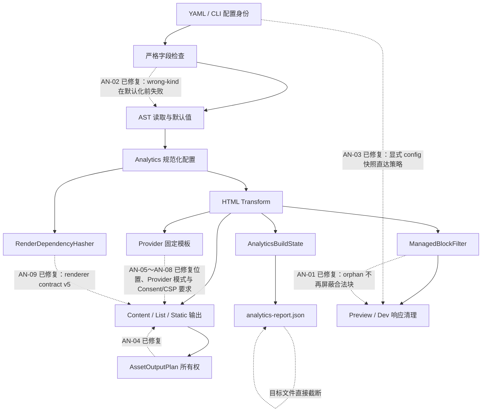

# Bukit Analytics 内置插件深度全方位复审报告（2026-07-20）

> 复审日期：2026-07-20（Asia/Kuala_Lumpur）
> 原复审实现基线：`main@fe27bbbe`；当前整改基线：`main@02a44617` 加 AN-11 当前工作树
> 原 Analytics 实现提交：`4103959c`
> 原报告提交：`9ff5d452`
> 执行环境：macOS arm64，.NET SDK 10.0.100，Bukit 1.0.10
> 执行 checkout：审计开始时为 `f076a288`；结束前仓库被外部推进到 `main@f80919f8`。`fe27bbbe..f80919f8` 没有 `src/Bukit-Core` 实现变化，因此本文继续以约定的 `fe27bbbe` 为唯一实现基线。
> 整改状态：AN-01～AN-10 已进入当前 `main`；AN-11 于 2026-07-21 在 `main@02a44617` 后的当前工作树完成修复和验证。Analytics renderer contract 当前为 v5；其余状态不自动变化。
> 审计阶段边界：复审时只重写本报告。后续整改按发现逐项推进；AN-08 新增显式 Google Consent Mode v2 与 CSP requirements-report 配置、Analytics 报告 v2 和对应公共配置模型，不改变外部插件协议，也不把静态生成器伪装成 CMP、HTTP nonce 发行方或完整 CSP 生成器。

## 一、复审结论

原 AN-01～AN-14 均已从当前源码和运行结果重新验证，旧结论没有自动继承。结论如下：

- 当前未解决问题 **3 项**：P0 0 项、P1 0 项、P2 0 项、P3 3 项。
- 已修复 **11 项**：AN-01～AN-11。Preview fallback 现在区分 Keep/Remove/Error/Source：发现但无法加载的配置会在 listener 启动前退出 2，缺失配置则明确警告后保留管理块。Preview 无改写路径保留原始字节；Preview 清理与 Dev LiveReload 仅改写严格 UTF-8 并保留已有 BOM。Google Provider 必须显式声明 Consent Mode v2 advanced 默认值；可选 CSP requirements-report 输出与实际片段字节一致的 SHA-256 和 origin 清单，renderer contract v5 进入增量 hash。
- 新增确认问题 **0 项**。本轮扩大到共享 Engine、运行模式、原始字节、报告、增量和 Native AOT 后，没有把不稳定假设升级成新编号。
- 复审基线相关定向测试 **450/450 通过**；AN-02 整改 gate 为 Config **245/245**、CLI **578/578**，AN-03 整改后的 CLI gate 为 **583/583**，AN-05/AN-09 整改后的 Engine gate 为 **1564/1564**，AN-06 整改后的 Engine gate 为 **1566/1566**，AN-07 整改后的 Config/Engine gate 为 **255/255、1569/1569**，AN-08 最终 Config/Engine 为 **278/278、1577/1577**，AN-10 最终 CLI 为 **599/599**，AN-11 最终 CLI 为 **602/602**。测试通过不用于否定仍未覆盖的其他发现。
- `osx-arm64` Native AOT 发布成功，发布二进制完成四 Provider 最小真实构建；未加载生成页面，也未向 Analytics 服务发送请求。

主体链路能够工作：四个 Provider 可生成脚本，Content/List/Static/多语言页面经过统一 Transform，Development 能抑制 production-only 追踪，插件禁用会生成可解释的报告，Provider 值校验和输出转义有效，报告不泄露 Provider ID。AN-01～AN-11 已关闭，P1/P2 已清零；剩余项为报告原子性、linked-source 所有权和禁用配置过度增量失效三项 P3。Consent advanced mode 本身仍不等于零网络或法规合规保证。

## 二、严重度与状态总表

### 2.1 分级与状态

| 项目 | 定义 |
|---|---|
| P0 | 可普遍触发的灾难性数据、安全或发布失败，必须阻断发布。 |
| P1 | 可稳定触发的隐私策略失效、错误启用追踪或核心契约破坏。 |
| P2 | 明确的兼容性、可靠性、安全能力或增量正确性缺口。 |
| P3 | 架构债务、性能、原子性或低概率恢复风险。 |
| 仍存在 | 当前源码解释、最小复现或严格控制流证据仍成立。 |
| 已修复 | 源码闭环、最小复现转绿和真实构建证据同时成立。 |

### 2.2 当前发现总表

| ID | 状态 | 等级 | 分类 | 当前结论 | 置信度 |
|---|---|---:|---|---|---:|
| AN-01 | **已修复** | 原 P1 | 已修复 Bug / 隐私风险 | orphan 保留但不再屏蔽后续合法块；连续三次 Transform 完全相等，Preview 可清理合法块。 | 高 |
| AN-02 | **已修复** | 原 P1 | 已修复配置契约 Bug | 原五类错误 YAML 及四个同根防御用例均以精确路径失败；插件 Schema 与运行时短/长格式一致。 | 高 |
| AN-03 | **已修复** | 原 P1 | 已修复 Preview Bug / 隐私风险 | custom config、`--config + --dir`、`--site`、冲突 root config 和外部 output 均使用同一显式配置快照。 | 高 |
| AN-04 | 已修复 | 原 P1 | 已修复发布 Bug | fresh build 不再生成原始 `raw.html`；旧 manifest 拥有的旁路文件会在增量升级时删除。 | 高 |
| AN-05 | **已修复** | 原 P2 | 已修复外部规范漂移 | GA/GTM 现在按槽内配置顺序紧随 opening head；GTM noscript 仍紧随 opening body。 | 高 |
| AN-06 | **已修复** | 原 P2 | 已修复 Provider 设计缺陷 | 多 GA 共享一套 loader/bootstrap；每个 destination 保留一个有序 config 与独立 marker。 | 高 |
| AN-07 | **已修复** | 原 P2 | 已修复外部规范漂移 / 配置契约 | Plausible 新旧片段由显式 `snippetMode + scriptUrl` 决定；删除旧默认并拒绝官方 URL/模式错配。 | 高 |
| AN-08 | **已修复** | 原 P2 | 已修复安全/隐私设计缺陷 | Google Provider 强制显式 Consent Mode v2 advanced 默认值；报告 v2 提供精确 CSP hash/origin 要求并明确非完整策略。 | 高 |
| AN-09 | **已修复** | 原 P2 | 已修复增量设计缺陷 | Analytics renderer contract 已进入 framed hash，AN-08 输出变化同步提升为 v5。 | 高 |
| AN-10 | **已修复** | 原 P2 | 已修复字节保真 Bug | Preview 无改写时逐字节返回；严格 UTF-8 改写保留 BOM，非法改写输入可见失败而非替换。 | 高 |
| AN-11 | **已修复** | 原 P2 | 已修复安全/隐私风险 | Preview fallback 对损坏/不可读配置在 serving 前报错退出；缺失配置明确警告并保留管理块。 | 高 |
| AN-12 | 仍存在 | P3 | 可靠性问题 | Analytics 报告直接截断并覆盖目标文件，不是原子写入。 | 高 |
| AN-13 | 仍存在 | P3 | 架构债务 | CLI 引用 Engine 的同时再次源码编译 Engine 的扫描器和过滤器。 | 高 |
| AN-14 | 仍存在 | P3 | 性能/增量问题 | 哈希未按有效启用状态裁剪；禁用配置变化仍使页面过度失效。 | 高 |

### 2.3 AN-01～AN-14 状态迁移

| ID | 2026-07-18 | 当前状态 | 复审/整改依据 |
|---|---|---|---|
| AN-01 | 确认 | **已修复（同日整改）** | RED 复现 1→2→3；线性两遍解析后连续三次相等，Preview 合法块被清理。 |
| AN-02 | 确认 | **已修复（同日整改）** | 原五个黑盒 `config check` 均由退出 0 转为退出 1；合法空 Analytics 与插件长格式仍通过。 |
| AN-03 | 确认 | **已修复（2026-07-21 整改）** | 五个真实 HTTP 场景由错误保留/误删转绿；显式策略来源输出为已解析配置路径。 |
| AN-04 | 确认 | **已修复** | `AssetOutputPlan` 输出所有权修复；fresh/upgrade 两种真实构建转绿。 |
| AN-05 | 漂移 | **已修复（2026-07-21 整改）** | Google 官方文档重新抓取；混合 Provider、SEO、旧 marker 与真实增量构建均转绿。 |
| AN-06 | 确认 | **已修复（2026-07-21 整改）** | 三 GA 真实构建为 loader/bootstrap 各 1、config 3；配置顺序、marker、删除与三次幂等回归转绿。 |
| AN-07 | 漂移 | **已修复（2026-07-21 整改）** | 删除旧 URL 默认；显式 legacy/site-specific 契约、官方 URL 交叉校验、真实新旧构建和迁移幂等均转绿。 |
| AN-08 | 风险 | **已修复（2026-07-21 整改）** | Consent default 在全部 Google bootstrap/config 前且只出现一次；CSP 报告 hash 与实际脚本字节一致，Native AOT 四 Provider 构建通过。 |
| AN-09 | 确认 | **已修复（AN-05～AN-08 依赖整改）** | renderer contract v2 首次进入 framed hash，AN-06/AN-07/AN-08 同步提升为 v3/v4/v5；v1～v5 hash 均不等。 |
| AN-10 | 确认 | **已修复（2026-07-21 整改）** | 16 个真实 HTTP 原始字节用例由全部失败转绿；Preview 直通、伪 marker、BOM 改写、UTF-16/32 fail-closed、Dev LiveReload 与非法 UTF-8 拒绝均有断言。 |
| AN-11 | 风险 | **已修复（2026-07-21 整改）** | 三个真实 Preview 黑盒场景先红后绿；结构化决策保留来源与异常，损坏/不可读配置在 listener 前退出 2，缺失配置显式警告。 |
| AN-12 | 风险 | 仍存在 | 仍为 `File.Create(path)` 直接写入。 |
| AN-13 | 债务 | 仍存在 | `.csproj` linked-source 仍存在。 |
| AN-14 | 性能 | 仍存在 | 插件关闭时 hasher 仍纳入全部 Provider 值。 |

## 三、跨模块根因图



三类系统性根因贯穿多数发现：

1. JSON Schema、YAML AST 节点类型、运行时默认值和 CLI 检查曾在 Analytics/plugin 开关处失配；AN-02 已将该范围收敛为同一严格契约。
2. HTML marker 没有签名或所有权凭据；AN-01 已用线性两遍解析修复可判定的 orphan-before-valid 情形，完整伪造合法 pair 的所有权仍无法从文本本身区分。
3. Provider 渲染能力曾被压缩为 `HeadEnd/BodyStart` 两个固定槽且缺少安全策略模型；AN-05～AN-08 已分别补 HeadStart、共享 Google bootstrap、显式 Plausible 模式和 default-before-config Consent/CSP requirements。每响应 nonce 仍由 HTTP serving layer 负责，这是静态生成边界而非未完成实现。

## 四、发现详情（含整改状态）

### AN-01 — 原 P1：畸形管理标记阻断合法块清理并破坏幂等（已修复）

- **置信度 / 分类：** 高；历史已确认 Bug、隐私风险；当前已修复。
- **源码位置：** `AnalyticsManagedBlockFilter.cs:12-98,174-178`；`AnalyticsHtmlTransform.cs:31-34,88-112`；`PreviewCommand.cs:253-260`；`DevRequestHandler.cs:65-73`。
- **最小复现：** 在 `<head>` 中放入没有 end 的 `<!-- bukit:analytics:google-analytics:G-ORPHAN:head:start -->`，对同一 HTML 连续执行三次有效 GA Transform。
- **命令与输出：** TDD RED 中 Engine 断言第一、第二次字符串不同，CLI 仍找到 `G-ACTIVE`；修复后 `AnalyticsHtmlTransformTests` 13/13、`PreviewCommandTests` 18/18，Engine Analytics 54/54、CLI Preview/Dev 117/117。
- **期望 / 实际：** 期望保留 orphan、清理其后独立合法块并保证重复 Transform 相等；当前实际为三次结果完全相等、恰有一个 `G-ACTIVE`，Preview 删除 `G-ACTIVE` 及其脚本且保留 orphan。
- **历史根因：** 旧过滤器对每个 start 向后做全局 depth 扫描，未闭合时 `break`，使 orphan 吞掉其后的合法 pair。
- **修复实现：** 第一遍以栈按通用 start/end 边建立 close 和 parent，第二遍只删除“直接 pair、key/location 相同、没有已闭合祖先”的块。未闭合祖先被保留但不再屏蔽后续独立 pair；总复杂度为 O(n)，避免简单 `break → continue` 在多个 orphan 下退化为 O(n²)。
- **影响范围：** Production 幂等、Preview/Dev production-only 清理均恢复；没有改动公共 API、配置 Schema、报告 Schema 或外部插件协议。
- **修复边界：** nested、crossed、bounded mismatch、孤立 marker 仍保守整组保留；无签名协议无法区分用户手写的完整合法 pair 与 Bukit pair，这是既有协议边界，不在 AN-01 内扩张协议。
- **回归测试：** 连续三次完全相等；Preview orphan 后合法块清理；嵌套、交叉、bounded mismatch、属性、普通注释及 `script/style/title/textarea` 中 marker-like 内容不误删。

### AN-02 — 原 P1：错误 YAML 节点类型被静默降级为默认值（已修复）

- **置信度 / 分类：** 高；历史已确认配置契约 Bug；当前已修复。
- **源码位置：** `ConfigStrictFieldValidator.cs:72-104,142-185`；`ConfigJsonSchemaGenerator.cs:57,604-613`；`AnalyticsConfigTests.cs:71-104`；`ConfigCommandTests.cs:111-161`。
- **历史最小复现：** `analytics: []`、`providers: {}`、`enabled: []`、`productionOnly: {}`、`site.plugins.analytics: definitely-not-a-bool` 均曾被当作缺失或默认启用。
- **修复后命令与输出：** 用 Release CLI 对原五个文件运行 `dotnet bukit.dll config check --config <file>`，五次均退出 `1`，依次输出 `site.analytics must be a mapping`、`providers must be a sequence`、两个布尔路径错误及 `site.plugins.analytics must be a mapping or boolean`；合法 `analytics.providers: []` 与插件 `{ enabled: false, options: {...} }` 退出 `0`。
- **期望 / 实际：** 期望 wrong-kind 在默认值应用前失败；当前 YAML AST 严格层按完整路径抛出 `ConfigInvalidValue`，`config check` 返回 1，不再静默启用插件或丢弃 Provider。
- **历史根因：** `Map/Seq/GetOptional*` 用 null 同时表示“不存在”和“类型错误”，插件短格式的 `bool.TryParse` 失败又保留初始 `enabled=true`。
- **修复实现：** Analytics object、Provider list 和两个布尔字段均做 presence-aware kind 检查；`site.plugins` 及每个插件短/长格式统一验证。生成 Schema 使用 `oneOf(boolean, strict mapping)`，mapping 只允许 `enabled/options`，同时保留未知插件名与 `options.additionalProperties=true`。
- **影响范围：** `config check`、Production、Development、Preview 共用同一加载路径；修复同时覆盖所有 Core built-in plugin toggle，避免同类非法标量默认启用。
- **修复边界：** 没有改动公共 C# API、Analytics Provider 字段或外部插件协议；合法 `analytics: {}`、`providers: []`、插件 true/false 短格式和 mapping 长格式保持兼容。此前无效果的 wrapper 未知字段现在按严格契约拒绝。
- **回归测试：** 原五个复现加 `site.plugins: []`、长格式错误 `enabled/options`、wrapper 未知字段共九项均精确断言错误码、消息和 CLI 非零退出；合法空 object/list、Provider 校验与顺序、插件短/长格式及 Schema 开放边界保持通过。仓库定向 gate：Config 245/245、CLI 578/578；最终 subagent 只读审查无 Critical/Important。

### AN-03 — 原 P1：Preview 丢失显式配置身份（已修复）

- **置信度 / 分类：** 高；历史已确认 Preview Bug、隐私风险；当前已修复。
- **源码位置：** `PreviewCommand.cs:20-40,64-75`；`PreviewCommandExtendedTests.cs:179-258,460-556`。
- **历史最小复现：** 站点只有 production-only `custom.yaml`，`dist/index.html` 含合法管理块，运行 `bukit preview --config custom.yaml`；历史响应保留完整追踪块，加入相同 `site.yaml` 后才清理。
- **修复后命令与输出：** 五个真实 listener/HTTP 场景分别覆盖 custom-only、custom 与最近 `site.yaml` 反向冲突、`--config + --dir`、`--site` 与 root config 冲突、外部绝对 output；响应均服从显式配置，启动输出增加 `Analytics policy source: <resolved config path>`。
- **期望 / 实际：** 期望显式配置同时决定 configured output 和 Analytics 策略；当前 `--config/--site` 在目录判定前 Resolve+Load 一次，`--dir` 只覆盖 serving directory，策略使用同一个不可变 `AppConfig` 快照。
- **历史根因：** Preview 在计算 output 后丢弃 `ResolvedConfigPath` 和已加载配置，策略层再次从 output 向上猜测字面 `site.yaml`；`--config + --dir` 更是完全跳过配置加载。
- **影响范围：** 自定义配置、多站点、显式目录、外部 output 和同一 output 被多个配置使用的场景；修复后不再由目录祖先偶然决定是否移除追踪块。
- **修复边界：** 无显式 `--config/--site` 时仍执行既有 nearest-`site.yaml` fallback；其错误状态和缺失状态已由 AN-11 分离。HTML 读取/UTF-8 重编码属于 AN-10，亦未改动。显式配置加载错误继续在 listener 启动前传播。
- **回归测试：** 五个场景在修复前均稳定 RED、修复后 5/5 GREEN；全部 Preview 定向测试 72/72，仓库 targeted gate CLI 583/583；最终 subagent 只读审查无 Critical/Important。

### AN-05 — 原 P2：GA/GTM head 注入位置偏离 Google 当前安装要求（已修复）

- **置信度 / 分类：** 高；历史外部规范漂移、兼容性问题；当前已修复。
- **源码位置：** `AnalyticsHtmlFragments.cs:3-7`；`AnalyticsHtmlTransform.cs:88-128`；`GoogleAnalyticsProvider.cs:15-25`；`GoogleTagManagerProvider.cs:16-19`；`AnalyticsRendererContract.cs:1-6`；`RenderDependencyHasher.cs:14-18,54-61`。
- **官方基线：** 2026-07-21 重新抓取 Google tag 官方文档，仍要求片段 immediately after opening `<head>`；GTM 官方文档仍要求第一段尽可能靠近 head 顶部、第二段 immediately after opening `<body>`。
- **TDD RED：** 混合大小写 `<HeAd data-x="a>b"><title>...` 输入中，opening head 内容起点为索引 25，GA marker 历史实际位于 title 后；精确位置断言失败。
- **修复实现：** 内部 fragment contract 增加 `HeadStart`；GA/GTM 改填该槽，Plausible/Umami 保持 `HeadEnd`。Transform 单次扫描 head，先按原坐标写 HeadEnd、再写 HeadStart，槽内保持配置顺序；marker 继续使用兼容的 `location=head`，GTM `BodyStart` 未改变。
- **期望 / 实际：** `/tmp/bukit-an05-reaudit-*` 四 Provider 真实构建输出为 `head → GTM → GA → theme/SEO → Plausible → Umami → /head`，`body → GTM noscript`；符合按物理槽分组、槽内配置稳定的新契约。
- **增量闭环：** renderer contract 提升为 v2 并进入 framed Render Dependency Hash。人工植入旧位置 HTML 与旧 hash 后执行 `--no-clean --incremental`，页面重新渲染，旧 HeadEnd 内容消失；相同新契约后续构建可继续增量复用。
- **影响范围：** GA4/GTM 的 Content、List、Static 与多语言统一 Transform 路径；没有改变配置 Schema、Provider ID、外部插件协议、Plausible/Umami 位置、GTM iframe 或 Consent/CSP 语义。
- **兼容边界：** Provider 的全局 DOM 顺序现在按槽分组，而非跨槽严格跟随配置列表；HeadStart 内部、HeadEnd 内部各自保持配置顺序。外部插件若也在更晚阶段插入 head 首部，其相对顺序仍由插件 pipeline 决定，不在本项扩展聚合协议。
- **回归测试：** GA/GTM Provider golden 槽位；opening head 精确索引；混合大小写与含 `>` 属性；首个多 head；GTM body 第一子项；interleaved Provider 槽内顺序；SEO/主题组合；旧 HeadEnd marker 迁移后三次字节幂等；renderer version hash 变化。

官方基线（抓取日期 2026-07-21）：[Google tag](https://developers.google.com/tag-platform/gtagjs)、[GTM 安装规范](https://support.google.com/tagmanager/answer/14847097?hl=en)。

### AN-06 — 原 P2：多个 GA Provider 输出多套 bootstrap（已修复）

- **状态 / 置信度 / 分类：** 已修复；高；已修复 Provider 设计缺陷、性能与数据质量风险。
- **源码位置：** `AnalyticsHtmlTransform.cs:53-61,86-105`；`GoogleAnalyticsProvider.cs:7-39`；`AnalyticsRendererContract.cs:3-5`。
- **原最小复现：** 配置两个不同合法 measurement ID，真实构建任一页面；修复前 loader、`window.dataLayer`、`function gtag`、`gtag('js')` 与 config 均各 2。
- **TDD 命令与 RED：** 定向执行 `Transform_MultipleGoogleAnalyticsProviders_ShareBootstrapAndKeepConfigOrder` 与 renderer contract 测试；旧实现返回 loader `Expected: 1, Actual: 3`，默认 hash 仍等于 v2 而非 v3，两个测试均按预期失败。
- **修复实现：** Transform 依配置顺序选择 GA 片段。首个 GA 继续使用原有完整 golden，loader URL 使用首个 measurement ID；后续 GA 使用各自 `ProviderKey` 的 config-only HeadStart managed block，不再重复 loader、队列、函数或 `gtag('js')`。这保留 `GA-1, GTM, GA-2` 的槽内全局顺序、单 GA 字节输出、destination 删除语义和旧 marker 清理能力。
- **期望 / 实际：** Google 当前官方示例是一套 loader/bootstrap 后调用多个 `gtag('config', ...)`。当前三 GA + GTM 真实构建得到 loader=1、`window.dataLayer`=1、`function gtag`=1、`gtag('js')`=1、config=3；三个 GA marker 各 1，顺序为 `GA-1 config < GTM < GA-2 config < GA-3 config`。
- **真实构建证据：** `/tmp/bukit-an05-reaudit-tS7Q4g/site` 使用合成 ID 执行源码 CLI `build --no-clean --no-incremental`，`dist/index.html` 计数为 `1/1/1/1/3`；随后连续两次 `--incremental` 仍保持相同计数，页面 SHA-256 均为 `c9bf6253afd7575fdbf3e40863417233a3851f2aeb4ca5cfeede31f0b8c04d44`。未加载页面，也未发送追踪请求。
- **增量闭环：** 可观察输出变化将 `AnalyticsRendererContract.Version` 从 v2 提升为 v3；v1、v2、v3 framed hash 两两相异，旧契约 manifest 不会复用多 bootstrap 页面。Provider 列表及顺序本身仍由既有 hasher 覆盖。
- **根因与关闭依据：** 原根因为逐 Provider 无状态调用完整 GA renderer；现在 Transform 作为唯一持有完整有序 Provider 列表的层，显式跟踪是否已渲染 GA bootstrap。源码闭环、原复现转绿、真实构建计数和 renderer hash 证据均成立。
- **影响范围：** 所有配置两个或以上不同 GA measurement ID 的 Content、List、Static 与多语言页面；单 GA、GTM body、Plausible、Umami、配置 Schema 和外部插件协议不变。
- **修复边界：** 没有把 GA 合并为单一 shared marker，也没有把后续 GA 提前越过中间 Provider；每个 destination 仍有独立 managed block。Consent/CSP 和禁用时 hash 裁剪分别留在 AN-08、AN-14；Plausible 随后的 AN-07 整改独立完成。
- **回归测试：** `AnalyticsHtmlTransformTests:78-129` 覆盖双/三 GA 一套 bootstrap、N config、首 ID loader、GTM 交错顺序、三个 marker、三次字节幂等和移除 destination；单 GA exact golden 继续通过；`RenderDependencyHasherTests:178-204` 覆盖 v1/v2/v3。

官方基线（抓取日期 2026-07-21）：[Google 配置多个 destination](https://developers.google.com/tag-platform/gtagjs/configure)。文档示例在首个 tag 初始化后追加第二个 `config`，且页面标注最后更新于 2026-05-12 UTC。

### AN-07 — 原 P2：Plausible 默认绑定旧通用脚本模型（已修复）

- **状态 / 置信度 / 分类：** 已修复；高；已修复外部规范漂移、配置契约缺陷。
- **源码位置：** `AppConfig.cs:74-84`；`SiteDefaultsApplier.cs:88-115`；`I18nValidator.cs:203-253`；`ConfigJsonSchemaGenerator.cs:214-290`；`AnalyticsConfigNormalizer.cs:28-33`；`PlausibleProvider.cs:7-27`；`AnalyticsRendererContract.cs:3-5`。
- **原最小复现：** Plausible 只配置 `domain`；修复前 Schema/defaults 静默补入 `https://plausible.io/js/script.js`，真实构建固定生成旧式 `defer + data-domain`，无法表达 2025-10 后站点专属脚本及初始化片段。
- **TDD RED：** 新配置/Engine 用例首先因 `AnalyticsProviderConfig` 没有 `SnippetMode` 无法编译；补齐模型后，旧默认、缺失模式可通过以及仅有旧模板的行为继续使契约测试失败，证明缺口位于公共配置到渲染的完整链路。
- **修复实现：** 公共配置新增必填 `snippetMode: site-specific|legacy`，两种模式均显式要求 `domain + scriptUrl`；删除旧通用 URL 默认。JSON Schema 以条件规则表达模式/URL 组合，严格字段白名单、YAML AST、默认值读取、运行时验证和标准化保持一致。Plausible Cloud URL 额外交叉校验：`site-specific` 必须使用 `/js/pa-<site-id>.js`，该路径不得声明为 `legacy`。
- **期望 / 实际：** `site-specific` 生成官方结构的 `async` 外链、固定 queue/bootstrap 与 `plausible.init()`，不再输出 `data-domain`；`legacy` 精确保留旧式 `defer data-domain + src`。两者继续使用 IDN 规范化后的 `plausible:<domain>` 稳定 Provider key，因此切换模式会替换同一 managed block，而不是残留两套脚本。
- **真实命令与输出：** 在 `/tmp/bukit-an05-reaudit-tS7Q4g/site` 以合成 URL 执行两次源码 CLI 构建。site-specific 输出各 1 个 `pa-AN07TEST.js`、queue bootstrap 和 `plausible.init()`，旧 script/data-domain 计数为 0；legacy 输出恰有 1 个 `defer data-domain="example.test"` 且没有 init。删除 `snippetMode` 后 `config check` 退出 1，并输出 `site.analytics.providers[1].snippetMode is required.`；未加载页面、未发出追踪请求。
- **根因闭环：** 原实现把一项会随 Plausible 站点设置变化的旧 URL 固化为 Bukit 默认值，并把 Provider 渲染压缩为单一模板。当前配置必须显式选择兼容模式和脚本 URL，运行时不会再猜测或静默迁移用户语义。
- **增量闭环：** 可观察 HTML 契约将 `AnalyticsRendererContract.Version` 从 v3 提升为 v4；v1/v2/v3/v4 framed hash 均不等。legacy→site-specific 的同 key Transform 会清除旧块、只保留一个新块，第三次结果字节相等。
- **公共 API 与迁移影响：** `AnalyticsProviderConfig.SnippetMode` 是唯一新增公共成员，已通过 candidate baseline 逐项比对并写入治理基线。现有仅配置 `domain` 或依赖旧默认的站点会有意 fail-fast；继续旧行为需显式增加 `snippetMode: legacy` 和原脚本 URL，迁移新机制则使用 `site-specific` 与 Plausible Site Installation 提供的完整 URL。这是可见但受控的配置破坏性收紧，不宣称向后兼容。
- **影响范围：** Plausible Cloud 新站点、旧 Cloud 站点、自托管/代理脚本和 IDN domain；没有改变 GA/GTM/Umami、外部插件协议或 managed marker 格式。
- **修复边界：** 本项只提供固定安全模板和显式 URL，不接受任意 HTML、JavaScript 或初始化选项，也不新增 endpoint 覆盖。site-specific 自托管/代理脚本只有在该脚本自身已绑定正确 endpoint 时可用；CSP nonce、授权前加载和 CMP 时序仍属于 AN-08。
- **回归测试：** 缺失/非法模式、缺失 URL、Plausible Cloud URL/模式错配、未知/跨 Provider 字段、IDN key、legacy exact golden、site-specific exact golden、属性转义、模式 hash 差异、同 key 迁移清理和三次幂等；仓库 targeted gate 为 Config 255/255、Engine 1569/1569，公共 API drift 检查通过。

官方基线（抓取日期 2026-07-21）：[Plausible script update guide](https://plausible.io/docs/script-update-guide)、[Plausible 当前脚本指南](https://plausible.io/docs/plausible-script)、[官方 site-specific snippet 示例](https://plausible.io/docs/proxy/guides/laravel)。官方同时说明旧片段仍可工作，因此本修复保留显式 legacy 模式，而非强制改写现有站点。

### AN-08 — 原 P2：Consent Mode 与严格 CSP 缺少一等集成契约（已修复）

- **置信度 / 分类：** 高；历史安全/隐私风险、设计缺陷；当前已修复。
- **源码位置：** `AppConfig.cs` 的 Analytics consent/CSP records；`ConfigStrictFieldValidator.cs`、`SiteDefaultsApplier.cs`、`I18nValidator.cs`、`ConfigValidator.cs` 与 `ConfigJsonSchemaGenerator.cs` 的一致契约；`GoogleConsentRenderer.cs`、`AnalyticsFragmentRenderer.cs`、`AnalyticsCspRequirementsBuilder.cs`；`AnalyticsReportWriter.cs`；`analytics-report.v2.schema.json`；`RenderDependencyHasher.cs` 与 `AnalyticsRendererContract.cs`。
- **TDD RED：** 缺失 Google consent 的配置原先通过；嵌套 consent/csp 被报 unknown field；标准化与 hash 不包含策略；HTML 中没有 consent marker，三次变换断言失败；报告没有 `googleConsent`/`csp` 且仍引用 v1 Schema。所有失败均先稳定复现，再补实现。
- **配置契约：** 任意 GA/GTM Provider 现在必须存在 `site.analytics.consent.google`；无 Google Provider 时反向拒绝 dormant Google consent。当前只接受 `mode: advanced`，四个 v2 默认值均必填且只能为 `granted|denied`，`waitForUpdateMs` 可选范围 `0..5000`。`site.analytics.csp.mode` 只接受 `requirements-report`，并要求 build report 未被显式关闭。严格字段校验、YAML AST 读取、公共模型、JSON Schema、运行时验证、标准化和公共 API 治理基线同步更新。
- **渲染与时序：** 单一 `google-consent:default` managed block 初始化 `dataLayer/gtag` 并执行 default command，固定早于全部 GA loader/config 与 GTM bootstrap；首个 GA 不再重复初始化，后续 GA 保持 config-only marker。含 GTM、双 GA 的同一输入连续三次 Transform 字节相等；删除 Google Provider、关闭 Analytics 或 production-only Development pass 会清除 consent 与 Provider blocks。
- **CMP 边界：** Bukit 不发明私有 update helper。GA-only 站点由 CMP 调用标准 `gtag('consent','update',...)`；含 GTM 时由 GTM consent template 使用 `setDefaultConsentState` / `updateConsentState`。Advanced mode 在 denied 时仍可加载资源并产生 cookieless pings，因此本修复不宣称零网络、法律合规或自动 CMP 集成。
- **CSP 边界：** 可选 requirements-report 从与实际 Transform 共用的 fragment renderer 计算内联脚本 UTF-8 精确字节的 SHA-256，输出排序去重的 `script-src`/`frame-src` origins 和 GTM 动态目的地不确定标志。报告固定 `completePolicy=false`，不包含 Provider ID、Plausible tracking domain、UUID、完整脚本 URL、nonce 或任意用户 JavaScript；启用 CSP report 时会有意输出去路径后的 scheme + authority origin。静态生成器不生成固定/占位 nonce；安全 nonce 必须由 serving layer 每响应随机生成。
- **增量与报告：** Consent 的 mode、四个默认值和 wait 值进入 framed render dependency hash；可观察 HTML 契约从 v4 提升为 v5。CSP report-only 开关不污染页面 hash，requirements 清单由配置和共享 renderer 构建，不依赖本轮实际渲染页数。Analytics report 升级为严格 v2，旧 v1 Schema 文件原样保留。
- **真实命令与输出：** `/tmp` 隔离站点使用合成 GA/GTM/Plausible/Umami 值完成 config check、源码 CLI build 和重复 incremental build。2 个正式页面均为 consent→GA/GTM 顺序、四 Provider 各一份；报告 v2 为 `processedHtml=2`、`injectedHtml=2`，含 4 个 inline hash、3 个 script origin、1 个 frame origin、`dynamicContainerDestinationsUnknown=true`。`osx-arm64` Native AOT publish 成功，`runtime: native-aot` 二进制构建结果与源码 CLI HTML 字节相同，报告断言通过；没有加载页面或发出追踪请求。
- **影响范围：** 现有 GA/GTM 配置会有意 fail-fast，必须显式选择 consent defaults；Plausible/Umami-only 站点无需 Google consent。报告消费者需要从 analytics-report v1 迁移到 v2。外部插件协议、主题模型、manifest schema 和 HTTP headers 均未扩张。
- **修复边界：** 不验证 CMP 运行时是否实际发送 update，不生成站点完整 CSP header，不枚举 GTM container 内部目的地，也不保证法规合规；这些属于部署与运行环境责任，不再作为本项实现缺口。AN-11 已修复 Preview fallback 的错误可观测性，但不会把 Preview 变成 CMP 或法规合规验证器。
- **回归测试：** wrong-kind/unknown/missing/invalid consent 与 CSP、Schema 双向条件、报告开关冲突、标准化、hash 差异、default-before-bootstrap、多 GA、三次幂等、删除与 Development 清理、精确脚本 hash、四 Provider origins、隐私字段排除、report v2 strict schema、源码 CLI 与 Native AOT 构建。

官方基线（抓取日期 2026-07-21）：[Google Consent Mode](https://developers.google.com/tag-platform/security/guides/consent)、[Google CSP 指南](https://developers.google.com/tag-platform/security/guides/csp)。

### AN-09 — 原 P2：增量哈希不包含 Analytics 渲染契约版本（已修复）

- **置信度 / 分类：** 高；历史增量设计缺陷；作为 AN-05～AN-07 的生效依赖已修复。
- **源码位置：** `AnalyticsRendererContract.cs:1-6`；`RenderDependencyHasher.cs:14-18,54-75`；`VariantBuildPipeline.cs:556-608`。
- **历史根因：** Render Dependency Hash 只建模配置输入，没有建模 Provider/marker/位置生成器契约，升级二进制仍可能与旧 manifest hash 相等。
- **修复实现：** 新增单一内部 `AnalyticsRendererContract.Version`，以 `analytics.rendererContractVersion` framed value 进入基础渲染依赖 hash；AN-05 的 HeadStart 变化以 v2 为升级边界，AN-06 的多 destination 变化提升为 v3，AN-07 的 Plausible 模式变化提升为 v4，AN-08 的 Consent 渲染同步提升到当前 v5。
- **期望 / 实际：** 同配置下显式 contract v1/v2/v3/v4/v5 计算得到不同 hash；旧 manifest 人工置入 v1 结果后 AN-05 真实 `--no-clean --incremental` 构建重新渲染并更新，AN-06～AN-08 进一步证明默认值依次升级且当前等于 v5。
- **影响范围：** Provider snippet、marker 格式、注入位置、转义或后续 consent 渲染逻辑的二进制升级；未来每次可观察 HTML 契约变化仍必须显式提升该版本。
- **修复边界：** 没有改变 manifest schema，也没有顺带裁剪 disabled 配置的过度失效；后者仍属于 AN-14。
- **回归测试：** `Compute_AnalyticsRendererContractVersionChange_ProducesDifferentHash`；AN-05 真实 legacy hash 升级；Provider golden、Plausible 模式/Consent policy hash 与当前 contract v5 同批维护。

### AN-10 — 原 P2：Preview/Dev 无条件破坏 HTML 原始字节（已修复）

- **置信度 / 分类：** 高；已修复 Bug、兼容性问题。
- **源码位置：** `HtmlResponseByteTransformer.cs:1-90`；`PreviewCommand.cs:259-285`；`DevRequestHandler.cs:60-74`；`PreviewCommandExtendedTests.cs:323-431`；`DevCommandTests.cs:561-619`。
- **历史最小复现：** 在没有配置、没有管理块的 output 中放入一个 UTF-8 BOM HTML 和一个含 Latin-1 `0xE9` 的 HTML，通过 Preview 请求原始响应字节；另用 BOM HTML 和非法 UTF-8 HTML 请求 Dev。
- **RED 命令与输出：** 首轮 6 个真实 `HttpListener` 原始响应测试全部失败：Preview/Dev 的 BOM 期望 `efbbbf`、实际以 `3c6874` 开始；Latin-1 `e9` 被改为 `efbfbd`；Preview 必须清理以及 Dev 必须注入时的非法 UTF-8 均错误返回 200。首轮只读复核追加的 script/style/title/textarea/属性/孤立伪 marker 与 Latin-1 组合亦 6/6 先失败为 500；第二轮复核追加的 UTF-16LE/BE、UTF-32LE/BE BOM 真实管理块则 4/4 先错误返回 200。
- **历史根因：** Preview 和 Dev 在是否发生有效变换之前就调用文本读取 API，并总是以 UTF-8 重新编码；响应层没有原始字节 fast path、严格解码或 BOM 输出策略。
- **修复实现：** Preview 策略关闭时直接流式复制文件；策略开启时不再以某一种编码的 marker 字节作为前置判断，而是总是调用同一过滤器确认结构是否变化。严格 UTF-8 解码失败时，UTF-16LE/BE、UTF-32LE/BE BOM 由对应严格解码器产生结构投影，其余输入使用一字节 Latin-1 投影；script/style/title/textarea/属性中的伪 marker、孤立 marker 及无管理块输入均返回原数组，真实可移除块则安全拒绝。必须清理时与 Dev LiveReload 共用严格 UTF-8 rewriter：解码前记录 UTF-8 BOM，字符串无变化时返回原数组，发生变化时按原 BOM 状态重新编码；解码失败且确需改写时抛出明确的 `InvalidDataException`，两种服务器均返回 500，Dev 同时记录 `valid UTF-8` 警告。
- **期望 / 实际：** 无需改写的 UTF-8 BOM 和 Latin-1 输入现在逐字节相等，`Content-Length` 等于原始/实际输出长度；Analytics 清理和 LiveReload 注入保留输入 BOM；必须改写的非法 UTF-8 不再产生 replacement character 或错误 200。
- **影响范围：** Preview 不改写路径、production-only 管理块清理、Dev Analytics 清理与 LiveReload 注入；磁盘源文件始终不变。
- **修复边界：** 没有尝试猜测或转码非 UTF-8 HTML。无改写路径保持原字节；需要 Analytics/LiveReload 改写的输入必须是 UTF-8。Preview fallback 配置的错误语义已由 AN-11 独立修复，本项编码契约不变。
- **回归测试：** Preview 策略关闭 BOM 直通、策略开启但无 marker 的 Latin-1 直通、6 类不可移除伪 marker 的 Latin-1 直通、带 BOM marker 清理、非法 UTF-8 真实 marker 拒绝、UTF-16/32 四种 BOM 真实 marker 拒绝；Dev BOM + LiveReload、非法 UTF-8 拒绝。成功直通/改写用例断言 HTTP 状态、原始响应字节和 `Content-Length`；拒绝用例断言 500 与空响应体。

### AN-11 — 原 P2：Preview 配置失败静默 fail-open（已修复）

- **置信度 / 分类：** 高；已修复安全/隐私风险、可观测性缺陷。
- **源码位置：** `PreviewCommand.cs:63-98,335-386`；`PreviewAnalyticsPolicyFailureTests.cs:26-95`；`PreviewCommandExtendedTests.cs:118-184`。
- **历史最小复现：** `site.yaml` 使用畸形 YAML 或在 Unix/macOS 上不可读，`dist/index.html` 含生产管理块，启动 Preview；另在完全没有 fallback 配置时启动并请求页面。
- **RED 命令与输出：** 新增的三个真实 `PreviewCommand.RunAsync` 黑盒用例首轮 **0/3**：畸形和不可读配置均返回 0、启动 listener 并静默保留管理块；缺失配置虽保留管理块但没有任何策略警告。
- **历史根因：** 一个 bool 同时承载 Keep/Remove 与错误状态；nearest-`site.yaml` 分支的 broad catch 把异常、来源和“配置确实存在”一并压成 false。缺失配置与损坏配置因此不可区分。
- **修复实现：** fallback resolver 现在返回内部结构化 `Decision/Source/ConfigFound/Error`。发现配置并成功加载时产生 Keep 或 Remove；发现但加载失败时保留原始异常对象和配置路径并产生 Error；搜索链没有配置时产生可观察的 Keep。RunAsync 在创建 listener 前处理 Error，向 stderr 输出来源、异常类型和消息并返回 2；缺失配置则向 stderr 明确说明将保留管理块以及可用的 `--config/--site` 显式选择。
- **期望 / 实际：** 损坏或不可读的 fallback 配置不再被解释为 keep，也不会进入 serving；缺失配置仍保留既有“不要凭空删除未知输出”的安全边界，但从静默行为变为明确警告。正常 active/inactive、显式 custom config 和显式 keep 的策略语义保持不变。
- **影响范围：** nearest-`site.yaml` 的语法、严格契约、权限和读取失败；Preview 启动时的诊断、退出码和 listener 生命周期。磁盘 HTML、Provider 渲染、Dev、配置 Schema 和外部插件协议均未改变。
- **修复边界：** 显式 `--config/--site` 仍由既有加载路径 fail-fast；fallback 只停止“已发现但无法加载”的配置。完全缺失配置不自动删除可能并非由当前站点拥有的管理块，而是警告后 keep；没有新增静默 override 或公共 API。
- **回归测试：** 畸形 fallback、Unix/macOS 无权限 fallback、缺失 fallback 的真实 HTTP 200 + keep + 警告；结构化 resolver 覆盖无配置、active Remove、四类 inactive Keep。权限用例会先证明 mode-000 文件确实不可读；Windows 或特权身份无法构造该前提时明确记为 skip，不伪装成通过。当前 macOS 环境扩大 Preview/Dev 定向 **141/141**，Release CLI targeted gate **602/602**、0 skipped。

### AN-12 — P3：Analytics 报告写入非原子

- **置信度 / 分类：** 高；可靠性问题。
- **源码位置：** `AnalyticsReportWriter.cs:17-64`，尤其 `File.Create(path)`。
- **最小复现：** 在报告覆盖写入期间终止进程或注入写异常；目标文件已先被截断。
- **命令与输出：** 源码控制流为创建目标文件、直接写 JSON、dispose；与 `BuildManifest` 使用 temp file 的实现不同，没有 replace/rename 提交点。
- **期望 / 实际：** 期望旧完整报告或新完整报告二选一；实际可能留下空文件或截断 JSON。
- **根因：** 报告 writer 没有复用仓库的临时文件 + 原子替换模式。
- **影响范围：** 构建中断、磁盘满、I/O 错误、并发读取报告的 CI/工具。统计本身使用并发安全状态，本项只针对落盘提交。
- **修复边界：** 同目录写唯一 temp、flush/close 后原子 replace/move，失败清理 temp 并保留旧报告。
- **回归测试：** 写入前/中/后故障注入、并发读取、旧报告保留、无孤儿 temp、正常 JSON schema。

### AN-13 — P3：CLI 重复编译 Engine 源文件

- **置信度 / 分类：** 高；架构债务、所有权风险。
- **源码位置：** `Bukit.Cli.csproj:3-9,29-33`。
- **最小复现：** 检查项目图：CLI 已 `ProjectReference` Engine，同时 linked compile `HtmlHeadScanner.cs` 和 `AnalyticsManagedBlockFilter.cs`。
- **命令与输出：** `rg` 同时命中 Engine 引用和两条 `<Compile Include="..\Bukit.Engine\...">`；相同源码形成 CLI/Engine 两个内部类型所有者。
- **期望 / 实际：** 期望共享行为由一个明确 assembly/abstraction 拥有；实际通过源码链接复制实现，测试和修复可能只覆盖其中一个编译上下文。
- **根因：** Preview 需要内部过滤器，但没有合适的内部共享程序集或显式 facade。
- **影响范围：** Native AOT trimming、类型身份、条件编译、可见性、未来重构和测试覆盖解释。
- **修复边界：** 将纯 HTML 扫描/管理块逻辑移到已有合适的 internal shared 项目，或从 Engine 暴露受控 internal facade 并配合 `InternalsVisibleTo`；避免公共 API 扩张。
- **回归测试：** 架构测试禁止 CLI linked compile Engine source；Engine/CLI 共享 golden；AOT publish 与 Preview 清理均通过。

### AN-14 — P3：有效禁用状态仍造成增量过度失效和扫描成本

- **置信度 / 分类：** 高；性能问题、设计取舍。
- **源码位置：** `RenderDependencyHasher.cs:54-74`；`AnalyticsHtmlTransform.cs:31-45`。
- **最小复现：** 将 `site.plugins.analytics: false`，只改变 Provider ID 或 Analytics options，比较 render dependency hash；插件仍关闭但 hash 改变。Analytics enabled=false/no providers 时 Transform 仍先扫描管理块。
- **命令与输出：** 源码控制流先写 pluginEnabled，再无条件写 enabled/productionOnly/executionMode/全部 Provider；真实禁用构建报告 `pluginEnabled=false`、`processedHtml=0`、`plugin_disabled=5`，证明主插件执行已跳过，但 hash 仍未裁剪。
- **期望 / 实际：** 期望无效配置变化不使页面失效；实际禁用站点仍被无效 Provider 值污染全局 hash。enabled=false/no providers 的扫描可用于清除 stale block，属于正确性取舍，但缺少 cheap precheck/度量。
- **根因：** hasher 表达原始完整配置，而非最终有效渲染契约；清理语义与注入语义共用同一 Transform。
- **影响范围：** 大站点的增量构建、频繁切换配置、禁用但保留历史 Provider 配置的仓库。
- **修复边界：** plugin disabled 时 hash 只纳入插件开关和 renderer contract；enabled=false/no providers 时保留 stale-block 正确清理，但可先做 marker 字节查找并记录扫描命中率。
- **回归测试：** disabled 下 Provider 变化 hash 不变；重新启用时 hash 改变并正确注入；stale block 仍被清理；大批无 marker HTML 的基准测试。

## 五、已修复发现

### AN-04 — 原 P1：Static HTML 原文件旁路发布（已修复）

- **置信度 / 分类：** 高；历史发布 Bug，当前状态已修复。
- **历史源码根因：** Static HTML 同时进入渲染路由和静态目录复制，两个输出所有者分别生成路由 HTML 与原始相对文件，后者绕过 Transform。
- **当前源码位置：** `AssetOutputPlan.cs:41-65,150-174`；`BuildManifestTracker` 的所有权清理链；修复提交链中的统一输出所有权变更。
- **最小复现：** `theme.staticTemplate` 渲染 `static/raw.html` 为 `/raw/index.html`；fresh build 检查是否还有 `/raw.html`。再人工植入旧 `raw.html` 并把它加入旧 `.cache/build-manifest.json`，运行 `--no-clean --incremental`。
- **命令与输出：** fresh build 生成 `dist/raw/index.html` 且不生成 `dist/raw.html`；升级模拟输出 `RAW_HTML_REMOVED`，新 manifest 只保留 `raw/index.html`。
- **期望 / 实际：** 期望渲染型 Static HTML 只有路由输出，旧版本拥有的旁路文件升级时删除；当前实际与期望一致。
- **修复根因闭环：** `BuildRenderedStaticCopyDestinations` 从 RenderEntry 计算已渲染 Static 源相对路径，静态复制计划排除这些 destination；manifest 清理由旧所有权安全删除遗留输出。
- **影响范围：** fresh build、incremental、legacy manifest upgrade 均已覆盖。没有 manifest 所有权的人工未知 `raw.html` 会被保留，这是保护用户文件的正确行为，不是回归。
- **修复边界评价：** 修复位于输出所有权规划层，没有为 Analytics 写特例，边界正确。
- **回归测试：** `BuildAsync_StaticHtmlTemplateOutput_IsNotOverwrittenByRawCopy` 覆盖 fresh build；`BuildAsync_LegacyTrackedRawStaticHtml_IsDeletedWithoutDeletingUntrackedOutput` 覆盖 legacy manifest 删除和未知用户文件保留。大小写路径和多语言 Static 路由测试仍应长期保留。

## 六、Provider、HTML 与运行矩阵证据

### 6.1 四 Provider 真实构建

隔离站点位于 `/tmp/bukit-analytics-reaudit-site`，仅使用合成 ID：

- Content、List、Page、Static 共 5 个正式 HTML，SEO 关闭。
- 每个正式页面恰有一个 GA 管理块；四 Provider 均出现。
- `.bukit/analytics-report.json` 为 `processedHtml=5`、`injectedHtml=5`，只含 Provider type，不含 measurement ID、container ID、domain、UUID 或 script URL。
- `bukit-search.html` 是内部搜索索引载体，不是正式页面；redirect 页面不进入 Analytics Transform，均不计为缺陷。

### 6.2 运行模式

| 场景 | 结果 |
|---|---|
| Production | 5/5 正式 HTML 注入；报告 5/5。 |
| Development | 5 个页面均无 Analytics，存在 LiveReload；报告 `development_mode=5`。 |
| Preview 正常 `site.yaml` | production-only 管理块被清理。 |
| Preview custom config | AN-03 已修复：显式 custom config、`--site`、`--config + --dir` 与外部 output 均按所选配置清理或保留。 |
| Preview malformed/unreadable fallback config | AN-11 已修复：listener 启动前报告来源与异常并退出 2；完全缺失配置则警告后 keep。 |
| 插件关闭 | 无 marker；报告 `pluginEnabled=false`、`processedHtml=0`、`plugin_disabled=5`。 |
| 多 GA | AN-06 已修复：三 GA 页面为一套 loader/bootstrap、三个有序 config；重复构建 SHA-256 不变。 |
| 多语言 | en 5 页、zh-CN 3 页，8 页均恰有一个 GA 块；两份语言报告分别为 5/5 与 3/3。 |
| 重复增量 | 构建成功且管理块不重复；部分 List/Static 页面仍发生既有过度失效，归入 AN-14，不另立 Bug。 |

### 6.3 HTML 对抗矩阵

当前已有行为与本轮探针共同确认：

- 正常简单管理块可删除，普通注释不删除。
- 属性和 `script/style/title/textarea` 中 marker-like 文本不被识别为管理 marker。
- 嵌套、交叉、key/location 不匹配组被保留，避免误删用户内容。
- 无 head 时 head Provider 不注入并记录 `head_missing`；无 body 时 GTM body 片段不注入并记录 `body_missing`。
- 大小写 tag 和常规畸形 HTML 由 `HtmlHeadScanner` 处理；AN-01 的 orphan-before-valid 情形已经整改并加入 Engine/CLI 回归测试。

### 6.4 官方 Provider 对照（更新至 2026-07-21）

| Provider | 当前状态 |
|---|---|
| GA4 | ID 校验、HTML/JS 转义和 head-start 位置有效；多 destination 共享 bootstrap，保留独立 marker 与配置顺序。 |
| GTM | head-start 与 body noscript 位置正确；Google consent default 位于 bootstrap 前，CSP 报告覆盖静态 origin/hash 并标记 container 动态目的地未知。 |
| Plausible | site-specific/legacy 均为显式模式和 URL；Cloud `pa-*` URL 交叉校验，旧通用默认已删除。CSP 报告覆盖外链 origin 和 site-specific 内联 bootstrap hash。 |
| Umami | 当前 `defer src + data-website-id` 核心形式与官方配置兼容；自托管 URL 和 UUID 校验正确，未发现确认兼容 Bug。 |

官方资料：[Google tag](https://developers.google.com/tag-platform/gtagjs)、[GTM](https://support.google.com/tagmanager/answer/14847097?hl=en)、[Consent Mode](https://developers.google.com/tag-platform/security/guides/consent)、[Google CSP](https://developers.google.com/tag-platform/security/guides/csp)、[Plausible](https://plausible.io/docs/script-update-guide)、[Umami](https://docs.umami.is/docs/tracker-configuration)。

## 七、测试、AOT 与审计证据

### 7.1 定向测试

| 项目 | 结果 |
|---|---:|
| Config：Analytics + ConfigJsonSchemaGenerator | 48/48 |
| Engine：Analytics/HTML/Hasher/Static/AssetOutputPlan/Variant pipeline | 117/117 |
| CLI：Preview/Dev | 116/116 |
| Rendering | 164/164 |
| Architecture：AnalyticsPluginBoundaryTests | 5/5 |
| **合计** | **450/450** |

不含 Rendering 的 Analytics 相关基线为 **286/286**，替代旧报告的 276 项数字。未运行 full、release、`test-all`、`smoke-all` 或 whole-solution gate。

### 7.2 Native AOT

执行：

```bash
dotnet publish src/Bukit-Core/Bukit.Cli/Bukit.Cli.csproj \
  -c Release -r osx-arm64 --self-contained true \
  -o /tmp/bukit-analytics-reaudit-aot
```

结果：

- 沙箱内首次尝试仅因 NuGet vulnerability cache 无写权限产生 `NU1900`，属于环境阻塞，不是产品缺陷。
- 在批准的外部执行中 publish 成功；产物为 Mach-O 64-bit arm64 Native AOT。
- `/tmp/bukit-analytics-reaudit-aot/bukit version` 报告 Bukit 1.0.10、runtime `native-aot`。
- AOT 二进制完成四 Provider 的 5 页最小构建，每页恰有一个 GA 块，报告 5/5；未发现 JIT/AOT 行为差异。

### 7.3 审计环境说明

一次并行启动多个 `dotnet run` 的尝试引发共享 `obj/bin` 文件锁警告；该批结果已废弃，后续先构建一次 CLI，再串行执行全部运行场景。此项是审计编排问题，不是 Bukit 产品 Bug。

### 7.4 报告 targeted gate

执行 `env -u NOTION_TOKEN bash scripts/checks/post-change-targeted.sh -- docs/analysis/bukit-analytics-built-in-plugin-deep-audit-2026-07-18.zh-CN.md`。沙箱内首次运行在 `brainstorm server self-test` 将已回收子进程误判为存活；同一命令在沙箱外复跑后完整通过，包括 diff whitespace、文档契约、public API drift、brainstorm server、YAML static context 等检查。首次失败归类为沙箱进程可见性阻塞，不归类为 Analytics 或仓库产品缺陷。

### 7.5 AN-01 整改验证

- TDD RED：`Transform_RemainsIdempotent_WhenUnpairedStartPrecedesManagedBlock` 因第二次结果新增管理块而失败；`ApplyPreviewAnalyticsPolicy_RemovesValidManagedBlockAfterUnpairedStart` 因仍包含 `G-ACTIVE` 而失败。
- GREEN：`AnalyticsHtmlTransformTests` 13/13、`PreviewCommandTests` 18/18。
- 扩大回归：Engine Analytics 54/54、CLI Preview/Dev 117/117。
- 仓库代码 targeted gate：Engine 1558/1558、CLI 569/569，并通过文档契约、public API drift、brainstorm server 和 YAML static context 检查。
- 高风险只读 subagent 复核：Spec Compliance ✅，Task quality Approved，Critical/Important/Minor 均无。

### 7.6 AN-02 整改验证

- TDD RED：原五个错误节点在 Config 层均未抛异常、CLI 均返回 0；补充的插件 root/长格式/unknown-wrapper 四项同样证明严格契约缺口。
- GREEN：九个错误配置均为 `ConfigInvalidValue` 和精确路径，合法空 Analytics 与插件短/长格式保持通过；实际 Release CLI 原五项均返回 1，合法配置返回 0。
- 仓库代码 targeted gate：Config 245/245、CLI 578/578；Schema 的 plugin value 已与运行时 boolean/strict-mapping 契约一致。
- 高风险只读 subagent 复核：Critical/Important 均无，AN-02 可关闭。

### 7.7 AN-03 整改验证

- TDD RED：五个真实 HTTP 场景全部失败，包括显式 active 配置被错误 keep，以及显式 inactive 配置被最近 `site.yaml` 错误清理。
- GREEN：custom-only、custom-vs-nearest、`--config + --dir`、`--site`-vs-root、外部绝对 output 五项全部按显式配置快照执行；Preview 定向测试 72/72。
- 仓库代码 targeted gate：CLI 583/583，并通过文档契约、public API drift、brainstorm server 与 YAML static context 检查。
- 该阶段高风险只读 subagent 复核：Critical/Important 均无；当时 AN-10 编码路径和 AN-11 fallback fail-open 保持未改，二者已在后续独立整改中关闭。

### 7.8 AN-06 整改验证

- TDD RED：三 GA 用例的 loader 计数为 `Expected: 1, Actual: 3`；renderer contract 默认 hash 仍对应 v2，两个用例均因目标缺陷失败而非测试错误。
- GREEN：Engine Analytics + Hasher 定向测试 72/72；单 GA exact golden、多 GA 一套 bootstrap、GTM 交错顺序、每 Provider marker、destination 删除、三次幂等及 v1/v2/v3 hash 全部通过。
- 真实源码 CLI：三 GA + GTM + Plausible + Umami 构建得到 loader/bootstrap `1/1/1/1`、config 3；连续增量构建计数与 SHA-256 均稳定。
- 仓库代码 targeted gate：沙箱内 `brainstorm-server-self-test` 因进程可见性在 `mv-1` 误判，沙箱外同一命令退出 0，Engine Release **1566/1566**，并通过文档契约、public API drift、brainstorm server 与 YAML static context 检查。
- 只读 subagent 在实现前识别“合并为首个 shared marker 会跨越 GTM 并破坏槽内顺序”的风险；最终采用首个完整片段 + 后续独立 config-only marker，未引入该回归。

### 7.9 AN-07 整改验证

- TDD RED：新契约测试因公共配置没有 `SnippetMode` 首先编译失败；补齐模型后，旧默认、缺失模式可通过及单一 legacy 模板继续暴露预期缺口。最终只读复核另发现 Schema 尚未编码 Cloud 模式/URL 交叉约束，新增结构回归先以缺少 `allOf` 失败，再补条件规则转绿。
- GREEN：Config/Schema 定向测试 69/69，Engine Analytics/Hasher 定向测试 75/75，CLI `ConfigCommandTests` 18/18；缺失/非法模式、缺失 URL、Cloud URL/模式错配、新旧 exact golden、IDN、迁移清理、三次幂等及 v1～v4 hash 全部通过。
- 真实源码 CLI：site-specific 和 legacy 各完成两次最小构建；新模式输出官方固定双片段且没有 `data-domain`，旧模式精确保留旧片段。缺失 `snippetMode` 的 `config check` 退出 1 并报告精确 Provider 路径。
- 公共 API 治理：candidate snapshot 与现有 baseline 的唯一差异为 `AnalyticsProviderConfig.SnippetMode`；审查该加法后更新治理基线，`public-api-drift.sh check Release` 退出 0。高风险只读复核发现并推动修复 Schema/运行时组合约束漂移；最终复核为 Approved，Critical/Important/Minor 均无。
- 仓库代码 targeted gate：Config Release **255/255**、Engine Release **1569/1569**，并通过文档契约、公共 API drift、brainstorm server 与 YAML static context 检查。首次文档 gate 把反引号中的服务域名误识别为字段，改为普通产品名称后同一 gate 完整转绿；这不是产品缺陷。

### 7.10 AN-08 整改验证

- TDD RED：配置层首先证明缺失 Google consent 仍能通过、嵌套字段未知、CSP 模型缺失；Engine 随后证明 consent marker/顺序、renderer contract v5、report v2 与精确 CSP hash 均不存在。
- GREEN：最新 Config Release **278/278**、Engine Release **1577/1577**；Analytics/Hasher 阶段定向 **80/80**，报告契约 **7/7**。四个默认 consent state、wait 范围、双向 Provider 条件、三次幂等、清理、hash/origin、隐私排除和 v1～v5 contract 均有断言。
- 公共 API 治理：新增 4 个 Analytics consent/CSP records 与 `AnalyticsConfig.Consent/Csp`；candidate snapshot 逐项审查后归类为 `Configuration / serialized-contract / retain-1.x`，public API drift 通过。
- 真实源码 CLI：隔离站点 config check 与四 Provider 构建成功，2 个正式页面各有一个 consent block 且位于 GA/GTM 前；report v2 含 4 个 hash、3 个 script origin、1 个 frame origin，未输出 Provider ID 或完整 URL。重复构建未产生重复块。
- Native AOT：`osx-arm64` publish 成功，二进制报告 `runtime: native-aot`；同一站点的两份 HTML 与源码 CLI 结果逐字节相同，CSP 报告结构断言通过。
- 仓库代码 targeted gate：初始配置阶段 Config **273/273**、Engine **1571/1571**；渲染阶段 Engine **1574/1574**；最终 CSP/文档阶段 Engine **1577/1577**。只读审核追加两类配置漂移回归后，最终 consolidated gate 重新覆盖并通过 Config **278/278**、Engine **1577/1577**。沙箱内 brainstorm 子进程可见性误报和一次 Roslyn analyzer `MissingMethodException` 均在沙箱外原样复跑后消失，归类为环境/工具链瞬时阻塞，不是产品缺陷。

### 7.11 AN-10 整改验证

- TDD RED：Preview 的策略关闭 BOM、策略开启无 marker Latin-1、带 BOM marker 清理和非法 UTF-8 marker 四项全部失败；Dev 的 BOM LiveReload 与非法 UTF-8 拒绝两项亦全部失败。失败值直接证明 BOM 删除、`e9` 变为 `efbfbd` 以及非法改写输入错误返回 200。首轮只读审核随后发现裸 marker 前缀会把“不可移除伪 marker + Latin-1”误报为 500，新增 script/style/title/textarea/属性/孤立 marker 6 项也全部先红；第二轮审核发现相同前缀判断会让 UTF-16/32 管理块 fail-open，四种 BOM 用例亦全部先红。
- GREEN：三轮共 16 个真实 HTTP 原始字节用例 **16/16**；Preview/Dev Debug 定向测试 **138/138**。直通路径断言响应数组与文件数组完全相同，改写路径断言 BOM、脚本清理/注入、状态码和 `Content-Length`。
- 仓库代码 targeted gate：修正两轮只读审核发现后重新执行，Release CLI **599/599**，同时通过 diff whitespace、文档契约、public API drift、brainstorm server、YAML static context 与相关自测；Build 为 0 warning、0 error。
- 编码契约：本项不声明支持转码 Latin-1。Preview 不发生改写时保持源字节；Analytics 清理与 Dev LiveReload 发生改写时仅接受严格 UTF-8，非法输入返回可见 500。AN-11 后续只改变策略解析错误控制流，不改变这里的字节契约。

### 7.12 AN-11 整改验证

- TDD RED：新增畸形 fallback、Unix/macOS 无权限 fallback、完全缺失 fallback 三个真实 RunAsync/HTTP 场景，首轮 **0/3**。前两项返回 0 并进入 serving，后一项没有任何警告，直接证明错误和缺失均被压成 silent keep。
- GREEN：当前 macOS 环境三个黑盒用例 **3/3**、0 skipped；缺失配置 HTTP 路径明确断言 200。结构化 resolver 的无配置、active 和四类 inactive 场景全部通过。扩大 Preview/Analytics policy/Dev 定向测试 **141/141**。权限测试在 Windows 或 Unix 特权身份仍可读取 mode-000 文件时以动态 skip 诚实报告环境限制。
- 测试盲区修正：扩大回归首次暴露四个旧 inactive fixture 的 Analytics YAML 被重复缩进，实际均为非法 YAML；旧 broad catch 恰好把加载异常变成 false，使错误夹具“通过”。修正夹具后四类合法 inactive 配置仍稳定返回 Keep，且 Error 必须为空。
- 仓库代码 targeted gate：Release CLI **602/602**，同时通过 diff whitespace、文档契约、public API drift、brainstorm server、YAML static context 与相关自测；Build 为 0 warning、0 error。
- 控制流契约：显式配置继续沿既有加载路径 fail-fast；nearest fallback 发现配置但加载失败时在 listener 前返回 2 并报告路径、异常类型和消息；搜索链完全没有配置时发出可见警告后 keep。此修复不声称 Preview 会加载页面或阻止浏览器在用户主动请求含追踪脚本的无配置输出时发出网络请求。

## 八、测试盲区与已排除问题

### 8.1 仍需补齐的测试盲区

1. 以真实 v2/v3/v4 manifest 固件驱动完整二进制升级到 v5 的端到端回归；当前已有 framed hash 单测和真实输出稳定性证据。
2. CMP 运行时 update 的浏览器级集成与真实部署 CSP header 验证；Core 已固定 default-before-config、hash/origin requirements，但不会执行 CMP 或发 HTTP header。
3. Plausible 自托管 site-specific endpoint/高级 init 选项；固定 site-specific/legacy 模板和 CSP requirements 已覆盖。
4. Analytics report 原子写入的故障注入。
5. Native AOT 下四 Provider + Preview/Dev 组合行为。

### 8.2 已排除或不升级为确认 Bug

- **AN-04 回归：** 已排除；fresh 与 legacy-owned upgrade 均转绿。
- **未知 `raw.html` 被保留：** 未列 Bug。没有 manifest 所有权的文件可能属于用户，构建不得擅自删除。
- **Provider 值注入：** 未发现。GA/GTM ID 有正则约束，Plausible 域名做 IDN 规范化，Umami UUID/URL 严格校验，HTML/JS 按上下文转义。
- **重复同 key Provider：** 配置验证会拒绝；两个或更多不同 GA ID 被允许并由 AN-06 的共享 bootstrap 路径稳定处理。
- **Umami 核心模板漂移：** 未发现。当前核心属性与官方文档兼容。
- **报告隐私泄漏：** 未发现。report v2 只增加 consent 状态、不可逆脚本 hash 和去路径 origin；不含 Provider ID、Plausible tracking domain、UUID 或完整脚本 URL。
- **统计并发竞争：** 未发现。BuildState 的现有并发模型和测试通过；AN-12 只针对文件提交原子性。
- **Static/Content/List/多语言漏注入：** 当前真实矩阵未复现。
- **Native AOT 差异：** 未复现；发布二进制真实构建通过。
- **失败构建后永久复用 stale report：** 未升级。恢复追踪会把未完成状态标记为 started，下一次 no-clean 构建会自动清理；需要故障注入测试，但现有控制流没有稳定证明永久错误发布。

## 九、四批修复路线

### 第一批：阻断级正确性与隐私

正确性与隐私范围已完成：AN-01、AN-02、AN-03、AN-04、AN-11 均保留为固定回归，当前 P1/P2 已清零。

- AN-01 已完成：线性两遍 marker 解析只清理可证明的直接 pair，orphan 不再导致累积。
- AN-02 已完成：YAML strict validator 对 wrong-kind、非法插件布尔值和错误长格式 fail-fast，Schema 与运行时一致。
- AN-03 已完成：Preview 保留显式配置身份，输出显式策略来源。
- AN-11 已完成：fallback 损坏/不可读配置在 listener 前失败；完全缺失配置明确警告后 keep，结构化结果保留决策、来源与异常。
- 验收：AN-01～AN-04、AN-11 的 Production/Preview/Dev、配置契约、显式/nearest 配置身份、fallback 错误控制流与 legacy Static upgrade 测试长期通过。

### 第二批：Provider 兼容与配置契约

AN-05～AN-08 已完成并保留固定回归，本批无剩余发现。

- AN-05 已完成：支持 HeadStart、按槽分组与槽内稳定顺序，GA/GTM 官方位置真实构建转绿。
- AN-06 已完成：首个 GA 拥有唯一 bootstrap，后续 destination 使用独立 config-only managed block，槽内配置顺序不变。
- AN-07 已完成：Plausible 新旧模式和 URL 显式化，删除旧默认；Cloud URL/模式错配 fail-fast，site-specific/legacy 真实构建转绿。
- AN-08 已完成：Google consent defaults 为显式强契约；CMP update 所有权清晰，CSP requirements-report 不冒充完整 policy 或 nonce issuer。
- 验收：GA/GTM 官方位置、多 GA、Plausible 新旧片段、default-before-config、精确 CSP hash/origin、report v2 和 Native AOT 全部通过。

### 第三批：可靠性与性能

剩余范围：AN-12、AN-14；AN-09 已作为 AN-05 的升级闭环完成，AN-10 已关闭。

- AN-09 已完成：renderer contract 当前 v5 进入增量 hash，旧页面升级强制重渲染。
- AN-10 已完成：Preview 无改写时原字节直通；必须改写时严格 UTF-8、保留 BOM，非法输入可见失败。
- 报告采用同目录临时文件和原子替换。
- hash 按有效启用状态裁剪，保留 stale-block 清理正确性。
- 验收：二进制升级失效、BOM/Latin-1、报告故障注入、禁用配置 hash 基准全部通过。

### 第四批：架构债务

范围：AN-13 及跨模块契约收口。

- 消除 CLI linked-source，明确 HTML scanner/managed-block filter 的单一所有者。
- 用架构测试禁止再次从 Engine 链接编译源码。
- 验收：CLI/Engine golden 一致、AOT publish、Preview/Dev、Architecture targeted gate 全部通过。

## 十、最终判断

Analytics 已具备可工作的主路径，AN-01～AN-11 已关闭且 P1/P2 清零；GA/GTM 已回到 2026-07-21 Google 官方安装位置，多 GA 已收敛为单 bootstrap，Plausible 新旧片段有显式迁移契约，Google Consent Mode v2 default 与 CSP requirements-report 也已形成严格配置、渲染和报告闭环，renderer contract v5 不会复用旧页面。Preview/Dev 的原始字节与 UTF-8 改写边界已明确，Preview fallback 不再把损坏配置静默解释为 keep。仍不能把 Consent advanced mode、缺失配置警告或静态构建本身表述为零网络或法规合规保证。下一项应处理 AN-12，再收敛 AN-14 的过度增量失效和 AN-13 的 linked-source 债务。

本报告的原复审结论来自 `fe27bbbe`，整改状态已按顶部列出的当前提交与工作树重新验证；所有状态变化均有源码、RED/GREEN、真实构建或官方规范证据。未成功复现的假设仍保留在测试盲区或已排除项中，没有伪装成确认 Bug。
