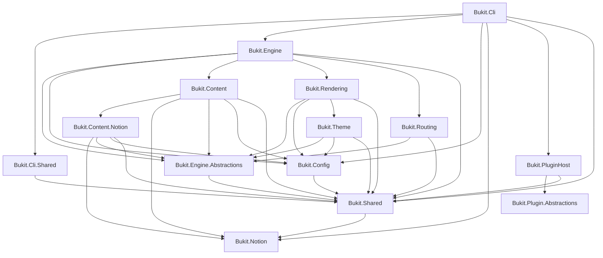
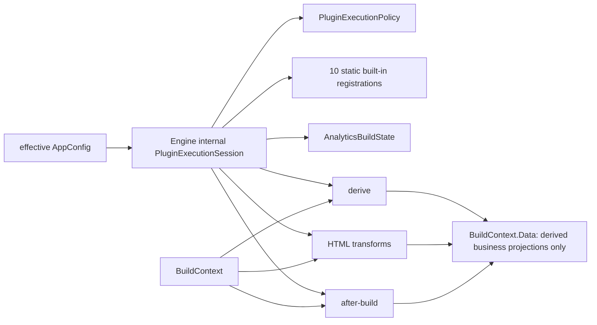

# Bukit Core AD-01 配置解耦最终关闭台账

> 关闭日期：2026-07-24
>
> 任务：AD-01B1～AD-01B4
>
> 父任务基线：`2.0@b14edc7d16e8ecdcfaf3a27712f86fe74fa0669b`
>
> 代码终态：`1d3f7b9f1db23ba2dcd67a75fd0cbcaf35f2374f`
>
> 文档关闭提交：`docs(core): close ad01 config decoupling`；完整提交哈希以任务交接为准，提交内文件不能稳定内嵌自身哈希
>
> 范围：仅 Bukit Core；Labs 与外部插件实现不在范围内
>
> 判定：**AD-01 已关闭**

## 1. 执行结论

2026-07-15 全面审计把 AD-01 定义为
`Bukit.Engine.Abstractions -> Bukit.Config` 的具体配置耦合。当前 2.0
终态已消除这条项目和编译程序集依赖：

- `Bukit.Engine.Abstractions` 只直接引用 `Bukit.Shared`；
- `BuildContext` 不再公开或保存 `AppConfig`；
- Core 生产构建把有效配置显式绑定到 Engine 内部的
  `PluginExecutionSession`，并将同一 session 传过 derive、HTML transform
  和 after-build 阶段；
- `PluginRegistry`、`PluginRunner` 和进程内插件接口的既有 public
  签名保持不变；
- public `SiteEngine.GetListRoutes(BuildContext, ThemeTemplateResolver?)`
  被显式输入 overload 取代；
- 当前 public API baseline 仍为 14 assemblies / 443 types / 0
  `2.0-candidate`，只有三项已批准的 CLR 语义变化。

本任务没有引入新的 contracts assembly，也没有复制 `AppConfig`、使用
service locator、全局状态、弱表或 `BuildContext.Data` 作为隐藏配置通道。
这属于一次受控的依赖方向修正，不是整体架构重写。

## 2. 原始问题、根因与资格结论

原始审计证据见
[2026-07-15 Bukit Core 全面审计 AD-01](bukit-core-comprehensive-audit-2026-07-15.zh-CN.md#AD-01-engineabstractions--config-不是纯抽象层)。
当时 `Bukit.Engine.Abstractions.csproj` 同时引用 `Bukit.Config` 与
`Bukit.Shared`，根因不是项目之间存在循环，而是 `BuildContext` 直接公开：

```csharp
public required AppConfig Config { get; init; }
```

它造成四类后果：

1. 任何只需要内容、路由或进程内插件契约的消费者，也被迫获得完整配置程序集
   依赖；
2. 插件实现可以在任意 hook 中读取完整配置图，配置来源和生命周期不再显式；
3. `BuildContext` 同时承担运行期交换对象和配置容器两种变更原因；
4. 若直接删除属性，PluginRunner、14 个内建实现/聚合适配器、CLI Doctor、
   helper cache 和 public `SiteEngine` overload 会同时断裂。

AD-01A 只读资格审计因此没有采用“新增窄 contracts assembly”或“复制一份
配置 DTO”。当前只有一个具体依赖入口，且实际需要配置的 owner 位于
`Bukit.Engine` 与 `Bukit.Cli`；先显式绑定配置、再删除桥接属性，比新增程序集
和双模型同步成本更低，也避免为架构形式引入第二份配置真相。

## 3. 受控实施与复审关闭

### 3.1 AD-01B1：提取执行策略

提交：`5a7a30ad`（`refactor(engine): extract plugin execution policy`）。

范围：

- 新增 Engine-internal `PluginExecutionPolicy`；
- 只规范化 plugin failure mode、derive conflict policy 和
  case-insensitive enablement；
- public `PluginRunner` 签名、插件排序、hook 选择、冲突处理和日志行为不变；
- 此阶段故意保留 `BuildContext.Config`，不提前跨入 B2/B3。

证据：

- RED：策略类型不存在，5 个 `CS0103`；
- GREEN：新策略测试 16/16，策略与 Runner 回归 31/31；
- focused gate：exit 0，`Bukit.Engine.Tests` Release 1613/1613；
- 独立只读复审：compliant，无 Critical/Important。

### 3.2 AD-01B2：显式绑定内建配置

提交：

- `042c3203`（`refactor(engine): bind plugin configuration explicitly`）；
- `73d14e34`（`fix(engine): invalidate config-bound build caches`）。

范围：

- registry-owned 的 10 个内建插件按原顺序从有效 `AppConfig` 构造；
- Feed、LLMs.txt、SearchIndex、Sitemap 四个 aggregate-only 实现继续由
  aggregate owner 管理，没有被加入 Registry；
- CLI Doctor、variant stages、PluginPipeline、Analytics、
  Taxonomy 与 list-route helper 使用显式配置路径；
- B2 期间 public compatibility facade 和 `BuildContext.Config`
  仍保留，避免在行为迁移未完成前制造 CLR break。

RED/GREEN：

- Registry constructor/overload 不存在时出现预期 `CS1729`/`CS1501`；
- Registry 13/13、代表性 Engine 回归 206/206、有效配置错配回归 2/2、
  Doctor 25/25；
- 初始 focused gate exit 0：CLI 618/618、Engine 1618/1618。

第一次独立复审记录 1 个 Important 和 2 个 Minor：

- Important：taxonomy cache 未把实际 `TaxonomyConfig` reference 纳入失效条件；
- Minor：Analytics state 未同时区分 `AppConfig` reference 和 execution mode；
- Minor：任务报告中的 focused filter 证据需要纠正。

两个行为回归先 RED，最小代码修复后 2/2 GREEN，同时纠正报告证据；
review-fix focused gate exit 0，Engine 1620/1620。独立 re-review 判定
compliant。没有把配置放入 ambient state 或新 DTO。

### 3.3 AD-01B3：删除桥接依赖并封闭 session

提交：

- `42b0b0c9`（`refactor(core): decouple build context from config`）；
- `171fc428`（`refactor(engine): keep config-bound plugin state explicit`）；
- `466f4a26`（`test(engine): close config graph traversal gaps`）。

第一阶段完成：

- 删除 `BuildContext.Config`；
- 删除 `Engine.Abstractions -> Config` project reference；
- 删除旧 public SiteEngine overload并加入显式输入 overload；
- 更新 baseline，严格限制为三项 CLR delta；
- 保留 `ConfigException`、`DiagnosticCode.ConfigInvalidValue` 和缺失 template
  resolver 的消息语义。

RED 证明旧结构真实存在：architecture tests 最初 3 failed / 2 passed，分别命中
项目引用、`BuildContext.Config` 和旧 SiteEngine overload。一次兼容性自审还先
证明临时实现把 resolver 异常改成了 `InvalidOperationException`，随后恢复原有
`ConfigException` 契约。

第一阶段 GREEN：

| 项目/检查 | 结果 |
|---|---:|
| `Bukit.Engine.Abstractions.Tests` | 61 / 0 / 0 |
| `Bukit.Engine.Tests` | 1620 / 0 / 0 |
| `Bukit.Cli.Tests` | 618 / 0 / 0 |
| `Bukit.Architecture.Tests` | 264 / 0 / 0 |
| public API drift self-test / real check | exit 0 / exit 0 |
| focused gate | exit 0 |

独立复审随后发现：虽然 public property 已删除，registry cache、Analytics state、
Taxonomy cache 以及 menu projection 仍可能让配置对象经
`BuildContext.Data` 保持可达。这属于真实的隐藏配置通道，不能用“属性已删除”
宣布关闭。

`171fc428` 引入 Engine-internal、per-variant `PluginExecutionSession`：

- session 显式拥有 policy、10 项静态 registrations 和 Analytics state；
- 同一 session 经方法参数传过 derive、transform 和 after-build；
- Taxonomy cache 转为插件实例状态；
- menu 投影改为普通 dictionary/list/scalar 图；
- 三个旧 cache key 从 `BuildContext.Data` 移除。

review-fix 后 Engine 1626/1626、CLI 618/618、Architecture 264/264，
public API baseline 未出现第四项变化，focused gate exit 0。

第二次独立复审发现测试辅助器会在遍历 `IDictionary` entries 后提前返回，
且只检查 runtime type 的字段，可能漏掉基类 private field。`466f4a26`
增加恶意 dictionary 和 cycle fixture，先 RED，再让递归证明同时遍历：

- dictionary keys/values；
- `IEnumerable` 内容；
- 每层继承类型的 private instance fields；
- reference-identity cycle guard。

最终 session 测试 7/7，proof-fix focused gate exit 0，Engine 1628/1628；
独立最终 re-review 为 compliant。

## 4. 最终依赖与配置所有权

### 4.1 项目依赖图



本图只声明 `Engine.Abstractions` 已与 Config 解耦；`Engine`、CLI、Content、
Content.Notion、Rendering 和 Theme 仍按其 owner 职责显式依赖 Config。
AD-01 不以消除整个 Core 的 Config 依赖为目标。

### 4.2 执行期所有权



生产 build 返回后，session 不由 `BuildResult` 或 `BuildContext` 持有。它没有
独立的 dispose/complete 状态机，因此这里的“生命周期结束”是调用图可达性事实，
不是新增的释放协议。

当前内建 production writers 不把 `AppConfig`、`SiteConfig`、配置绑定的 plugin
instances 或 Analytics/Taxonomy cache 写入 `BuildContext.Data`。测试覆盖真实
derive/transform/after-build 路径、嵌套 menu projection、基类 private field 和
循环对象图。但 `Data` 仍是 public `Dictionary<string, object>`；外部调用者或未来
实现理论上可以自行写入任意对象，因此不能把上述结论扩大为类型系统保证。

## 5. 精确 CLR 迁移

### 5.1 Governed delta

相对父任务基线，baseline 仍是 14 assemblies / 443 types，唯一三项变化为：

1. 删除
   `BuildContext.Config : Bukit.Config.AppConfig`；
2. 删除
   `SiteEngine.GetListRoutes(BuildContext, ThemeTemplateResolver?)`；
3. 新增
   `SiteEngine.GetListRoutes(IReadOnlyList<RoutedContentDocument>,
   IReadOnlyDictionary<string, CollectionConfig>?, string,
   ThemeTemplateResolver?)`。

原有 collections-only overload 保持：

```csharp
SiteEngine.GetListRoutes(
    IReadOnlyDictionary<string, CollectionConfig>? collections,
    ThemeTemplateResolver? templateResolver = null)
```

`PluginRegistry.GetAllPlugins(BuildContext)`、`PluginRunner` 的 5 个 public
方法以及所有 `Bukit.Engine.Abstractions.Plugins` 接口签名没有变化。

### 5.2 调用迁移示例

2.0 之前：

```csharp
var context = new BuildContext
{
    Config = config,
    RootDir = rootDir,
    OutputDir = outputDir,
    BaseUrl = config.Site.BaseUrl,
    LayoutsDir = layoutsDir,
    RoutedDocuments = routedDocuments,
    Logger = logger
};

var routes = SiteEngine.GetListRoutes(context, templateResolver);
```

2.0：

```csharp
var context = new BuildContext
{
    RootDir = rootDir,
    OutputDir = outputDir,
    BaseUrl = config.Site.BaseUrl,
    LayoutsDir = layoutsDir,
    RoutedDocuments = routedDocuments,
    Logger = logger
};

var routes = SiteEngine.GetListRoutes(
    routedDocuments,
    config.Site.Collections,
    config.Site.OutputPathEncoding,
    templateResolver);
```

直接读取 `context.Config` 的 CLR 消费者必须改为在自己的 composition boundary
保存并显式传递配置。不要把 `AppConfig` 写回 `context.Data` 来模拟已删除属性。

public config-free `PluginRegistry`/`PluginRunner` facade 为直接 CLR
兼容调用使用确定性的 strict/fail/all-enabled Engine 默认配置；Bukit Core
生产路径不依赖该默认值，而是使用真实有效配置建立内部 session。消费者若需要
站点特定执行，应通过受支持的 `SiteEngine.BuildAsync` 入口，而不是把 config
藏入 context。

## 6. 不变量与明确排除

| 边界 | 终态 |
|---|---|
| 配置 schema / YAML | 未修改；字段、默认值、strict validation 和持久化格式不变 |
| `bukit-plugin-v1` | 未修改；进程插件 manifest、JSON wire DTO、权限与调用协议不变 |
| 进程内插件 | 接口、public Registry/Runner facade、10 项注册顺序和名称/版本不变 |
| aggregate ownership | Feed、LLMs.txt、SearchIndex、Sitemap 仍不进入 Registry |
| 输出与 asset | URL、output-path encoding、文件 owner、manifest 和写入策略不变 |
| 安全 | SSRF、路径、symlink、secret、插件权限和外部图片网络边界不变 |
| AOT 设计 | 继续静态构造内建插件，未加入 reflection/dynamic assembly discovery |
| Labs / 外部插件实现 | 未修改、未纳入测试结论 |

Native AOT publish **未获本任务授权，也未执行**。Architecture test 证明静态
registration source 不包含 `Assembly.Load`、`Activator.CreateInstance`、
`GetExportedTypes` 或 `GetTypes()`；这只能证明现有 AOT 设计边界未被 AD-01
改写，不能替代一次 Native AOT publish 证明。

## 7. 消费者证据与限制

仓内语义调查发现：

- 唯一真实的跨 assembly Core 生产消费者是 CLI Doctor；两个
  `BuildContext` 构造、plugin discovery、list routes 和 template requirement
  路径均已迁移；
- Engine 自身的 production callers 全部使用显式 effective configuration；
- tests 中的直接构造已同步迁移，并保留 public facade 行为回归；
- `ThrowingPlugin` 等测试程序集只实现插件接口，不需要 Config reference。

已知使用 Bukit 编译网站的 `SRBiz-bukit`、`sitegen` 与
`ALi365WebSiteBuilder` 调查中未观察到对 Bukit CLR assemblies、
`BuildContext.Config` 或旧 SiteEngine overload 的直接引用；这些项目通过 Bukit
CLI 构建站点。这个结果只描述已检查仓库。

不存在“没有外部消费者”的结论。private、unindexed、undisclosed、离线二进制和
未提供源码的直接 CLR consumer 仍未知；它们若直接访问上述两个已删除成员，会
发生 2.0 source/binary/reflection break，必须按第 5 节迁移。

## 8. 验证证据

### 8.1 B4 fresh focused

所有命令均在非沙箱环境、`env -u NOTION_TOKEN` 下顺序执行：

| 项目 | Passed | Failed | Skipped |
|---|---:|---:|---:|
| `Bukit.Engine.Abstractions.Tests` | 61 | 0 | 0 |
| `Bukit.Engine.Tests` | 1628 | 0 | 0 |
| `Bukit.Cli.Tests` | 618 | 0 | 0 |
| `Bukit.Architecture.Tests` | 264 | 0 | 0 |

Architecture 本轮实际验证：

- Engine.Abstractions project 和 compiled assembly 均不引用 Config；
- `BuildContext` 不含 public Config property；
- Engine 与 CLI 仍保留应有的显式 Config dependency；
- public SiteEngine list-route API 不再接收 `BuildContext`；
- 内建 registration 仍为 reflection-free 静态路径。

### 8.2 Aggregate、ratchet 修复与 replacement 证据链

所有 aggregate 都使用固定 base、76 个显式排序去重路径和相同环境边界：

```bash
env -u NOTION_TOKEN bash scripts/checks/post-change-targeted.sh \
  --base b14edc7d16e8ecdcfaf3a27712f86fe74fa0669b \
  -- "${changed_paths[@]}"
```

未跟踪的 SDD briefs 和 review packages 没有进入 path list。`changed_paths`
是执行前冻结的 B1～B4 tracked path 数组，不在 gate 运行过程中动态扩张。

验证链没有隐藏失败，也没有把失败误写成通过：

1. **原始 aggregate：exit 1。** CLI 618/618、Abstractions 61/61、
   Engine 1628/1628 和 Architecture 264/264 已通过；随后 code-analysis
   ratchet 报告 `IDE0301 181 > 180`、`IDE0305 135 > 134`，执行立即停止。
2. **第一次窄修复：`4a53a744`。** 只修复这两个新增 collection-style
   diagnostic；focused Engine 1628/1628，raw style 回到
   `IDE0301=180`、`IDE0305=134`。第一次 replacement aggregate 由用户明确
   授权，执行后在下一项真实超限 `CA1859 89 > 88` 处 exit 1，没有被当作通过。
3. **第二次窄修复：`1d3f7b9f`。** 只做一行 private 返回类型修正；focused
   Engine 1628/1628，raw 计数为 `IDE0301=180`、`IDE0305=134`、
   `CA1859=88`，独立窄复审结论为 COMPLIANT。
4. **第二次 replacement aggregate：exit 0。** 该次执行同样经过用户明确授权，
   对固定 base 和 76 个路径运行。最终 CLI 618/618、Abstractions 61/61、
   Engine 1628/1628、Architecture 264/264；code analysis 汇总为
   style 584/593、analyzers 323/326。public API drift、docs/contracts、
   brainstorm server self-test、YAML static context 等现行阶段均执行完成并通过。

两次失败均保留为验证证据；没有执行第三次 replacement aggregate。没有
standalone `ci-fast`，各 aggregate 只通过 `post-change-targeted.sh` 的内部编排，
按其实际到达的阶段执行 fast contract gate。

`git diff --check`：exit 0。

没有运行 full、release、`test-all`、`smoke-all` 或 Native AOT。

## 9. 回滚边界

AD-01 的可回滚原子边界是：

1. B1：`5a7a30ad` 的 policy + Runner + tests；
2. B2：`042c3203` 与 `73d14e34` 的显式 binding 与 cache invalidation；
3. B3：`42b0b0c9`、`171fc428` 与 `466f4a26` 的 public migration、session
   ownership 与 proof closure；
4. B4 ratchet remediation：`4a53a744` 与 `1d3f7b9f` 的三处窄 style/analyzer
   修正。

如只撤销 2.0 CLR break，必须先按逆序撤销 B4 两个 ratchet remediation，再原子
撤销整个 B3 组三个提交；B1/B2 可以继续保留，但其 compatibility bridge 需要随
B3 rollback 一起恢复。完整撤销则按逆序撤销八个代码提交。

禁止只回滚 baseline、只恢复 `BuildContext.Config`、只恢复旧 overload，或只删除
session 中任一项；这些做法会让 public shape、生产配置来源、cache 生命周期和
验证 fixture 重新不一致。任何回滚都必须重新运行受影响 owner tests、public API
drift 和独立复审。

## 10. 残余风险与关闭判定

残余项不是 AD-01 reopen 条件：

- 未知 direct CLR consumers 仍可能需要 2.0 迁移；
- public `BuildContext.Data` 仍允许调用者保存任意对象，当前保证是 Core 内建
  writer 的行为保证；
- public config-free Registry/Runner facade 使用兼容默认值，它不是站点配置
  composition API；
- Native AOT publish 证明未在本任务刷新；
- `Engine`、CLI、Content、Rendering、Theme 等 owner 仍合理依赖 Config。

关闭条件已经满足：

- 原始依赖边、public property 和隐式配置读取路径均已消除；
- 配置 owner 与 session 生命周期可从源码和 tests 追踪；
- 三项 CLR delta 被 baseline 精确治理并提供迁移方案；
- B1/B2/B3 均完成 RED、GREEN、focused gate 和独立只读复审；
- B4 fresh focused 通过；两次 ratchet 超限分别经窄修复、focused
  验证和明确授权的 replacement 处理，第二次 replacement aggregate 通过；
- 未发现 schema、protocol、asset、security 或额外 public API 漂移。

因此，AD-01 在 `2.0@1d3f7b9f` 的代码终态及本关闭提交下正式关闭。新增 Config
跨层依赖、重新把配置对象藏入 `BuildContext.Data`，或修改上述 CLR 迁移面，必须
作为新的独立治理任务处理，不得回填到 AD-01。
