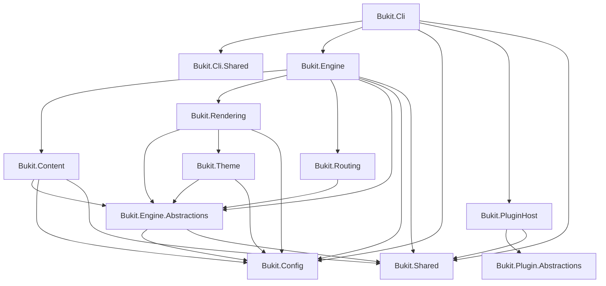

# Bukit Core 全面架构、质量与发展方向审计报告

> 审计日期：2026-07-15
>
> 源码基线：`main@4103959c9f7ee1b8dfe8db7e34340f4495e7a9ce`
>
> 审计范围：`src/Bukit-Core/`，并以现行 `tests/`、`scripts/`、`guide/`、schema 和插件协议验证契约
>
> 明确排除：`guide-0.1/`、`guide-0.2/`、`scripts-0.1/`、`scripts-0.2/`；Labs 与插件内部业务实现不做深审
>
> 交付性质：只读审计结论；本任务不修改 Core 代码、公共 API、配置 schema、插件协议或持久化格式
>
> 状态更新（2026-07-19）：本文的 F-01～F-08 是修复前快照；当前技术状态以[八项最终关闭台账](bukit-core-eight-findings-final-aggregate-closure-audit-2026-07-19.zh-CN.md)为准，八项均已关闭。

## 1. 执行摘要

### 1.1 管理层结论

Bukit Core 的技术方向总体正确，但产品定位必须收窄并说得更准确：它最有机会成为一个面向 Markdown/Notion、强调确定性、可审计发布与机器可读输出的“可信内容发布编译器”，而不是再做一个通用静态站点生成器，也不能把 `llms.txt`、JSON-LD 或 GEO 报告包装成搜索与 AI 引用的结果保证。

当前架构不需要整体重构。Core 已经具备模块化单体、项目依赖约束、阶段化流水线、Canonical Content Graph、严格配置契约、Native AOT 静态注册、进程外插件协议和多份机器可读报告。架构测试本轮 77/77 通过，Core 回归 3756/3756 通过，安全回归 291/291 通过，Core 行覆盖率 86.72%。这些证据说明主干是可演进的，不存在必须推倒重写的依赖循环、不可验证核心链路或 AOT 根本阻断。

但是，“不整体重构”不等于“继续堆功能”。本轮确认 8 个新问题，其中 P1 3 个、P2 5 个：

| 严重度 | 数量 | 重点 |
|---|---:|---|
| P0 | 0 | 未发现可在默认路径直接造成全局失控、远程代码执行或不可恢复数据破坏的证据。 |
| P1 | 3 | `clean --dir .git` 可删除仓库元数据；默认搜索 UI 存在内容驱动 DOM XSS；资产流水线并行写入重叠目标导致非确定性覆盖或失败。 |
| P2 | 5 | 递归目录符号链接策略不一致；dev 长进程模板能力缓存不失效；`site.search.maxContentLength` 无效；媒体 `maxConcurrency` 不限制单文档真实下载并发；build report 健康计数和文件清单失真。 |

2026-07-09 旧 Core 审计的 8 项问题均已在当前主线关闭，没有发现回归；但新的 `clean --dir` 分支说明“配置式清理已收口”不代表所有破坏性入口都已收口。

### 1.2 决策

- **整体重构：不建议。** 当前没有满足整体重构触发条件。
- **渐进式架构升级：必须。** 顺序应是正确性与安全边界 → 契约真实性 → 热点拆分与公共面治理 → 性能与生态扩展。
- **产品路线：有条件支持路线 B。** 主路线应是“确定性的可信内容发布编译器”；“通用 SSG”不应成为主战场。
- **止损路线 C：必须保留。** 目前 GitHub API 显示 0 stars、0 forks、0 watchers、5 个发布的资产累计下载 0，尚无外部 issue 作者；技术完成度不能替代采用证据。
- **下一阶段优先级：** 先完成 8 个 findings，尤其是 3 个 P1；在这些问题关闭前，不建议扩大 Core 公共面或增加新的直接内容源。

### 1.3 综合判断

| 维度 | 判断 | 说明 |
|---|---|---|
| 技术方向 | 正确但需收窄 | Native AOT、强契约、机器可读报告和发布审计形成差异化；通用 SSG 能力竞争没有优势。 |
| 架构适配未来 | 基本适配 | 模块化单体和阶段化 Engine 可渐进拆解；AOT 与进程插件边界方向一致。 |
| Core 功能完整度 | 中高 | 构建、路由、主题、渲染、i18n、SEO/发布审计链完整；易用性、生态和采用证据不足。 |
| 代码与测试质量 | 较高但不均衡 | 关键模块测试强、覆盖率高；Engine 体量、公共面、缓存与可观测性仍有债务。 |
| 安全与可靠性 | 有基础、仍有关键缺口 | SSRF、secret、output path、插件协议已有防线；破坏性 CLI、DOM XSS 和 symlink walker 仍需修复。 |
| 是否可发布为“成熟通用产品” | 暂不建议 | 没有采用信号，且 P1 未关闭；可作为受控项目或早期技术预览使用。 |

## 2. 审计方法、边界与证据等级

本报告采用四类证据：

1. **源码事实**：当前 commit 的实现、项目引用、静态命令表、schema 生成器和运行时 binder。
2. **测试事实**：现行测试项目、架构测试、覆盖率、security regression、`ci-fast` 和隔离 fixture 构建。
3. **安全复现**：只在 `/tmp` 隔离目录执行破坏性验证，不触碰真实仓库 `.git`。
4. **外部原始来源**：官方产品文档、Microsoft/Google/OpenAI 官方资料及 GitHub API；检索日期为 2026-07-15。

证据等级定义：

| 等级 | 定义 |
|---|---|
| 已确认 | 有明确源码路径，并由测试、隔离复现或生成产物证实。 |
| 高可信风险 | 源码路径闭环，触发条件明确，但本轮未构造完整端到端利用。 |
| 架构债务 | 当前行为不一定错误，但持续增加耦合、迁移成本或契约不确定性。 |
| 证据不足 | 有可疑信号，尚不能据此判定为缺陷。 |

本轮没有把 Labs 未承诺能力、尚未提供的 GUI、未集成的知识库来源或插件市场当成 Core bug。它们属于产品投资选择，不属于已承诺契约的实现缺陷。

## 3. 当前事实基线

### 3.1 规模与项目面

- Core 共 12 个项目，513 个 C# 源文件，约 65,894 行 C#。
- `Bukit.Engine` 195 个文件、约 31,941 行，占 Core C# 约 48.5%。
- 通过文本级声明盘点，Core 约有 449 个 `public` 类型声明、295 个 `internal` 类型声明；该数字用于治理规模判断，不等同于已承诺的包级公共 API。
- 28 个 C# 文件超过 400 行，3 个超过 600 行。最大文件为 `VariantBuildPipeline.cs` 755 行、`ConfigJsonSchemaGenerator.cs` 642 行、`I18nOutputMerger.cs` 614 行。
- SDK 为 .NET 10，CLI 目标 `net10.0`，`Bukit.Cli.csproj:61-65` 启用 `PublishAot` 和 invariant globalization。
- `Directory.Build.props` 统一启用 nullable、最新分析级别、代码风格检查和 warnings-as-errors。

### 3.2 Core 项目依赖图



这个图的优点是无项目引用循环，CLI/Engine/内容/渲染/路由/主题/外部插件宿主有显式程序集边界。主要债务是 `Engine.Abstractions → Config`，使抽象层仍携带具体配置模型；详见第 9 节。

### 3.3 静态 CLI 契约

`src/Bukit-Core/Bukit.Cli/Cli/BukitCliSpecs.cs:7-210` 定义 12 个稳定 Core 命令：

`build`、`doctor`、`config`、`preview`、`dev`、`clean`、`version`、`completion`、`seo`、`geo`、`publish`、`deploy`。

稳定子命令为 `config check`、`config schema`、`seo audit`、`seo diff`、`geo audit`、`publish audit`、`publish diff`。`Program` 先解析静态 Core 命令，只有命令不属于 Core 时才加载项目级进程插件描述符。当前没有稳定 `init`/`new` 命令；这是一项易用性选择，不应被误写成已存在的 Core 契约。

### 3.4 内置插件与外部进程插件是两套边界

- Engine 内置插件实现 `IBukitPlugin`、`IDerivePagesPlugin`、`IAfterBuildPlugin` 等进程内阶段接口，用于 taxonomy、pagination、archive、related、menu、analytics 等确定性构建步骤。
- 外部插件使用 `bukit-plugin-v1` 进程协议，通过 stdin/stdout JSON 完成 handshake、manifest 和 command invoke；Core 校验 manifest、路径、平台、hash、权限子集、超时、输出上限和 artifact 相对路径。
- `SystemProcessRunner.cs:83-116` 清空继承环境，只注入授权变量；`SystemProcessRunner.cs:28-80` 限制超时与 stdout/stderr 大小并终止进程树。
- 权限模型是“宿主声明与输入过滤”，不是操作系统 sandbox。插件可执行文件一旦运行，仍具有当前用户的 OS 权限。对外文档必须明确这一点。

## 4. 业务逻辑与完整构建链

### 4.1 主业务流程


### 4.2 关键业务设计评价

1. **配置先于执行**：配置 loader、strict field validator、schema generator 和 docs contract 形成较强的配置闭环。
2. **Canonical Model 是正确投资**：不同内容源先归一为稳定记录，再进入路由、SEO、列表和投影，降低 Notion/Markdown 差异向下游扩散。
3. **路由不是模板副作用**：路由、列表图、taxonomy 和冲突检测在渲染前形成显式计划，适合可审计构建。
4. **多表示输出是差异化能力**：HTML、内容 JSON/Markdown、feeds、search、sitemap、`llms.txt` 和报告共享同一内容/路由真相，方向正确。
5. **报告链条比传统 SSG 更完整**：SEO、publish、security、incremental、artifact manifest 等可作为 CI 契约；但 F-08 说明 build report 汇总仍不可信。
6. **多语言采用隔离 variant 后合并**：语言构建可并发，最终生成合并投影，架构上能支持增长；但需持续验证缓存、合并和报告一致性。
7. **部署保持薄层是正确的**：Core 目前只直接承诺 GitHub Pages，不宜在 Core 内堆叠大量云厂商 SDK。

## 5. 模块成熟度矩阵

评分范围为 1–5：1=缺失/不可依赖，2=早期，3=可用但有明显缺口，4=成熟，5=强契约且证据充分。评分是当前基线的相对判断，不是市场份额或 SLA。

| 模块 | 业务完整度 | 契约稳定性 | 测试充分度 | 可维护性 | 安全性 | 性能 | 可观测性 | 战略适配 | 主要依据 |
|---|---:|---:|---:|---:|---:|---:|---:|---:|---|
| CLI | 4 | 5 | 4 | 3 | 3 | 4 | 4 | 4 | 静态命令表和 docs sync 强；F-01 破坏性入口未统一。 |
| Config | 5 | 5 | 5 | 3 | 4 | 4 | 4 | 5 | strict validator/schema/docs 闭环；生成器与 `AppConfig` 偏大，F-06 暴露“可配置但未消费”。 |
| Content | 4 | 4 | 5 | 3 | 3 | 3 | 4 | 5 | Markdown/Notion、canonical normalization 完整；F-04、F-07。 |
| Canonical Model | 4 | 4 | 4 | 3 | 4 | 4 | 3 | 5 | 下游共享内容真相；抽象层依赖 Config，公共类型面偏大。 |
| Routing/List/Taxonomy | 4 | 4 | 4 | 3 | 4 | 3 | 4 | 4 | 显式 route graph、冲突与列表投影；复杂 builder 需要继续拆分。 |
| Theme | 4 | 4 | 4 | 3 | 3 | 3 | 3 | 4 | manifest、继承、能力声明完整；F-05 缓存失效。 |
| Rendering | 4 | 4 | 4 | 3 | 3 | 4 | 3 | 4 | Scriban、HTML transforms、线程安全测试较强；模板输出依赖主题作者信任。 |
| Engine Pipeline | 4 | 4 | 5 | 3 | 3 | 3 | 4 | 5 | 阶段化、测试量大；Engine 占 Core 近半，F-03、F-08。 |
| Incremental/I18n | 4 | 4 | 4 | 3 | 3 | 4 | 4 | 5 | 隔离 fixture 第三次构建出现 1 hit/1 miss；F-05 影响 dev 正确性。 |
| SEO/GEO/Publish Audit | 5 | 4 | 5 | 3 | 3 | 3 | 5 | 5 | 规则与报告丰富；对外不能承诺排名/引用结果，F-02/F-06/F-08。 |
| Plugin Host | 3 | 4 | 4 | 4 | 4 | 3 | 4 | 3 | 协议与宿主防线较强；目前主要是命令扩展，不是完整 build hook 生态，也非 OS sandbox。 |
| Dev/Preview | 4 | 4 | 4 | 3 | 4 | 3 | 4 | 4 | LiveReload、LAN opt-in、internal path deny；F-05。 |
| Deploy | 3 | 4 | 4 | 3 | 4 | 3 | 4 | 3 | GitHub Pages 路径可信且 secret 已加固；有意保持单 provider。 |

### 5.1 模块完整度结论

- **Core 内应继续投资**：配置契约、canonical graph、路由/投影、输出安全、报告真实性、AOT、构建确定性。
- **应保持插件优先**：新的第三方内容源、导入/同步、外部发布平台、可选数据处理。
- **应留在 Labs**：不稳定 AI transform、自动内容生成、未经验证的 crawler/agent 实验、协议草案。
- **应留在 BukitJalil**：可视化项目创建、内容源向导、主题选择、预览控制、报告展示和非技术用户工作流。

## 6. 2026-07-09 旧审计问题关闭台账

旧报告：`docs/analysis/bukit-core-deep-audit-2026-07-09.zh-CN.md`。本表按当前源码复核，不直接继承旧结论。

| 旧 finding | 当前状态 | 当前证据 |
|---|---|---|
| F-01 recovery auto-clean 绕过 guard | 已关闭 | `BuildPlanner.cs:78-89` 两条清理路径都调用 `OutputDirectoryCleaner.CleanIfExists`；`BuildPlannerCleanErrorTests.cs:134-237` 覆盖无 marker 和 `.git`。 |
| F-02 `clean --config` 直接递归删除 | 已关闭 | `CleanCommand.cs:40-50` 的配置式分支调用统一 cleaner。注意：本轮 F-01 是未配置的 `--dir` 另一分支。 |
| F-03 output 内 symlink 写入/删除逃逸 | 已关闭 | `Output/SafePathResolver.cs:9-62` 检查所有已存在 reparse segment；`SafeOutputFileSystemTests.cs:65-96` 覆盖 delete/write escape。 |
| F-04 媒体失败日志/汇总泄露 URL | 已关闭 | `ImageAssetLocalizer.cs:92-110,185-210,268-271` 使用 `UrlRedactor`，失败集合只保存脱敏 URL。 |
| F-05 askpass 把 GitHub token 写入脚本 | 已关闭 | `GitHubPagesDeployProvider.Auth.cs:5-30` 脚本只读取 `BUKIT_GITHUB_TOKEN` 环境变量，不内嵌 token。 |
| F-06 SSRF IPv6 覆盖不足 | 已关闭 | `SsrfGuard.cs:84-93` 覆盖 any/none/link-local/site-local/multicast/ULA/documentation ranges；security regression 通过。 |
| F-07 dev server 可服务 `.bukit` | 已关闭 | `Commands/Dev/DevRequestHandler.cs:135-153` 拒绝 `.bukit`、build state 和 output marker。 |
| F-08 媒体下载整文件进入内存 | 已关闭 | `ImageAssetLocalizer.cs:274-316` 流式写临时文件并实时限额，完成后原子 move。 |

关闭率为 8/8；没有“部分关闭”或“回归”项。关闭台账不覆盖本轮新增 findings。

## 7. 新 findings 总览

| ID | 严重度 | 类型 | 结论 | 证据等级 |
|---|---|---|---|---|
| F-01 | P1 | 已确认 Bug / 破坏性操作 | `bukit clean --dir .git` 可删除当前项目的 `.git`。 | 已确认、隔离复现 |
| F-02 | P1 | 已确认安全 Bug | 默认生成的 `bukit-search.html` 对内容 title/snippet 使用 `innerHTML`，可触发 DOM XSS。 | 已确认源码闭环 |
| F-03 | P1 | 可靠性 / 确定性 | static、assets、theme tokens、media 并行写入可重叠路径，结果无确定优先级。 | 高可信风险 |
| F-04 | P2 | 安全 / 策略一致性 | 多个递归 walker 会穿过目录 symlink，绕过默认不跟随策略。 | 已确认枚举行为 |
| F-05 | P2 | 正确性 / dev | 模板能力与静态分析全局缓存不含文件版本，长进程修改后可继续使用旧结果。 | 已确认源码闭环 |
| F-06 | P2 | 已确认契约 Bug | `site.search.maxContentLength` 被读取、校验和文档化，但 Engine 仍固定使用 8000。 | 已确认源码闭环 |
| F-07 | P2 | 已确认并发契约 Bug | `content.media.maxConcurrency` 只限制文档数，不限制单文档内实际下载任务数。 | 已确认源码闭环 |
| F-08 | P2 | 已确认可观测性 Bug | build report 的 warning/error 固定为 0，generatedFiles 实际调用始终为空。 | 已确认生成产物 |

## 8. 新 findings 详细证据

### F-01 P1 — `clean --dir` 可删除 `.git`

**所属模块**：CLI / output safety

**触发条件**：用户在仓库根目录运行 `bukit clean --dir .git`，或把其他敏感子目录传给 `--dir`。

**影响**：递归删除仓库元数据；可能造成未推送提交、分支、reflog 和工作状态不可恢复。虽然需要显式命令，但命令名和文档语义是“清理构建输出”，影响远超合理预期。

**源码证据**：

- `src/Bukit-Core/Bukit.Cli/Commands/CleanCommand.cs:29-37` 只验证目标位于 cwd 内。
- `CleanCommand.cs:52-55` 对该分支直接执行 `Directory.Delete(..., recursive: true)`。
- 配置式分支在 `CleanCommand.cs:40-50` 使用 `OutputDirectoryCleaner`，两条入口安全策略不一致。

**隔离复现**：在 `/tmp/bukit-clean-probe.*` 创建假的 `.git/objects/probe`，运行当前 Release CLI：

```text
Cleaned: /private/tmp/bukit-clean-probe.*/.git
probe_result=.git-deleted
```

未读取或删除真实仓库 `.git`。

**测试缺口**：没有 `--dir .git`、project root、home、markerless non-empty directory 的拒绝测试。

**修复方向**：所有 clean 模式统一进入 `OutputDirectoryCleaner`；显式拒绝 project root、filesystem root、home、`.git` 和 markerless 非空目录。`.cache`、`.bukit` 可保留为独立的、固定名称的受控清理。

### F-02 P1 — 默认搜索 UI 存在内容驱动 DOM XSS

**所属模块**：Engine / Search / output security

**触发条件**：站点使用默认 `site.search.ui: default`，内容 title、summary/snippet 含 HTML payload，用户在生成的搜索 UI 输入命中词。

**影响**：恶意或被污染的内容元数据可在站点访客浏览器执行脚本；对多作者、Notion 同步或导入内容站点尤其危险。

**源码证据**：

- `SearchIndexPlugin.cs:27-31` 将匹配文字拼成 `<mark>` HTML。
- `SearchIndexPlugin.cs:47-53` 把 `it.title` 和 `it.snippet` 拼入 `d.innerHTML`。
- `AppConfig.cs:493-500` 默认 UI 为 `default`。
- `SearchIndexPlugin.cs:129-154` 的 `placeholderText` 也未做 HTML attribute encode；它通常来自可信配置，风险低于内容数据，但属于同一输出编码缺口。
- starter theme 的 `SearchTemplate.html:20-35` 使用 `textContent`，证明安全实现路径已经存在，只是默认生成 UI 未复用。

JSON 序列化只保护 JSON 语法；浏览器 `fetch().json()` 后字符串恢复原值，进入 `innerHTML` 时仍会被解释为 DOM。

**测试缺口**：现有 search tests 覆盖索引内容与 script 移除，但没有 title/snippet DOM 安全测试，也没有浏览器级回归。

**修复方向**：用 `textContent`、文本节点和 `<mark>` 元素构造高亮，不允许数据进入 `innerHTML`；placeholder 使用 `HtmlEncoder`；增加恶意 title/summary/snippet 的 DOM 或浏览器测试。

### F-03 P1 — AssetPipeline 并行写入重叠目标，破坏确定性

**所属模块**：Engine / assets / build determinism

**触发条件**：以下来源映射到相同目标路径：

- `static/assets/...` 与 theme/site `assets/...`；
- assets 中的 `css/theme-tokens.css` 与生成的 theme token 文件；
- static 或 assets 与 media 的 `assets/uploads/...`。

**影响**：不同 task 可能同时 `File.Copy(overwrite:true)` 或 `File.WriteAllText` 到同一文件，产生非确定 winner、sharing violation、部分输出或跨机器差异。它直接冲突于“确定性发布编译器”的核心价值。

**源码证据**：

- `AssetPipeline.cs:48-71` 同时启动 static、assets、tokens、media task，并 `Task.WhenAll`。
- `AssetPipeline.cs:108-116` static 写入 output root。
- `AssetPipeline.cs:130-157` assets 写入 `output/assets`。
- `AssetPipeline.cs:164-179` tokens 写入 `output/assets/css/theme-tokens.css`。
- `AssetPipeline.cs:188-198` media 同步到 output assets 路径。

**测试缺口**：`AssetPipelineTests` 使用互不重叠的 fixture，没有 collision、优先级或重复构建 hash 一致性测试。

**修复方向**：先定义正式优先级和冲突诊断；只并行保证互斥的输出树。推荐先 preflight 建立 destination inventory，冲突默认失败；确需覆盖时按明确顺序执行并记录来源。

### F-04 P2 — 递归目录 symlink 可绕过默认不跟随策略

**所属模块**：Content / Engine / output safety

**触发条件**：content、static 或 media cache 内存在指向外部目录的 symlink；代码使用 `SearchOption.AllDirectories` 递归枚举。

**影响**：外部 Markdown、HTML、静态文件或 media 文件可能被读取并发布；在缓存污染或不完全可信项目输入场景下可造成信息泄露。默认 `build.followSymlinks=false` 不能覆盖这些 walker。

**源码证据**：

- `DirectoryCopy.cs:176-207` 的 `SyncFilesRecursive` 先 `GetFiles(...AllDirectories)`，只检查最终 file 是否 symlink；被目录 symlink 遍历后的普通目标文件不是 symlink。
- `BuildManifestTracker.cs:11-27` 用该函数同步 media output，并再次递归枚举 manifest。
- `StaticFileService.cs:19-94` 递归读取/copy static 文件，不接收 `FollowSymlinks`。
- `MarkdownFolderProvider.cs:28-42` 对内容目录执行同样的递归枚举。
- 对照实现 `DirectoryCopy.cs:97-137` 在非递归分层 walker 中会显式拒绝 symlink directory，说明策略不一致。

本轮在临时目录创建 `source/link -> outside` 后，.NET `Directory.GetFiles(source, "*", AllDirectories)` 返回了 `source/link/secret.txt`，确认运行时会穿透目录链接。

**测试缺口**：`SyncFilesRecursive_SkipsSymlink` 只覆盖 symlink file；缺少 directory symlink。static/content walker 也缺少默认拒绝和显式允许两类测试。

**修复方向**：统一安全枚举器。默认使用 `EnumerationOptions.AttributesToSkip = FileAttributes.ReparsePoint`；当显式允许时，逐层解析 realpath，并只允许仍位于受信 source root 的目标。所有 content/static/media/manifest walker 必须使用同一策略。

### F-05 P2 — dev/incremental 模板能力缓存不失效

**所属模块**：Theme / Engine / dev

**触发条件**：同一 `bukit dev` 进程中修改 `bukit.templates.yaml`、模板 `.content` 使用或 include/layout 链。

**影响**：后续 rebuild 仍可使用旧的 `needsPageContent`、pagination、taxonomy、search snippets 能力，导致列表内容、搜索 snippet 或渲染决策与文件现状不一致，直到重启进程。

**源码证据**：

- `TemplateStaticAnalysisService.cs:9-26` 的静态 cache key 只有 layouts dir + template path，不包含 mtime、length 或 hash，也没有 invalidate API。
- `TemplateCapabilitiesResolver.cs:9-15,54-57` 把 manifest load `Task` 永久缓存到 layouts dir。
- `TemplateCapabilitiesResolver.cs:128-146` 的 fallback cache 同样只按路径缓存。

**测试缺口**：测试只验证首次解析，没有“修改文件后在同进程再次解析”的 dev 生命周期回归。

**修复方向**：cache key 加内容 fingerprint，或在 watcher rebuild 前显式失效相关 layouts root；manifest 与 include graph 都应纳入 fingerprint。增加同进程 mutate-and-rebuild 测试。

### F-06 P2 — `site.search.maxContentLength` 不生效

**所属模块**：Config / Search

**触发条件**：用户将 `site.search.maxContentLength` 配置为非 8000 值。

**影响**：生成的 search record 仍按 8000 截断；大站点无法按预期控制索引大小，小值的隐私/成本约束也不生效。文档、schema 与运行行为漂移。

**源码证据**：

- `AppConfig.cs:493-500` 定义默认值 8000。
- `SiteDefaultsApplier.cs:183` 读取用户配置。
- `ConfigJsonSchemaGenerator.cs:289` 和 strict field validator 接受该字段。
- `SearchIndexBuilder.cs:120-126,219-232` 两处直接使用字面量 8000。
- `SearchIndexPlugin.cs:89-99` 调用 builder 时没有传递 `MaxContentLength`。

**测试缺口**：没有非默认 cap 的单语言、merged i18n 和 list route 测试。

**修复方向**：将 cap 作为明确参数传入所有 search writer，覆盖 document、derived/list route 和 merged 输出；保留 schema minimum=1。

### F-07 P2 — media `maxConcurrency` 不限制真实下载并发

**所属模块**：Content / media / performance reliability

**触发条件**：单个文档包含多条不同媒体 URL。

**影响**：即使 `maxConcurrency=4`，单文档也可以一次创建远多于 4 个 `_localizer.LocalizeAsync`，造成网络突发、远端 rate limit、socket/内存压力和不稳定重试。

**源码证据**：

- `ContentImageRewritePipeline.cs:31-47` semaphore 只包围每个 document。
- `ContentImageRewritePipeline.cs:264-288` 在 semaphore 内为每个 distinct URL 立即创建 task，再 `Task.WhenAll`。
- 多文档上限和单文档下载上限因此不是同一概念。

**测试缺口**：现有测试只断言存在并发（`MaxConcurrency >= 2`），没有断言实际峰值 `<= configured cap`。

**修复方向**：使用所有文档共享的 download-level semaphore 包围 localizer 调用；文档 transform 并发可单独配置。测试应覆盖单文档 HTML、多字段和多文档混合 URL。

### F-08 P2 — build report 健康字段与生成文件清单失真

**所属模块**：Engine / observability / CI contract

**触发条件**：任意成功构建，尤其是产生 SEO/publish warning 的构建。

**影响**：消费 `build-report.json` 的 CI 或管理界面会看到固定 0 warning/0 error 和空 `generatedFiles`，即使构建实际输出大量文件且 audit 已报告 warning。`guide/dev/observability.md:19-20` 把该报告描述为 build health，因此不是纯展示问题。

**源码证据**：

- `BuildResult.cs:86-94` 把 `WarningCount`、`ErrorCount` 固定为 0。
- `BuildResult.cs:54-64,99-106` 允许 `generatedFiles`，但实际 `SiteEngine.cs:124,233` 调用均未传入。
- `BuildReporter.cs:93-117` 原样写出这些值。

**生成产物证据**：隔离 `basic-markdown-site` 构建生成 23 个文件；`publish audit` 显示 0 error、22 warning；同一构建的 `build-report.json` 仍为 `warningCount: 0`、`errorCount: 0`、`generatedFiles: []`。

**测试缺口**：测试断言序列化结果，但 fixture 由同一个固定 0 工厂生成，没有端到端比对 logger/audit/file inventory。

**修复方向**：先定义 warning 的边界：构建 warning、SEO warning、publish warning应分栏而非混为一个计数；generated files 从最终 artifact inventory 生成。报告 schema 若新增字段，保留 v1 字段并提供向后兼容聚合，或发布 v2。

## 9. 架构与代码质量审计

### 9.1 做得好的部分

- 12 项程序集边界没有循环，且由 architecture tests 保护。
- AOT 约束驱动静态 CLI、JSON source-generation 和进程插件设计，避免运行时 assembly discovery。
- Config、Content、Routing、Rendering 和 PluginHost 都有独立测试项目；Core 回归总量和覆盖率充分。
- 关键异常有 `ConfigException`、`ContentException`、`RenderException` 和 diagnostic code，CLI 映射为稳定退出码。
- 构建 pipeline 已分成 content、variant、render、asset、plugin、report 等 stage，并非单一 `SiteEngine` 巨型方法。
- SSRF、secret redaction、output path、internal/public report 隔离、插件超时/输出上限已经是显式能力。

### 9.2 需要治理的架构债务

#### AD-01 `Engine.Abstractions → Config` 不是纯抽象层

`Bukit.Engine.Abstractions.csproj:4-5` 直接引用 `Bukit.Config` 和 `Bukit.Shared`。这在单仓模块化单体中可以工作，但会让领域模型、插件接口和配置对象一起演化。建议先盘点哪些类型是真正跨模块 DTO，再引入更窄的 contract types；不要为了“纯洁架构”一次性搬迁所有类型。

#### AD-02 CLI 链接编译 Engine 源文件

`Bukit.Cli.csproj:31-32` 把 `HtmlHeadScanner.cs` 和 `AnalyticsManagedBlockFilter.cs` 从 Engine 以 linked compile 方式再次编译，即使 CLI 已引用 Engine。这会产生同源不同程序集的类型身份、重复编译和修改影响不透明。应将真正共享、无领域依赖的实现放入窄的内部共享项目，或公开 Engine 内的受控 facade。

#### AD-03 `Shared` 含较重 Notion 领域逻辑

`Bukit.Shared/Notion/HtmlToNotionBlockConverter.cs` 约 479 行，已超出底层 shared primitive 的合理职责。Notion URL/block primitives 可以留在 Shared，但 HTML→Notion block 转换更接近 Import/Notion integration，应迁到对应上层，避免所有低层消费者继承领域依赖。

#### AD-04 公共面过大且“public”含义不清

约 449 个 public 类型远大于当前真正支持的外部 SDK 契约。多数 public 只是程序集间可见性。建议建立 API inventory，标记：

- 支持的用户/插件契约；
- 仅仓库内部跨程序集；
- 暂时兼容；
- 计划移除。

随后使用 `InternalsVisibleTo`、facade 或 contracts assembly 逐步缩小，不应直接在补丁版本大规模改 internal。

#### AD-05 Engine 热点需要按变更原因拆分

`VariantBuildPipeline.cs`、`I18nOutputMerger.cs`、`ScribanModelBinder.cs`、`SeoReportValidator.cs`、`RenderDependencyHasher.cs`、`BuildReporter.cs` 等同时满足“大文件 + 多职责/高契约密度 + 难隔离验证”的至少两个条件，是重构候选。文件行数本身不是结论；优先拆出 pure planning、projection inventory、hash contributor 和 report aggregation。

#### AD-06 代码规范自动化仍偏基础

`.editorconfig` 主要规定编码、换行、缩进和尾空格；编译器 analyzer/latest 与 warnings-as-errors 是强项，但命名、复杂度、API design、async 和 disposability 没有更细规则。本轮 `dotnet format --verify-no-changes` 在 `RenderPipeline.cs:62-65` 发现 4 行缩进错误，说明现有 CI 未完全执行同一格式门禁。

### 9.3 异常、async、并发与资源释放

- 大部分 async API 传播 cancellation；外部进程 timeout/cancel 会终止进程树。
- Engine 仍有大量同步 filesystem I/O，适用于本地编译器，但大站点性能优化应先通过 metrics 找热点，不能机械改为 async。
- 多语言使用受 `languageJobs` 限制的并发是合理的；资产并行缺少目标互斥是 F-03。
- `Task.WhenAll` 使用较多，测试已覆盖许多异常路径；F-07 表明并发单位的定义仍需审计。
- streaming media、临时文件和 move 清理已改善资源峰值；旧 F-08 已关闭。

### 9.4 测试可替换性

构造函数注入、接口化 logger/body store/process runner/plugin loader 较好。主要阻碍来自全局静态 cache 和静态 registry。后续应减少“为测试提供 Reset”而生产没有 invalidate 的模式；生产生命周期和测试生命周期必须一致。

## 10. 安全、可靠性与性能总评

### 10.1 安全边界

| 边界 | 当前能力 | 剩余风险 |
|---|---|---|
| 输出路径 | traversal、unsafe output、marker、symlink segment 防线 | F-01 任意 `--dir`；F-04 source walker。 |
| 网络下载 | HTTP(S) 限制、DNS/IP SSRF、private ranges、类型/大小/重试、URL redaction | F-07 并发突发；重定向/代理环境仍需持续回归。 |
| 模板与 HTML | Scriban 渲染与部分安全扫描 | 主题作者和原始 HTML 属于受信输入；F-02 默认 search UI 输出编码错误。 |
| 插件 | hash、路径、manifest、权限子集、环境清空、timeout、output limit | 不是 OS sandbox；启用插件等价于运行受信本地程序。 |
| dev/preview | 默认 loopback、LAN opt-in、internal output deny | 长进程 cache correctness（F-05）。 |
| deploy | provider whitelist、staging、askpass env、secret mask | 发布凭证仍由当前用户环境提供，应保持最小权限。 |

### 10.2 可靠性

正确性风险现在主要不是“崩溃”，而是静默契约漂移：配置已接受但无效（F-06）、报告看似健康但计数无效（F-08）、缓存保留旧决策（F-05）、并行结果取决于时序（F-03）。这些问题比再增加一个输出格式更值得优先处理。

### 10.3 性能

- 当前 Core 行覆盖率高，包含少量 pipeline performance tests，但本轮没有建立大站点统一 benchmark 基线。
- Engine 的同步 I/O 对 CLI 编译器不是天然错误；优先优化应是减少重复读取、明确 cache invalidation 和控制并发。
- `RenderDependencyHasher.cs` 562 行，随着更多配置进入 hash，容易产生遗漏或全站无效化；建议拆成可测试的 contributor 列表并输出 hash reason。
- F-07 是实际资源上限失效；F-03 是并行化收益低于正确性风险的典型位置。
- Native AOT 有利于启动时间与自包含分发，但不自动保证整体构建更快；应分别记录 startup、content load、render、projection、audit 和 peak RSS。

## 11. 验证结果

### 11.1 门禁结果

| 验证 | 结果 | 说明 |
|---|---|---|
| `Bukit.Architecture.Tests` Release | 77/77 通过 | 0 skipped。 |
| `bash scripts/checks/core-tests.sh Release` | 3756/3756 通过 | 11 个 Core 测试项目，0 failed、0 skipped。 |
| `bash scripts/security/security-regression.sh Release` | 291/291 通过 | CLI 4、Content 115、Engine 61、PluginHost 103、Routing 8。 |
| `bash scripts/checks/coverage-baseline-schema.sh` | 通过 | 正常 policy 通过，11 类无效 fixture 按预期失败。计划中旧路径 `scripts/coverage/...` 已按当前主线纠正为 `scripts/checks/...`。 |
| `bash scripts/checks/coverage.sh Release` | 通过 | Overall 86.72%（28,730/33,131）。 |
| `bash scripts/gates/ci-fast.sh Release` | 通过（需沙箱外） | 沙箱内因禁止 `ps`，brainstorm 进程身份自检产生假失败；同一自检与完整 gate 在沙箱外通过。 |
| `dotnet format bukit-core.slnx --verify-no-changes --no-restore` | **失败** | `RenderPipeline.cs:62-65` 四处 whitespace；未在审计任务修改。 |
| `dotnet list bukit-core.slnx package --vulnerable --include-transitive` | 通过 | 使用临时 NuGet HTTP cache 后，12 个 Core 项目均无已知 vulnerable package。首轮失败是用户 NuGet cache 写权限，属于环境阻塞。 |

### 11.2 覆盖率

| Assembly | 行覆盖率 |
|---|---:|
| Bukit.Cli | 82.89% |
| Bukit.Cli.Shared | 95.03% |
| Bukit.Config | 89.39% |
| Bukit.Content | 94.26% |
| Bukit.Engine | 85.48% |
| Bukit.Engine.Abstractions | 93.50% |
| Bukit.Plugin.Abstractions | 89.95% |
| Bukit.PluginHost | 91.04% |
| Bukit.Rendering | 83.72% |
| Bukit.Routing | 93.83% |
| Bukit.Shared | 92.85% |
| Bukit.Theme | 73.99% |
| **Overall** | **86.72%** |

Theme 是唯一低于 80% 的 Core assembly，但覆盖率数字不能单独决定风险；其 manifest、继承、tokens、doctor 有专门测试。下一步应把 F-05 的 dev cache 生命周期测试放在 Theme/Engine 交界，而不是仅补无意义行覆盖。

### 11.3 Fixture 业务验证

所有 fixture 均复制到 `/tmp` 后构建，未改动仓库 fixture：

| Fixture | 结果 | 关键证据 |
|---|---|---|
| basic-markdown | 构建通过 | 23 个文件；publish audit 0 error、22 warning，warning 来自 fixture 缺少 `site.url` 和语义化模板。 |
| i18n | 构建通过 | 42 个文件；`en/`、`zh-CN/` variant 和根级 merged `search.json` 存在。 |
| incremental | 构建通过 | 稳定后重复构建为 rendered=1、skipped=1；incremental report 为 1 hit/1 miss。 |
| taxonomy | 构建通过 | 41 个文件；生成 `/categories/` 及 blog/news/tech term routes。 |
| output-safety | 构建通过 | security/build reports 存在；专项安全行为由 security regression 证明。 |
| plugin-policy | 构建通过 | 当前 fixture 未配置外部插件，证明 Core 默认构建不依赖插件宿主。 |

这些极简 fixture 的 audit warning 是内容/模板质量证据，不是 Core regression；F-08 的问题是 build report 没有如实表达这些不同报告的健康状态。

## 12. 外部对标与趋势

外部资料检索日期均为 2026-07-15，只使用官方或原始来源。

### 12.1 竞品/相邻产品

| 产品 | 官方定位与强项 | 对 Bukit 的含义 |
|---|---|---|
| Hugo | Go 编写、强调速度、灵活模板、多语言、taxonomy、assets、modules 和成熟生态。[官方介绍](https://gohugo.io/about/introduction/) | Bukit 不应正面竞争通用功能数量和生态；应突出 canonical/audit/trust contracts。 |
| Eleventy | 简单、渐进、支持多模板语言，极低入门成本。[官方网站](https://www.11ty.dev/) | Bukit 当前缺少同等级的创建/上手体验；这更适合 BukitJalil 或小型 scaffold，而非扩大 Engine。 |
| Astro | Content Collections 支持本地/远程 loader 与 schema，且 2026 已区分 build-time/live collections。[官方 API](https://docs.astro.build/en/reference/modules/astro-content/) | 类型化内容源不是 Bukit 独有；Bukit 差异应是跨表示一致性和发布证据。 |
| Quartz | 面向 Markdown notes/digital garden，开箱即用并明确已有大量用户。[官方文档](https://quartz.jzhao.xyz/) | “Notes-as-CMS”市场已有强心智；Bukit 需要更具体的企业/可信发布场景，不宜只说数字花园。 |
| Docusaurus | 文档站、React 生态和版本化文档；官方也警告不必要 versioning 会增加复杂度。[Versioning](https://docusaurus.io/docs/versioning) | 文档版本化不是当前 Core 必选项；只有真实客户需求后再投入。 |
| MkDocs | Markdown + 单 YAML、内置 dev server、主题/插件、简单部署。[官方介绍](https://www.mkdocs.org/) | Bukit 配置和报告更强，但上手复杂度更高；最小路径必须可在数分钟内跑通。 |
| Notion Sites | 分钟级发布、外观定制和自定义域名，直接占据“Notion 立即发布”路径。[官方帮助](https://www.notion.com/help/category/notion-sites) | Bukit 无法在即时性上竞争；价值应是可迁移、自托管、Git/CI、完整 SEO/发布审计和多表示输出。 |

### 12.2 Native AOT

Microsoft 官方说明 Native AOT 提供自包含、较快启动和较小内存，但不支持动态 assembly loading 和 runtime code generation，并要求 trimming 分析。[Native AOT 官方文档](https://learn.microsoft.com/en-us/dotnet/core/deploying/native-aot/)

这验证了 Bukit 的选择：Core 命令和内置插件静态注册、第三方插件进程外运行，比在 AOT CLI 中恢复 assembly discovery 更可持续。未来不应为了“插件方便”重新引入动态进程内加载；那会与平台目标根本冲突。

### 12.3 Google/OpenAI 搜索与发布规范

Google 官方明确表示，AI Overviews/AI Mode 仍建立在基础 SEO、可索引页面、可抓取、内部链接、文本内容和与页面一致的 structured data 上；不需要特殊 AI 文件或专用 schema，也不保证索引与展示。[Google AI features guidance](https://developers.google.com/search/docs/appearance/ai-features)

OpenAI 官方发布者 FAQ 表示，允许 `OAI-SearchBot` 有助于内容出现在 ChatGPT 搜索的摘要/片段中；训练控制则使用不同的 `GPTBot` 信号。[OpenAI Publishers and Developers FAQ](https://help.openai.com/en/articles/12627856-publishers-and-developers-faq)

因此：

- Bukit 生成 `llms.txt`、agent manifest 和机器可读内容是可选增强与可移植发布资产，不应宣称它们是 Google/ChatGPT 收录的必要条件。
- “GEO-ready”可以作为能力描述，但必须解释为“结构化、可抓取、可引用、可审计”，不能承诺排名、摘要或引用。
- SEO/publish audit 的可信度比追逐未经官方承诺的新文件格式更重要。

### 12.4 Bukit 自身采用信号

GitHub API 截至检索时：

- 仓库创建于 2026-05-04，时间尚短；
- 0 stars、0 forks、0 subscribers/watchers；
- 5 个 GitHub Releases，命名均为 beta/rc，API 的 `prerelease` 字段却为 false；
- 发行资产累计下载 0；最新 `v1.0.6.rc.1` release 没有资产；
- 12 个 issue、46 个 PR；issue 作者唯一值为维护者账号 `ClrsDream`，没有外部问题作者；
- API `open_issues_count=7` 同时包含 issue/PR，不能直接当用户问题数。

原始入口：[repository API](https://api.github.com/repos/ALi365-SDN-BHD/Bukit)、[releases API](https://api.github.com/repos/ALi365-SDN-BHD/Bukit/releases?per_page=100)、[issues API](https://api.github.com/repos/ALi365-SDN-BHD/Bukit/issues?state=all&per_page=100)。

结论不是“产品失败”，而是“尚未验证”。在这种阶段，新增功能数量是弱指标；真实外部站点、重复构建、独立安装、外部 issue 和升级成功率才是路线 B 的继续投资依据。

## 13. 三条发展路线重新评估

### 路线 A：通用 SSG

**不建议作为主路线。** Hugo、Eleventy、Astro、MkDocs/Docusaurus 已覆盖速度、生态、主题、框架集成、文档与易用性。Bukit 若追赶全部能力，会扩大 Engine、公共面和维护成本，却没有采用证据。

可以保留必要的通用 SSG 基础能力，但它们应服务路线 B，而不是成为路线目标。

### 路线 B：确定性的可信内容发布编译器

**有条件建议作为主路线。** 当前已有的 canonical model、route graph、多表示投影、SEO/publish/security reports、diff gate、AOT 分发和进程插件协议支持这一路线。

成立条件：

1. P1/P2 正确性问题优先于新功能；
2. 对外承诺以可验证产物为准，不承诺搜索结果；
3. 所有输出有明确来源、版本、hash、public/internal 边界和失败语义；
4. 至少获得少量独立生产站点和升级验证。

### 路线 C：冻结为内部稳定引擎

**保留为明确止损机制。** 如果 6–12 个月仍没有外部生产站点、独立安装/下载、非维护者 issue 或可重复的客户场景，应停止扩大通用产品面：

- 只维护安全、兼容、可重复构建和内部站点需要；
- 冻结新的 Core content source 和 public contract；
- Labs/Plugin 只保留有内部用户的能力；
- BukitJalil 只服务已验证工作流，不做通用 CMS 平台。

## 14. 内部战略原则与对外产品承诺

### 14.1 内部战略原则

1. 运行时真相优先于文档口号：schema、binder、route inventory、最终 HTML 和报告必须一致。
2. 确定性优先于无边界并行；可解释失败优先于静默覆盖。
3. Core 只承载稳定、跨站复用、决定发布正确性的能力。
4. 新集成先 Plugin/Labs，经过两个以上真实站点和稳定契约后再考虑 Core。
5. Native AOT 是架构约束，不是营销装饰；不得用动态加载破坏它。
6. 每个 machine-readable 输出都必须说明消费者、schema、版本和不保证的结果。
7. 采用证据决定 6–12 个月投资强度，代码量与测试数不能替代市场信号。

### 14.2 对外可以承诺

- 从受支持的 Markdown/Notion 输入生成静态、可部署输出；
- 可配置、可验证的路由、主题、i18n、taxonomy 和多表示投影；
- 版本化的 SEO/publish/security/build artifacts；
- 可在 CI 中检查和 diff 的发布质量；
- Native AOT 自包含 CLI 的目标平台发行物（以每次 release 实际资产为准）。

### 14.3 对外不应承诺

- Google/ChatGPT 必然索引、排名、摘要或引用；
- 外部进程插件是安全 sandbox；
- 所有知识库来源都是 Core 原生支持；
- 当前已有成熟社区、插件市场或广泛生产采用；
- beta/rc 命名发行物等同稳定 GA，尤其在 GitHub release metadata 未标 prerelease 时。

## 15. 重构判定

### 15.1 整体重构触发条件核对

| 触发条件 | 当前是否成立 | 证据 |
|---|---|---|
| 不可增量拆解的依赖循环 | 否 | 12 项目依赖无循环，architecture tests 通过。 |
| 核心契约与产品定位根本冲突 | 否 | canonical/audit/AOT 与路线 B 一致。 |
| 关键链路无法可靠验证 | 否 | Core、security、coverage、fixtures 均有自动证据。 |
| 平台/AOT 目标被现架构阻断 | 否 | CLI 已 AOT；进程插件绕开动态加载限制。 |
| 跨模块 P0/P1 持续发生且不可局部修复 | 否 | 本轮 P1 均有明确局部修复边界。 |

**结论：不整体重构。**

### 15.2 应做的渐进重构

1. 统一 destructive operation 和 safe enumeration 基础设施。
2. 为 AssetPipeline 建立 destination plan 与 precedence contract。
3. 把 template capability/cache 生命周期纳入 dev rebuild contract。
4. 将 report aggregation 从 `BuildResultFactory` 拆出，使用最终审计与 artifact inventory。
5. 把 `RenderDependencyHasher` 拆成显式 contributor，输出 invalidation reason。
6. 建立 supported public API inventory，再逐步缩小跨程序集 public 面。
7. 把 linked Engine source 和重 Notion converter 移到职责正确的上层/窄共享层。

## 16. 路线图

### 16.1 0–30 天：可信度止血

| 工作 | 价值 | 风险/依赖 | 验收条件 | 归属 |
|---|---|---|---|---|
| 修 F-01 clean guard | 防止仓库破坏 | CLI 行为收紧，需清晰诊断 | `.git`/root/home/markerless 测试；现有安全 clean 通过 | Core |
| 修 F-02 search DOM XSS | 关闭访客侧执行风险 | 需保留 highlight UX | 恶意 title/snippet 浏览器回归不生成可执行 DOM | Core |
| 修 F-03 asset collision | 恢复确定性 | 需决定 precedence/失败策略 | collision fixture 稳定失败或按文档优先级产生一致 hash | Core |
| 修 F-04 symlink walkers | 统一 source/output policy | 跨 Content/Engine | directory symlink 默认拒绝；显式允许只接受 root 内 realpath | Core |
| 修复 `dotnet format` 4 行差异并纳入 targeted gate | 恢复代码规范基线 | 无 | format verify 通过 | Core 工程治理 |

### 16.2 30–90 天：契约真实性与开发态正确性

| 工作 | 价值 | 风险/依赖 | 验收条件 | 归属 |
|---|---|---|---|---|
| 修 F-05 cache invalidation | dev 输出与文件一致 | watcher/fingerprint 设计 | 同进程修改 manifest/template 后行为立即变化 | Core |
| 修 F-06 search cap | 配置契约兑现 | i18n/list writer 参数传播 | 单/多语言/列表非默认 cap 测试 | Core |
| 修 F-07 download concurrency | 可控资源与远端压力 | 重新定义并发单位 | 峰值始终 `<= maxConcurrency` | Core |
| 修 F-08 report truth | CI/BukitJalil 可依赖 | schema 兼容策略 | build/audit/artifact 数字与最终产物一致 | Core |
| 建 supported API inventory | 控制兼容成本 | 需要版本政策 | 每个 public 类型有分类和 owner | Core governance |

### 16.3 3–6 个月：架构热点与产品闭环

| 工作 | 价值 | 风险/依赖 | 验收条件 | 归属 |
|---|---|---|---|---|
| 拆 report aggregation / artifact inventory | 单一报告真相 | F-08 后实施 | 所有报告引用同一 final inventory | Core |
| 拆 render dependency contributors | 可解释 cache invalidation | 需 golden hash migration | hash 变化有 reason；兼容策略明确 | Core |
| 清理 linked compile / Shared Notion converter | 边界清晰 | 可能涉及 internal API | architecture tests 新增反回归 | Core/Plugin Import |
| 最小上手工作流 | 降低试用成本 | 不应扩大 Engine | 10 分钟内从空目录到首次安全 build | BukitJalil 或薄 CLI scaffold |
| 2–3 个真实站点升级验证 | 建立采用证据 | 需要外部/独立用户 | 从旧 release 到当前版本无手工源码修复 | 产品验证 |

### 16.4 6–12 个月：按采用证据决定扩张或冻结

| 工作 | 价值 | 风险/依赖 | 验收条件 | 归属 |
|---|---|---|---|---|
| 稳定 GA 发行治理 | 建立版本信任 | 需 release metadata/asset 完整 | semver、prerelease flag、三平台资产、checksums、升级说明一致 | Core release |
| 外部 adoption milestone | 决定路线 B 是否继续 | 非技术可控 | 独立生产站点、非维护者反馈、真实下载/升级数据 | 产品 |
| 插件生态只扩真实需求 | 避免 Core 膨胀 | 需协议稳定 | 每个新插件至少一个真实消费者和权限说明 | Plugin |
| 路线 C 决策点 | 控制长期成本 | 需要诚实数据 | 未达采用阈值则冻结新增 Core 能力 | 管理层 |

## 17. 公共契约变更建议与版本策略

本审计不实施任何契约变化。后续若修复涉及行为变化，建议：

| 建议 | 兼容性 | 迁移成本 | 版本策略 |
|---|---|---|---|
| `clean --dir` 拒绝危险目录 | 收紧原有危险行为 | 极低；合法 dist 不受影响 | 安全补丁可进入 1.0.x，提供明确错误与迁移说明。 |
| asset collision 默认失败 | 可能暴露依赖未定义覆盖的站点 | 中；需要重命名或声明 precedence | 先 warning+report，再在 minor/major 切 strict；安全冲突可直接 fail。 |
| search UI 改 DOM 构造 | 不改变 JSON schema | 低 | patch。 |
| `maxContentLength` 真正生效 | 修复后输出长度变化 | 低到中 | patch/minor，release note 标明配置终于生效。 |
| build report 新增分类计数 | schema 消费者需适配 | 中 | v1 保留旧字段并定义聚合，新增 optional fields；不兼容才升 v2。 |
| 缩减 Core public 类型 | 二进制/源码不兼容 | 高 | 先标注与 obsolete，集中在 2.0；不要散落在补丁版本。 |
| 调整插件协议 | 外部插件迁移 | 高 | 当前无必要；如需 build hook，另起 `bukit-plugin-v2`，v1 command protocol 保持。 |

## 18. 最终结论

Bukit Core 不是需要重写的失败架构，而是一个技术能力增长快于产品验证、局部契约还未完全收口的早期平台。它的正确做法不是继续增加更多 SSG 功能，也不是为了“干净架构”大搬家，而是让现有差异化能力真正可信：危险命令不能误删、默认 UI 不能执行内容、并行输出必须确定、配置必须生效、缓存必须失效、报告必须说真话。

当这些基础问题关闭后，当前架构足以支持未来 12 个月的发展。路线 B 值得继续，但要用真实外部站点、独立安装、升级成功和非维护者反馈来证明；如果这些证据没有出现，应按路线 C 冻结为稳定内部引擎，而不是以更多代码掩盖采用不足。

## 附录 A：关键源码热点

| 文件 | 行数约数 | 审计判断 |
|---|---:|---|
| `VariantBuildPipeline.cs` | 755 | 多阶段编排热点，适合按 planning/render/report handoff 拆分。 |
| `ConfigJsonSchemaGenerator.cs` | 642 | schema 契约密集，需以 golden contract 为保护再拆。 |
| `I18nOutputMerger.cs` | 614 | 多表示合并热点，优先提取 projection writers。 |
| `ScribanModelBinder.cs` | 591 | 模板公共模型边界，拆分需谨慎兼容。 |
| `SeoReportValidator.cs` | 590 | 规则分类和报告解析可分离。 |
| `RenderDependencyHasher.cs` | 562 | 应改为可解释 contributor。 |
| `BuildReporter.cs` | 529 | F-08 修复后适合按 report type 拆 writer。 |
| `AppConfig.cs` | 528 | 配置模型集中可接受，但需自动 contract drift 测试。 |
| `ListRouteGraphBuilder.cs` | 517 | 路由/过滤/分页职责聚合，适合 pure planner 分解。 |
| `Shared/Notion/HtmlToNotionBlockConverter.cs` | 479 | 领域逻辑放错低层。 |

## 附录 B：本轮未判为 Bug 的事项

- 没有稳定 `init/new`：属于易用性缺口，不是当前 Core 命令契约回归。
- 只有 GitHub Pages provider：符合 Core 收敛策略；新 provider 应优先插件。
- 外部插件不是 build hook：当前 v1 是命令协议，不应按未承诺能力判缺陷。
- `WordCountSectionPlugin` 仍在 `bukit-plugins.slnx`：是已知历史/概念债务，但当前 architecture tests 约束其不得引用 Core section-plugin abstractions；不属于本轮 Core 新 bug。
- fixture 的 SEO/publish warnings：来自极简模板和缺少 `site.url`，报告系统正确发现问题；真正缺陷是 build summary 没有表达跨报告健康状态。
- 同步 filesystem I/O：本地编译器中不是自动缺陷，需有 benchmark 后再优化。

## 附录 C：审计限制

- 本轮没有运行 release、`test-all`、`smoke-all` 或整仓库解决方案测试，符合既定 Core+契约面边界。
- 没有对 Labs 和每个外部插件业务实现做深审。
- 没有执行真实 GitHub Pages 推送或使用真实 Notion token；相关判断基于源码、单元/安全测试和现有契约。
- 没有进行第三方渗透测试、fuzzing、跨平台三机实测或超大站点 benchmark。
- GitHub stars/downloads 是粗粒度公开信号，不等同全部私有使用；报告只据此判断“公开采用未被证明”，不声称不存在任何内部用户。
