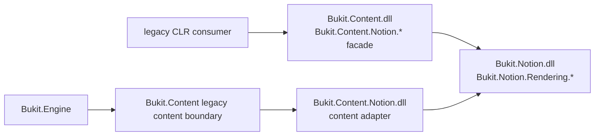

# Bukit Core G-04D1 Content Notion renderer cluster 资格审计

日期：2026-07-22

状态：只读审计完成，等待逐批实施授权

基线：`2.0@3f77a738f7c527459825e6583889d105a7a519c5`

目标版本线：`2.0.0-alpha.1`

## 1. 执行结论

G-04D1 的正确审计对象是 `Bukit.Content.dll` 中 30 个 legacy Notion renderer
兼容类型，不是历史候选清单里全部 31 个 `Bukit.Content.Notion*` 候选。
`Bukit.Content.Notion.NotionClientStats` 是 transport statistics DTO，不属于 renderer
cluster；把它带入本任务会造成 owner 和变更原因漂移。

本轮结论为：**30 项具备分阶段迁移基础，但不具备一次性批量删除资格。**

- 2 个无状态静态 facade 具备最高的独立实施资格：
  `NotionColorPalette`、`NotionRichTextRenderer`；
- 23 个 block renderer facade 具备第二阶段成组实施资格；它们集中在一个 facade
  文件中，规范化 namespace 后 public member 集合与 canonical 类型一致；
- 5 个扩展图类型暂不具备直接删除资格：`INotionBlockRenderer`、
  `NotionBlockTransformer`、`NotionBlockRendererRegistry`、`NotionRenderContext`、
  `NotionBlocksRenderer`。前 3 个与后 2 个形成同一 callback/registry/transport 图，
  且后 2 个存在 client 类型和异常语义差异；
- `NotionClientStats` 必须留给独立 transport-facade 任务，不得在 G-04D1 顺带处理。

推荐顺序是 G-04D1A（2 个静态 facade）→ G-04D1B（23 个 block renderer
facade）→ G-04D1C（5 个扩展图类型）。每项都必须是独立分支、独立 deliberate
public API approval、独立测试和独立只读复审。任何新 CLR 消费者证据都会使相应类型
从“可删除候选”退回“保留或先弃用”。

## 2. 审计边界

### 2.1 包含

- 当前 public API baseline 中由 `Bukit.Content.dll` 导出的 30 个 legacy renderer 类型；
- canonical `Bukit.Notion.Rendering` 替代类型及其 member parity；
- Core、Labs、官方插件、测试、反射、序列化和 Native AOT 风险；
- 关闭的消费者声明及认证 GitHub 搜索证据；
- source/binary compatibility、程序集分发和迁移成本；
- 后续实施的严格分批和停止条件。

### 2.2 不包含

- 不修改任何 C# 源码或类型访问级别；
- 不修改 public API baseline、关闭的 136 项 candidate manifest 或消费者声明；
- 不修改 `site.yaml`、theme、report、插件协议、持久化格式、asset URL、路径工具、
  HTTP/TLS 或 Notion 网络行为；
- 不处理 `NotionClientStats`、`NotionApiClient`、`NotionContentProvider`、
  `NotionPropertyParser` 或 `NotionProviderOptions`；
- 不改变 1.x `main`；
- 不把 canonical Notion assemblies 宣传成受支持 NuGet SDK。

## 3. 当前事实基线

### 3.1 公共面与历史候选

G-04C 关闭后，当前 baseline 有 539 个导出类型、135 个 `2.0-candidate`。
关闭的 136 项 manifest 是声明窗口结束时的历史 cohort，不能因当前审计重写。

在当前 baseline 中：

- 30 个本任务类型仍位于 `Bukit.Content.dll`；
- classification 均为 `implementation-public`；
- compatibility 均为 `2.0-candidate`；
- canonical 替代类型位于 `Bukit.Notion.dll` 的 `Bukit.Notion.Rendering*`；
- canonical 类型被标为 `cross-assembly-implementation / 1.x-do-not-narrow`，它们不是
  本任务的收窄对象。

重现命令：

```bash
jq -r '.types[] | select(.assembly=="Bukit.Content") | select((.name|startswith("Bukit.Content.Notion.BlockRenderers.")) or (.name=="Bukit.Content.Notion.INotionBlockRenderer") or (.name=="Bukit.Content.Notion.NotionBlockRendererRegistry") or (.name=="Bukit.Content.Notion.NotionBlockTransformer") or (.name=="Bukit.Content.Notion.NotionBlocksRenderer") or (.name=="Bukit.Content.Notion.NotionColorPalette") or (.name=="Bukit.Content.Notion.NotionRenderContext") or (.name=="Bukit.Content.Notion.NotionRichTextRenderer")) | [.name,.classification,.compatibility] | @tsv' \
  docs/governance/bukit-core-public-api-baseline.v1.json
```

### 3.2 当前程序集边界



`Bukit.Content.csproj` 直接引用 `Bukit.Content.Notion`、`Bukit.Notion`、Config、
Engine.Abstractions 和 Shared。`Bukit.Content.Notion.csproj` 将 `Bukit.Content`、
`Bukit.Content.Tests` 和 `Bukit.Content.Notion.Tests` 作为受限 friend assemblies；
Engine 不直接成为 adapter friend。现有 architecture tests 对这些边界有显式守卫。

canonical `Bukit.Notion` 和 `Bukit.Content.Notion` 都是 `IsPackable=false` 的 monorepo
Core components，没有 `PackageId` 或独立 NuGet 发布契约。当前替代路径在源码和构建图中
真实存在，但不是一个可对外承诺的独立 SDK 分发面。

### 3.3 facade 已经完成职责迁移

实现职责已经从 legacy renderer 移到 canonical owner：

- 23 个 block renderer 位于
  `src/Bukit-Core/Bukit.Notion/Rendering/BlockRenderers/`；
- legacy 23 类型集中在
  `src/Bukit-Core/Bukit.Content/Notion/BlockRenderers/BlockRendererFacades.cs:19-179`，
  只持有 canonical renderer 并转发 `RenderAsync`；
- legacy registry 的 `CreateDefault()` 在
  `src/Bukit-Core/Bukit.Content/Notion/NotionBlockRendererRegistry.cs:75-76`
  委托 canonical registry；
- legacy rich-text renderer 和 color palette 都是一对一转发；
- legacy blocks renderer 在
  `src/Bukit-Core/Bukit.Content/Notion/NotionBlocksRenderer.cs:13-61`
  包装 canonical renderer，并保留 legacy client 与 `ContentException` 翻译。

因此当前问题不是“先建立替代实现”，而是“是否以及如何结束 legacy assembly identity”。

## 4. 消费者证据

### 4.1 仓库内生产消费者

对 `src/` 排除 legacy facade 定义目录后进行 namespace 和精确类型检索，没有发现
30 个 renderer 类型的生产消费者。Engine 中的四个 `using Bukit.Content.Notion;`
只消费本任务范围外的 `NotionApiClient` 等 content compatibility 类型，不消费 renderer
cluster。

这证明当前仓库的运行路径已切到 canonical renderer，但不能证明私人或未索引消费者
不存在。

### 4.2 测试消费者

测试目录中有 13 个文件包含本 cluster 的精确类型名；它们主要是兼容行为测试和 1.x
source-consumer fixture，不是外部产品消费者，但形成真实迁移成本。

`tests/Bukit.Content.Tests/LegacyNotionConsumerFixture.cs:3-18` 明确编译旧 namespace；
`tests/Bukit.Architecture.Tests/NotionBoundaryTests.cs:271-336` 验证旧类型仍从原程序集
解析；同文件 `:345-381` 固定完整 36 类型 legacy Content Notion surface。

任何实施都不能简单删除这些测试来“让编译通过”。应将行为测试迁移到 canonical owner，
同时把兼容守卫改为只允许经独立决策批准的精确删除集合。

### 4.3 认证公开搜索与私人消费者限制

关闭 manifest 对本任务 30 个类型记录了：

- 30/30 为 `no-public-match-found`；
- 共 74 个 authenticated query；
- 记录的 raw returned count 为 366；
- 记录的 excluded false-positive entries 为 239；
- 30/30 的 private-consumer status 仍为
  `unknown-until-voluntary-declaration`。

这些数据只证明已审阅公开证据没有确认命中。根据
`docs/governance/bukit-core-2.0-consumer-declaration.md:36-40`，私人仓库、未索引代码和
未自愿声明的消费者不可观察；“没有公开命中”不得写成“没有消费者”。

## 5. member、行为和迁移兼容性

### 5.1 23 个 block renderer

使用当前 baseline 将 legacy namespace 规范化为 canonical namespace 后，23/23 类型的
public member 集合完全一致。构造函数也一一对应，包括：

- `ChildEntityBlockRenderer(string typeName)`；
- `RichTextContainerRenderer(string containerName, string tag)`；
- 其余 21 个无参构造函数；
- 相同 `RenderAsync(JsonElement, NotionRenderContext, CancellationToken)` 形状。

这提供了强 migration mapping，但不是 binary compatibility。类型的 assembly identity 和
namespace 都发生变化，已经编译的消费者必须重新编译，源码消费者必须更换 namespace。

### 5.2 两个无状态静态 facade

`NotionColorPalette` 和 `NotionRichTextRenderer` 在 namespace 规范化后 public member
集合完全一致。它们没有 callback、client、registry 或异常翻译依赖，是最小且最容易
验证的实施批次。

`NotionColorPalette` 的 `const string` 值可能被消费者编译进自己的程序集；删除 legacy
类型不会改变已经编译进去的常量值，但会破坏后续源码编译和任何反射 type lookup。

### 5.3 五个扩展图类型

| 类型 | canonical member parity | 主要风险 | 资格结论 |
|---|---|---|---|
| `INotionBlockRenderer` | namespace 规范化后相同 | 外部实现类、callback context identity | 暂缓，纳入 G-04D1C |
| `NotionBlockTransformer` | namespace 规范化后相同 | delegate binary identity、callback context | 暂缓，纳入 G-04D1C |
| `NotionBlockRendererRegistry` | namespace 规范化后相同 | 接收前两类并维持 adapter lifecycle | 暂缓，纳入 G-04D1C |
| `NotionRenderContext` | 不相同 | `Client` 从 legacy `NotionApiClient` 变为 canonical `NotionClient` | 暂缓，必须提供 migration test |
| `NotionBlocksRenderer` | 不相同 | 构造器 client 类型变化；异常翻译变化 | 暂缓，必须先决定行为契约 |

legacy `NotionBlocksRenderer` 会把 canonical `NotionRenderingException` 和
`NotionApiException` 翻译为 `ContentException`。直接迁移到 canonical renderer 后，该异常
语义不再自动保持。这个差异不能用 namespace 替换掩盖，也不能在 public-surface 删除任务
中顺带修改 canonical 网络或异常策略。

## 6. 逐类型资格矩阵

资格口径：

- **D1A 优先**：可申请下一项独立、2.0-only 直接删除任务；
- **D1B 条件合格**：需要先迁移等价行为测试并将同文件 facade 作为一个原子批次；
- **D1C 暂缓**：需要先完成 callback/client/exception migration contract；
- 所有“合格”都仍需要明确实施授权，不由本报告自动授权。

| # | legacy 类型 | canonical 替代 | 当前仓库生产消费 | 资格 |
|---:|---|---|---|---|
| 1 | `BlockRenderers.AudioBlockRenderer` | `Bukit.Notion.Rendering.BlockRenderers.AudioBlockRenderer` | facade only | D1B 条件合格 |
| 2 | `BlockRenderers.BookmarkBlockRenderer` | `Bukit.Notion.Rendering.BlockRenderers.BookmarkBlockRenderer` | facade only | D1B 条件合格 |
| 3 | `BlockRenderers.CalloutBlockRenderer` | `Bukit.Notion.Rendering.BlockRenderers.CalloutBlockRenderer` | facade only | D1B 条件合格 |
| 4 | `BlockRenderers.ChildEntityBlockRenderer` | `Bukit.Notion.Rendering.BlockRenderers.ChildEntityBlockRenderer` | facade only | D1B 条件合格 |
| 5 | `BlockRenderers.CodeBlockRenderer` | `Bukit.Notion.Rendering.BlockRenderers.CodeBlockRenderer` | facade only | D1B 条件合格 |
| 6 | `BlockRenderers.ColumnBlockRenderer` | `Bukit.Notion.Rendering.BlockRenderers.ColumnBlockRenderer` | facade only | D1B 条件合格 |
| 7 | `BlockRenderers.ColumnListBlockRenderer` | `Bukit.Notion.Rendering.BlockRenderers.ColumnListBlockRenderer` | facade only | D1B 条件合格 |
| 8 | `BlockRenderers.DividerBlockRenderer` | `Bukit.Notion.Rendering.BlockRenderers.DividerBlockRenderer` | facade only | D1B 条件合格 |
| 9 | `BlockRenderers.EmbedBlockRenderer` | `Bukit.Notion.Rendering.BlockRenderers.EmbedBlockRenderer` | facade only | D1B 条件合格 |
| 10 | `BlockRenderers.EquationBlockRenderer` | `Bukit.Notion.Rendering.BlockRenderers.EquationBlockRenderer` | facade only | D1B 条件合格 |
| 11 | `BlockRenderers.FileBlockRenderer` | `Bukit.Notion.Rendering.BlockRenderers.FileBlockRenderer` | facade only | D1B 条件合格 |
| 12 | `BlockRenderers.ImageBlockRenderer` | `Bukit.Notion.Rendering.BlockRenderers.ImageBlockRenderer` | facade only | D1B 条件合格 |
| 13 | `BlockRenderers.LinkPreviewBlockRenderer` | `Bukit.Notion.Rendering.BlockRenderers.LinkPreviewBlockRenderer` | facade only | D1B 条件合格 |
| 14 | `BlockRenderers.LinkToPageBlockRenderer` | `Bukit.Notion.Rendering.BlockRenderers.LinkToPageBlockRenderer` | facade only | D1B 条件合格 |
| 15 | `BlockRenderers.NoOpBlockRenderer` | `Bukit.Notion.Rendering.BlockRenderers.NoOpBlockRenderer` | facade only | D1B 条件合格 |
| 16 | `BlockRenderers.PdfBlockRenderer` | `Bukit.Notion.Rendering.BlockRenderers.PdfBlockRenderer` | facade only | D1B 条件合格 |
| 17 | `BlockRenderers.RichTextContainerRenderer` | `Bukit.Notion.Rendering.BlockRenderers.RichTextContainerRenderer` | facade only | D1B 条件合格 |
| 18 | `BlockRenderers.SyncedBlockRenderer` | `Bukit.Notion.Rendering.BlockRenderers.SyncedBlockRenderer` | facade only | D1B 条件合格 |
| 19 | `BlockRenderers.TableBlockRenderer` | `Bukit.Notion.Rendering.BlockRenderers.TableBlockRenderer` | facade only | D1B 条件合格 |
| 20 | `BlockRenderers.TableOfContentsBlockRenderer` | `Bukit.Notion.Rendering.BlockRenderers.TableOfContentsBlockRenderer` | facade only | D1B 条件合格 |
| 21 | `BlockRenderers.ToDoBlockRenderer` | `Bukit.Notion.Rendering.BlockRenderers.ToDoBlockRenderer` | facade only | D1B 条件合格 |
| 22 | `BlockRenderers.ToggleBlockRenderer` | `Bukit.Notion.Rendering.BlockRenderers.ToggleBlockRenderer` | facade only | D1B 条件合格 |
| 23 | `BlockRenderers.VideoBlockRenderer` | `Bukit.Notion.Rendering.BlockRenderers.VideoBlockRenderer` | facade only | D1B 条件合格 |
| 24 | `INotionBlockRenderer` | `Bukit.Notion.Rendering.INotionBlockRenderer` | compatibility graph only | D1C 暂缓 |
| 25 | `NotionBlockRendererRegistry` | `Bukit.Notion.Rendering.NotionBlockRendererRegistry` | compatibility graph only | D1C 暂缓 |
| 26 | `NotionBlockTransformer` | `Bukit.Notion.Rendering.NotionBlockTransformer` | compatibility graph only | D1C 暂缓 |
| 27 | `NotionBlocksRenderer` | `Bukit.Notion.Rendering.NotionBlocksRenderer` | compatibility graph only | D1C 暂缓 |
| 28 | `NotionColorPalette` | `Bukit.Notion.Rendering.NotionColorPalette` | facade only | D1A 优先 |
| 29 | `NotionRenderContext` | `Bukit.Notion.Rendering.NotionRenderContext` | compatibility graph only | D1C 暂缓 |
| 30 | `NotionRichTextRenderer` | `Bukit.Notion.Rendering.NotionRichTextRenderer` | facade only | D1A 优先 |

## 7. 风险与模块影响

### 7.1 Source 与 binary compatibility

任何删除都是 2.0 breaking change：legacy fully-qualified name 和 assembly-qualified name
不再解析；预编译消费者会出现 `TypeLoadException`、`MissingMethodException` 或加载失败，
源码消费者会出现编译错误。canonical 类型相同的 simple name 不提供 type forwarding 或
binary identity。

本报告不建议新增 type-forwarding shim。forwarding 到不同 namespace 不保留原 fully-
qualified type identity；另外发明一套 shim 会延长双公共面并偏离“结束 legacy facade”的
目标。

### 7.2 Content、Engine 和 Notion adapter

仓库生产路径不消费 renderer facade，因此 D1A/D1B 不应改变内容加载、Notion 查询、
canonical projection、路由、HTML 输出或缓存。D1C 若误删 registry/context 适配逻辑，
会影响自定义 block renderer、嵌套 block rendering、取消传播和异常分类，必须用迁移
fixture 证明。

### 7.3 测试完整性

大量 legacy renderer 测试是 canonical 实现通过 facade 的间接回归证据。实施时应先把
等价行为断言迁入 `Bukit.Notion.Tests`，再删除 legacy tests；不得仅以总测试数下降后仍
通过作为验收。URL safety、HTML encoding、media/container、color、pagination、registry
override、custom transformer fallback 和 cancellation 都必须保留。

### 7.4 Native AOT、反射与序列化

源码扫描没有发现 renderer cluster 参与生产反射或 JSON serializer registration；现有
architecture test 也禁止新 Notion projects 使用 reflection-based JSON serialization。
legacy type-resolution architecture tests 是治理守卫，不是生产反射路径。

这降低了 AOT 风险，但不能替代真实 publish/package smoke。删除 public types 会改变
trim graph、程序集引用和构造可达性，实施批次仍必须运行真实 Native AOT 证据。

### 7.5 文档和分发

canonical assemblies 当前不是 NuGet SDK。如果未来希望对外支持 CLR custom renderer，
必须另立 productization 决策，定义 package、SemVer、目标框架和支持政策。G-04D1 只能
提供 source-level migration mapping，不能顺带把 monorepo assembly 升级为公开 SDK。

## 8. 推荐实施顺序

### G-04D1A：两个无状态静态 facade

只处理：

- `Bukit.Content.Notion.NotionColorPalette`；
- `Bukit.Content.Notion.NotionRichTextRenderer`。

兼容目标：2.0-only removal，迁移到同名 canonical 类型。不得顺带删除 block renderer、
stats、client、provider 或 assembly reference。

### G-04D1B：23 个 block renderer facade

只处理 `BlockRendererFacades.cs` 中 23 个 public wrapper。开始前必须先把 legacy 行为测试
投影到 canonical types，并证明 23/23 member mapping 和关键 HTML 输出等价。

兼容目标：2.0-only removal。该文件应作为一个原子 facade 集合处理，避免保留半套默认
renderer 目录造成错误迁移说明。

### G-04D1C：五个扩展图类型

先建立 migration contract，再决定 removal 或 pre-release obsolete period。必须明确：

1. legacy `NotionApiClient` 到 canonical `NotionClientOptions/NotionClient` 的构造映射；
2. `NotionRenderContext.Client` 的类型变化；
3. 自定义 `INotionBlockRenderer` 和 transformer callback 的源码迁移；
4. legacy `ContentException` 与 canonical exception 的预期差异；
5. registry fallback、嵌套 rendering、取消和 disposal 行为。

在这些条件未闭环前，D1C 不应申请删除授权。

### 独立 transport 后续任务

`Bukit.Content.Notion.NotionClientStats` 当前只从 internal `GetStats()` 返回，生产外部没有
public signature 传播，但它属于 transport compatibility，不属于 renderer。可以作为后续
单类型资格审计候选，不能进入 D1A、D1B 或 D1C。

## 9. 每个实施批次的强制验收

1. 从 `2.0` 建立独立分支和 worktree；1.x `main` 保持不变；
2. 先增加精确 RED architecture/drift test，再实施删除；
3. public API drift 在 baseline approval 前只报告该批精确类型；
4. 当前 baseline 只删除获批类型；关闭的 136 项 manifest 保持 byte-identical；
5. canonical public surface、namespace、members 和程序集 identity 不变化；
6. 迁移后的测试不得减少 URL safety、encoding、rendering、registry、pagination、取消或
   exception 证据；
7. 运行相关 `Bukit.Content.Tests`、`Bukit.Notion.Tests`、
   `Bukit.Architecture.Tests`；
8. 编译 Core、Labs 和官方 plugins；
9. 运行真实 Native AOT publish/package smoke；
10. 每项执行 focused owner check；父任务末尾只执行一次 aggregate targeted gate；
11. 进行独立只读 diff 复审，确认没有 schema、插件协议、配置、URL、路径、HTTP/TLS、
    report 或其他 owner 漂移；
12. 若出现 CLR、reflection、serialization、inheritance 或 Native AOT 消费证据，立即停止
    删除并改为保留或显式迁移/obsolete 决策。

## 10. 最终判定

G-04C 已证明 Bukit 2.0 可以安全完成单类型 deliberate removal，但它不授权批量处理
剩余 135 项。G-04D1 的架构方向是正确的：canonical rendering owner 已经建立，legacy
facade 不再承载核心实现，AD-04 可以继续渐进收窄。

当前最合理的下一步不是删除 30 个类型，而是申请 **G-04D1A 两个静态 facade 的独立
实施授权**。D1A 成功关闭后，才能进入 D1B；D1C 必须等 migration contract 完成。
AD-04 在 G-04D1 全部完成后仍不会自动关闭，后续 owner batch 仍须沿 G-04D 顺序逐批
审计。
