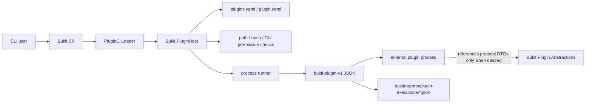
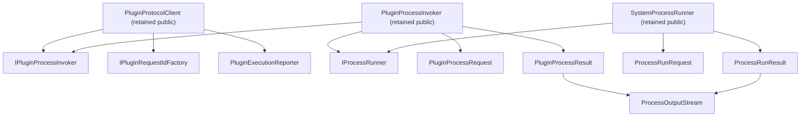

# Bukit Core G-04D2：PluginHost process helper/facade 资格审计

日期：2026-07-23

基线：`2.0@21072f4f45fdb23c0f3a95f03c837c1dab4665b5`

任务属性：独立只读资格审计
状态：审计结论完成；不构成访问级别或删除授权

## 1. 执行摘要

G-04D2 的正确结论不是“PluginHost 有 16 个零仓内引用类型，所以可以一次性
internalize”，也不是“PluginHost 是安全边界，所以全部 public 都必须永久保留”。

当前 `Bukit.PluginHost` 有 **40 个 public 类型**：

- 24 个标记为 `1.x-do-not-narrow`，主要承担 `Bukit.Cli` 与 Host 程序集间协作；
- 16 个标记为 `implementation-public / 2.0-candidate`；
- 16 个候选均无 protected member；
- 当前 Core public API 基线为 14 assemblies / 509 types / 105 candidates；
- 闭合消费者 manifest 仍为 136 项，Git blob 为
  `7b07d6890562387010b52301e9f8716e9bf10ed1`，其中 PluginHost 仍占 16 项。

逐类型传播图证明，16 项并不是平坦集合：

| 组 | 数量 | 当前资格 |
|---|---:|---|
| 进程/协议编排图 | 8 | 被 retained public constructor/method/base-interface 阻断，不可直接收窄 |
| execution-report 图 | 3 | 被 retained `PluginProtocolClient` constructor 与尚未版本化的报告工件共同阻断 |
| filesystem permission 图 | 2 | 被 retained `PluginPermissionEvaluator` constructor 及类型间传播阻断 |
| runtime-only config context | 1 | 被 retained `PluginConfigLoader` constructor 阻断 |
| `PluginHostErrorCodes` | 1 | 条件资格；必须先锁定六个可观察诊断字符串，迁移测试所有权 |
| `PluginSecretMasker` | 1 | 当前唯一适合作为下一项独立单类型 2.0 internalization 试点的候选 |

因此：

1. **不批准 16 项批量收窄。**
2. **不建议整体重构或合并 PluginHost 程序集。**
3. **推荐下一项是独立的 G-04D2A：`PluginSecretMasker` 单类型
   internalization。**
4. `PluginHostErrorCodes` 可作为后续单类型任务，但必须保留协议文档中的六个字符串
   语义，并用入口行为断言替代对 public constants 类型的测试依赖。
5. 其余 14 项要先处理 retained public member 传播、report contract 与测试可见性，
   不能仅修改类型访问级别。

本报告只给出资格与迁移边界，不修改源码、public API baseline、闭合 manifest、
`bukit-plugin-v1`、report schema、配置、路径、权限、进程或 AOT 行为。

## 2. 范围与方法

### 2.1 审计范围

本轮覆盖：

- `src/Bukit-Core/Bukit.PluginHost/` 的 public CLR 面；
- 直接消费者 `src/Bukit-Core/Bukit.Cli/Cli/PluginCliLoader.cs`；
- `Bukit.Plugin.Abstractions` 的 wire DTO 边界；
- Core、Labs、官方 process plugin 项目引用；
- `Bukit.PluginHost.Tests`、`PluginBoundaryTests`、CLI plugin tests；
- current public API baseline、闭合 136 项 manifest、消费者声明与活动文档；
- reflection、manual/source-generated serialization 与 Native AOT 风险。

不深审官方插件内部业务，也不把 Engine 内置插件接口混入本轮。正式外部插件边界是
`Bukit.Cli -> Bukit.PluginHost -> external process plugin`；Engine 内置插件和
`ISectionPlugin` 不是同一个产品契约。

### 2.2 证据等级

按以下优先级判断：

1. 当前源码与 `.csproj`；
2. 编译 public API baseline；
3. 当前测试与架构门禁；
4. 当前 guide、契约矩阵和活动插件规范；
5. 闭合 manifest 中的认证公开搜索；
6. 历史审计仅用于定位，不直接替代当前证据。

“仓内无外部命中”和 `no-public-match-found` 只降低已知消费者风险，不证明私有、
未索引、源码复制、DLL 引用、reflection 或 binary consumer 不存在。

## 3. 当前业务和程序集边界

[PluginCliLoader.cs](../../src/Bukit-Core/Bukit.Cli/Cli/PluginCliLoader.cs)
第 23–56 行保留依赖注入 constructor，并在 `CreateDefault()` 中组合
`PluginProcessInvoker`、`SystemProcessRunner`、`PluginConfigLoader`、
`PluginProtocolClient` 和 `PluginRequestIdFactory`。这说明 PluginHost 的 public
主要源于跨程序集组合与测试替换性，不是第三方插件 SDK。

[Bukit.PluginHost.csproj](../../src/Bukit-Core/Bukit.PluginHost/Bukit.PluginHost.csproj)
只引用 `Bukit.Plugin.Abstractions`、`Bukit.Shared` 和 YamlDotNet；
[PluginBoundaryTests.cs](../../tests/Bukit.Architecture.Tests/PluginBoundaryTests.cs)
同时禁止 Host 反向引用 CLI、Engine、Labs、领域库或官方插件实现。官方 process
plugin 项目也不得引用 `Bukit.PluginHost`。

仓内 production `.csproj` 中，只有 `Bukit.Cli` 引用 PluginHost；另外三个引用者均为
测试项目。正式分发仍是 Native AOT CLI archive，不存在独立 PluginHost NuGet SDK
发布、`dotnet pack` 产品链或第三方 CLR 安装指引。

结论：**程序集层必须保留，全部 public CLR 身份不必因此永久保留。**

## 4. 当前治理事实

### 4.1 计数

| 项目 | 当前值 |
|---|---:|
| Core audited assemblies | 14 |
| Core public types | 509 |
| Core `2.0-candidate` | 105 |
| PluginHost public types | 40 |
| PluginHost `1.x-do-not-narrow` | 24 |
| PluginHost `2.0-candidate` | 16 |
| closed historical cohort | 136 |
| closed manifest PluginHost entries | 16 |

所有 16 项仍是闭合历史 cohort 的成员，状态保持：

- `declarationStatus=consumer-declaration-pending`；
- `privateConsumerStatus=unknown-until-voluntary-declaration`；
- `externalEvidence.searchStatus=no-public-match-found`；
- `proposedAction=review-only`。

这些字段不代表“待删除”，只代表可以进入逐类型兼容性评审。

### 4.2 已知消费者证据

闭合 manifest 对 16 项都记录了认证 full-name 和 simple-name 搜索。所有 full-name
查询为零公开匹配；`IProcessRunner`、`PluginProcessRequest`、
`PluginProcessResult`、`ProcessOutputStream`、`ProcessRunRequest`、
`ProcessRunResult` 的通用 simple-name 查询出现大量词法碰撞，但均通过未截断限定查询
复核为零 Bukit exact match。

已确认使用 Bukit 的 SRBiz-bukit、sitegen 与 ALi365WebSiteBuilder 是 CLI/process
consumer，并声明不直接引用当前 Bukit CLR 候选。这支持“没有已知直接 CLR
consumer”，但不能扩张成对私有代码的全局证明。

## 5. 16 项候选完整矩阵

| 候选 CLR identity | 组 | 当前生产传播 | 资格 | 必要前置 |
|---|---|---|---|---|
| `IPluginProcessInvoker` | process | `PluginProtocolClient` public ctor；`PluginProcessInvoker` public base interface | 阻断 | 先设计 Host construction seam，并处理 retained members |
| `IPluginRequestIdFactory` | process | `PluginProtocolClient` public ctor；`PluginRequestIdFactory` public base interface | 阻断 | 同上 |
| `IProcessRunner` | process | `PluginProcessInvoker` public ctor；`SystemProcessRunner` public base interface | 阻断 | 同上 |
| `PluginProcessRequest` | process | `IPluginProcessInvoker`、`PluginProcessInvoker.InvokeAsync` | 阻断 | process graph 原子迁移 |
| `PluginProcessResult` | process | `IPluginProcessInvoker`、`PluginProcessInvoker.InvokeAsync`、`PluginProtocolClient` 内部链 | 阻断 | process graph 原子迁移 |
| `ProcessOutputStream` | process | 两级 process result public property/ctor | 阻断 | 与两个 result 一起处理 |
| `ProcessRunRequest` | process | `IProcessRunner`、`SystemProcessRunner.RunAsync` | 阻断 | process graph 原子迁移 |
| `ProcessRunResult` | process | `IProcessRunner`、`SystemProcessRunner.RunAsync` | 阻断 | process graph 原子迁移 |
| `PluginExecutionReport` | report | `PluginExecutionReporter.WriteAsync`；手写 JSON 输入 | 阻断 | 先确定并版本化 report contract |
| `PluginExecutionReporter` | report/DI | `PluginProtocolClient` public ctor；invoke 自动写 report | 阻断 | report policy + construction seam |
| `PluginExecutionResponseSummary` | report | `PluginExecutionReport` ctor/property；JSON `responseSummary` | 阻断 | 与 report DTO 原子处理 |
| `PluginFileSystemPermissionEvaluator` | permission | retained `PluginPermissionEvaluator` public ctor | 阻断 | constructor seam + permission behavior fixtures |
| `PluginPermissionPathNormalizer` | permission | candidate evaluator public ctor和内部字段 | 阻断 | 与 evaluator 原子处理 |
| `PluginRuntimeOnlyContext` | config | retained `PluginConfigLoader` public ctor/default value | 阻断 | parameterless/default facade 与 Labs/Test mapping |
| `PluginHostErrorCodes` | diagnostic | Host 内部使用；六个字符串由活动协议文档公开 | 条件资格 | 锁定实际异常字符串；迁移直接类型测试 |
| `PluginSecretMasker` | report security | 仅 Reporter 内部调用；无 public signature 传播 | **可进入独立单类型任务** | 保留所有 masking 行为和入口测试 |

## 6. Process/Protocol 编排图为什么不能逐类型删除

[PluginProtocolClient.cs](../../src/Bukit-Core/Bukit.PluginHost/PluginProtocolClient.cs)
第 18–30 行把三个候选放进 retained public constructor。
[PluginProcessInvoker.cs](../../src/Bukit-Core/Bukit.PluginHost/PluginProcessInvoker.cs)
第 3–36 行同时传播两个接口与两组 request/result。
[SystemProcessRunner.cs](../../src/Bukit-Core/Bukit.PluginHost/SystemProcessRunner.cs)
第 6–80 行公开实现 runner，并返回包含 `ProcessOutputStream` 的 result。

所以以下做法均不合格：

- 只把接口改 internal，保留 public class implements internal interface；
- 只改 request/result access level，保留 public method；
- 只删除 `ProcessOutputStream`，保留两个 public result 的属性；
- 为了让测试编译，先无约束添加大量 `InternalsVisibleTo`；
- 一次删除 8 项但不审计 retained public members 的变更。

后续必须先选择一个 construction boundary：

1. 受控的 internal composition，加精确的 CLI/test friendship；
2. 一个窄 public factory/facade，隐藏 process runner 与 reporter 注入；
3. 保留当前 public seam，放弃收窄此图。

本报告推荐先设计方案 1 与 2 的兼容 diff，再决定，不在资格审计中预选实现。

## 7. Execution report 不是纯 CLR 实现细节

[PluginExecutionReport.cs](../../src/Bukit-Core/Bukit.PluginHost/PluginExecutionReport.cs)
定义两个候选 record；[PluginExecutionReporter.cs](../../src/Bukit-Core/Bukit.PluginHost/PluginExecutionReporter.cs)
第 9–93、147–198 行逐字段写入
`.bukit/reports/plugin-executions/*.json`，并对 environment、stderr、
diagnostic message/path 和 artifact description 做脱敏。

活动证据表明它不是完全隐藏的临时文件：

- `guide/dev/plugins.md` 承诺 secrets are masked in reports；
- `docs/plugins/Bukit 插件配置规范.md` 列出固定目录和所有权；
- 1.0 contract matrix 把外部 process protocol、timeout、output limit、permission、
  masking 等行为纳入 GA-limited/GA-locked 边界；
- PluginHost 与 Echo integration tests 验证报告存在和主要字段。

但当前又缺少：

- 独立 JSON schema；
- `schema` / `schemaVersion`；
- 明确字段兼容政策；
- reader、upgrade 或 unknown-field policy。

因此不能直接选择“best-effort 内部日志”来方便收窄，也不能无证据宣称当前所有 JSON
字段已经是永久 GA schema。推荐独立 **G-04D2R report-contract decision**：

1. 把现有路径、secret masking、失败可观测性视为已承诺行为；
2. 决定是否从 2.0 起引入版本化 schema；
3. 若采用 schema，先建立独立 writer DTO，再让 CLR execution DTO 回归内部；
4. 若明确降级为内部诊断工件，必须先修正文档与兼容矩阵，并提供迁移说明；
5. 在该决策前保留 `PluginExecutionReport`、`PluginExecutionResponseSummary` 和
   `PluginExecutionReporter` 的 public 形状。

## 8. Permission 和 runtime-only 两个小图

### 8.1 Permission 图

[PluginPermissionEvaluator.cs](../../src/Bukit-Core/Bukit.PluginHost/PluginPermissionEvaluator.cs)
第 6–45 行通过 public optional constructor 暴露
`PluginFileSystemPermissionEvaluator`；后者又通过 public constructor 暴露
`PluginPermissionPathNormalizer`。

二者承载 traversal、绝对路径、`.bukit` 特殊目录和 permission subset 安全规则。
收窄时不能减少这些入口行为测试。推荐先增加 public `PluginPermissionEvaluator`
入口级 contract fixture，再以同一原子任务处理 evaluator/normalizer；不得只删除
normalizer。

### 8.2 Runtime-only context

[PluginConfigLoader.cs](../../src/Bukit-Core/Bukit.PluginHost/PluginConfigLoader.cs)
第 9–16 行在 public constructor 暴露 `PluginRuntimeOnlyContext`，第 96–112 行用它
限制 `manifestPolicy=runtime-only` 只能在 Development、Labs 或 Test 使用。

该 enum 的 CLR 身份不是 wire contract，但行为是架构安全边界。后续若收窄，必须先：

- 保留 production 默认 `None`；
- 明确 Dev/Labs/Test 如何创建 loader；
- 保留 runtime-only 在 Core/default 路径拒绝的架构测试；
- 不把 runtime-only 重新开放给普通 production build。

## 9. 两个独立工具类型

### 9.1 `PluginSecretMasker`：推荐的下一项

[PluginSecretMasker.cs](../../src/Bukit-Core/Bukit.PluginHost/PluginSecretMasker.cs)
只由 `PluginExecutionReporter` 在同一程序集调用；没有出现在任何 retained public
signature、Core/Labs/官方 plugin 生产源码、source-generated JSON context 或 reflection
注册中。闭合 manifest 的 full-name/simple-name 查询均无公开匹配。

其行为是安全契约，但 public CLR identity 不是契约。当前报告入口测试已经验证：

- secret environment value 写为 `***`；
- stderr、diagnostic path/message、artifact description 不泄漏 secret；
- public non-secret value保留。

因此可建立独立 G-04D2A，只把该类型从 `public static` 改为 `internal static`，不移动
文件、不改算法、不改 secret key fragments、不改 report shape。验收必须包含：

- 原入口 masking 测试；
- 该 CLR full name 不再导出；
- public API baseline 只减少这一项；
- closed 136-entry manifest byte-identical；
- Core/Labs/plugins build；
- Native AOT publish/package smoke；
- 独立 aggregate review。

如果未来出现具体 CLR consumer，停止 internalization，改为保留或 obsolete。

### 9.2 `PluginHostErrorCodes`：条件资格

[PluginHostErrorCodes.cs](../../src/Bukit-Core/Bukit.PluginHost/PluginHostErrorCodes.cs)
只在 Host 内部和测试中引用，但六个字符串值出现在活动插件协议/安全文档：

- `plugin.unsupportedProtocol`
- `plugin.invalidResponse`
- `plugin.timeout`
- `plugin.executionFailed`
- `plugin.permissionDenied`
- `plugin.outputTooLarge`

public `const string` 还具有编译期内联特性：删除类型不会改变已经编译进 consumer 的
字符串，但会破坏重新编译、reflection 和 type lookup。直接把测试改成不检查 code
会削弱契约，属于超限修复。

所以它只有条件资格：先把测试改为通过 `PluginProtocolClient` 的实际异常输出断言六个
稳定字符串，必要时由 protocol owner 提供内部常量；不得新建一个未经治理的 public
CLR constants 类型。完成 RED/GREEN 迁移证据后，才能申请独立 internalization。

## 10. Reflection、serialization 与 Native AOT

本轮仓内搜索未发现 16 项候选被以下机制按 CLR identity 注册：

- `Type.GetType` / `Assembly.Load` / `Activator.CreateInstance`；
- `DynamicDependency` / `DynamicallyAccessedMembers`；
- `JsonSerializable` / polymorphic converter；
- source generator、配置字符串或 plugin manifest 中的 CLR type name。

`PluginExecutionReporter` 使用 `Utf8JsonWriter` 手写 JSON，不依赖候选 CLR reflection。
正式 wire DTO 的 source-generated context 位于 `Bukit.Plugin.Abstractions`，不包含这
16 项。

这说明 Native AOT 不要求它们保持 public；但不能把静态扫描写成 AOT 通过。任何后续
access-level 实施仍需在最终合并候选上运行真实 Native AOT publish/package smoke，
确认 CLI composition、trimming、process invocation 和报告写入均未回归。

## 11. 测试与可替换性

审计基线：

- `Bukit.PluginHost.Tests`：168/168；
- `PluginBoundaryTests`：23/23。

当前测试对 process interfaces/DTO、error constants、runtime-only enum 和 report DTO
有直接编译依赖；PluginHost 没有对应 test friendship。未来不能以“改 internal 后测试
编译失败”为理由删除白盒覆盖，也不能无约束开放所有 internals。

推荐迁移规则：

1. security、protocol、report shape 能从正式入口验证的，迁到入口行为测试；
2. process kill、output truncation 等必须白盒验证的，最多授予
   `Bukit.PluginHost.Tests` 精确 friendship；
3. CLI 默认 composition 若使用 internals，只授予真实程序集名并增加架构测试；
4. 官方 process plugins 继续不得引用 PluginHost internals；
5. 测试数量不是验收目标，timeout/cancellation/output-limit/masking/path/permission
   证据不得减少才是目标。

## 12. 方案比较

### 方案 A：渐进收窄（推荐）

- 先处理 `PluginSecretMasker`；
- 再处理 `PluginHostErrorCodes` 的诊断契约；
- 独立决定 execution report policy；
- 为 process、permission、runtime-only 图设计窄 construction boundary；
- 每次只批准一个原子图。

优点：可回滚、证据清晰、不把 wire protocol 和 Host CLR 混为一体。
风险：任务数量多，短期 public 数量下降较慢。

### 方案 B：一次性 internalize PluginHost 实现面（不推荐）

需要同时修改 16 candidates、多个 retained public constructors/methods/base interfaces、
CLI composition、测试 friendship、report DTO 和 baseline。虽然源码可一次编译通过，
但审计面跨 process、protocol、security、report、config 和 CLI，违反当前 owner-batch
治理原则。

### 方案 C：冻结现状

如果两项独立工具的维护收益不足以覆盖 breaking 审计成本，可以保持 public 可见性，
继续声明其不是 SDK。公共面治理目标是降低误承诺与变更风险，不是追求最小数字。

## 13. 推荐的后续顺序

### G-04D2A：`PluginSecretMasker` 单类型 internalization

当前唯一直接具备资格的候选。必须是独立分支、单类型 baseline drift、focused gate、
Native AOT smoke 和独立只读复审。

### G-04D2B：`PluginHostErrorCodes` diagnostic-contract migration

先建立实际入口的六值契约，再决定 internalization；禁止修改字符串或协议错误语义。

### G-04D2R：execution-report contract decision

只决定报告属于 versioned supported artifact 还是明确的 internal diagnostic artifact。
若选择 versioned contract，schema 设计和 CLR DTO 收窄必须分任务。

### G-04D2C：Host construction-boundary design

只设计并验证 `PluginProtocolClient`、`PluginProcessInvoker`、
`SystemProcessRunner`、`PluginConfigLoader`、`PluginPermissionEvaluator` 的 companion
member migration，不同时收窄八个 process 类型。

### G-04D2D～F：按图实施

建议在 construction design 获批后依次：

1. permission evaluator/normalizer 图；
2. runtime-only context；
3. process/protocol 8-type 图；
4. execution-report CLR 图。

每一项必须重新检查 private consumer 新证据，不能把本报告当作长期授权。

## 14. 强制停止条件

任一后续任务出现以下证据必须停止：

- 外部程序集实现三个 candidate interface 中任一项；
- public/protected signature、reflection、serialization、source generator 或 AOT
  root 绑定候选 full name；
- private consumer 声明直接使用候选类型或 retained constructor；
- CLI composition 只能通过扩大公开 Host API 才能继续；
- report reader 依赖当前无版本 JSON shape；
- security tests 需要删除、弱化或改变 timeout/output/masking/path/permission 行为；
- batch 必须修改 `bukit-plugin-v1`、plugin schema、asset URL、配置默认值或其他 owner；
- public API baseline 出现非批准类型/member drift；
- closed manifest 发生任何字节变化。

## 15. 验证记录

| 检查 | 结果 |
|---|---|
| 独立 worktree | `codex/g04d2-pluginhost-eligibility-audit` |
| 基线 | `2.0@21072f4f` |
| PluginHost tests | 168/168 通过 |
| PluginBoundary tests | 23/23 通过 |
| public API current | 14 assemblies / 509 types / 105 candidates |
| PluginHost surface | 40 public / 16 candidates |
| closed manifest | 136 entries；PluginHost 16；blob `7b07d6890562387010b52301e9f8716e9bf10ed1` |
| production project references | 仅 `Bukit.Cli` 引用 PluginHost；其余直接引用为测试 |
| official process plugins | 未引用 PluginHost；仅引用 protocol/domain owner |
| reflection/AOT registration | 未发现候选 CLR identity 注册 |
| 本任务 runtime/API/schema/protocol change | 0 |
| docs focused / aggregate / independent review | 不在报告中预判；以本任务最终 handoff 的实测证据为准 |

## 16. 最终判定

G-04D2 证明 PluginHost 的方向正确：它是必须保留的外部进程插件 Host 边界，但当前
public CLR 面包含可收窄的实现泄漏。现架构不需要整体重构；需要的是：

- 保留 `Bukit.Plugin.Abstractions` wire contract 与 Host 安全行为；
- 分离“public constructor 方便跨程序集组合”和“受支持 CLR SDK”；
- 先处理没有传播的独立工具，再处理报告契约和 constructor graph。

本审计只支持启动 **G-04D2A `PluginSecretMasker` 单类型资格实施任务**。它不批准
`PluginHostErrorCodes` 或其他 14 项同步收窄，不批准新增 schema、改变协议、扩大
friendship、合并程序集或一次性重写 PluginHost。
