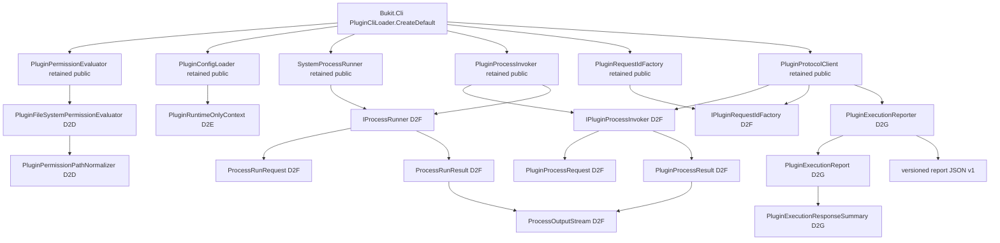

# Bukit Core G-04D2C Host construction-boundary 设计

日期：2026-07-23

任务：G-04 Group 1 Task 3

基线：`codex/g04-group1-pluginhost-content-a@db8bab77a7516e26904691c693e67a16afb05af9`

状态：`group-verification-pending`

## 1. 决策摘要

本设计把“retained companion 类型继续 public”与“2.0 分支迁移其传播候选的
constructor/member”分开治理。14 个候选的终态冻结为：

| 原子图 | 候选数 | 决策 | 后续任务 |
| --- | ---: | --- | --- |
| D2D permission | 2 | internalize；`PluginPermissionEvaluator` 保持 public，并提供 public 无参构造；候选注入构造改为 internal、非 optional | Task 4 |
| D2E runtime-only | 1 | internalize；`PluginConfigLoader` 保持 public，无参构造固定 `None`；enum 构造改为 internal | Task 5 |
| D2F process/protocol | 8 | retain-by-design；作为完整 public implementation seam 保留，不制造 retained public empty shell | Task 6 |
| D2G execution-report CLR | 3 | 在 D2R 的 JSON v1 契约先落地后原子 internalize；`PluginProtocolClient` 保留 two-dependency public ctor，reporter-injection ctor 改 internal | Task 7 |

该选择不新增通用 service locator、public runtime-only factory 或 production
`InternalsVisibleTo`。只允许按实际测试引用精确授予：

- `Bukit.PluginHost.Tests`
- `Bukit.Cli.Tests`

两者都是 test assembly；不得把 `Bukit.Cli`、`bukit`、Engine、官方 process plugin
或其它 production assembly 加为 friend。

本任务只冻结构造边界和迁移顺序，不修改源码、测试、baseline、插件协议、配置 schema、
路径安全语义或 execution-report 字节形状。

## 2. 设计边界

### 2.1 必须保持的产品边界

当前生产 composition 位于
[PluginCliLoader.cs](../../src/Bukit-Core/Bukit.Cli/Cli/PluginCliLoader.cs)：

```text
Bukit.Cli
  -> PluginConfigLoader
  -> PluginPermissionEvaluator
  -> SystemProcessRunner
     -> PluginProcessInvoker
        -> PluginProtocolClient
           -> bukit-plugin-v1 stdin/stdout process plugin
```

稳定产品边界是：

```text
CLI -> retained PluginHost facade/interface -> bukit-plugin-v1 wire protocol
```

不是把 PluginHost 源文件链接进 CLI，也不是把 PluginHost 的 process request/result、
permission normalizer 或 report CLR record 定义成外部插件 SDK。正式 wire DTO 继续由
`Bukit.Plugin.Abstractions` 拥有；本设计不移动、复制或替换该协议模型。

### 2.2 三类构造用途

| 用途 | 判定 | 本设计 |
| --- | --- | --- |
| CLI composition contract | CLI 需要 loader、permission 与 protocol 行为 | 继续通过 public retained Host 类型和接口组合；不获得 Host internals |
| 测试 seam | owner tests 需要注入 runtime context、reporter 或 process fake | 只在确有需要的测试程序集使用精确 IVT |
| 纯实现构造参数 | normalizer、filesystem evaluator、runtime enum、report CLR writer | 从 public signature 移除；不以测试便利为由保留 public |

D2F 是例外：其八项虽然属于 implementation seam，但同时构成
`PluginProcessInvoker`/`SystemProcessRunner` 当前可构造、可替换、可测试的完整 public
行为面。只隐藏候选而保留两个 concrete companion，会留下可反射但不可用的 public
empty shell。公共类型数量下降不是验收条件，因此本轮选择 retain-by-design。

## 3. 当前传播总图



## 4. 14 个候选逐项传播、owner 与处置

下表的“传播点”同时核对了显式成员、base-interface list，以及 record 自动生成的
property/`Deconstruct`/equality surface。14 项均没有 protected member。

| 候选 | contract owner | 当前 public 传播点 | 决策 | 后续原子任务 |
| --- | --- | --- | --- | --- |
| `PluginFileSystemPermissionEvaluator` | PluginHost permission implementation | `PluginPermissionEvaluator` public optional ctor；自身 public methods | internalize | D2D / Task 4 |
| `PluginPermissionPathNormalizer` | PluginHost permission implementation | candidate evaluator public optional ctor；自身 public `Normalize` | internalize | D2D / Task 4 |
| `PluginRuntimeOnlyContext` | PluginHost config implementation | `PluginConfigLoader` public optional ctor/default value | internalize | D2E / Task 5 |
| `IPluginProcessInvoker` | PluginHost process orchestration | `PluginProtocolClient` public ctor；`PluginProcessInvoker` public base interface | retain-by-design | D2F / Task 6 |
| `IPluginRequestIdFactory` | PluginHost request correlation | `PluginProtocolClient` public ctor；`PluginRequestIdFactory` public base interface | retain-by-design | D2F / Task 6 |
| `IProcessRunner` | PluginHost OS-process implementation | `PluginProcessInvoker` public ctor；`SystemProcessRunner` public base interface | retain-by-design | D2F / Task 6 |
| `PluginProcessRequest` | PluginHost process orchestration | `IPluginProcessInvoker.InvokeAsync` 参数；`PluginProcessInvoker.InvokeAsync` 参数 | retain-by-design | D2F / Task 6 |
| `PluginProcessResult` | PluginHost process orchestration | `IPluginProcessInvoker.InvokeAsync` 返回；`PluginProcessInvoker.InvokeAsync` 返回；ProtocolClient 内部消费 | retain-by-design | D2F / Task 6 |
| `ProcessOutputStream` | PluginHost process output limit | `PluginProcessResult` 与 `ProcessRunResult` ctor/property/`Deconstruct` | retain-by-design | D2F / Task 6 |
| `ProcessRunRequest` | PluginHost OS-process implementation | `IProcessRunner.RunAsync` 参数；`SystemProcessRunner.RunAsync` 参数 | retain-by-design | D2F / Task 6 |
| `ProcessRunResult` | PluginHost OS-process implementation | `IProcessRunner.RunAsync` 返回；`SystemProcessRunner.RunAsync` 返回 | retain-by-design | D2F / Task 6 |
| `PluginExecutionReporter` | PluginHost diagnostic artifact writer | `PluginProtocolClient` public optional ctor；public `WriteAsync` | internalize after JSON v1 freeze | D2G / Task 7 |
| `PluginExecutionReport` | PluginHost diagnostic artifact implementation | Reporter public `WriteAsync` 参数；record 合成 surface | internalize after JSON v1 freeze | D2G / Task 7 |
| `PluginExecutionResponseSummary` | PluginHost diagnostic artifact implementation | Report ctor/property/`Deconstruct`；persisted `responseSummary` shape | internalize after JSON v1 freeze | D2G / Task 7 |

这张表覆盖 2 + 1 + 8 + 3 = 14 项。不存在“未映射候选”或在 Task 8 才临时决定的
悬空项。

## 5. D2D permission 图：精确 member migration

当前传播源见
[PluginPermissionEvaluator.cs](../../src/Bukit-Core/Bukit.PluginHost/PluginPermissionEvaluator.cs)、
[PluginFileSystemPermissionEvaluator.cs](../../src/Bukit-Core/Bukit.PluginHost/PluginFileSystemPermissionEvaluator.cs)
和
[PluginPermissionPathNormalizer.cs](../../src/Bukit-Core/Bukit.PluginHost/PluginPermissionPathNormalizer.cs)。

### 5.1 目标形状

`PluginPermissionEvaluator` 类型与入口行为保持 public：

```diff
- public PluginPermissionEvaluator(
-     PluginFileSystemPermissionEvaluator? fileSystemEvaluator = null)
+ public PluginPermissionEvaluator()
+     : this(new PluginFileSystemPermissionEvaluator())
+ {
+ }
+
+ internal PluginPermissionEvaluator(
+     PluginFileSystemPermissionEvaluator fileSystemEvaluator)
```

internal injection ctor 必须是 non-optional，并保留 null guard。两个候选作为同一图
internalize：

```diff
- public sealed class PluginFileSystemPermissionEvaluator
+ internal sealed class PluginFileSystemPermissionEvaluator

- public sealed class PluginPermissionPathNormalizer
+ internal sealed class PluginPermissionPathNormalizer
```

候选类型的 constructors 和 methods 同步改为 internal，避免在 internal type 上保留
具有误导性的伪 public member。这个同步不改变 permission 算法。

### 5.2 原子顺序

1. 先添加从 retained public `PluginPermissionEvaluator` 入口运行的行为断言。
2. 将 retained evaluator 拆为 public parameterless ctor 与 internal non-optional
   injection ctor。
3. 同一提交 internalize filesystem evaluator 和 normalizer 及其 members。
4. 更新当前 baseline、候选计数和 D2D 决策报告。
5. 保持状态 `group-verification-pending`，到 Task 10 才运行 G1 集合。

D2D 不需要 IVT。现有 owner tests 可从 public entry 覆盖读/写 subset、绝对路径、
`..`、`.bukit` 特例与拒绝诊断。

### 5.3 安全语义边界

当前 normalizer 只处理声明字符串，未接收 project root，也不探测 filesystem、
realpath、symlink 或 reparse point。因此 Task 4 只能固定**现有词法 permission
declaration semantics**，不能声称已经提供物理路径 symlink/reparse 防护。

若产品要新增 symlink/reparse 拒绝，必须另立 security behavior 任务，先定义 root、
不存在路径、broken link、平台差异和 TOCTOU 语义。本 visibility task 不得顺带重写
路径工具或放宽/收紧权限。

## 6. D2E runtime-only 图：精确 member migration

当前传播源见
[PluginConfigLoader.cs](../../src/Bukit-Core/Bukit.PluginHost/PluginConfigLoader.cs)
与
[PluginRuntimeOnlyContext.cs](../../src/Bukit-Core/Bukit.PluginHost/PluginRuntimeOnlyContext.cs)。

### 6.1 目标形状

```diff
- public PluginConfigLoader(
-     PluginRuntimeOnlyContext runtimeOnlyContext =
-         PluginRuntimeOnlyContext.None)
+ public PluginConfigLoader()
+     : this(PluginRuntimeOnlyContext.None)
+ {
+ }
+
+ internal PluginConfigLoader(
+     PluginRuntimeOnlyContext runtimeOnlyContext)

- public enum PluginRuntimeOnlyContext
+ internal enum PluginRuntimeOnlyContext
```

本设计明确**不新增** `CreateRuntimeOnly()`、通用 context factory 或公开 boolean
替代参数。public parameterless ctor 必须继续等价于 `None`，即默认拒绝
`manifestPolicy: runtime-only`。

这是一项获准发生在 2.0 分支的 CLR composition 收窄：

- 默认 Core/CLI 路径不变；
- `manifestPolicy` 字段、允许值、默认值及 `PluginHostConfig` serialization 不变；
- Development/Labs/Test 三值的内部过滤行为仍由 owner tests 固定；
- 外部 CLR consumer 不再获得构造 privileged runtime-only loader 的 public seam。

### 6.2 IVT 与原子顺序

允许精确 test-only IVT：

```text
Bukit.PluginHost -> Bukit.PluginHost.Tests
Bukit.PluginHost -> Bukit.Cli.Tests
```

用途仅为：

- PluginHost owner tests 保留 `Development/Labs/Test` 三值矩阵；
- CLI integration test 保留显式 `Test` context 场景。

不得把 production `Bukit.Cli` 设为 friend；生产 CLI 继续只调用
`new PluginConfigLoader()`。

原子顺序：

1. 在 architecture guard 中先声明仅上述两项 test friend 可接受。
2. 固定 default reject、三个 internal privileged context allow，以及 config
   serialization/schema 无 drift 的断言。
3. 增加 public parameterless ctor，迁移 enum ctor 为 internal。
4. internalize enum。
5. 更新 baseline、D2E 决策和计数；Task 10 统一验证。

## 7. D2F process/protocol 图：retain-by-design

当前实现由
[PluginProcessInvoker.cs](../../src/Bukit-Core/Bukit.PluginHost/PluginProcessInvoker.cs)、
[SystemProcessRunner.cs](../../src/Bukit-Core/Bukit.PluginHost/SystemProcessRunner.cs)
与
[PluginProtocolClient.cs](../../src/Bukit-Core/Bukit.PluginHost/PluginProtocolClient.cs)
共同传播八项候选。

### 7.1 为什么不收窄

技术上可以把三个 interface 和五个 request/result/enum 改 internal，再把 retained
public concrete class 的候选 typed method 改为 explicit interface implementation。
但这样会产生以下结果：

- `PluginProcessInvoker` 保持 public，却没有可用的 public constructor/method；
- `SystemProcessRunner` 保持 public，却没有可用的 public process method；
- public companion 变成 binary/reflection 上仍存在、功能上不可用的 empty shell；
- owner tests 需要额外 IVT，而产品并未获得更清晰的新 public composition contract；
- 破坏面覆盖 constructor token、method token、base-interface metadata、record
  constructor/property/`Deconstruct` 和 reflection。

因此八项作为完整 public implementation seam 保留。Task 6 的责任是：

1. 用 architecture test 明确它们是有理由的 `retained-by-design`，不是漏清理；
2. 固定 timeout、cancel、stdout/stderr、output-limit、exit code、request ID 与
   disposal 的现有行为；
3. 不修改 `bukit-plugin-v1` DTO、handshake、error code 或 wire bytes；
4. baseline 从 `2.0-candidate` 迁移到明确 retained classification，而不是减少
   exported type 数。

### 7.2 反射细节

如果未来重新选择 internalization，C# 允许 public class 实现 internal interface，
但 reflection `GetInterfaces()` 仍可从 public companion 观察到该 internal interface
identity；`Assembly.GetExportedTypes()` 不会返回它。这种状态只能称为
“not exported”，不能称为“full-name 完全不可反射”。

本轮 retain 后不存在这种半隐藏状态：八项继续 exported，public concrete types 继续
具有可解释、可构造和可替换的行为。

### 7.3 Task 6 原计划文件清单缺口

若未来要 internalize 八项，原计划列出的文件不足以形成可编译原子图，至少还会涉及：

- `src/Bukit-Core/Bukit.PluginHost/PluginProtocolClient.cs`
- `src/Bukit-Core/Bukit.Cli/Cli/PluginCliLoader.cs`
- PluginHost test-only IVT declaration

并且必须显式审理 `PluginRequestIdFactory` 的 base-interface metadata。由于本轮
retain-by-design，上述缺口**不触发任何修改**，也不得借 Task 6 顺带改 CLI composition
或新增 friend。

## 8. D2G report CLR 图：JSON contract 与 CLR visibility 分离

D2R 已选择
**versioned supported artifact**，见
[G-04D2R execution-report contract 决策](bukit-core-g04d2r-execution-report-contract-decision-2026-07-23.zh-CN.md)。
受支持契约是：

```text
.bukit/reports/plugin-executions/*.json
```

不是三个 CLR identity。Task 7 必须先以 out-of-band v1 schema、golden fixture 与
validator 固定当前 writer 的字段、类型、null/空集合、redaction、路径和“不写完整
stdout”语义；不得在当前 JSON 内新增 `schemaVersion`，不得依赖 record reflection
自动生成新 shape。

### 8.1 目标构造形状

`PluginProtocolClient` 保留当前 D2F two-dependency public composition：

```diff
+ public PluginProtocolClient(
+     IPluginProcessInvoker processInvoker,
+     IPluginRequestIdFactory requestIdFactory)
+     : this(
+         processInvoker,
+         requestIdFactory,
+         new PluginExecutionReporter())
+ {
+ }
+
- public PluginProtocolClient(
+ internal PluginProtocolClient(
      IPluginProcessInvoker processInvoker,
      IPluginRequestIdFactory requestIdFactory,
-     PluginExecutionReporter? executionReporter = null)
+     PluginExecutionReporter executionReporter)
```

internal reporter-injection ctor 必须是 non-optional，并对三个 dependency 保留 null
guard。随后同一原子图 internalize：

- `PluginExecutionReporter`
- `PluginExecutionReport`
- `PluginExecutionResponseSummary`

reporter 的 writer 行为、文件路径、failure propagation 和 JSON bytes 不变。

### 8.2 原子顺序

1. 创建 out-of-band `plugin-execution-report.v1` schema、golden 与独立 validator。
2. 通过现有 public protocol invoke 路径固定报告生成、redaction 和 path contract。
3. 添加 public two-dependency ctor，使 CLI 和外部 D2F seam 不接触 reporter。
4. 将 three-dependency reporter injection ctor 改为 internal、non-optional。
5. 原子 internalize report/reporter/summary 三项。
6. 使用 `Bukit.PluginHost.Tests` test-only IVT 保留 writer/注入白盒测试；CLI 不需要
   report internals。
7. 更新 baseline、D2G 决策与计数；Task 10 统一运行 JSON、PluginHost、CLI、
   Architecture 和 AOT 证据。

## 9. compatibility、reflection、serialization 与 AOT

### 9.1 兼容性账本

| 图 | source/binary/reflection 影响 | 不变契约 |
| --- | --- | --- |
| D2D | 显式注入 candidate 的 source 失败；旧 optional ctor binary token 失效；两个 full name 不再 exported | public parameterless permission entry 与 permission semantics |
| D2E | 显式 enum caller 失败；旧 optional ctor binary token 失效；enum 不再 exported | default `None`、config schema/serialization |
| D2F | 无 visibility/member breaking；仅治理分类从 candidate 变 retained | process behavior、public seam、wire protocol |
| D2G | 显式 reporter/DTO consumer 失败；旧 three-argument public ctor token 与 CLR identities 失效 | public two-dependency protocol ctor、report JSON v1 |

上述 breaking 只面向明确批准的 2.0 分支；不得回移到 1.x。migration note 必须如实
写明旧 binary 需要重新编译，不能因 `new PluginPermissionEvaluator()` 或
`new PluginConfigLoader()` 的 source 写法仍存在就宣称 binary compatible。

### 9.2 serialization 与 AOT

- D2D/D2E 类型没有已知 JSON serialization root。
- D2F request/result 保存 JSON string，但不作为 `bukit-plugin-v1` serializer root；
  wire DTO 继续来自 `Bukit.Plugin.Abstractions` source-generated context。
- D2G writer 使用 `Utf8JsonWriter` 手写 JSON；CLR record visibility 与 JSON v1
  contract 独立。
- 当前静态搜索没有发现 14 项候选由 source generator、trimmer descriptor 或
  full-name reflection 注册；这只是风险降低证据，不替代 Task 10 的 Native AOT
  运行验证。
- Task 10 必须从 public CLI/protocol entry 验证真实 process launch、报告写入及默认
  config/permission 路径，不能只验证编译。

## 10. 消费者证据与局限

仓内 production 直接 consumer 只有 `Bukit.Cli` 的 composition；官方 process plugin
由 architecture boundary 禁止引用 `Bukit.PluginHost`。现有 exact-name 外部搜索没有
确认公开 consumer，但这一结论有明确边界：

- 通用 simple name 存在大量词法碰撞，不能当作 Bukit 命中；
- 未认证或受限的 GitHub 搜索不是对全量 public code 的证明；
- private repository、未公开 source、binary、reflection 与动态加载 consumer
  始终不可观测；
- 历史 136-entry consumer manifest 必须保持 byte-identical，不能因本轮收窄而重写
  过去的证据。

所以“无已知公开引用”只是 2.0 收窄的一个输入，不是单独授权。真正授权来自：

1. 类型已被治理为 `implementation-public / 2.0-candidate`；
2. public signature propagation 已按本设计解除；
3. owner behavior、serialization、AOT 与 migration contract 在组级验证中通过；
4. 没有命中下述停止条件。

## 11. 停止条件与禁止漂移

后续 Task 4–7 任一项命中以下条件时，停止该图的 visibility 实施并记录
`retained`/`blocked`，不得为追求计数继续扩大修改：

- 出现新的、可验证的 production 或外部 CLR consumer；
- internalization 需要 production IVT、source linking、service locator 或新的通用
  public factory；
- D2D 需要改变 permission/path semantics 才能通过；
- D2E 无法同时保持 default `None`、三种 owner-test context 与 0 schema drift；
- D2F retention 无法固定现有 process/disposal 行为；该证据缺口不得用协议修改补救；
- D2G 无法先冻结 JSON v1，或必须改变 report path/shape/redaction 才能 internalize；
- public/protected signature、reflection、serializer 或 AOT 扫描发现未映射传播；
- 需要修改 `bukit-plugin-v1`、配置 schema、错误码或持久化格式。

明确禁止：

- internalize retained companion type identity；
- 给 production assembly 添加 friend access；
- 新增 public runtime-only factory；
- 把 D2F 拆成会产生不可编译或不可用半图的 visibility 改动；
- 把 report CLR record 当作 JSON schema；
- 顺带处理 symlink/reparse、process security policy、协议或路径工具。

## 12. 后续任务与组级验证输入

| Task | 必须消费的本设计结论 | 任务内状态 |
| --- | --- | --- |
| Task 4 / D2D | public parameterless evaluator + internal non-optional injection；internalize 2；无 IVT | `group-verification-pending` |
| Task 5 / D2E | public parameterless loader fixed to `None`；internal enum ctor；精确 two-test IVT | `group-verification-pending` |
| Task 6 / D2F | retain 8；补行为与 architecture retention 证据；不触发文件清单缺口 | `group-verification-pending` |
| Task 7 / D2G | JSON v1 first；public two-dependency protocol ctor；internal reporter ctor；internalize 3 | `group-verification-pending` |
| Task 8 | 汇总 16 个原始 PluginHost 候选的终态与传播关闭状态 | `group-verification-pending` |
| Task 10 | 一次性运行 G1 PluginHost/Content/CLI/Architecture/AOT/targeted 验证 | 尚未运行 |

本 Task 3 未运行 test、focused、targeted、gate 或 Native AOT，也未修改 public API、
baseline 或源码。所有行为与可见性结论在 Task 10 完成前只能标记为
`group-verification-pending`，不能提前宣称关闭。
