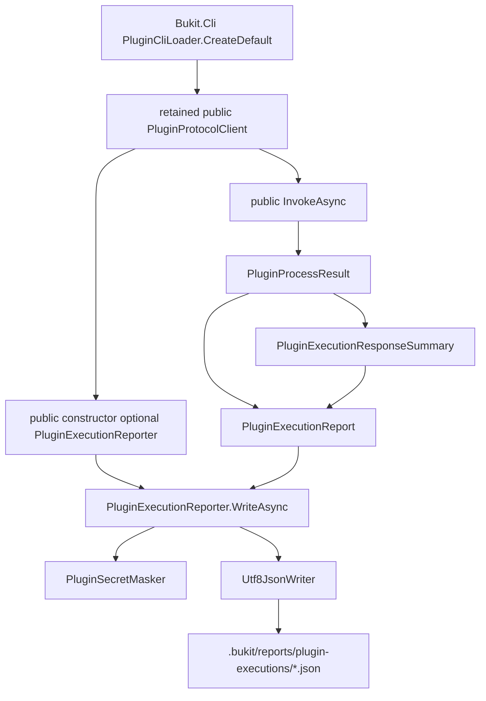

# Bukit Core G-04D2R execution-report contract 决策

日期：2026-07-23

任务：G-04 Group 1 Task 2

基线：`codex/g04-group1-pluginhost-content-a@15f0bd352f3c3b1c9a94e24d8e2885d5b2f428a0`

状态：`group-verification-pending`

Task 7 实施状态：out-of-band v1 schema、golden、独立 validator、public
constructor 传播解除与三个 CLR identity 的原子 internalization 已完成，等待
Group 1 Task 10 统一验证。决策本身及 persisted JSON shape 不变；实施台账见
[G-04D2G execution-report CLR 图处置](bukit-core-g04d2g-execution-report-resolution-2026-07-23.zh-CN.md)。

## 1. 决策摘要

三选一结论为：**versioned supported artifact（版本化、受支持的诊断工件）**。

受支持的产品契约是：

```text
.bukit/reports/plugin-executions/*.json
```

不是以下三个 CLR identity：

- `Bukit.PluginHost.PluginExecutionReport`
- `Bukit.PluginHost.PluginExecutionReporter`
- `Bukit.PluginHost.PluginExecutionResponseSummary`

现有活动文档和运行时共同承诺了 execution report 的生成、目录、字段语义、
secret 脱敏以及不得写入完整 stdout。另一方面，没有活动文档把三个 CLR 类型
承诺为通用 SDK，也没有独立 `Bukit.PluginHost` NuGet SDK 分发证据。因此，
持久化 JSON 契约与 CLR 实现类型必须分开治理：

1. JSON 工件采用独立、out-of-band 的 v1 schema、golden fixture 和 validator；
2. 当前 JSON 不新增 `schemaVersion`，不改变任何现有字节形状；
3. Task 7 先冻结现有 JSON v1，再解除 retained public constructor 的签名传播；
4. 传播解除且验证输入齐备后，三个 CLR 类型作为一个原子图 internalize；
5. 若任何停止条件成立，则保留 CLR public 形状并另立迁移任务，不先收窄。

本 Task 2 只作契约决策，不创建 schema、golden、validator，不修改 writer、
源码访问级别、插件协议或持久化格式。

## 2. 决策边界与 contract owner

| 对象 | 当前 owner | 本任务结论 | 兼容目标 | 后续动作 |
| --- | --- | --- | --- | --- |
| `.bukit/reports/plugin-executions/*.json` | Core `Bukit.PluginHost` | versioned supported artifact | 路径、字段名、类型、null/空集合语义、脱敏和不记录完整 stdout | Task 7 建立 out-of-band v1 contract |
| `PluginExecutionReport` | `Bukit.PluginHost` 实现 | 非 CLR SDK；可 internalize | 不以 record constructor、equality、deconstruction 作为 JSON 契约 | Task 7 与 reporter/summary 原子处理 |
| `PluginExecutionResponseSummary` | `Bukit.PluginHost` 实现 | 非 CLR SDK；可 internalize | 只保留其 persisted `responseSummary` JSON 语义 | Task 7 与 report/reporter 原子处理 |
| `PluginExecutionReporter` | `Bukit.PluginHost` 实现 | 非 CLR SDK；可 internalize | 保持 invoke 自动写报告的入口行为 | Task 7 先解除 public constructor 传播 |

公共 API baseline 将三个类型均标为：

- owner：`External plugin host`
- classification：`implementation-public`
- compatibility：`2.0-candidate`
- migration horizon：`2.0-review`

这与“JSON 工件受支持、CLR identity 不作为 SDK”一致。不得把 JSON 契约的稳定性
错误传导为 CLR record 必须永久 public。

## 3. public / protected 面清单

下列清单以当前
[public API baseline](../governance/bukit-core-public-api-baseline.v1.json)
和
[PluginExecutionReport.cs](../../src/Bukit-Core/Bukit.PluginHost/PluginExecutionReport.cs)、
[PluginExecutionReporter.cs](../../src/Bukit-Core/Bukit.PluginHost/PluginExecutionReporter.cs)
交叉核对。三个类型的 protected members 均为 **0**。

### 3.1 `PluginExecutionReport`

类型：

```text
public sealed record Bukit.PluginHost.PluginExecutionReport
  : System.IEquatable<Bukit.PluginHost.PluginExecutionReport>
```

显式 primary constructor：

```text
public PluginExecutionReport(
  string PluginId,
  string Operation,
  string RequestId,
  int ProcessExitCode,
  bool Success,
  bool TimedOut,
  bool OutputLimitExceeded,
  int StdoutBytes,
  int StderrBytes,
  string Stderr,
  IReadOnlyDictionary<string,string>? Environment = null,
  string? PluginVersion = null,
  string? Protocol = null,
  string? Platform = null,
  string? Command = null,
  IReadOnlyList<string>? CommandPath = null,
  string? Entry = null,
  DateTimeOffset? StartedAt = null,
  long? DurationMs = null,
  int? ResponseExitCode = null,
  bool? Sha256Verified = null,
  PluginPermissionSet? Permissions = null,
  IReadOnlyList<PluginDiagnostic>? Diagnostics = null,
  IReadOnlyList<PluginArtifact>? Artifacts = null,
  PluginExecutionResponseSummary? ResponseSummary = null)
```

public init properties：

```text
PluginId, Operation, RequestId, ProcessExitCode, Success, TimedOut,
OutputLimitExceeded, StdoutBytes, StderrBytes, Stderr, Environment,
PluginVersion, Protocol, Platform, Command, CommandPath, Entry, StartedAt,
DurationMs, ResponseExitCode, Sha256Verified, Permissions, Diagnostics,
Artifacts, ResponseSummary
```

record 另合成 `Clone`、`Deconstruct`、equality operators、typed/object
`Equals`、`GetHashCode` 和 `ToString`。这些成员是当前 CLR public surface，
但不是 persisted JSON v1 的版本模型。

### 3.2 `PluginExecutionReporter`

```text
public sealed class Bukit.PluginHost.PluginExecutionReporter
public PluginExecutionReporter()
public Task<string> WriteAsync(
  string projectRoot,
  PluginExecutionReport report,
  CancellationToken cancellationToken)
```

`WriteAsync` 返回生成的 report path。运行时
`PluginProtocolClient` await 该返回值但不继续公开或消费它。

### 3.3 `PluginExecutionResponseSummary`

```text
public sealed record Bukit.PluginHost.PluginExecutionResponseSummary
  : System.IEquatable<Bukit.PluginHost.PluginExecutionResponseSummary>

public PluginExecutionResponseSummary(
  bool Success,
  int ExitCode,
  IReadOnlyList<string>? DiagnosticCodes = null,
  int ArtifactCount = 0)
```

public init properties 为 `Success`、`ExitCode`、`DiagnosticCodes`、
`ArtifactCount`；record 同样合成 `Clone`、`Deconstruct`、equality operators、
`Equals`、`GetHashCode` 和 `ToString`。

## 4. 构造、返回、序列化和文件写入传播图



精确传播事实：

1. `PluginExecutionReporter` 通过 retained public
   [PluginProtocolClient](../../src/Bukit-Core/Bukit.PluginHost/PluginProtocolClient.cs)
   constructor 的可选参数传播到公共签名；这是当前
   reporter 不能直接 internalize 的生产签名阻断。
2. CLI 只调用两参数形式
   `new PluginProtocolClient(processInvoker, requestIdFactory)`，见
   [PluginCliLoader](../../src/Bukit-Core/Bukit.Cli/Cli/PluginCliLoader.cs)；
   CLI 不直接引用三个候选 CLR identity。
3. `PluginExecutionReport` 只由
   `PluginProtocolClient.WriteExecutionReportAsync` 构造。
4. `PluginExecutionResponseSummary` 只由 private
   `CreateResponseSummary` 构造，并只嵌入 report。
5. 没有 public protocol method 返回 report DTO；`InvokeAsync` 返回的是
   plugin protocol 的 `PluginInvokeResponse`。
6. report 在已取得 `PluginProcessResult` 后的 response parse/validation
   `finally` 中写入。若 process invoker 在返回 result 前直接抛出异常或取消，
   当前路径不会生成 report。
7. project root 取 `ResolvedPlugin.ProjectRoot`，否则只接受存在的 invoke
   `contextRoot`；两者都不可用时不写报告。
8. writer 使用 `File.Create` 和异步 flush。当前没有原子临时文件 rename、
   collision avoidance、rotation 或 cleanup。
9. write/flush 失败当前会向外传播；本任务不把它改成 best effort。

## 5. 当前 JSON v1 兼容目标

Task 7 应把**当前 writer 实际输出**定义为
`plugin-execution-report.v1`，而不是从 CLR record 自动推导一个新 shape。
JSON object 属性顺序不属于兼容目标。

### 5.1 Root shape

| 字段 | 类型 | 当前 null/空集合语义 |
| --- | --- | --- |
| `pluginId` | string | non-null |
| `pluginVersion` | string/null | null 时仍写字段 |
| `operation` | string | non-null |
| `protocol` | string/null | null 时仍写字段 |
| `platform` | string/null | null 时仍写字段 |
| `command` | string/null | null 时仍写字段 |
| `commandPath` | array<string> | CLR null 归一化为 `[]` |
| `entry` | string/null | null 时仍写字段 |
| `startedAt` | ISO 8601 string/null | null 时仍写字段 |
| `durationMs` | integer/null | null 时仍写字段 |
| `requestId` | string | non-null |
| `processExitCode` | integer | non-null |
| `responseExitCode` | integer/null | 无可读 response 时 null |
| `sha256Verified` | boolean/null | 未知时 null |
| `success` | boolean | non-null |
| `timedOut` | boolean | non-null |
| `outputLimitExceeded` | boolean | non-null |
| `stdoutBytes` | integer | non-null；不写 stdout body |
| `stderrBytes` | integer | non-null |
| `stderr` | string | environment values 经文本脱敏 |
| `environment` | object<string,string> | CLR null 归一化为 `{}`；secret-like values 写 `***` |
| `permissions` | object/null | null 时仍写字段 |
| `diagnostics` | array<object> | CLR null 归一化为 `[]` |
| `artifacts` | array<object> | CLR null 归一化为 `[]` |
| `responseSummary` | object/null | 无 response 时 null |

嵌套 shape：

```json
{
  "permissions": {
    "fileSystem": {
      "read": ["string"],
      "write": ["string"]
    },
    "network": false,
    "environment": {
      "read": ["ENV_NAME"]
    }
  },
  "diagnostics": [
    {
      "code": "string",
      "severity": "string",
      "message": "masked string",
      "path": "masked string or null"
    }
  ],
  "artifacts": [
    {
      "type": "string",
      "path": "string",
      "description": "masked string or null"
    }
  ],
  "responseSummary": {
    "success": false,
    "exitCode": 2,
    "diagnosticCodes": ["string"],
    "artifactCount": 1
  }
}
```

### 5.2 安全兼容目标

必须冻结：

- environment 中 secret-like key 的非空 value 写为 `***`；
- stderr、diagnostic message/path、artifact description 不得泄漏已知
  environment value；
- 不持久化完整 stdout，只记录 byte count 和安全 response summary；
- `entry` 不泄漏 project root 的绝对路径；
- report artifact 不因 CLR internalization 而弱化 redaction。

当前未证明且不得在本任务误写为承诺：

- artifact `path`、permission path 等全部字段都经过通用 secret masker；
- masker 能发现任意 credential；
- report write 是原子操作；
- report 一定永久保留；
- 所有 process launch/cancellation failure 都会生成报告。

## 6. 活动文档承诺与保留期限

活动材料共同形成以下产品承诺：

| 维度 | 当前证据 | 决策 |
| --- | --- | --- |
| 生成 | [插件协议 v1](../plugins/Bukit%20插件协议%20v1%20规范.md) 与 [安全模型 ADR](../plugins/Bukit%20插件安全模型%20ADR.md) 使用“必须” | 受支持 |
| 目录 | 多份活动文档固定 `.bukit/reports/plugin-executions/` | 受支持 |
| 文件名语义 | 协议/ADR 为 `<plugin-id>-<operation>-<timestamp>.json` | 以更精确规范和实现为准；Task 7 收敛旧示例 |
| 最低字段 | 协议、ADR、[发布准入](../plugins/Bukit%20Labs%20%E2%86%92%20Plugin%20%E2%86%92%20Core%20发布准入规范.md) 均列出 | 受支持 |
| secret redaction | 协议、ADR、[插件配置规范](../plugins/Bukit%20插件配置规范.md) 均明确 | 受支持 |
| 完整 stdout | 发布准入明确禁止 | 受支持 |
| CI consumption | 安全 ADR 要求作为 artifact 或测试报告 | 受支持 |
| schema/version | 当前无独立 report schema 或 in-band version | Task 7 建立 out-of-band v1 |
| retention period | 当前无天数、max-files、rotation 或 cleanup 承诺 | 不承诺永久保留 |
| CLR identity | 活动插件文档未点名三个候选类型 | 不属于 SDK 承诺 |

保留期限的准确表述应为：Host 当前没有自动删除实现，但不承诺永久保留；需要长期
审计的消费者应自行复制或归档。引入 rotation、cleanup 或 retention SLA 是独立
产品行为变更，不属于 G-04 CLR public-surface 治理。

## 7. 外部消费者证据与限制

截至本决策日期：

- 历史认证搜索对三个 full name 未发现外部直接 CLR consumer；
- `PluginExecutionReport` simple-name 命中为其他语言/项目的词法碰撞；
- 已知 SRBiz-bukit、sitegen、ALi365WebSiteBuilder 是 CLI/config/theme/process
  consumer，未观察到三个候选的直接 CLR reference；
- 仓内跨程序集生产代码未直接引用三个候选名称；
- 没有独立 `Bukit.PluginHost` NuGet package 分发证据；
- 本轮公开 Web 搜索未发现外部 exact match 或公开 report parser。

证据硬边界：

- 当前环境没有可用的认证 GitHub Code Search，本轮不能把公开 Web 零结果写成
  “全部公开代码零消费者”；
- private、未索引、未声明消费者不可观测；
- 历史消费者声明窗口不能证明未来不会出现新证据；
- JSON parser 证据与 CLR consumer 证据必须分开判断：前者会提高 schema
  compatibility 要求，但不自动要求三个 CLR 类型保持 public。

若 Task 7 前出现直接 CLR、reflection、serializer metadata 或二进制消费证据，
必须触发停止条件并重新评估 obsolete window、facade 或 retention 方案。

## 8. Native AOT、serializer 与 reflection 可达性

- [Bukit.Cli.csproj](../../src/Bukit-Core/Bukit.Cli/Bukit.Cli.csproj)
  设置 `PublishAot=true`；
- CLI 静态构造 `PluginProtocolClient`；
- `InvokeAsync` 静态到达 report construction 和 writer；
- reporter 使用 `Utf8JsonWriter` 逐字段写入；
- 三个候选未列入
  [PluginJsonSerializerContext](../../src/Bukit-Core/Bukit.Plugin.Abstractions/PluginJsonSerializerContext.cs)
  的
  `[JsonSerializable]` source-generated metadata；
- 未发现按候选 full name 执行的 `Type.GetType`、`Activator.CreateInstance`、
  `GetExportedTypes` runtime registration、`DynamicDependency` 或
  `DynamicallyAccessedMembers`；
- 已完成的 D2B2 证明 published Native AOT CLI 可通过真实 process-plugin invoke
  生成 execution report；本 Task 2 不重跑该证明。

因此 CLR internalization 不会切断当前静态 writer reachability。Task 10 应验证的
不是候选 public metadata 仍存在，而是 published Native AOT CLI 在成功和可读失败
路径仍生成符合 v1 契约的 JSON。

## 9. 版本策略

### 9.1 v1 标识

Task 7 使用独立文件标识 v1：

```text
docs/schemas/plugin-execution-report.v1.schema.json
```

并配套 canonical golden fixture 和 validator。当前 JSON 中不加入
`schema`/`schemaVersion` 字段，因为这会改变 persisted format，超出本治理任务。

### 9.2 Breaking change

以下变化需要新的 major schema 和独立产品契约任务：

- 删除或重命名字段；
- 改变 JSON 类型、nullability、nesting 或字段语义；
- 弱化 secret redaction；
- 改变固定目录或“不写完整 stdout”规则；
- 使既有成功/可读失败路径不再生成报告。

### 9.3 Additive change

在明确旧消费者是否必须忽略 unknown properties 前，不假设 optional field 可以
自由增加。任何 additive field 都必须先更新 schema policy、golden 和 consumer
兼容说明。

### 9.4 非 schema 行为

retention/rotation、collision 处理、原子写、partial-file 恢复以及 write-failure
policy 都是产品行为，不得借 CLR internalization 顺带修改。

CLR visibility/identity 与 persisted schema 版本分别治理。将三个类型收窄为
internal 是 2.0 CLR public-surface change，不是 JSON schema major change。

## 10. Task 7 精确实施顺序

Task 7（G-04D2G）必须按以下顺序执行，不能先 internalize 再补契约：

1. **冻结现有 JSON v1，writer 零变化。**
   - 新建 out-of-band v1 schema；
   - 新建完整报告及 response-null/default 的 canonical golden fixtures；
   - validator 固定字段、类型、null/空集合、嵌套、no-full-stdout 和 redaction；
   - 按 JSON object 语义验证，不把 property order 写成契约；
   - 明确当前没有 in-band `schemaVersion`。
2. **收敛活动文档。**
   - 统一 filename 为当前
     `<plugin-id>-<operation>-<timestamp>.json`；
   - 写清只有取得 process result 且 project root 可解析的 invoke 路径生成报告；
   - 写清当前没有 retention SLA 或自动 cleanup；
   - 不改变 plugin protocol DTO 或 report bytes。
3. **解除 retained public signature 传播。**
   - public `PluginProtocolClient` 不再暴露
     `PluginExecutionReporter` 参数；
   - 需要注入 reporter 的 composition seam 采用 Task 3 批准的 internal
     constructor/factory；
   - CLI 默认构造与运行行为保持不变；
   - 不向无关生产 assembly 扩大 `InternalsVisibleTo`。
4. **迁移测试 ownership。**
   - 实际 owner test 是
     [PluginLockAndReportTests.cs](../../tests/Bukit.PluginHost.Tests/PluginLockAndReportTests.cs)，
     不是总计划中
     不存在的 `PluginExecutionReporterTests.cs`；
   - 以 public `InvokeAsync` → persisted JSON 为主要 contract fixture；
   - direct writer test 仅在确有必要时使用精准 test-only seam；
   - 覆盖 success、readable response failure、malformed response、
     response validation failure、redaction、path 和 Native AOT。
5. **三个 CLR 类型原子 internalize。**
   - 同一原子图处理 `PluginExecutionReport`、
     `PluginExecutionReporter` 和 `PluginExecutionResponseSummary`；
   - 不提交 public member 引用 internal parameter 的中间态；
   - 更新 current baseline、architecture assertion 和 D2G ledger；
   - 历史 closed candidate manifest 保持不变。
6. **留待 Group 1 Task 10 统一验证。**
   - Task 7 标记 `group-verification-pending`；
   - 不在 Task 7 单独运行 focused/targeted gate、AOT 或复审。

总计划的测试文件路径漂移应在 Task 7 工作说明中以
`PluginLockAndReportTests.cs` 为准；不得为了匹配计划中的旧文件名创建一个重复测试
文件。

## 11. Task 10 统一验证输入

本任务仅建立检查输入，未执行：

- full-shape golden JSON 与 v1 schema validation；
- JSON property-order independence；
- nullable/default report；
- success、readable failure、malformed JSON 和 response validation failure；
- full stdout absent；
- stderr/environment/diagnostic/path/artifact-description 中已知 secret absent；
- project root absolute path absent；
- report directory 与 filename semantics；
- published Native AOT CLI real process-plugin success/failure report；
- compiled `Bukit.PluginHost` 不再 export 三个 CLR 类型；
- public `PluginProtocolClient` signature 不再传播 reporter；
- current baseline 计数正确；
- historical 136-entry manifest blob 不变。

上述集合只在 Group 1 Task 10 统一执行。当前状态保持
`group-verification-pending`，不能提前宣称 gate 或 AOT 通过。

## 12. 风险与停止条件

### 12.1 已知风险

1. 活动插件材料仍有“设计稿”或 `Proposed` 状态，但其规范性措辞、运行时实现和
   测试已形成足够强的 artifact 承诺；
2. 当前没有 schema、golden 或独立 validator；
3. 当前没有 retention policy；
4. current writer 可能发生同 plugin/operation/毫秒文件名 collision；
5. cancellation 可能留下已创建但未完整 flush 的文件；
6. report write failure 可能覆盖原 protocol failure；
7. 当前 redaction 并不覆盖所有 string/path field；
8. 本轮无认证 GitHub Code Search，私有 consumer 未知；
9. 当前 direct writer test 不是完整 JSON contract test；
10. Task 3 若不能提供安全 construction seam，三个类型仍受 public signature
    阻断。

### 12.2 必须停止并升级的条件

出现以下任一条件时，Task 7 不得继续 internalize：

- 发现可验证的外部直接 CLR、reflection 或 serializer metadata consumer；
- schema/golden 无法描述现有 writer 而必须先改 persisted bytes；
- Task 3 未解除 `PluginProtocolClient` public constructor 传播；
- 为了测试必须向生产 assembly 扩大 friend access；
- 方案要求改变插件协议、配置 schema、路径所有权、权限语义或 secret policy；
- Native AOT 静态 writer reachability 无法保留；
- 三个类型不能作为原子图收口而会产生 public-to-internal 签名非法状态；
- Task 10 无法验证 current artifact semantics 或 historical manifest 发生变化。

这些情况必须形成独立兼容/产品契约任务。禁止通过顺带修改 writer、弱化验证或扩大
public facade 规避停止条件。

## 13. 决策关闭条件

本 Task 2 的决策已完成，但实现关闭必须等到：

1. Task 3 construction-boundary 设计获确认；
2. Task 7 按本报告顺序完成 schema/golden/validator、签名传播解除和原子
   internalization；
3. Group 1 Task 10 的统一测试、targeted gate 和 Native AOT/process proof 通过；
4. Group 1 独立只读复审没有未解决的 Critical/High finding；
5. current baseline 与历史 manifest 约束均满足。

在这些条件满足前，本报告只代表明确的 contract owner 和迁移方向，状态保持
`group-verification-pending`。

## 14. 本任务验证边界

本任务只创建本决策文档。未修改 schema、writer、源码、测试、baseline、插件协议
或持久化格式；未运行测试、focused/targeted gate、Native AOT、full/release gate
或独立复审。
