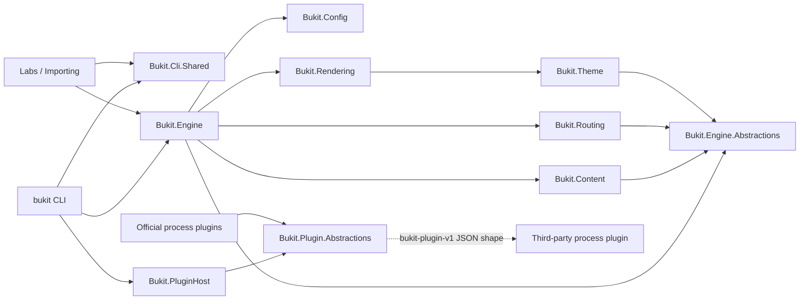

# Bukit Core G-01 公共 API 清单与兼容性基线审计

日期：2026-07-20

源码基线：`main@19058ce2c7ae9f8356bb795ac2cfff38185315d8`

审计范围：`src/Bukit-Core/` 的 12 个 Release 程序集、当前 Core/Labs/官方插件/测试项目引用、现行公开文档与契约文件

机器清单：[bukit-core-public-api-inventory-2026-07-20.json](bukit-core-public-api-inventory-2026-07-20.json)

## 1. 执行结论

G-01 已建立首份可逐类型追溯的 Bukit Core CLR 公共面基线。结论不是“Core 已有 472 个受支持 SDK 类型”，而是：

- 12 个 Core 程序集当前导出 **472 个 CLR 类型**，合计 **3,898 个 declared public members** 和 **52 个 declared protected members**；472/472 均映射到当前源码，程序集加载错误为 0。
- 当前仓库没有 NuGet SDK 发布流程、包标识、第三方 CLR SDK 安装说明或“所有 public 类型受 SemVer 保护”的政策证据。因此正式受支持的通用 CLR SDK 类型数应记为 **0**，不能把 C# `public` 自动解释为产品承诺。
- 仓库确实有稳定外部契约：CLI 行为、`site.yaml`/`theme.yaml`、模板对象、公开报告 schema 和 `bukit-plugin-v1` 进程协议。它们分别属于行为、序列化形状或 wire contract，不等同于 CLR SDK。
- **115 个类型**直接承载 1.x 稳定形状：23 个 process wire/dual-use DTO，6 个插件 YAML-only DTO，82 个配置、主题清单与 Scriban 模型类型，以及 4 个 `build-report.v1` 公共报告 CLR mirror。
- **175 个类型**在 1.x 不应收窄：170 个有直接项目引用消费者中的词法协作证据，另有 2 个由 G-04A Roslyn semantic analysis 确认的跨程序集协作类型和 3 个 AOT/静态序列化支持类型。这里的“不收窄”是当前构建兼容要求，不是对第三方宣布 SDK。
- **176 个类型**属于 implementation-public；其中 136 个是 2.0 复核候选，40 个来自 CLI 可执行程序集、标为 `not-a-clr-contract`。没有跨项目消费者证据只说明“尚未证明跨项目使用”，不构成删除证据。
- **G-04A 语义纠正：** 原清单对 4 个 `BuildResult` 公共报告镜像漏计 `build-report.v1` 冻结 schema 证据，并对 2 个 Theme 类型漏计 Engine 的生产程序集协作；本次只纠正这 6 项治理元数据和汇总，不改变 CLR 可见性、签名、运行时或既有 G-03 发现记录。
- 6 个类型属于内部持久化格式：3 个增量 build cache model 与 3 个 Labs theme catalog cache model。它们不是公开 report schema DTO，变更时仍需 cache 迁移/失效策略。

对原审计 `AD-04` 的判定为：**保持确认，但结论已收窄并量化。** 问题不只是“类型数量多”，而是公共可见性、仓库内跨程序集协作、序列化需要、AOT 需要和对外支持承诺尚未形成统一的可执行治理。当前不需要整体重构，也不应在 1.x 批量改成 `internal`；应先建立非破坏性的 API drift 治理，再把收窄工作留给证据充分的 2.0 批次。

## 2. 审计边界与方法

### 2.1 权威来源

本次按以下优先级取证：

1. 12 个 `net10.0` Release 程序集的 `Assembly.GetExportedTypes()`；
2. 当前 C# 源码与 `.csproj` 项目引用，包括 linked `Compile`；
3. Core、Labs、官方插件和测试中的仓库内标识符证据；
4. 当前 [Architecture](../../guide/dev/architecture.md)、[Plugin Host Boundary](../../guide/dev/plugins.md)、[Documentation Governance](../../guide/dev/documentation-governance.md)、[1.0 契约矩阵](../bukit-1.0-contract-matrix.zh-CN.md)和[兼容性治理](../compatibility-governance.zh-CN.md)；
5. `docs/analysis/`、`docs/superpowers/`、`guide/archive/` 及 backup 目录只作历史背景，不驱动当前分类。

基线构建命令：

```bash
dotnet build bukit-core.slnx -c Release --nologo
```

结果为 12/12 项目成功、0 warning、0 error。临时审计器使用反射枚举导出类型，并用 Roslyn 语法树映射源码位置。成员数仅统计类型自身声明的 public/protected 构造、方法、属性、字段和事件，不包含继承成员，也不等于独立方法签名 baseline。

### 2.2 证据限制

- 仓库内消费者扫描是词法和项目引用证据，不是完整 Roslyn symbol graph；因此跨程序集分类统一标为中等置信度，任何访问级别收窄前都必须再做语义调用图验证。
- 本次没有检索私有仓库、未公开插件、用户自建程序集或反射调用；“仓库内零命中”不能推出“外部零消费者”。
- 本次清点的是 CLR 导出类型。CLI 参数、exit code、YAML key、JSON property、Scriban property 和协议字段仍由各自 schema/契约测试治理，不应由 CLR 类型数替代。
- 本任务只新增审计文档和机器清单，没有修改访问级别、schema、插件协议、项目引用、持久化格式或运行时行为。

## 3. 依赖与契约边界



边界解释：

- `Bukit.Engine.Abstractions.Plugins` 是 Core 内部扩展点；当前文档明确禁止把它与外部进程插件协议合并描述成一个 SDK。
- `Bukit.Plugin.Abstractions` 的 DTO 是官方插件复用实现，但第三方插件只需实现 JSON 协议，不需要引用 Bukit 程序集。稳定承诺落在 wire shape。
- `Bukit.Config` 和 `Bukit.Theme` 的 CLR models 是严格 YAML/schema 链的一部分；兼容性重点是字段名、默认值、验证语义和序列化形状。
- `Bukit.Rendering` 的 18 个 models 是模板可见对象；它们的 Scriban 属性兼容性比 CLR 二进制兼容性更重要。

## 4. 程序集清单

| 程序集 | 导出类型 | public members | protected members | 主分类分布 |
|---|---:|---:|---:|---|
| `Bukit.Cli.Shared` | 20 | 173 | 14 | 跨程序集 15；实现层 5 |
| `Bukit.Config` | 60 | 773 | 0 | 配置形状 49；跨程序集 11 |
| `Bukit.Content` | 51 | 211 | 0 | 跨程序集 16；实现层 35 |
| `Bukit.Engine` | 80 | 523 | 11 | 跨程序集 16；序列化形状 4；实现层 57；内部持久化 3 |
| `Bukit.Engine.Abstractions` | 50 | 604 | 0 | 跨程序集 50 |
| `Bukit.Plugin.Abstractions` | 30 | 438 | 1 | wire/dual-use 23；YAML-only 6；AOT 1 |
| `Bukit.PluginHost` | 40 | 250 | 0 | 跨程序集 24；实现层 16 |
| `Bukit.Rendering` | 22 | 269 | 0 | 模板形状 18；跨程序集 2；实现层 2 |
| `Bukit.Routing` | 6 | 37 | 0 | 跨程序集 5；实现层 1 |
| `Bukit.Shared` | 39 | 291 | 26 | 跨程序集 22；实现层 17 |
| `Bukit.Theme` | 34 | 190 | 0 | 序列化形状 15；跨程序集 11；内部持久化 3；AOT 2；实现层 3 |
| `bukit` | 40 | 139 | 0 | CLI 实现层 40 |
| **合计** | **472** | **3,898** | **52** | — |

类型集中度最高的 namespace 是 `Bukit.Config`（60）、`Bukit.Engine`（48）、`Bukit.PluginHost`（40）、`Bukit.Engine.Abstractions.Content`（38）、`Bukit.Theme`（34）和 `Bukit.Content.Notion.BlockRenderers`（23）。高数量本身不是重构理由，但与跨程序集耦合、序列化形状或 protected 扩展面叠加时，会提高变更审查成本。

## 5. 分类与兼容性口径

| 主分类 | 数量 | 本次定义 | 1.x 处理 |
|---|---:|---|---|
| `supported-sdk` | 0 | 有明确第三方 CLR 安装、分发和 SemVer 支持承诺 | 当前不存在，不应事后推定 |
| `plugin-wire-contract` | 23 | `bukit-plugin-v1` protocol/runtime/security/result DTO、常量，以及同时进入 manifest response 的 3 个 command metadata DTO | 保持 JSON 字段和语义；CLR assembly 不升级为 SDK 承诺 |
| `serialized-contract` | 92 | `site.yaml`、`theme.yaml`、插件 YAML-only DTO、Scriban 可见模型或 `build-report.v1` 公共报告的 CLR mirror | 维持 shape；breaking change 走 schema/major 策略 |
| `aot-serialization-surface` | 3 | 当前 source-generated serializer/AOT 构建需要的 public 类型 | 1.x 不收窄，修改须做真实 AOT 验证 |
| `cross-assembly-implementation` | 172 | 170 项在直接引用 owner 项目的仓库内程序集存在词法协作证据；G-04A 的 2 项 Theme 类型由 Roslyn semantic analysis 确认跨程序集协作 | 1.x 不收窄；2.0 前先做 semantic symbol 验证、拆调用和 owner |
| `implementation-public` | 176 | 未证明跨项目消费，也没有正式外部支持证据 | 仅列 2.0 候选；不得据此直接删除 |
| `persisted-internal-format` | 6 | `.cache/build-manifest*.json` 与 Labs `.cache/theme-catalog.json` 的内部持久化 model | 变更须迁移或安全失效 cache，不冒充公开 report schema |
| `documented-cli-contract` | 0 个 CLR 类型 | CLI 契约存在，但由命令、参数、exit code 和 JSON error shape 表达 | 继续用 CLI spec/schema/tests 治理 |

兼容性汇总：

| 等级 | 数量 | 含义 |
|---|---:|---|
| `1.x-shape-stable` | 115 | wire/配置/主题/模板/build-report 形状在 1.x 保持兼容 |
| `1.x-do-not-narrow` | 175 | 当前跨程序集或 AOT 构建依赖 public；1.x 不改可见性 |
| `1.x-migration-safe` | 6 | 内部持久化格式可演进，但必须可迁移或安全失效 |
| `2.0-candidate` | 136 | 非 CLI 的 implementation-public，待外部消费者与反射/AOT复核 |
| `not-a-clr-contract` | 40 | 可执行程序集实现类型，不构成受支持的 CLR 调用契约 |

## 6. 正式契约盘点

### 6.1 外部插件协议

[Plugin Host Boundary](../../guide/dev/plugins.md) 将 Core 内部插件接口和外部 process protocol 分开；[插件协议 v1 规范](../plugins/Bukit%20插件协议%20v1%20规范.md)也明确第三方插件不必引用 Bukit 程序集。该长规范页仍标为“设计稿”，所以本审计只用它补充字段说明，协议已实现的判断以当前 guide、代码和架构测试为准。`Bukit.Plugin.Abstractions` 中 17 个纯 wire DTO/常量、6 个同时出现在 `plugin.yaml` 与 manifest response 的 command/permission metadata DTO，以及 `PluginJsonSerializerContext` 构成当前 process protocol/AOT 代码镜像；另 6 个类型只承载 `.bukit/plugins.yaml` 或 `plugin.yaml` 的配置形状，不能统称为进程 wire。

因此应同时坚持两条规则：

1. `bukit-plugin-v1` 的 JSON 字段、envelope、handshake、manifest、permission、diagnostic 和 artifact 语义受 1.x 兼容约束；
2. 不承诺 `Bukit.Plugin.Abstractions.dll` 是已发布的第三方 NuGet SDK，也不承诺其全部 CLR constructor/member 形状独立稳定。

### 6.2 配置、主题与模板

- `Bukit.Config` 中 49 个 `AppConfig.cs`/`DeployConfig.cs` 类型映射 `site.yaml` 的严格字段、默认值和 schema 链；用户契约由 [site.yaml 文档](../../guide/user/04-site-yaml-config.md)与 schema/validator 决定。
- `Bukit.Theme` 中 15 个 manifest/section model 以及 2 个 AOT support 类型服务 `theme.yaml`、主题定义和静态反序列化；不能为了缩小 API 数量破坏 Native AOT。另有 3 个 theme catalog model 只服务 Labs cache，不升级为 Core 稳定形状。
- `Bukit.Rendering` 中 18 个 model 是 Scriban 可见对象。即使将来 CLR type 被 facade 包装，模板属性名与可空语义仍须按模板契约迁移。

### 6.3 CLI 与公开报告

README 和 [CLI 开发文档](../../guide/dev/cli.md)承诺的是稳定命令面、参数和 exit code；CLI JSON error 及 build/routes/assets/incremental/security/SEO/publish 报告由 `docs/schemas/` 与对应 contract tests 治理。Engine 中多数 report DTO 已经是 `internal`，这反向证明公开 JSON schema 与 public CLR type 是两条不同的兼容轴。

### 6.4 内部 cache

`Bukit.Engine.Incremental.BuildManifest`、`BuildManifestEntry`、`PluginOutputManifestEntry` 写入 `.cache/build-manifest*.json`；`ThemeCatalog` 及两个 entry 类型写入 Labs `.cache/theme-catalog.json`。前一组不是公开 `.bukit/incremental-manifest.json` 的 DTO，后一组也没有 Core report/schema 承诺。后续可以在非 breaking 产品版本中演进内部 cache，但必须提供版本识别、迁移或确定性失效，不能让旧 cache 被错误解释。

## 7. Findings

### G01-F01 高：`public` 与“受支持 CLR SDK”缺少正式分界

**证据：** 472 个导出类型遍布 12 个程序集，但仓库没有 SDK `PackageId`、`dotnet pack`/NuGet 发布链、第三方安装示例或 CLR compatibility policy；正式 release 流程发布的是 Native AOT CLI archive。现行 [Documentation Governance](../../guide/dev/documentation-governance.md)定义的 public surface 是 command、config、template object、report 与 plugin boundary，也没有把所有 public CLR type 纳入承诺。

**影响：** 维护者可能把实现层 public 当成永久 ABI，或反过来在 patch 版本误收窄真实跨程序集/AOT surface。两种误解都会增加兼容风险。

**处置：** 1.x 只增加治理声明和 drift 检查，不改访问级别；任何未来 CLR SDK 必须有独立 package、allowlist、版本和支持政策。

### G01-F02 高：176 个 implementation-public 类型形成 2.0 收窄候选池

**证据：** 176 个类型没有已证明的跨项目非测试消费者；热点包括 `Bukit.Content.Notion.BlockRenderers`、CLI docs-check 实现、PluginHost helpers 和 Shared Notion models。它们仍可能在所属程序集内部使用，也可能被未扫描的外部代码或反射使用。

**影响：** 继续新增同类类型会扩大变更审查面；直接批量 internalize 又会制造未知 breaking change。

**处置：** 1.x 冻结“不得无评审新增 public implementation type”；2.0 按 owner 小批处理，每批先做 semantic call graph、反射/AOT/serializer 检查和真实构建，再决定 internal、facade、contracts assembly 或保留。

### G01-F03 高：172 个类型的 public 可见性承担仓库内模块协作

**证据：** `Bukit.Engine.Abstractions` 的 50 个导出类型全部在直接引用该项目的程序集内获得词法协作命中；Config、PluginHost、Shared、Content、Engine 也存在大批同类 surface。当前 `.csproj` 图没有循环，但 public 是跨 assembly 可见性的主要工具。词法命中只支持 1.x 的保守“不收窄”判定，2.0 真正变更前仍须用 semantic symbol graph 确认。

**影响：** 在没有替代 boundary 前缩小可见性会直接破坏 Core、Labs 或官方插件编译；反之把这些类型宣传成 SDK 会把内部结构冻结为产品承诺。

**处置：** 1.x 标为 `do-not-narrow`；2.0 只有在调用迁移完成后，才评估 `InternalsVisibleTo`、窄 facade 或 contracts assembly。不要仅为了“架构纯洁”整体搬迁。

### G01-F04 中：19 个类型暴露 52 个 protected members

**证据：** protected surface 集中于 `TemplateRendererBase`、CLI parser/result/error payload、`PluginJsonSerializerContext` 和 Shared Notion block 继承树。

**影响：** protected member 可能形成派生类扩展点；即使类型从未被正式声明为 SDK，修改 virtual/protected constructor/member 仍比普通 implementation-public 更易产生源兼容或运行时问题。

**处置：** 1.x 不收窄。2.0 对每个继承树分别判断“真实扩展点、record 生成构造、serializer 要求或纯实现泄漏”，禁止用统一规则机械处理。

### G01-F05 中：3 个 AOT support 类型不能按“实现细节”直接 internalize

**证据：** `PluginJsonSerializerContext`、`ThemeManifestYamlStaticContext`、`StaticTypeInspector` 的 public 可见性与当前 source-generated serializer/AOT 构造相关；此前可复现构建修复也明确保留了 Theme static context 的 public 行为。

**影响：** 单纯缩小访问级别可能在普通 JIT tests 通过时破坏 Native AOT publish 或静态 serializer 行为。

**处置：** 保留 1.x；未来调整必须以真实 RID Native AOT publish、静态序列化 round-trip 和 generated source drift 为验收条件。

### G01-F06 中：契约矩阵存在“Source-generated plugin SDK”漂移

**证据：** 当前 [1.0 契约矩阵](../bukit-1.0-contract-matrix.zh-CN.md)列出 `Source-generated plugin SDK` 和 `PluginSourceGenerator` 测试，但当前项目、源码和测试树中不存在该 SDK/source-generator 项目；同时 README 将更完整的 external plugin ecosystem/marketplace 放在 future 范围。

**影响：** 该行可能被误读成“已经发布 CLR SDK”，与真实的 process JSON protocol 边界冲突。

**处置：** 后续独立文档任务应把该行标为未实现/未来能力，或用现有 protocol DTO/AOT context 的准确名称替换；G-01 不改活动契约文档。

### G01-F07 中：内部 cache model 容易被误判为稳定产品契约

**证据：** 3 个 public `BuildManifest*` 类型服务 `.cache/build-manifest*.json`，另 3 个 `ThemeCatalog*` 类型服务 Labs `.cache/theme-catalog.json`；公开 `.bukit/incremental-manifest.json` 由独立 reporter/schema 产生，theme catalog 没有 Core schema 承诺。

**影响：** 若把内部 cache shape 误判为 GA 产品 schema，会不必要地冻结实现；若忽略其持久化属性，又可能读取旧 cache 得到错误增量或 Labs tooling 结果。

**处置：** 分类为 `persisted-internal-format`；未来变更要求 cache version/migration/invalidation，但不需要冒充公开 CLR/API 承诺。

## 8. AD-04 复核

原报告估计“约 449 个 public 类型”。本次 Release assembly 事实值是 472，差异来自后续代码演进和以编译结果而非文本搜索为准。AD-04 的关键判断仍成立，但应重写为：

> Core 存在较大的 exported CLR surface，而当前正式稳定承诺主要落在 CLI、配置、主题/模板、报告和 process plugin wire contract。多数 CLR public 是仓库内协作或实现可见性。缺陷是支持等级不清和缺少 drift 基线，不是“472 个类型都必须立即 internalize”。

本次未发现导出类型在两个程序集拥有相同 CLR full name。CLI linked compile 的 Engine 源文件当前类型为 internal，因此 AD-02 仍是同源重复编译债务，但不是本次 exported API identity 冲突。

## 9. 受控路线图

### 1.x：只做非破坏性治理

1. 将本清单作为 baseline，后续 public type 增删必须分类 owner、兼容轴和原因。
2. 在活动治理文档明确：“public CLR ≠ supported SDK”；分别链接 CLI、config/theme、report 和 process protocol 契约。
3. 修正 `Source-generated plugin SDK` 文档漂移，不改变 `bukit-plugin-v1`。
4. 增加只读 API drift gate：检测新增/删除导出类型、protected surface 和稳定 shape family 的变化；先要求人工批准，不自动阻断合法 additive change。
5. 1.x 禁止批量修改访问级别；AOT、wire、serialized、cross-assembly 类型全部保留。

### 2.0：按 owner 小批收窄

建议批次顺序：

1. `bukit` 与 CLI docs-check/help/deploy 实现；
2. Content Notion block renderers 与 PluginHost helpers；
3. Shared Notion models，结合领域归属迁移；
4. Engine implementation-public 与 protected `TemplateRendererBase`；
5. 最后处理跨程序集 surface，并只在 facade/contracts 替代完成后收窄。

每批验收必须包含：仓库内 semantic symbol graph、反射/serializer/AOT 检查、Core+Labs+官方插件编译、相关 targeted gate、迁移说明和独立只读复审。不得一次提交 472 类型的机械访问级别改写。

## 10. 下一项建议

建议下一项独立任务设为 **G-02：公共面 drift governance**，范围只包括：

- 把“CLR public 不自动等于 supported SDK”提升到活动兼容治理文档；
- 修正 `Source-generated plugin SDK` 漂移；
- 设计并实现从 Release assemblies 对比 allowlisted baseline 的只读门禁；
- 对 additive、removal、protected change、wire/serialized family 分别给出不同审批结果。

G-02 仍不应修改任何访问级别。只有 drift governance 稳定运行且外部消费者调查完成后，才能启动首个 2.0 API 收窄批次。

## 11. 验证状态

| 检查 | 结果 |
|---|---|
| Core Release build | 12/12 成功；0 warning；0 error |
| Reflection load | 472 exported types；0 load errors |
| Source reconciliation | 472/472 mapped；无 generated/unmapped exported type |
| Mandatory classification | 472/472 均有 owner、classification、contract surface、compatibility、migration horizon、confidence、basis |
| Aggregate reconciliation | assembly/type/member/classification totals 一致 |
| Runtime/API/schema change | 0；本任务仅新增计划、JSON 清单和审计报告 |

最终 docs gate、确定性重提取、占位符/绝对路径检查、`git diff --check` 与独立只读复审在本报告提交前执行；若复审发现分类或证据错误，必须先更正并重跑对应验证。
