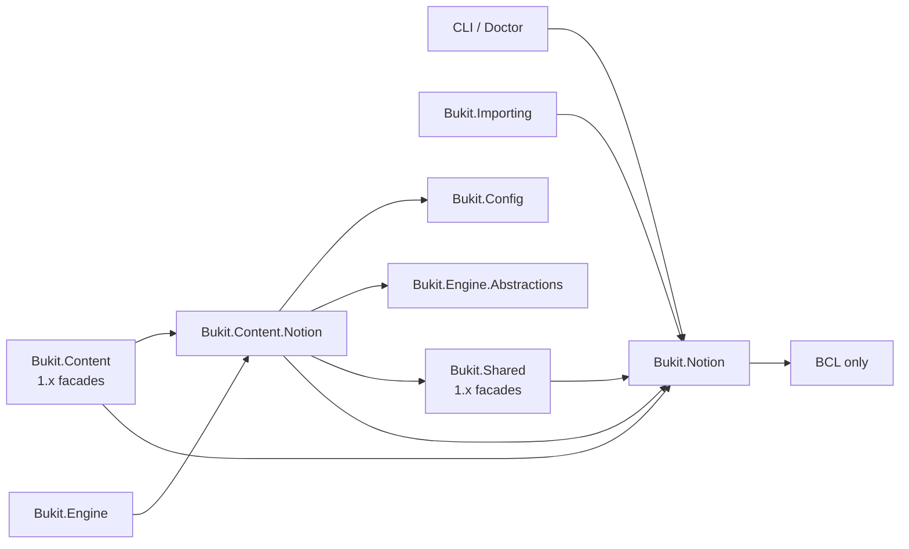

# Bukit Notion 两层拆分迁移与受控修复复核报告

日期：2026-07-22

基线：`main@b8bc7059fa9f1040d71e12cac1697c8cecac741a`

实施分支：`codex/notion-two-layer-migration`

范围：N-01～N-07；不修改配置 schema、插件协议、Notion API 版本、内容投影契约或缓存格式。

## 1. 结论

AD-03 的根因不是“Notion 代码数量多”，而是底层 `Bukit.Shared` 同时承担 Notion block 模型、HTML 转换、HTTP 端点以及上层内容集成职责。此次迁移采用两层单仓结构：

- `Bukit.Notion`：BCL-only 的独立 Notion 协议、传输、诊断、转换、渲染与写入库，不引用 Bukit 内容模型。
- `Bukit.Content.Notion`：面向 Bukit Core 的内容源适配层，负责把 Notion 数据投影为现有 Core 内容契约。
- `Bukit.Shared` 与 `Bukit.Content`：保留 1.x 原命名空间和原程序集身份的薄兼容层，避免程序集搬迁造成二进制断裂。

该方案消除了新代码继续堆入 Shared 的结构性原因，也没有为了“纯粹分层”一次性破坏 1.x 公共面。AD-03 的 1.x 治理目标可以关闭；兼容层的最终移除属于 2.0 候选，不应在 1.x 中继续收窄。



## 2. N-01～N-07 实施结果

| 阶段 | 结果 | 主要边界 |
|---|---|---|
| N-01 | 完成 | block primitives、HTML tokenizer/converter、block JSON writer 进入 `Bukit.Notion`；Shared 保留兼容入口。 |
| N-02 | 完成 | 统一 `NotionClient`、请求头、重试语义、限流、异常脱敏和 `HttpClient` 所有权。 |
| N-03 | 完成 | Doctor/health 请求统一使用 `Bukit.Notion.Diagnostics`。 |
| N-04 | 完成 | Importing 写请求统一使用 `Bukit.Notion.Write`；读取和写入语义显式区分。 |
| N-05 | 完成 | Notion HTML 渲染、renderer registry、颜色策略进入 `Bukit.Notion.Rendering`；Wechat 重复颜色实现删除。 |
| N-06 | 完成 | `NotionContentSource` 和内容投影实现进入 `Bukit.Content.Notion`；Content 旧 provider/parser 保留薄 facade；Engine 低层查询改用 adapter。 |
| N-07 | 完成 | 新程序集纳入公共面、schema、覆盖率与架构治理；补充 1.x 源码/程序集身份、HTTP 所有权和 AOT 防回归。 |

对应实施提交：

- `e5c0d908` N-01 conversion primitives
- `df6ca597` N-02 HTTP transport
- `955cea7d` N-03 doctor diagnostics
- `6020b4b1` N-04 write operations
- `1f27e803` N-05 rendering
- `bf034305` N-06 content adapter

N-07 与本报告在最终提交中共同落地。

## 3. 依赖与职责复核

### 3.1 `Bukit.Notion`

- 无 `ProjectReference`，无 `PackageReference`。
- 只承载 Notion 通用协议能力，不出现 `ContentDocument`、`RawContentLoadResult`、Engine 或插件类型。
- Token 与 API 版本按请求写入，不写入共享 `HttpClient.DefaultRequestHeaders`。
- 限流状态保存在 `NotionClient` 实例，不是进程级静态锁。

### 3.2 `Bukit.Content.Notion`

精确依赖为：

- `Bukit.Config`
- `Bukit.Engine.Abstractions`
- `Bukit.Notion`
- `Bukit.Shared`

它不引用 `Bukit.Content`、`Bukit.Engine`、CLI、Rendering、Routing、Theme 或插件程序集，因此没有形成 `Content ↔ Content.Notion` 循环。

### 3.3 1.x 兼容层

- `Bukit.Shared.Notion.*` 类型继续由 `Bukit.Shared.dll` 解析。
- `Bukit.Content.Notion.*` 旧类型继续由 `Bukit.Content.dll` 解析。
- 兼容入口委托给新实现，不把新领域逻辑复制回旧程序集。
- `Bukit.Shared → Bukit.Notion` 和 `Bukit.Content → Bukit.Content.Notion/Bukit.Notion` 是有意保留的 1.x 兼容依赖，计划在 2.0 评审，不在本任务中删除。

## 4. 高风险项复核矩阵

| 必须防止的问题 | 控制措施与证据 | 结论 |
|---|---|---|
| 写请求被通用 retry 重放 | `NotionRequestSemantics` 区分幂等读取与不可重放写入；`SendAsync_DoesNotReplayNonReplayableWrite`、`Mutations_DoNotReplay429` 断言写操作只发送一次。 | 已控制 |
| `HttpClient` 泄漏或提前释放 | 构造器记录所有权；注入实例不释放、内部实例只释放一次；对应两个 dispose 测试。 | 已控制 |
| 不同 Token 经共享默认请求头串用 | 每次请求单独写 Authorization；`SharedHttpClient_DoesNotCrossContaminateTokens` 同时验证两个 Token 与空 `DefaultRequestHeaders`。 | 已控制 |
| API 版本头不一致 | `NotionApiUrls.NotionVersion` 与传输层统一添加；wire-contract、health 和共享客户端测试验证。架构测试禁止 `Bukit.Notion` 外生产代码直接构造版本头。 | 已控制 |
| 原始 Notion 错误正文泄密 | `NotionApiException` 不携带响应正文或完整 URL；HTTP、transport、health、Importing 失败测试包含 secret 否定断言。 | 已控制 |
| adapter 吞掉取消信号 | transport、rendering、health、write、content source、Importing 均断言调用方 cancellation 原样传播。 | 已控制 |
| 限流意外变为全局锁 | `_throttleLock` 与时间状态均为实例字段；两个独立客户端的首次/第二次请求延迟分别断言。 | 已控制 |
| 内容投影、HTML、关系链接或缓存 key 漂移 | 旧 Content 端到端、canonical projection、relation、schema-driven mapping、缓存 hit/miss/stale 与新 adapter 测试继续覆盖原输出。迁移保留缓存路径和序列化格式。 | 已控制 |
| AOT 因反射式 JSON DTO 失败 | 两个新项目使用 `JsonDocument/JsonElement/Utf8JsonWriter`；架构测试扫描并拒绝 `JsonSerializer.Serialize/Deserialize` 反射入口。 | 静态防回归已建立 |
| 1.x 公共类型程序集身份变化 | 两个 compile-time consumer fixture 编译旧命名空间；架构测试逐项用旧程序集限定名解析 35 个 Content 类型与 18 个 Shared 类型。 | 已控制 |
| Importing 重新依赖 Content/Engine 领域实现 | 写操作只新增 `Bukit.Notion` 引用；插件边界测试继续禁止宿主、Labs 和插件实现依赖。Importing 原有 Engine/Config 依赖不是本迁移新增。 | 未回归 |

## 5. 公共面治理

两个新程序集已进入 `Bukit.PublicApiDrift` 的精确有序程序集矩阵、治理基线及 JSON schema：

- `Bukit.Content.Notion`：2 个公开 canonical adapter 类型。
- `Bukit.Notion`：62 个公开 canonical 类型。

共 64 个新类型均标为 `cross-assembly-implementation / 1.x-do-not-narrow / 2.0-review`，并按 block、conversion、diagnostics、rendering、transport、write、endpoint、content-adapter 分配 owner。这样可防止迁移完成后立即在 1.x 中无意缩窄新公共面。

2.0 候选台账进一步明确：

- 31 个 `Bukit.Content.Notion` 旧渲染 facade：`replace-with-bukit-notion`。
- 16 个 `Bukit.Shared.Notion` block/tokenizer facade：`replace-with-bukit-notion`。

主要迁移映射如下：

| 1.x 入口 | canonical 入口 | 2.0 方向 |
|---|---|---|
| `Bukit.Shared.Notion` block types | `Bukit.Notion.Blocks` | 删除旧 facade 前提供升级说明 |
| `Bukit.Shared.Notion.HtmlTokenizer/HtmlToNotionBlockConverter/NotionBlockJsonWriter` | `Bukit.Notion.Conversion` | 使用 canonical conversion API |
| `Bukit.Shared.Notion.NotionApiUrls` | `Bukit.Notion.NotionApiUrls` | 使用 canonical endpoint API |
| `Bukit.Content.Notion` renderers/registry/context | `Bukit.Notion.Rendering` | 使用 canonical rendering API |
| `Bukit.Content.Notion.NotionApiClient` | `Bukit.Notion.Transport.NotionClient` | 显式传递 request semantics |
| `Bukit.Content.Notion.NotionContentProvider` | `Bukit.Content.Notion.NotionContentSource`（新程序集） | Core adapter 迁移；1.x provider 暂留 |

## 6. 覆盖率与验证证据

覆盖率发现列表已加入：

- `tests/Bukit.Notion.Tests/Bukit.Notion.Tests.csproj`
- `tests/Bukit.Content.Notion.Tests/Bukit.Content.Notion.Tests.csproj`

覆盖率策略仍使用 Core 全局 84% 与每项目 70% 底线，没有为新项目增加豁免。六个直接相关测试项目的合并采集结果为：

- `Bukit.Notion`：95.39%（1509/1582）
- `Bukit.Content.Notion`：91.25%（1230/1348）

这次采集有意未运行 Rendering、Theme 等无关测试项目，因此其整体 83.77% 和未运行项目的低覆盖不构成完整 coverage gate 结果；这里只用于证明两个新项目在纳入发现后高于统一 70% 底线。

当前定向验证：

- `Bukit.Notion.Tests`：32/32
- `Bukit.Content.Notion.Tests`：3/3
- `Bukit.Content.Tests`：719/719
- `Bukit.Shared.Tests`：318/318
- `Bukit.Engine.Tests`：1594/1594（以 `env -u NOTION_TOKEN` 隔离环境）
- `Bukit.Cli.Tests`：610/610（以 `env -u NOTION_TOKEN` 隔离环境）
- `Bukit.Importing.Tests`：218/218
- `Bukit.Plugin.WechatSync.Tests`：238/238
- N-07 architecture/coverage subset：8/8
- Architecture 全项目排除已批准基线项：93/93
- public API drift self-test：通过
- public API real check：通过
- coverage project-list self-test：通过
- coverage matrix self-test：通过

曾出现一次 Engine 测试前置条件失败，原因是覆盖采集命令未清除宿主环境中的 `NOTION_TOKEN`；按既定隔离条件重跑后 1594/1594 通过，没有修改代码或测试来掩盖环境污染。

## 7. Aggregate gate 与基线例外

最终 aggregate 命令固定为：

```bash
bash scripts/checks/post-change-targeted.sh \
  --base b8bc7059fa9f1040d71e12cac1697c8cecac741a \
  -- <aggregate changed paths>
```

本报告写入后只执行一次该命令。关闭判定允许且仅允许以下既有基线例外：

- `CoverageGateTests.CoverageDocs_SeparateCurrentMatrixContractFromHistoricalPlans`
- 根因：`guide/dev/testing.md` 缺少既有 `coverage-plan` 文案。
- 该失败已在干净 `main` 复现，不属于 Notion 迁移，也禁止在本任务顺带修复。

如果 aggregate 输出包含除此之外的失败，则 N-07 不得关闭；最终结果以任务提交和交付记录中的原始命令状态为准。

## 8. 严格复审结论与残余项

### 可在 1.x 关闭

- Shared 不再拥有重 Notion 转换实现。
- 通用 Notion HTTP、诊断、写入、渲染只有一个 canonical 实现。
- Content adapter 与通用 Notion 库边界明确，无依赖环。
- 用户列出的十一类迁移风险均有代码约束或回归证据。
- 新程序集已进入公共面和覆盖率治理，不存在治理盲区。

### 仅在 2.0 处理

- 删除 `Bukit.Shared.Notion` 与旧 `Bukit.Content.Notion` facade。
- 移除 Shared/Content 为兼容 facade 保留的向新库依赖。
- 在有真实外部消费者迁移证据后，评审 canonical API 是否需要进一步收窄。

### 明确未做

- 未改变 Notion API 版本或 TLS/HTTP 策略。
- 未改变配置 schema、插件协议、内容字段、asset URL、缓存格式和全局路径工具。
- 未引入反射 JSON DTO、第三方 Notion SDK、全局限流器或网络重试框架。
- 未运行 full、release、`test-all`、`smoke-all` 或整仓库解决方案测试。

最终建议：合并 N-07 后将 AD-03 标为“1.x 已治理、2.0 facade 清理待办”，不要继续在同一任务内扩张到 AD-01、AD-05 或 Notion API 功能升级。
