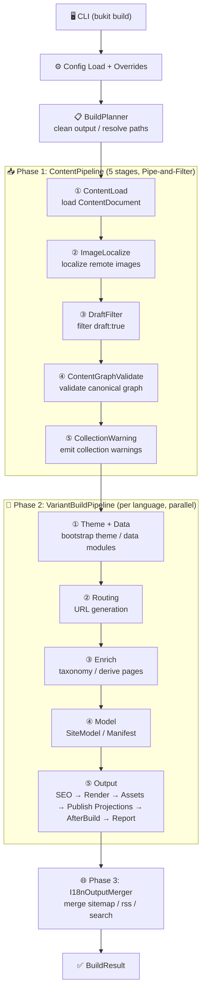

# Architecture and Module Boundaries

Describes Bukit's end-to-end build pipeline, module boundaries, and key data structures.

## End-to-End Data Flow



<details>
<summary>Text summary</summary>
CLI (bukit build/doctor/...)
  → Config (Load + Validate + ApplyOverrides)
    → SiteEngine.BuildAsync (orchestrator with Pipeline chain)
      → IContentProviderFactory (Markdown/Notion/sources)
      → BuildVariantAsync per language
        → RouteGenerator.Generate
        → DataModuleBuilder (site.modules)
        → PluginRunner (DerivePages)
        → PageRenderDispatcher (incremental rendering)
        → Publish projections (HTML-adjacent JSON/Markdown/feeds/search/llms/robots/manifest)
        → PluginRunner (AfterBuild for non-projection extensions)
      → I18nOutputMerger (merged artifacts)
      → MetricsWriter
```

</details>

## Module Division

| Module | Responsibility |
|---|---|
| `Bukit.Cli` | Command parsing, config resolution, engine invocation |
| `Bukit.Config` | `site.yaml` parsing, defaults, validation, overrides |
| `Bukit.Content` | Loading Markdown/Notion/sources content → raw field maps → `ContentDocument` |
| `Bukit.Routing` | Convert `ContentDocument` route policy (`url/outputPath/template`) → `RouteInfo` |
| `Bukit.Rendering` | Rendering models, Scriban binding, HTML output |
| `Bukit.Engine` | Build orchestration, incremental, plugins, i18n merging |
| `Bukit.Engine.Abstractions` | Plugin contracts, core data types |
| `Bukit.Shared` | Logging, exceptions, common infrastructure |

## Engine Internal Components

After refactoring, `SiteEngine` was split from a God Class into an orchestrator with a Pipeline chain plus dedicated components.

### Pipeline Chain (9 pipelines)

| Pipeline | Responsibility |
|---|---|
| `BuildPipeline` | Config validation, output directory preparation, clean/recovery |
| `ContentPipeline` | Provider creation, content loading, draft filtering, schema validation |
| `RoutePipeline` | Content URL routing, list routes, conflict detection |
| `RenderPipeline` | Page rendering, special list rendering, incremental skip decisions |
| `AssetPipeline` | Static/assets sync, SCSS compilation, image optimization, tokens, media. **4 个子操作使用 `Task.WhenAll` 真异步并行**（static/assets/tokens/media），外部进程使用 `await Process.WaitForExitAsync()` |
| `SeoPipeline` | SEO index building, diagnostics, Open Graph / JSON-LD |
| `PluginPipeline` | Publish projection execution, after-build plugin execution for non-projection extensions, stale deletion, manifest persistence |
| `BuildReportPipeline` | BuildVariantResult aggregation, logging, audit report |
| `VariantBuildPipeline` | Per-language build orchestration (Theme → Route → Enrich → Model → Output) |

Additional components: `ThemeBootstrapper`, `BuildOptionsMapper`, `FixedContentProviderFactory`.

### Internal Components

| Component | Responsibility |
|---|---|
| `SiteEngine` | Orchestrator coordinating BuildAsync with Pipeline chain |
| `BuildVariantContext` | Input parameter aggregation for single variant |
| `BuildVariantResult` | Result aggregation for single variant |
| `ContentProviderFactory` | Create content providers, handle media localization |
| `ContentRoutePolicy` | Route-level directives (url/outputPath/template/permalink/listGroup) |
| `ContentPublishPolicy` | Publish/readability directives (draft/noindex/searchExclude/feedExclude/...) |
| `BuildPathUtils` | Path operations, URL normalization, theme resolution. **`MakeAbsolute` 已添加 `enforceWithinRoot` 重载**（[P2-6](file:///Users/ali/mydev/Git/Github/Bukit/src/Bukit.Engine/BuildPathUtils.cs)），主题路径（layouts/assets/static）均启用边界校验，越界抛 `ConfigException(DiagnosticCode.ConfigPathTraversal)` |
| `BodyCacheDecorator` | **构建级 body 缓存**（[P0-3](file:///Users/ali/mydev/Git/Github/Bukit/src/Bukit.Content/BodyCacheDecorator.cs)）。使用 `LinkedList` + `ConcurrentDictionary` + `lock` 实现真实 LRU 淘汰（[P3-8](file:///Users/ali/mydev/Git/Github/Bukit/src/Bukit.Content/BodyCacheDecorator.cs)）。`_inlineBypasses` 独立计数器保持指标恒等式 `totalRequests = cacheHits + cacheMisses + inlineBypasses` |
| `TaxonomyTermsInjector` | Inject taxonomy terms from data items |
| `TaxonomyPlugin` | Taxonomy page generation (index + term pages) |
| `TaxonomyIndexBuilder` | Build term index from content meta |
| `TaxonomyPageCreator` | Create kind-level index + term pages with pagination |
| `TaxonomyDataWriter` | Write taxonomy.json (schema v2) |
| `TaxonomyTemplateResolver` | Resolve template path from multiple sources |
| `TaxonomySortHelper` | Sort pages by pin/date/title |
| `TaxonomyHierarchyBuilder` | Build children/ancestors from ParentSlug |
| `TaxonomyMetadataLoader` | Load term metadata from _index.md + ensure-terms |
| `TaxonomyFeedWriter` | Generate per-term RSS 2.0 feeds |
| `TaxonomyRedirectWriter` | Generate alias redirect pages |
| `DataModuleBuilder` | Build `site.modules` from data items |
| `PageRenderDispatcher` | Parallel page + list page rendering with incremental |
| `IncrementalBuildEngine` | Hash computation for incremental skip decisions |
| `I18nOutputMerger` | Multi-language orchestration, root merge |
| `SearchIndexBuilder` | Search index generation |
| `MetricsWriter` | Build metrics JSON output |

## Replaceable Interfaces

| Interface | Default | Purpose |
|---|---|---|
| `ITemplateRenderer` | `ScribanTemplateRendererAdapter` | Page/list rendering |
| `IContentProviderFactory` | `DefaultContentProviderFactory` | Content source creation |
| `ISearchIndexBuilder` | `DefaultSearchIndexBuilder` | Search index generation |

## Core Data Structures

- **ContentDocument**: Unified build artifact (`id/title/slug/publishAt/Body/Record/Route/Publish/CustomFields`)
- **IContentBodyStore + BodyKey**: Deferred body access channel
- **ContentRecord / ContentField**: Canonical domain model and typed field map
- **ContentRoutePolicy / ContentPublishPolicy**: Engine decisions (route & publish controls)
- **Fields**: Canonical template-facing values under `ContentDocument.CustomFields` (`field.key.type/value`)
- **RouteInfo**: Routing result (url/outputPath/template)
- **BuildContext**: Plugin runtime context

## Maintenance Principles

- External contracts first: Config fields, CLI parameters are stable interfaces
- Unidirectional dependencies: Cli → Config/Engine; Engine → Content/Routing/Rendering
- Clear responsibility boundaries
- Core components abstracted through interfaces for testability

## Code Quality Refactorings (P1/P2 审计修复)

以下为 2026-05 深度审计后完成的关键重构：

| 原文件 | 原行数 | 修复后 | 说明 |
|---|---|---|---|
| `CloneCommand.cs` | ~550 | 149 | 拆分为 6 个辅助类（`CloneInputLoader`、`CloneAssetDownloader`、`CloneContentWriter`、`CloneFidelityRunner`、`CloneThemeGenerator`、`CloneVerifier`），位于 `src/Bukit.Cli/Commands/Clone/` |
| `DevCommand.cs` | ~501 | 182 | 提取至 `Dev/` 子目录（`DevServerHost`、`DevWebSocketHub`、`DevFileWatcher`、`DevRequestHandler`、`DevPathGuard` + 2 接口） |
| `ScribanTemplateRenderer.cs` | ~422 | 210 | 拆分为 10 个独立文件（`RenderSectionFunction`、`RenderComponentFunction`、`TemplateContextBuilder`、`FileTemplateLoader`、`ImageFunctions`、`ComponentFunctions`、`SectionRenderHelper`、`SectionDataResolverAccessor`、`ScribanModelBinder`），位于 `src/Bukit.Rendering/Scriban/` |
| `ContentImageRewritePipeline.cs` | — | — | **P0-1**：12 轮正则扫描替换为 `HtmlMediaReferenceScanner` 单次遍历手写解析器，每页 CPU 消耗大幅降低 |
| `SpecialListRenderer.cs` | — | — | **P1-5**：嵌套 `Parallel.ForEachAsync` 替换为 `Parallel.ForAsync`，避免线程池过载；直接使用 `FileWriter.WriteUtf8` 写入 |
| `PageRenderDispatcher.cs` | 468 | — | **P2-4**：删除 5 处冗余 `lock(stageMetricsLock)`，改用 `stageMetrics.Merge()` 无锁合并 |
| `BodyCacheDecorator.cs` | — | — | **P0-3**：`_inlineBypasses` 独立计数器；**P3-8**：`LinkedList` + `ConcurrentDictionary` + `lock` 实现真实 LRU 淘汰替代 FIFO |
| `BuildPathUtils.cs` | — | — | **P2-6**：新增 `MakeAbsolute(rootDir, path, enforceWithinRoot: true)` 重载，主题路径启用边界校验 |
| `ThemeBootstrapper.cs` | — | — | **P2-7**：新增 `ThemeNameSanitizer`（7 层消毒：空值/绝对路径/`..`/分隔符/控制字符/设备名/非法字符），`extends` 失败 warn+跳过 |
