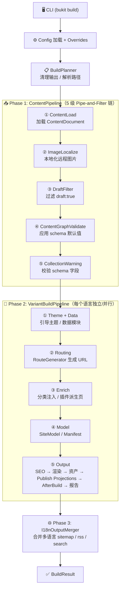

# 架构与模块边界

本文档描述 Bukit 的端到端构建链路、模块边界与关键数据结构，帮助维护者快速定位"改动应该落在哪一层"。

## 端到端数据流



<details>
<summary>文本摘要</summary>
CLI (bukit build/doctor/...)
  └─ 解析参数 → 解析配置路径 → 加载 site.yaml
      └─ Config（Load + Validate + ApplyOverrides）
          └─ SiteEngine.BuildAsync（编排器 + Pipeline 链）
              ├─ IContentProviderFactory.Create → LoadAsync（Markdown / Notion / sources 组合）
              ├─ IContentProviderFactory.LocalizeContentImagesAsync
              ├─ I18nOutputMerger.GetLanguages → 按语言循环 BuildVariantAsync
              │   ├─ RouteGenerator.Generate（含 permalinks 模式）
              │   ├─ TaxonomyTermsInjector（注入分类数据）
              │   ├─ DataModuleBuilder（构建 site.modules）
              │   ├─ PluginRunner.RunDerivePages（派生页）
              │   ├─ PageRenderDispatcher → ITemplateRenderer（增量渲染）
              │   ├─ Publish projections（JSON/Markdown/feed/search/llms/robots/manifest）
              │   └─ PluginRunner.RunAfterBuild（非 projection 扩展）
              ├─ I18nOutputMerger.GenerateRootOutputs（多语言合并产物）
              └─ MetricsWriter（可选构建指标输出）
```

</details>

## 代码模块划分（按 src 工程）

### Bukit.Cli

职责：
- 命令解析与参数归一化
- 配置路径解析（`--config` / `--site` / 默认 `site.yaml`）
- 将 CLI 选项映射为配置覆盖（output/baseUrl/clean/draft/ci/incremental/cache-dir/metrics/log-format）

关键入口：
- `src/Bukit.Cli/Program.cs`
- `src/Bukit.Cli/Commands/*`
- `src/Bukit.Cli/ConfigPathResolver.cs`

### Bukit.Config

职责：
- `site.yaml` 的解析（类型化到 AppConfig）
- 配置字段默认值
- 配置校验与错误消息（作为"对外契约"）

关键入口：
- `src/Bukit.Config/AppConfig.cs`
- `src/Bukit.Config/ConfigLoader.cs`
- `src/Bukit.Config/ConfigValidator.cs`
- `src/Bukit.Config/ConfigOverrides.cs`

### Bukit.Content

职责：
- 内容统一模型（`ContentDocument`、`ContentField`）
- 内容加载：Markdown 文件夹、Notion 数据库、以及组合 sources 模式
- 字段/属性归一化：`ContentDocument.Record` 与 `ContentDocument.CustomFields`（模板消费）

关键入口：
- `src/Bukit.Content/Markdown/MarkdownFolderProvider.cs`
- `src/Bukit.Content/Notion/NotionContentProvider.cs`
- `src/Bukit.Content/CompositeContentProvider.cs`

### Bukit.Routing

职责：
- 将 `ContentDocument` 转换为 `RouteInfo`（url/outputPath/template）
- 支持从字段与路由策略读取路由覆盖（route/url/outputPath/template）
- 支持 `site.permalinks` 自定义 URL 模式（`{year}/{month}/{slug}` 等占位符）
- 支持 `site.collections` 按集合定义 permalink/template/list 策略（并保留默认路由回退链）

关键入口：
- `src/Bukit.Routing/RouteGenerator.cs`

### Bukit.Rendering

职责：
- 渲染输入模型（SiteModel/PageModel/ListPageModel 等）
- Scriban 模板渲染（模板加载、模型绑定、输出 HTML）

关键入口：
- `src/Bukit.Rendering/Models.cs`
- `src/Bukit.Rendering/Scriban/*`

### Bukit.Engine

职责：
- 构建主流程编排（清理输出、加载内容、分语言变体构建、渲染、资产拷贝、插件执行、metrics/manifest 输出）
- 增量构建（hash/manifest/skip 原因统计）
- i18n root 输出（sitemap/rss/search 的 merged/index 模式）

关键入口：
- `src/Bukit.Engine/SiteEngine.cs`（~592 行编排器 + Pipeline 链）
- `src/Bukit.Engine/Incremental/*`
- `src/Bukit.Engine/Plugins/*`

#### Pipeline 构建链

重构后的 `SiteEngine` 通过 8 个独立 Pipeline 类串联构建流程：

| Pipeline | 职责 |
|---|---|
| `BuildPipeline` | 配置校验、输出目录准备、clean/recovery |
| `ContentPipeline` | provider 创建、内容加载、draft 过滤、schema 校验 |
| `RoutePipeline` | 内容 URL 路由生成、list routes、冲突校验 |
| `RenderPipeline` | 页面渲染、特殊列表渲染、增量跳过判定 |
| `AssetPipeline` | static/assets 同步、SCSS 编译、图片优化、tokens、media |
| `SeoPipeline` | SEO index 构建、diagnostics、Open Graph / JSON-LD |
| `PluginPipeline` | after-build 插件执行、stale 删除、manifest 保存 |
| `BuildReportPipeline` | BuildVariantResult 聚合、日志、audit report |

其他新组件：`ThemeBootstrapper`（主题初始化）、`BuildOptionsMapper`（BuildOptions→AppConfig）、`FixedContentProviderFactory`（适配器）。

#### Engine 内部组件职责

`SiteEngine` 经过多轮重构后已从 God Class（856 行）拆分为编排器 + Pipeline 链 + 专职组件。各组件职责如下：

| 组件 | 职责 |
|---|---|
| `SiteEngine.cs` | 编排器，协调 BuildAsync 主流程与 Pipeline 链 |
| `BuildVariantContext` | 单次变体构建的输入参数聚合（config/dirs/items/outputDir 等） |
| `BuildVariantResult` | 单次变体构建的结果聚合（routed/derived/renderCount 等） |
| `ContentProviderFactory` | 根据配置创建 IContentProvider 实例，处理媒体本地化 |
| `ContentFieldReader` | `ContentDocument` 与字段记录的统一访问工具（GetText/GetBool/GetList/GetText 等） |
| `BuildPathUtils` | 路径操作、URL 归一化、HTML 转义、主题目录解析、Windows 路径检查 |
| `TaxonomyTermsInjector` | 从数据项和 Notion 数据库选项注入 taxonomy 术语到 BuildContext |
| `DataModuleBuilder` | 从数据项构建 `site.modules`（按 type 分组、按 order 排序） |
| `PageRenderDispatcher` | 并行页面渲染，含增量判定（hash 比对）和特殊列表页渲染 |
| `IncrementalBuildEngine` | 内容/路由/列表的 hash 计算，供增量跳过决策使用 |
| `I18nOutputMerger` | 多语言编排：语言检测、内容过滤、根级合并 sitemap/rss/search |
| `SearchIndexBuilder` | 搜索索引生成（merged 和 index 两种模式） |
| `MetricsWriter` | 构建指标 JSON 输出（渲染数/跳过数/插件耗时等） |

#### 接口与可替换组件

Engine 通过接口抽象实现关键组件的可替换性，支持测试和未来扩展：

| 接口 | 默认实现 | 用途 |
|---|---|---|
| `ITemplateRenderer` | `ScribanTemplateRendererAdapter` | 页面/列表渲染，可替换模板引擎 |
| `IContentProviderFactory` | `DefaultContentProviderFactory` | 内容源创建与图片本地化 |
| `ISearchIndexBuilder` | `DefaultSearchIndexBuilder` | 搜索索引生成 |

`SiteEngine` 通过构造函数注入接收这些接口：

```csharp
public SiteEngine(ILogger logger)
    : this(logger, new DefaultContentProviderFactory(), new DefaultSearchIndexBuilder()) { }

internal SiteEngine(ILogger logger, IContentProviderFactory factory, ISearchIndexBuilder search) { ... }
```

#### Engine 内部依赖流

```text
SiteEngine (orchestrator)
  ├── IContentProviderFactory → DefaultContentProviderFactory → ContentProviderFactory
  ├── ISearchIndexBuilder → DefaultSearchIndexBuilder → SearchIndexBuilder
  ├── BuildVariantAsync(BuildVariantContext)
  │   ├── RouteGenerator.Generate(..., permalinks)
  │   ├── TaxonomyTermsInjector
  │   ├── DataModuleBuilder
  │   ├── PluginRunner (DerivePages + AfterBuild)
  │   ├── PageRenderDispatcher → ITemplateRenderer → ScribanTemplateRendererAdapter
  │   └── IncrementalBuildEngine + BuildManifest
  ├── I18nOutputMerger
  └── MetricsWriter
```

#### 配置覆盖与校验顺序

`SiteEngine.BuildAsync` 入口处的执行顺序：

1. `ConfigApplier.Apply(config, overrides)` -- CLI 覆盖参数（`--output`, `--base-url`, `--clean`, `--draft`）先应用到配置上
2. `ConfigValidator.Validate(effectiveConfig)` -- 对合并后的配置做完整校验

即 CLI 参数优先级高于 `site.yaml` 中的值，校验针对合并后的最终配置。`ConfigOverrides` 还包含 `Jobs`（并行渲染并发度）、`Incremental`、`CacheDir`、`MetricsPath`、`IsCI` 等运行时控制参数，它们不修改 `AppConfig` 本身，而是在构建流程中直接使用。

#### 媒体资产拷贝

构建变体完成后，Engine 会将媒体下载目录（默认 `content.media.downloadDir`，通常为 `assets/uploads`）的文件拷贝到输出目录的 `assets/uploads/` 下。跳过以 `.` 开头的隐藏文件，已存在的同名文件会被覆盖。该行为独立于主题 assets 的拷贝（主题 assets 通过 `DirectoryCopy.Sync` 同步到 `<outputDir>/assets/`）。

### Bukit.Engine.Abstractions

职责：
- 插件接口与构建上下文的稳定契约（对外扩展点）
- 核心数据记录类型的定义（`ContentDocument`、`ContentRecord`、`RouteInfo`）

关键入口：
- `src/Bukit.Engine.Abstractions/Plugins/*`
- `src/Bukit.Engine.Abstractions/ContentDocument.cs`
- `src/Bukit.Engine.Abstractions/RouteInfo.cs`

### Bukit.Shared

职责：
- 通用异常类型、日志接口/实现等基础能力

关键入口：
- `src/Bukit.Shared/*`

## 最核心的数据结构

- ContentDocument：内容加载后的统一结构；引擎只认它（定义在 Engine.Abstractions）
- IContentBodyStore + BodyKey：正文按需读取通道（避免默认把正文常驻在内容元数据对象中）
- Record/Policy：影响路由/构建策略的语义信息（type/language/route/sourceMode...）
- Fields：面向主题与模板的"自定义字段"（fields.<key>.type/value）
- RouteInfo：路由决策的结果（url/outputPath/template，定义在 Engine.Abstractions）
- BuildContext：插件运行上下文（config/rootDir/outputDir/baseUrl/routed/derived...）
- BuildVariantContext：单次变体构建的参数聚合
- BuildVariantResult：单次变体构建的结果聚合

## 维护原则（避免架构腐化）

- 对外契约优先：配置字段名、校验错误文案、CLI 参数都是用户会依赖的稳定接口，改动需谨慎
- 单向依赖：Cli → Config/Engine；Engine → Content/Routing/Rendering；插件只通过 Abstractions 访问上下文
- 明确职责边界：
- Content 负责"把内容变成 ContentDocument"
- Routing 负责"ContentDocument → RouteInfo"
  - Rendering 负责"模型 → HTML"
  - Engine 负责"编排与 IO"
  - Plugins 负责"可插拔扩展"
- 单一职责：新增引擎功能应提取为独立静态类或服务接口，避免回归到 God Class
- 可替换性：核心组件通过接口抽象，支持测试替身和未来扩展

## 当前评审口径（P1）

- 正文模型：当前主链已采用 `BodyStore + BodyKey` 的延迟正文读取模式，重点应转向超大规模场景的读取/缓存基准治理。
- 路由模型：当前主路径是 `collections`、显式 route/template 与主题 `templates.accepts`；核心不应维护 `post/page` 默认路由规则。
- 仓库边界：当前仓库聚焦 `Bukit` 主线，维护与评审以 `bukit.slnx` 和 `src/Bukit.*` 为准。
