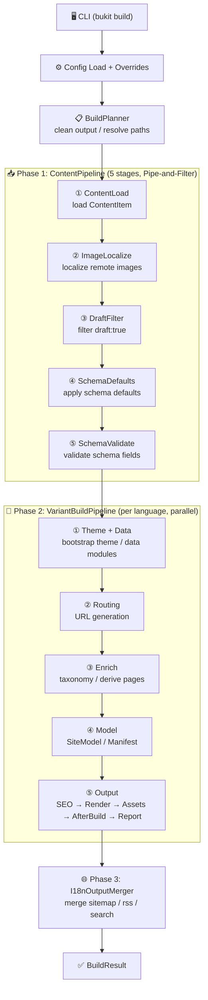

# Architecture and Module Boundaries

Describes Bukit's end-to-end build pipeline, module boundaries, and key data structures.

## End-to-End Data Flow



<details>
<summary>Text summary</summary>
CLI (bukit build/doctor/...)
  → Config (Load + Validate + ApplyOverrides)
    → SiteEngine.BuildAsync (orchestrator with Pipeline chain)
      → IContentProviderFactory (Markdown/Notion/sources)
      → BuildVariantAsync per language
        → RouteGenerator.Generate
        → DataModuleBuilder (site.modules)
        → PluginRunner (DerivePages + AfterBuild)
        → PageRenderDispatcher (incremental rendering)
      → I18nOutputMerger (merged artifacts)
      → MetricsWriter
```

</details>

## Module Division

| Module | Responsibility |
|---|---|
| `Bukit.Cli` | Command parsing, config resolution, engine invocation |
| `Bukit.Config` | `site.yaml` parsing, defaults, validation, overrides |
| `Bukit.Content` | Loading Markdown/Notion/multi-source content → ContentItem |
| `Bukit.Routing` | ContentItem → RouteInfo (url/outputPath/template) |
| `Bukit.Rendering` | Rendering models, Scriban binding, HTML output |
| `Bukit.Engine` | Build orchestration, incremental, plugins, i18n merging |
| `Bukit.Engine.Abstractions` | Plugin contracts, core data types |
| `Bukit.Shared` | Logging, exceptions, common infrastructure |

## Engine Internal Components

After refactoring, `SiteEngine` was split from a God Class into an orchestrator with a Pipeline chain plus dedicated components.

### Pipeline Chain (9 pipelines)

| Pipeline | Responsibility |
|---|---|
| `BuildPipeline` | Config validation, output directory preparation, clean/recovery |
| `ContentPipeline` | Provider creation, content loading, draft filtering, schema validation |
| `RoutePipeline` | Content URL routing, list routes, conflict detection |
| `RenderPipeline` | Page rendering, special list rendering, incremental skip decisions |
| `AssetPipeline` | Static/assets sync, SCSS compilation, image optimization, tokens, media |
| `SeoPipeline` | SEO index building, diagnostics, Open Graph / JSON-LD |
| `PluginPipeline` | After-build plugin execution, stale deletion, manifest persistence |
| `BuildReportPipeline` | BuildVariantResult aggregation, logging, audit report |
| `VariantBuildPipeline` | Per-language build orchestration (Theme → Route → Enrich → Model → Output) |

Additional components: `ThemeBootstrapper`, `BuildOptionsMapper`, `FixedContentProviderFactory`.

### Internal Components

| Component | Responsibility |
|---|---|
| `SiteEngine` | Orchestrator coordinating BuildAsync with Pipeline chain |
| `BuildVariantContext` | Input parameter aggregation for single variant |
| `BuildVariantResult` | Result aggregation for single variant |
| `ContentProviderFactory` | Create content providers, handle media localization |
| `MetaHelpers` | Static access helpers for ContentItem meta/fields |
| `BuildPathUtils` | Path operations, URL normalization, theme resolution |
| `TaxonomyTermsInjector` | Inject taxonomy terms from data items |
| `TaxonomyPlugin` | Taxonomy page generation (index + term pages) |
| `TaxonomyIndexBuilder` | Build term index from content meta |
| `TaxonomyPageCreator` | Create kind-level index + term pages with pagination |
| `TaxonomyDataWriter` | Write taxonomy.json (schema v2) |
| `TaxonomyTemplateResolver` | Resolve template path from multiple sources |
| `TaxonomySortHelper` | Sort pages by pin/date/title |
| `TaxonomyHierarchyBuilder` | Build children/ancestors from ParentSlug |
| `TaxonomyMetadataLoader` | Load term metadata from _index.md + ensure-terms |
| `TaxonomyFeedWriter` | Generate per-term RSS 2.0 feeds |
| `TaxonomyRedirectWriter` | Generate alias redirect pages |
| `DataModuleBuilder` | Build `site.modules` from data items |
| `PageRenderDispatcher` | Parallel page + list page rendering with incremental |
| `IncrementalBuildEngine` | Hash computation for incremental skip decisions |
| `I18nOutputMerger` | Multi-language orchestration, root merge |
| `SearchIndexBuilder` | Search index generation |
| `MetricsWriter` | Build metrics JSON output |

## Replaceable Interfaces

| Interface | Default | Purpose |
|---|---|---|
| `ITemplateRenderer` | `ScribanTemplateRendererAdapter` | Page/list rendering |
| `IContentProviderFactory` | `DefaultContentProviderFactory` | Content source creation |
| `ISearchIndexBuilder` | `DefaultSearchIndexBuilder` | Search index generation |

## Core Data Structures

- **ContentItem**: Unified content structure (Engine.Abstractions)
- **IContentBodyStore + BodyKey**: Deferred body access channel
- **Meta**: Engine decisions (type/language/route/sourceMode...)
- **Fields**: Template consumption (fields.<key>.type/value)
- **RouteInfo**: Routing result (url/outputPath/template)
- **BuildContext**: Plugin runtime context

## Maintenance Principles

- External contracts first: Config fields, CLI parameters are stable interfaces
- Unidirectional dependencies: Cli → Config/Engine; Engine → Content/Routing/Rendering
- Clear responsibility boundaries
- Core components abstracted through interfaces for testability
