# Seni Bina dan Sempadan Modul

Dokumen ini menerangkan saluran paip binaan hujung-ke-hujung Bukit, sempadan modul, dan struktur data utama — membantu penyelenggara menentukan "perubahan patut jatuh di lapisan mana".

## Aliran Data Hujung-ke-Hujung

```mermaid
flowchart LR
    CLI["🖥 CLI"] --> CFG["⚙ Config"]
    CFG --> P0["📋 BuildPlanner"]

    subgraph P1["📥 ContentPipeline (5 peringkat)"]
        direction LR
        C1["ContentLoad"] --> C2["ImageLocalize"] --> C3["DraftFilter"] --> C4["SchemaDefaults"] --> C5["SchemaValidate"]
    end

    P0 --> C1

    subgraph P2["🔧 VariantBuildPipeline (setiap bahasa)"]
        direction LR
        V1["Theme+Data"] --> V2["Routing"] --> V3["DerivePages"] --> V4["Render"] --> V5["Publish Projections+AfterBuild+Report"]
    end

    C5 --> V1
    V5 --> MERGE["🌐 I18nOutputMerger"]
    MERGE --> RESULT["✅ BuildResult"]
```



Tiga fasa utama:

```
CLI (bukit build/doctor/...)
  └─ Hurai argumen → Hurai laluan konfigurasi → Muat site.yaml
      └─ Config (Muat + Sahkan + GunaOverrides)
          └─ SiteEngine.BuildAsync (orkestrator + rantai Pipeline)
              ├─ IContentProviderFactory.Create → LoadAsync (Markdown / Notion / gabungan sumber)
              ├─ IContentProviderFactory.LocalizeContentImagesAsync
              ├─ I18nOutputMerger.GetLanguages → BuildVariantAsync bagi setiap bahasa
              │   ├─ RouteGenerator.Generate (termasuk pola permalink)
              │   ├─ TaxonomyTermsInjector (suntik data taksonomi)
              │   ├─ DataModuleBuilder (bina site.modules)
              │   ├─ PluginRunner.RunDerivePages (halaman terbitan)
              │   ├─ PageRenderDispatcher → ITemplateRenderer (rendering tokokan)
              │   ├─ Publish projections (JSON/Markdown/feed/search/llms/robots/manifest)
              │   └─ PluginRunner.RunAfterBuild (sambungan bukan projection)
              ├─ I18nOutputMerger.GenerateRootOutputs (gabungan berbilang bahasa)
              └─ MetricsWriter (output metrik binaan pilihan)
```

## Pembahagian Modul (mengikut projek src)

### Bukit.Cli

Tanggungjawab:
- Penghuraian perintah dan penormalan argumen
- Resolusi laluan konfigurasi (`--config` / `--site` / lalai `site.yaml`)
- Pemetaan pilihan CLI kepada ConfigOverrides (output/baseUrl/clean/draft/ci/tokokan/cache-dir/metrics/log-format)

Pintu masuk utama:
- `src/Bukit.Cli/Program.cs`
- `src/Bukit.Cli/Commands/*`
- `src/Bukit.Cli/ConfigPathResolver.cs`

### Bukit.Config

Tanggungjawab:
- Penghuraian `site.yaml` (ditaipkan kepada AppConfig)
- Nilai lalai medan konfigurasi
- Pengesahan konfigurasi dan mesej ralat (sebagai "kontrak luaran")

Pintu masuk utama:
- `src/Bukit.Config/AppConfig.cs`
- `src/Bukit.Config/ConfigLoader.cs`
- `src/Bukit.Config/ConfigValidator.cs`
- `src/Bukit.Config/ConfigOverrides.cs`

### Bukit.Content

Tanggungjawab:
- Model kandungan bersatu (`ContentItem`, `ContentField`) — **didefinisikan di Bukit.Engine.Abstractions**
- Pemuatan kandungan: folder Markdown, pangkalan data Notion, dan mod gabungan sumber
- Penormalan medan/sifat: Meta (keputusan enjin) dan Fields (penggunaan templat)

Pintu masuk utama:
- `src/Bukit.Content/Markdown/MarkdownFolderProvider.cs`
- `src/Bukit.Content/Notion/NotionContentProvider.cs`
- `src/Bukit.Content/CompositeContentProvider.cs`

### Bukit.Routing

Tanggungjawab:
- Menukar ContentItem kepada `RouteInfo` (url/outputPath/templat) — **RouteInfo didefinisikan di Bukit.Engine.Abstractions**
- Menyokong penggantian laluan dari Meta (route/url/outputPath/template)
- Menyokong pola URL tersuai `site.permalinks` (pemegang tempat `{year}/{month}/{slug}` dsb.)
- Menyokong `site.collections` bagi strategi permalink/templat/senarai mengikut koleksi (dan mengekalkan peraturan lalai serasi)

Pintu masuk utama:
- `src/Bukit.Routing/RouteGenerator.cs`

### Bukit.Rendering

Tanggungjawab:
- Model input rendering (SiteModel/PageModel/ListPageModel dsb.)
- Rendering templat Scriban (pemuatan templat, pengikatan model, output HTML)

Pintu masuk utama:
- `src/Bukit.Rendering/Models.cs`
- `src/Bukit.Rendering/Scriban/*`

### Bukit.Engine

Tanggungjawab:
- Orkestrasi aliran utama binaan (bersihkan output, muat kandungan, bina varian bahasa, render, salin aset, laksana plugin, output metrics/manifest)
- Binaan tokokan (hash/manifest/sebab langkauan)
- Output root i18n (mod gabungan/indeks untuk sitemap/rss/search)

Pintu masuk utama:
- `src/Bukit.Engine/SiteEngine.cs` (orkestrator + rantai Pipeline)
- `src/Bukit.Engine/Incremental/*`
- `src/Bukit.Engine/Plugins/*`

#### Rantaian Pipeline Binaan

`SiteEngine` selepas refaktor menghubungkan 8 kelas Pipeline bebas:

| Pipeline | Tanggungjawab |
|---|---|
| `BuildPipeline` | Pengesahan konfigurasi, penyediaan direktori output, clean/recovery |
| `ContentPipeline` | Penciptaan provider, pemuatan kandungan, penapisan draf, pengesahan skema |
| `RoutePipeline` | Penjanaan laluan URL kandungan, laluan senarai, pengesanan konflik |
| `RenderPipeline` | Rendering halaman, rendering senarai khas, keputusan langkauan tokokan |
| `AssetPipeline` | Penyegerakan static/assets, kompilasi SCSS, pengoptimuman imej, token, media |
| `SeoPipeline` | Pembinaan indeks SEO, diagnostik, Open Graph / JSON-LD |
| `PluginPipeline` | Pelaksanaan plugin after-build, pemadaman lapuk, simpanan manifest |
| `BuildReportPipeline` | Agregasi BuildVariantResult, pengelogan, laporan audit |

Komponen tambahan: `ThemeBootstrapper` (pemulaan tema), `BuildOptionsMapper` (BuildOptions→AppConfig), `FixedContentProviderFactory` (penyesuai).

#### Komponen Dalaman Enjin

| Komponen | Tanggungjawab |
|---|---|
| `SiteEngine.cs` | Orkestrator, menyelaras BuildAsync aliran utama dengan rantai Pipeline |
| `BuildVariantContext` | Agregasi parameter input untuk binaan varian tunggal |
| `BuildVariantResult` | Agregasi hasil untuk binaan varian tunggal |
| `ContentProviderFactory` | Mencipta contoh IContentProvider, mengendalikan penyetempatan media |
| `MetaHelpers` | Pembantu akses statik untuk ContentItem meta/fields |
| `BuildPathUtils` | Operasi laluan, penormalan URL, pelarian HTML, resolusi direktori tema |
| `TaxonomyTermsInjector` | Suntikan istilah taksonomi dari item data ke BuildContext |
| `DataModuleBuilder` | Pembinaan `site.modules` dari item data (dikumpul mengikut type, diisih mengikut order) |
| `PageRenderDispatcher` | Rendering halaman selari dengan keputusan tokokan |
| `IncrementalBuildEngine` | Pengiraan hash kandungan/laluan/senarai untuk keputusan langkauan tokokan |
| `I18nOutputMerger` | Orkestrasi berbilang bahasa: pengesanan bahasa, penapisan kandungan, penggabungan root |
| `SearchIndexBuilder` | Penjanaan indeks carian (mod gabungan dan indeks) |
| `MetricsWriter` | Output JSON metrik binaan |

#### Antara Muka dan Komponen Boleh Ganti

Enjin mengabstrak komponen utama melalui antara muka untuk kebolehujian dan pengembangan masa depan:

| Antara Muka | Pelaksanaan Lalai | Kegunaan |
|---|---|---|
| `ITemplateRenderer` | `ScribanTemplateRendererAdapter` | Rendering halaman/senarai, enjin templat boleh ganti |
| `IContentProviderFactory` | `DefaultContentProviderFactory` | Penciptaan sumber kandungan & penyetempatan imej |
| `ISearchIndexBuilder` | `DefaultSearchIndexBuilder` | Penjanaan indeks carian |

`SiteEngine` menerima antara muka ini melalui suntikan pembina:

```csharp
public SiteEngine(ILogger logger)
    : this(logger, new DefaultContentProviderFactory(), new DefaultSearchIndexBuilder()) { }

internal SiteEngine(ILogger logger, IContentProviderFactory factory, ISearchIndexBuilder search) { ... }
```

#### Aliran Kebergantungan Dalaman Enjin

```text
SiteEngine (orkestrator)
  ├── IContentProviderFactory → DefaultContentProviderFactory → ContentProviderFactory
  ├── ISearchIndexBuilder → DefaultSearchIndexBuilder → SearchIndexBuilder
  ├── BuildVariantAsync(BuildVariantContext)
  │   ├── RouteGenerator.Generate(..., permalinks)
  │   ├── TaxonomyTermsInjector
  │   ├── DataModuleBuilder
  │   ├── PluginRunner (DerivePages + AfterBuild)
  │   ├── PageRenderDispatcher → ITemplateRenderer → ScribanTemplateRendererAdapter
  │   └── IncrementalBuildEngine + BuildManifest
  ├── I18nOutputMerger
  └── MetricsWriter
```

#### Susunan Penggantian dan Pengesahan Konfigurasi

Di pintu masuk `SiteEngine.BuildAsync`:

1. `ConfigApplier.Apply(config, overrides)` — pilihan penggantian CLI (`--output`, `--base-url`, `--clean`, `--draft`) digunakan ke atas konfigurasi terlebih dahulu
2. `ConfigValidator.Validate(effectiveConfig)` — pengesahan lengkap dilakukan ke atas konfigurasi yang telah digabungkan

Ini bermaksud parameter CLI mempunyai keutamaan lebih tinggi daripada nilai dalam `site.yaml`, dan pengesahan dilakukan ke atas konfigurasi akhir yang digabungkan. `ConfigOverrides` juga mengandungi parameter kawalan masa jalan seperti `Jobs` (darjah keselarian rendering), `Incremental`, `CacheDir`, `MetricsPath`, `IsCI` — yang tidak mengubah `AppConfig` itu sendiri tetapi digunakan secara langsung dalam aliran binaan.

#### Penyalinan Aset Media

Selepas binaan varian selesai, Enjin akan menyalin fail dari direktori muat turun media (lalai `content.media.downloadDir`, biasanya `assets/uploads`) ke direktori output `assets/uploads/`. Fail tersembunyi (bermula dengan `.`) dilangkau, dan fail sedia ada akan ditimpa. Tingkah laku ini bebas daripada penyalinan aset tema (aset tema disegerakkan melalui `DirectoryCopy.Sync` ke `<outputDir>/assets/`).

### Bukit.Engine.Abstractions

Tanggungjawab:
- Kontrak stabil antara muka plugin dan konteks binaan (titik sambungan luaran)
- Definisi jenis rekod data teras (`ContentItem`, `ContentField`, `RouteInfo`)

Pintu masuk utama:
- `src/Bukit.Engine.Abstractions/Plugins/*`
- `src/Bukit.Engine.Abstractions/ContentItem.cs`
- `src/Bukit.Engine.Abstractions/RouteInfo.cs`

### Bukit.Shared

Tanggungjawab:
- Jenis pengecualian am, antara muka/pelaksanaan pengelogan, dan kemudahan infrastruktur

Pintu masuk utama:
- `src/Bukit.Shared/*`

## Struktur Data Teras

- **ContentItem** — struktur kandungan bersatu selepas pemuatan; enjin hanya mengenali ini (didefinisikan di Engine.Abstractions)
- **IContentBodyStore + BodyKey** — saluran akses bodi secara tertunda (mengelakkan bodi disimpan kekal dalam objek metadata kandungan)
- **Meta** — metadata yang mempengaruhi strategi laluan/binaan (type/language/route/sourceMode...)
- **Fields** — "medan tersuai" untuk tema dan templat (fields.\<key\>.type/value)
- **RouteInfo** — hasil keputusan laluan (url/outputPath/templat, didefinisikan di Engine.Abstractions)
- **BuildContext** — konteks masa jalan plugin (config/rootDir/outputDir/baseUrl/routed/derived...)
- **BuildVariantContext** — agregasi parameter binaan varian tunggal
- **BuildVariantResult** — agregasi hasil binaan varian tunggal

## Prinsip Penyelenggaraan (Mencegah Pereputan Seni Bina)

- **Kontrak luaran dahulu**: Nama medan konfigurasi, teks ralat pengesahan, parameter CLI adalah antara muka stabil yang pengguna sandarkan — ubah dengan berhati-hati
- **Kebergantungan sehala**: Cli → Config/Engine; Engine → Content/Routing/Rendering; Plugin hanya mengakses konteks melalui Abstractions
- **Sempadan tanggungjawab jelas**:
  - Content bertanggungjawab "menukar kandungan kepada ContentItem"
  - Routing bertanggungjawab "ContentItem → RouteInfo"
  - Rendering bertanggungjawab "model → HTML"
  - Engine bertanggungjawab "orkestrasi & IO"
  - Plugins bertanggungjawab "sambungan boleh pasang"
- **Tanggungjawab tunggal**: Fungsi enjin baharu patut diekstrak sebagai kelas statik bebas atau antara muka perkhidmatan, elakkan kembali kepada God Class
- **Kebolehgantian**: Komponen teras diabstrak melalui antara muka, menyokong ujian gantian dan pengembangan masa depan

## Perspektif Semakan Semasa (P1)

- **Model bodi**: Saluran utama kini menggunakan pola bacaan bodi tertunda `BodyStore + BodyKey`; fokus patut beralih kepada pentakatan bacaan/penimbal untuk senario berskala besar.
- **Model laluan**: Laluan utama kini ialah `collections`, route/template eksplisit, dan theme `templates.accepts`; teras tidak sepatutnya mengekalkan peraturan lalai `post/page`.
- **Sempadan repositori**: Repositori semasa memberi tumpuan kepada barisan utama `Bukit`; penyelenggaraan dan semakan berdasarkan `bukit.slnx` dan `src/Bukit.*`.
