# Seni Bina dan Sempadan Modul

Menerangkan saluran paip binaan hujung-ke-hujung Bukit, sempadan modul, dan struktur data utama.

## Aliran Data Hujung-ke-Hujung

```mermaid
flowchart LR
    CLI["🖥 CLI"] --> CFG["⚙ Config"]
    CFG --> P0["📋 BuildPlanner"]

    subgraph P1["📥 ContentPipeline (5 peringkat)"]
        direction LR
        C1["ContentLoad"] --> C2["ImageLocalize"] --> C3["DraftFilter"] --> C4["SchemaDefaults"] --> C5["SchemaValidate"]
    end

    P0 --> C1

    subgraph P2["🔧 VariantBuildPipeline (setiap bahasa)"]
        direction LR
        V1["Theme+Data"] --> V2["Routing"] --> V3["DerivePages"] --> V4["Render"] --> V5["AfterBuild+Report"]
    end

    C5 --> V1
    V5 --> MERGE["🌐 I18nOutputMerger"]
    MERGE --> RESULT["✅ BuildResult"]
```

## Pembahagian Modul
| Modul | Tanggungjawab |
|---|---|
| `Bukit.Cli` | Penghuraian perintah, resolusi konfigurasi |
| `Bukit.Config` | Penghuraian `site.yaml`, lalai, pengesahan |
| `Bukit.Content` | Pemuatan kandungan → ContentItem |
| `Bukit.Routing` | ContentItem → RouteInfo |
| `Bukit.Rendering` | Model rendering, pengikatan Scriban |
| `Bukit.Engine` | Orkestrasi binaan, tokokan, plugin |

## Komponen Dalaman Enjin
| Komponen | Tanggungjawab |
|---|---|
| `SiteEngine` | Orkestrator nipis |
| `PageRenderDispatcher` | Rendering halaman selari dengan tokokan |
| `DataModuleBuilder` | `mode=data` → `site.modules` |
| `I18nOutputMerger` | Orkestrasi pelbagai bahasa |

## Prinsip Penyelenggaraan
- Kontrak luaran dahulu: Medan konfigurasi, parameter CLI adalah antara muka stabil
- Kebergantungan sehala: Cli → Config/Engine; Engine → Content/Routing/Rendering
- Sempadan tanggungjawab jelas
