# Bukit / BukitJalil 模块调用关系图

本文档聚焦“模块如何彼此调用”，帮助开发者快速看清从 UI、CLI 到构建引擎的真实边界与关键链路。

## 1. 总体结论

这个仓库不是一个单体系统，而是两条主线协作：

- **Bukit**：负责静态站点构建。
- **BukitJalil**：负责 AI 对话、主题生成、配置落盘、调用 Bukit CLI。

最重要的边界是：

> **BukitJalil 并不直接引用 Bukit 引擎程序集。**
>
> 两者之间的集成协议是：**项目目录文件 + `site.yaml` + 外部 `bukit` CLI 进程**。

## 2. 系统级关系图

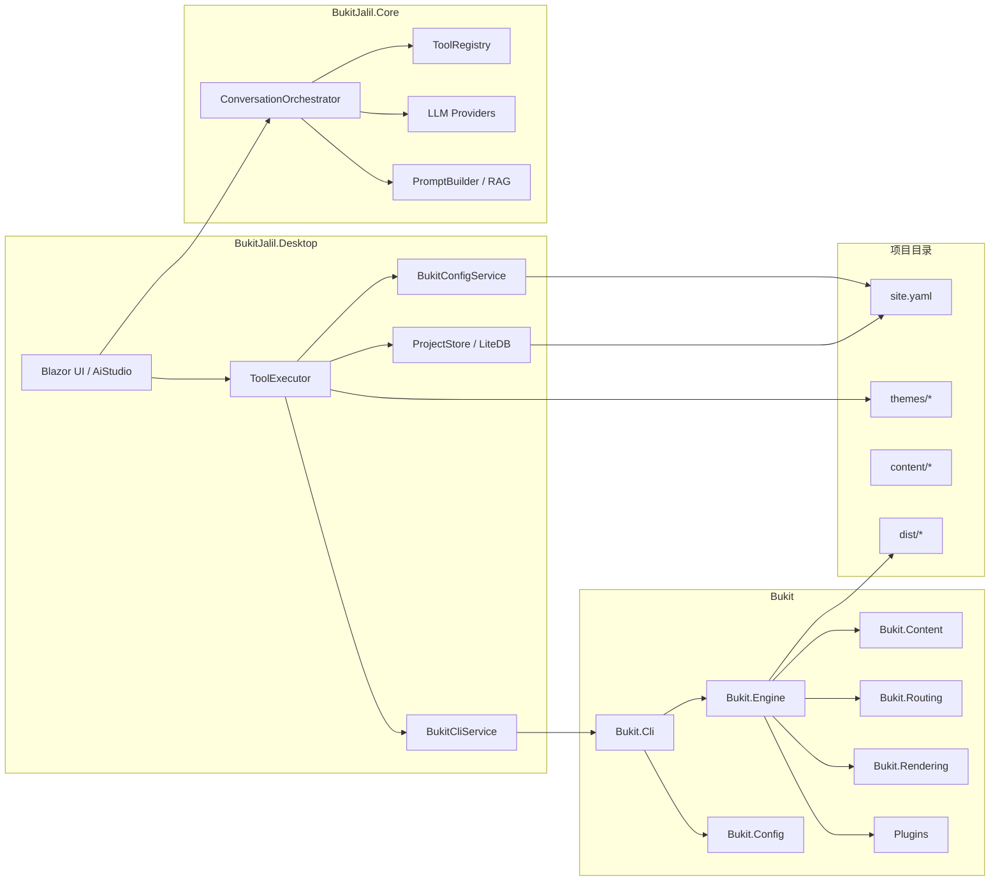

## 3. BukitJalil 到 Bukit 的真实桥接

### 3.1 关键事实

- BukitJalil 负责维护项目状态和文件。
- Bukit 负责读取这些文件并完成构建。
- 集成点不是类调用，而是“生成文件后启动 CLI”。

### 3.2 桥接链路

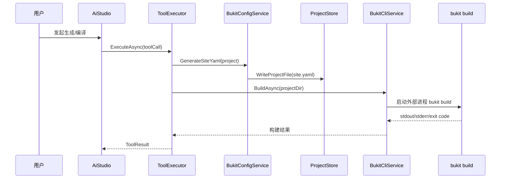

### 3.3 这一层的职责分工

| 模块 | 职责 |
|---|---|
| `AiStudio` | 触发对话、编译、预览等 UI 行为 |
| `ToolExecutor` | 把模型工具调用映射为真实操作 |
| `ProjectStore` | 维护项目目录与文件写入 |
| `BukitConfigService` | 根据项目状态生成 `site.yaml` |
| `BukitCliService` | 调用外部 `bukit build/preview` |

## 4. BukitJalil 内部调用关系

### 4.1 对话与工具调用链

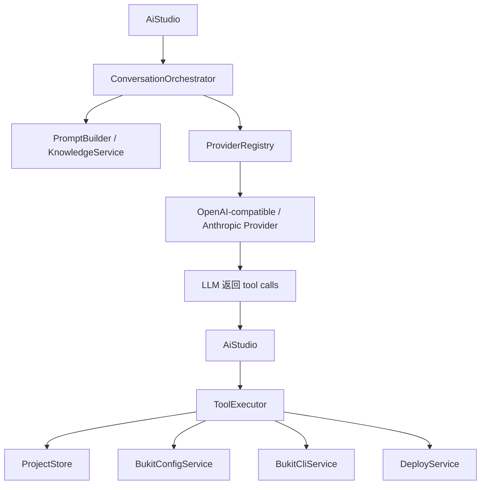

### 4.2 典型动作 1：AI 主题生成并确认落盘

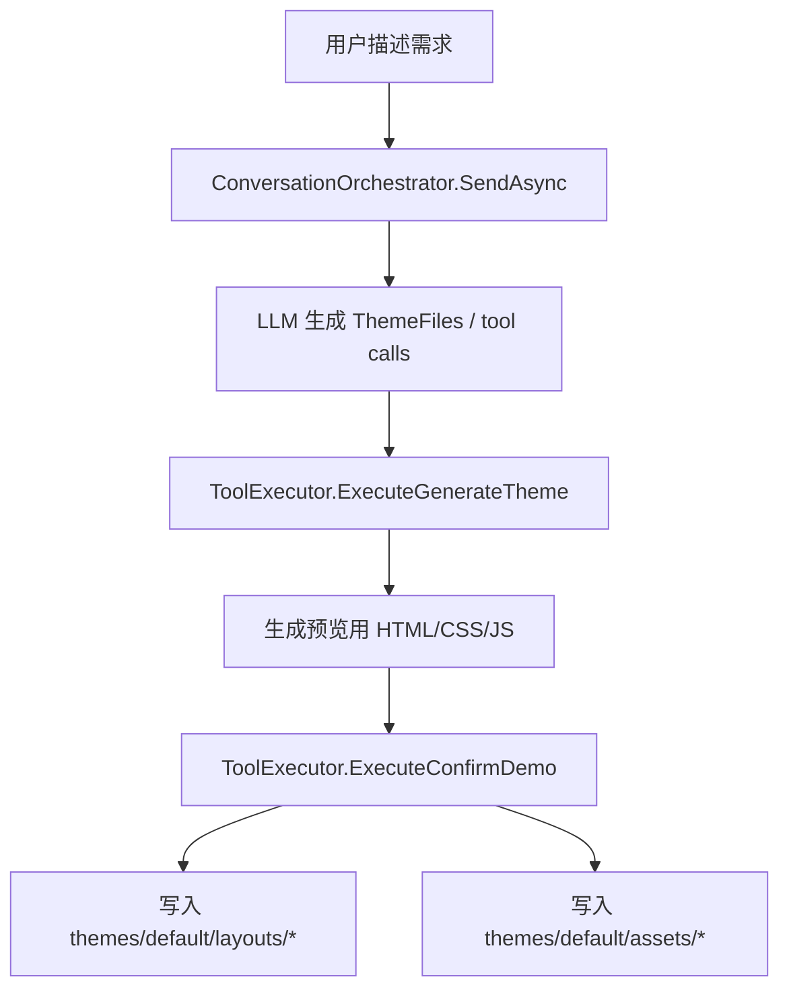

### 4.3 典型动作 2：手动编译与预览

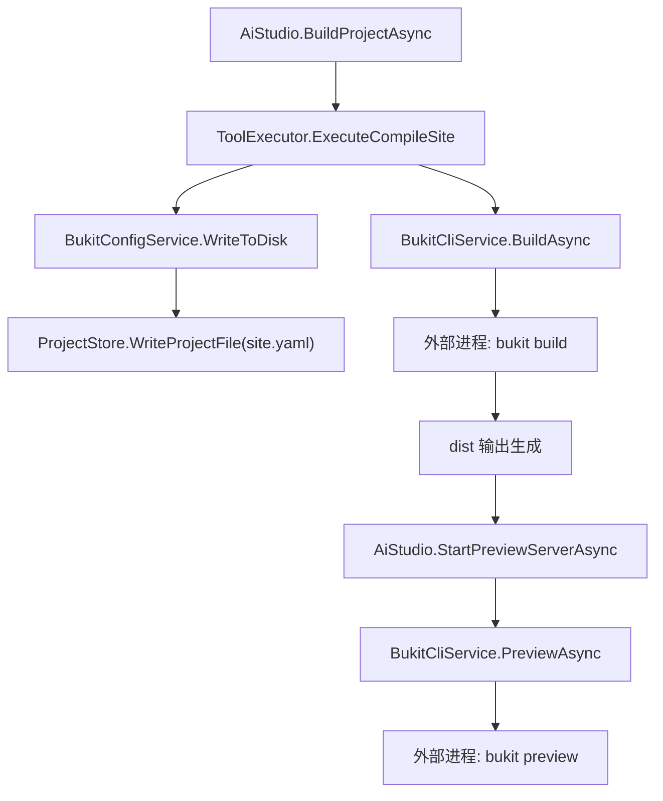

## 5. Bukit 内部调用关系

### 5.1 build 主链

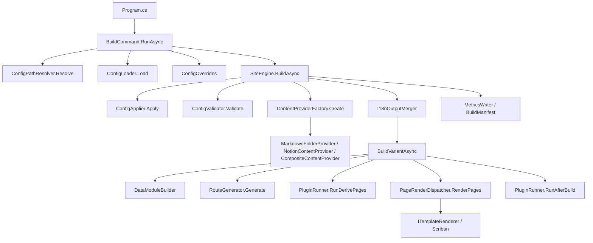

### 5.2 单语言变体构建细化

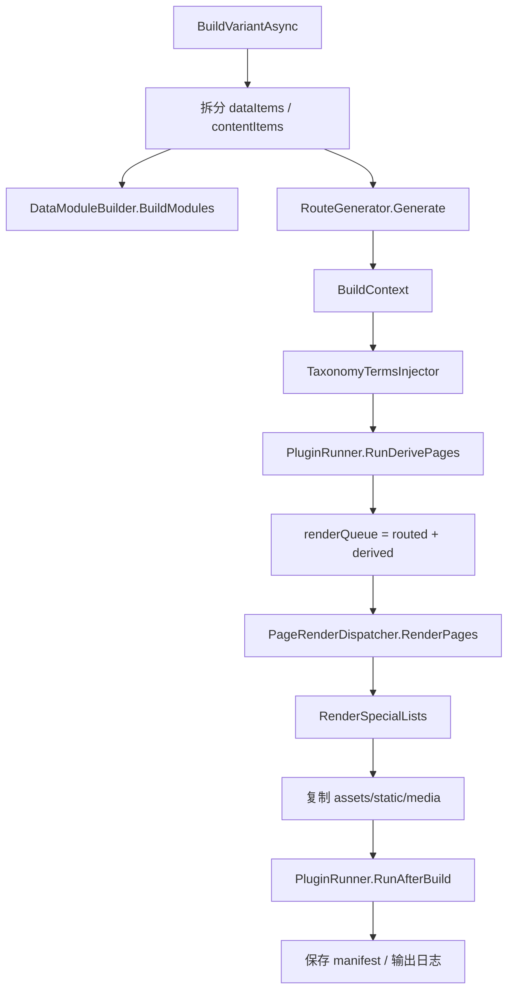

## 6. 内容、路由、渲染、插件四层协作

### 6.1 内容归一化层

- Markdown / Notion / 多源内容都会被归一化成 `ContentItem`
- `Meta` 供引擎决策
- `Fields` 供模板消费

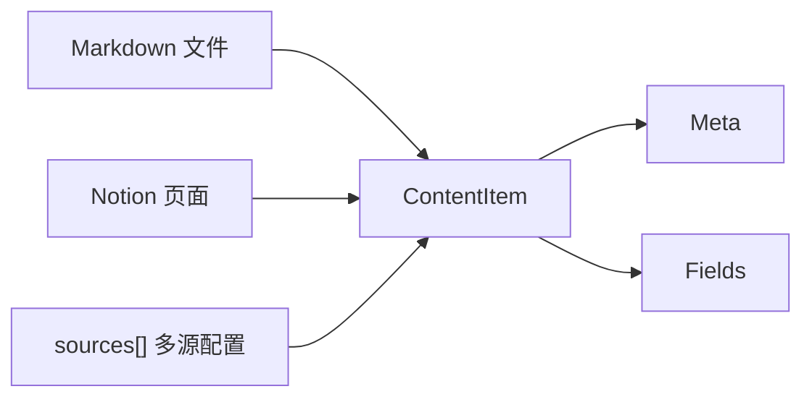

### 6.2 路由层

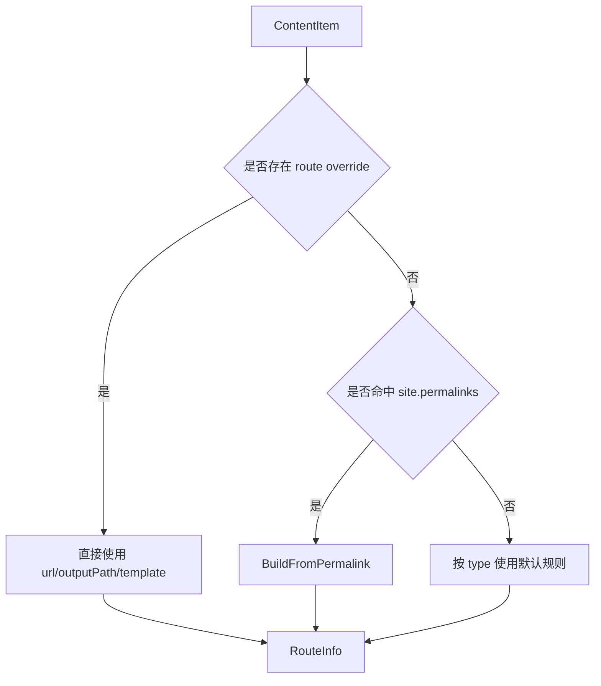

### 6.3 渲染层

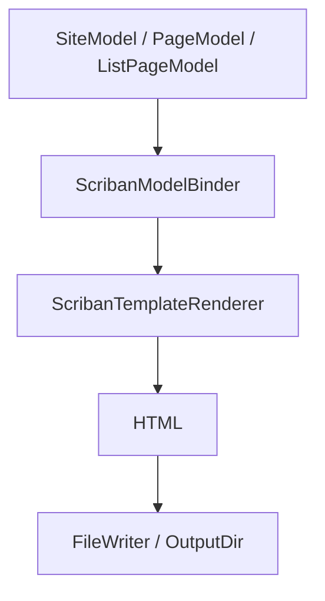

### 6.4 插件层

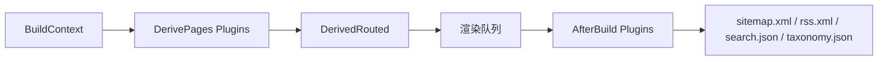

## 7. 模块边界图

### 7.1 Bukit 分层边界

| 层 | 输入 | 输出 | 不应该做的事 |
|---|---|---|---|
| CLI | 命令行参数 | `AppConfig + Overrides` | 不应承载实际构建细节 |
| Config | `site.yaml` | 类型化配置 | 不应负责内容加载 |
| Content | Markdown / Notion / 多源 | `ContentItem[]` | 不应负责路由与模板选择 |
| Routing | `ContentItem` | `RouteInfo` | 不应关心内容来源 |
| Rendering | `SiteModel / PageModel` | HTML | 不应负责内容拉取 |
| Engine | 上述组件与 IO | 输出目录 | 不应退化为巨型业务类 |
| Plugins | `BuildContext` | 派生页 / 构建后产物 | 不应绕过稳定契约随意侵入主流程 |

### 7.2 BukitJalil 分层边界

| 层 | 职责 |
|---|---|
| UI | 人机交互、工作流触发 |
| Core | Provider、Prompt、工具定义、纯逻辑 |
| Desktop Services | 文件、CLI、部署、存储集成 |
| Project Directory | 站点配置、主题、内容、构建产物 |

## 8. 最值得顺着看的调用链

如果你要快速理解系统，建议按以下顺序看：

1. **BukitJalil 视角**
   - `AiStudio` → `ToolExecutor` → `BukitConfigService` → `BukitCliService`
2. **CLI 视角**
   - `Program.cs` → `BuildCommand.RunAsync`
3. **引擎视角**
   - `SiteEngine.BuildAsync` → `BuildVariantAsync`
4. **页面生成视角**
   - `ContentProviderFactory` → `RouteGenerator` → `PageRenderDispatcher`
5. **输出产物视角**
   - `PluginRunner.RunAfterBuild` → sitemap/rss/search/taxonomy

## 9. 常见误解

- 误以为 BukitJalil 直接调用 Bukit 的 C# API
- 误以为 `mode=data` 也会进入普通页面渲染
- 误以为插件可以任意改写主流程内部结构
- 误以为 preview 是渲染引擎的一部分，实际上它是 CLI 附带的本地静态文件服务

## 10. 配套文档

- 仓库总览：[`code-wiki.md`](./code-wiki.md)
- 新开发者阅读路线：[`new-developer-30min.md`](./new-developer-30min.zh-CN.md)
- 架构边界：[`architecture.md`](./architecture.md)
- 插件体系：[`plugins.md`](./plugins.md)

## 11. 一句话总结

这套系统最关键的理解是：**BukitJalil 负责“生成与编排”，Bukit 负责“读取配置并构建站点”，二者通过文件与 CLI 进程解耦连接。**
