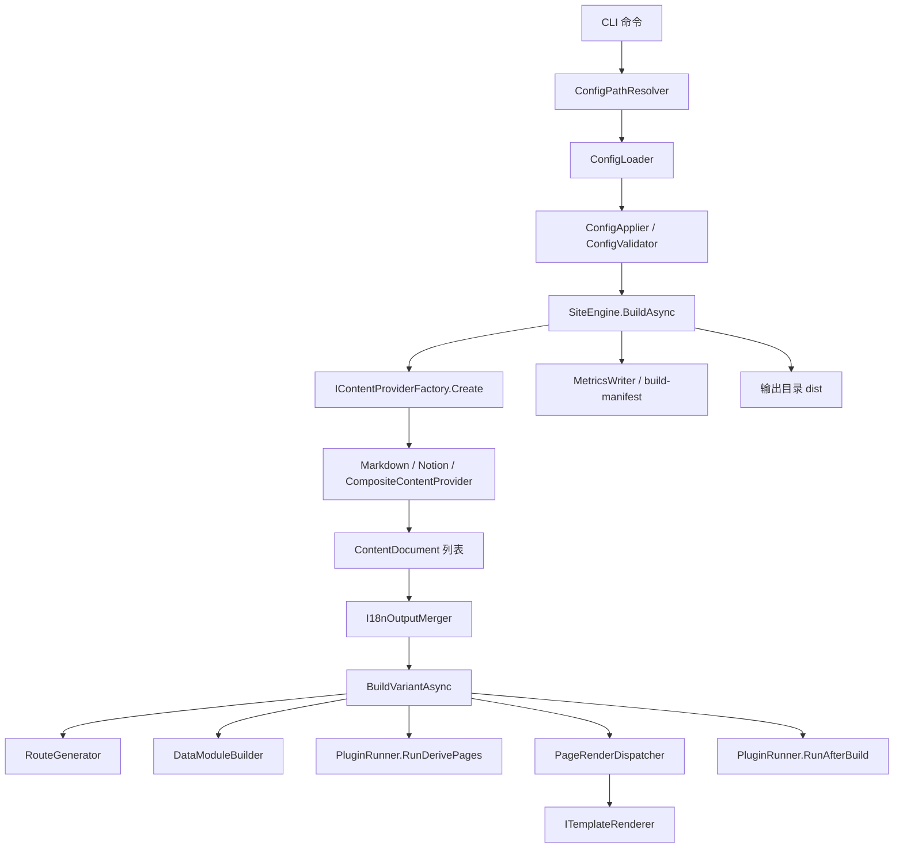

# Bukit Code Wiki

本文档从代码视角梳理仓库结构、核心架构、模块职责、关键类与函数、依赖关系，以及本地运行/测试/发布方式，作为开发者进入仓库时的统一导航页。

## 1. 项目概览

当前仓库聚焦 **Bukit** 主线：基于 .NET 10 的静态站点生成器，支持 Markdown / Notion 内容源、Scriban 模板、多语言、增量构建、插件扩展与 GitHub Pages 部署。

## 2. 仓库结构

```text
Bukit
├─ src/
│  ├─ Bukit.Cli/                 # CLI 入口与命令分发
│  ├─ Bukit.Config/              # site.yaml 解析、默认值、校验、覆盖
│  ├─ Bukit.Content/             # Markdown / Notion / 多源内容加载
│  ├─ Bukit.Engine.Abstractions/ # ContentDocument、RouteInfo、插件契约
│  ├─ Bukit.Engine/              # 构建编排、增量、插件运行、输出合并
│  ├─ Bukit.Rendering/           # 模板输入模型与 Scriban 绑定
│  ├─ Bukit.Routing/             # 内容到路由的映射
│  ├─ Bukit.Shared/              # 日志、异常、通用基础设施
│  ├─ Bukit.PluginSourceGenerator/ # 插件注册相关源码生成
│  └─ plugins/                     # 可选插件实现
├─ tests/                          # Bukit 测试
├─ examples/starter/               # 可直接运行的示例站点
├─ guide/dev/                      # 开发者文档
├─ guide/user/                     # 用户文档
├─ scripts/                        # smoke / perf / AOT 检查脚本
├─ tools/scriban/                  # 内嵌 Scriban 源码
└─ docs/                           # 方案与规划文档
```

## 3. 解决方案与工程边界

### 3.1 Solution 划分

- `bukit.slnx`：Bukit 主线工程与测试。

### 3.2 工程依赖主方向

```text
Bukit.Cli
  └─ Bukit.Engine
      ├─ Bukit.Config
      ├─ Bukit.Content
      ├─ Bukit.Rendering
      ├─ Bukit.Routing
      ├─ Bukit.Shared
      └─ Bukit.Engine.Abstractions
```

核心约束是单向依赖：

- CLI 只负责参数入口，不承载构建细节。
- Engine 负责编排，不直接承担所有细节逻辑。
- Content 只把内容转为统一模型。
- Routing 只负责路由。
- Rendering 只负责模型到 HTML。
- Plugins 只通过 Abstractions 契约接入。

## 4. Bukit 整体架构

### 4.1 端到端构建链路



### 4.2 核心运行阶段

1. CLI 解析命令与参数。
2. 加载 `site.yaml`，再应用 CLI 覆盖值。
3. 校验最终配置。
4. 通过内容提供器加载 Markdown / Notion / 多源内容。
5. 对内容做草稿过滤、图片本地化和多语言切分。
6. 对每个语言变体执行路由、模块构建、插件派生页、页面渲染、资源拷贝。
7. 运行 publish projection pipeline，生成 sitemap/rss/search/llms/robots/agent manifest 等机器可读产物；after-build 插件继续处理菜单、图片等非 P3 聚合输出。
8. 写入增量构建 manifest 与 metrics。

## 5. 核心模块职责

### 5.1 Bukit 主线

| 模块 | 主要职责 | 关键入口 |
|---|---|---|
| `Bukit.Cli` | 命令解析、参数映射、调用引擎 | `Program.cs`、`Commands/*` |
| `Bukit.Config` | 配置模型、YAML 解析、默认值、配置校验 | `AppConfig.cs`、`ConfigLoader.cs`、`ConfigValidator.cs` |
| `Bukit.Content` | 从 Markdown / Notion 加载内容并归一化为 `ContentDocument` | `MarkdownFolderProvider.cs`、`NotionContentProvider.cs`、`CompositeContentProvider.cs` |
| `Bukit.Engine.Abstractions` | 定义稳定的数据结构与插件扩展契约 | `ContentDocument.cs`、`RouteInfo.cs`、`Plugins/*` |
| `Bukit.Engine` | 构建编排、增量构建、插件执行、多语言输出合并 | `SiteEngine.cs`、`PageRenderDispatcher.cs`、`Plugins/*` |
| `Bukit.Rendering` | 模板输入模型、Scriban 模型绑定 | `Models.cs`、`Scriban/*` |
| `Bukit.Routing` | 根据内容和 permalink 规则生成 URL / OutputPath / Template | `RouteGenerator.cs` |
| `Bukit.Shared` | 日志、异常、安全辅助与通用能力 | `Logger.cs`、`Exceptions.cs`、`UrlRedactor.cs` |

### 5.2 仓库边界说明

当前仓库仅包含 `Bukit` 主线代码与测试，不包含 [BukitJalil](https://github.com/ALi365-SDN-BHD/BukitJalil) 相关源码与解决方案。

## 6. 关键数据模型

### 6.1 Bukit 数据模型

| 类型 | 含义 | 备注 |
|---|---|---|
| `ContentDocument` | 统一内容结构 | 所有内容源最终都要落到这个模型 |
| `ContentField` | 供模板使用的结构化字段 | 暴露为 `page.fields.*` |
| `RouteInfo` | 路由决策结果 | 包含 URL、输出路径、模板路径 |
| `BuildContext` | 插件运行上下文 | 提供 routed / derived / data / logger |
| `SiteModel` | 模板中的站点级模型 | 暴露 `site.*` |
| `PageModel` / `ListPageModel` | 模板中的页面模型 | 暴露 `page.*` 与 `pages.*` |
| `BuildManifest` | 增量构建缓存文件 | 用于跳过未变更页面 |

### 6.2 Record 与 Fields 的分工

- `Record`：用于引擎决策，例如 `type`、`language`、`draft`、`route`、`sourceMode`。
- `Fields`：用于模板消费，例如 SEO 字段、业务字段、封面图、阅读时长等。

这一区分非常关键：**引擎依赖 Record，主题依赖 Fields**。

## 7. Bukit 关键类与函数索引

### 7.1 CLI / 配置层

| 类 / 函数 | 所在文件 | 作用 |
|---|---|---|
| `Program` | `src/Bukit.Cli/Program.cs` | CLI 总入口，分发 `build/doctor/theme/intent/...` |
| `BuildCommand.RunAsync` | `src/Bukit.Cli/Commands/BuildCommand.cs` | 构建命令主入口，拼装运行时覆盖值并调用引擎 |
| `DoctorCommand.RunAsync` | `src/Bukit.Cli/Commands/DoctorCommand.cs` | 配置、主题、插件、Notion 接入的自检入口 |
| `ConfigPathResolver.Resolve` | `src/Bukit.Cli/ConfigPathResolver.cs` | 统一处理 `--config` / `--site` / 默认 `site.yaml` |
| `ConfigLoader.Load` | `src/Bukit.Config/ConfigLoader.cs` | 从 YAML 构建 `AppConfig` |
| `ConfigValidator.Validate` | `src/Bukit.Config/ConfigValidator.cs` | 对最终配置做完整校验 |
| `ConfigApplier.Apply` | `src/Bukit.Config/ConfigOverrides.cs` | 把 CLI 覆盖值应用到配置对象 |

### 7.2 内容层

| 类 / 函数 | 所在文件 | 作用 |
|---|---|---|
| `MarkdownFolderProvider.LoadAsync` | `src/Bukit.Content/Markdown/MarkdownFolderProvider.cs` | 扫描 Markdown 文件夹并转为 `ContentDocument` |
| `MarkdownFolderProvider.ParseFrontMatter` | `src/Bukit.Content/Markdown/MarkdownFolderProvider.cs` | 解析 front matter，为 meta/fields 做归一化 |
| `NotionContentProvider.LoadAsync` | `src/Bukit.Content/Notion/NotionContentProvider.cs` | 从 Notion 数据库拉取页面、渲染块并转为 `ContentDocument` |
| `CompositeContentProvider.LoadAsync` | `src/Bukit.Content/CompositeContentProvider.cs` | 多源并发加载，并注入 `sourceKey/sourceMode/sourceId` |
| `ContentProviderFactory.Create` | `src/Bukit.Engine/ContentProviderFactory.cs` | 根据配置选择 Markdown / Notion / Composite provider |

### 7.3 引擎层

| 类 / 函数 | 所在文件 | 作用 |
|---|---|---|
| `SiteEngine.BuildAsync` | `src/Bukit.Engine/SiteEngine.cs` | 主构建入口，串起配置、内容、i18n、渲染与输出 |
| `SiteEngine.BuildVariantAsync` | `src/Bukit.Engine/SiteEngine.cs` | 单语言变体的主流程 |
| `PageRenderDispatcher.RenderPages` | `src/Bukit.Engine/PageRenderDispatcher.cs` | 并发渲染页面并处理增量跳过 |
| `PageRenderDispatcher.RenderSpecialLists` | `src/Bukit.Engine/PageRenderDispatcher.cs` | 渲染首页、博客索引、页面索引等特殊列表页 |
| `DataModuleBuilder.BuildModules` | `src/Bukit.Engine/DataModuleBuilder.cs` | 将 `mode=data` 内容注入 `site.modules` |
| `I18nOutputMerger.GenerateRootOutputs` | `src/Bukit.Engine/I18nOutputMerger.cs` | 生成多语言根级 sitemap/rss/search 合并产物 |
| `MetricsWriter.WriteIfRequested` | `src/Bukit.Engine/MetricsWriter.cs` | 生成构建指标 JSON |

### 7.4 路由 / 渲染 / 插件

| 类 / 函数 | 所在文件 | 作用 |
|---|---|---|
| `RouteGenerator.Generate` | `src/Bukit.Routing/RouteGenerator.cs` | 将 `ContentDocument` 转为 `RouteInfo` |
| `RouteGenerator.ExpandPermalinkPattern` | `src/Bukit.Routing/RouteGenerator.cs` | 展开 `{slug}`、`{year}` 等 permalink 占位符 |
| `ScribanModelBinder` | `src/Bukit.Rendering/Scriban/ScribanModelBinder.cs` | 将 C# 模型映射为 Scriban 可消费对象 |
| `ScribanTemplateRendererAdapter` | `src/Bukit.Engine/ScribanTemplateRendererAdapter.cs` | 将渲染器适配到引擎接口 |
| `PluginRegistry.GetAllPlugins` | `src/Bukit.Engine/Plugins/PluginRegistry.cs` | 组装内置插件、生成插件与外部插件 |
| `PluginRunner.RunDerivePages` | `src/Bukit.Engine/Plugins/PluginRunner.cs` | 执行派生页插件 |
| `PluginRunner.RunAfterBuild` | `src/Bukit.Engine/Plugins/PluginRunner.cs` | 执行构建后插件 |

### 7.5 内置插件

| 插件 | 类型 | 产物 / 作用 |
|---|---|---|
| `PagesIndexPlugin` | derive-pages | 生成额外页面索引 |
| `PaginationPlugin` | derive-pages | 生成分页页 |
| `ArchivePlugin` | derive-pages | 生成归档页 |
| `TaxonomyPlugin` | derive-pages + after-build | 生成标签/分类页与 `taxonomy.json` |
| `SitemapPlugin` | after-build | 生成 `sitemap.xml` |
| `RssPlugin` | after-build | 生成 `rss.xml` |
| `SearchIndexPlugin` | after-build | 生成 `search.json` |

## 8. 仓库边界提示

若你在其他资料中看到 [BukitJalil](https://github.com/ALi365-SDN-BHD/BukitJalil) 相关入口，请以当前仓库实际目录与 `bukit.slnx` 为准。

## 9. 依赖关系

### 9.1 运行时与语言层

- 目标平台：`.NET 10`
- 解决方案组织：`bukit.slnx`
- 版本管理：根目录 `Directory.Packages.props` 统一管理 NuGet 版本

### 9.2 关键 NuGet 依赖

| 依赖 | 用途 |
|---|---|
| `YamlDotNet` | 解析 `site.yaml` |
| `Microsoft.Extensions.Http` | Provider / 服务层 HTTP 调用 |
| `xunit` / `Microsoft.NET.Test.Sdk` / `coverlet.collector` | 测试 |

### 9.3 仓库内嵌依赖

- `tools/scriban`：模板引擎源码内嵌，保证可控性与 AOT 兼容性。

### 9.4 外部系统依赖

- Notion API：内容提供器之一。
- GitHub Pages / GitHub Actions：典型部署目标。

## 10. 测试与验证结构

测试工程按模块拆分：

- `tests/Bukit.Engine.Tests`
- `tests/Bukit.Content.Tests`
- `tests/Bukit.Rendering.Tests`
- `tests/Bukit.Cli.Tests`
- `tests/ThrowingPlugin`

其中：

- Engine 测试覆盖路由、插件、taxonomy、sitemap、PathReport、WechatSync 等行为。
- Content 测试主要覆盖 Notion API/渲染行为。
- CLI 测试覆盖配置路径解析等入口逻辑。

## 11. 本地运行方式

### 11.1 Bukit 最短跑通

```bash
dotnet build bukit.slnx -c Release
dotnet run --project src/Bukit.Cli -c Release -- doctor --config examples/starter/site.yaml
dotnet run --project src/Bukit.Cli -c Release -- build --config examples/starter/site.yaml --clean --site-url https://example.com
dotnet run --project src/Bukit.Cli -c Release -- preview --dir examples/starter/dist --port auto
```

### 11.2 常见 Bukit 命令

```bash
dotnet run --project src/Bukit.Cli -c Release -- create my-site
dotnet run --project src/Bukit.Cli -c Release -- build --clean
dotnet run --project src/Bukit.Cli -c Release -- build --site blog --clean
dotnet run --project src/Bukit.Cli -c Release -- clean --dir dist
dotnet run --project src/Bukit.Cli -c Release -- theme list --config site.yaml
dotnet run --project src/Bukit.Cli -c Release -- theme use alt --config site.yaml
```

## 12. 测试、冒烟与发布

### 12.1 推荐验证命令

```bash
dotnet build bukit.slnx -c Release -warnaserror
dotnet test tests/Bukit.Engine.Tests/Bukit.Engine.Tests.csproj -c Release
dotnet test tests/Bukit.Content.Tests/Bukit.Content.Tests.csproj -c Release
dotnet format bukit.slnx --verify-no-changes
pwsh ./scripts/smoke.ps1
```

### 12.2 AOT 发布

```bash
dotnet publish src/Bukit.Cli -c AOT -r win-x64 -o out/bukit
dotnet publish src/Bukit.Cli -c AOT -r linux-x64 -o out/bukit
```

### 12.3 CI/CD

- 仓库提供了 Pages workflow 模板样例 [`.github/workflows/release.yml`](../../.github/workflows/release.yml)，可直接复制到目标仓库使用。
- 详细部署指引见 [`publish-deploy.md`](./publish-deploy.zh-CN.md) 与 [`../user/13-部署-GitHub-Pages.md`](../user/13-deploy-github-pages.zh-CN.md)。

## 13. 推荐阅读顺序

如果你是第一次进入代码仓库，推荐按以下顺序阅读：

1. `README.md`
2. `guide/dev/README.md`
3. `src/Bukit.Cli/Program.cs`
4. `src/Bukit.Cli/Commands/BuildCommand.cs`
5. `src/Bukit.Engine/SiteEngine.cs`
6. `src/Bukit.Content/*`
7. `src/Bukit.Routing/RouteGenerator.cs`
8. `src/Bukit.Engine/Plugins/*`
9. `guide/dev/maintainer-entrypoints.md`

## 14. 进一步文档入口

- 模块调用关系图：[`code-wiki-call-graph.md`](./code-wiki-call-graph.zh-CN.md)
- 新开发者 30 分钟上手路线：[`new-developer-30min.md`](./new-developer-30min.md)
- 按改动类型定位源码入口：[`maintainer-entrypoints.md`](./maintainer-entrypoints.zh-CN.md)
- 项目架构评审意见稿：[`architecture-review.md`](./architecture-review.zh-CN.md)
- 架构总览：[`architecture.md`](./architecture.md)
- CLI 说明：[`cli.md`](./cli.md)
- 配置契约：[`config-site-yaml.md`](./config-site-yaml.md)
- 内容系统：[`content.md`](./content.md)
- 插件体系：[`plugins.md`](./plugins.md)
- 多语言与 SEO：[`i18n-seo.md`](./i18n-seo.md)
- 增量构建：[`incremental-build.md`](./incremental-build.md)
- 发布部署：[`publish-deploy.md`](./publish-deploy.md)
- 用户文档入口：[`../user/README.md`](../user/README.md)

## 15. 一句话总结

这个仓库的核心是一个**配置驱动、内容归一化、路由与渲染解耦、插件可插拔、支持多语言与增量构建的静态站点引擎**，主线工程边界由 `bukit.slnx` 与 `src/Bukit.*` 目录定义。
